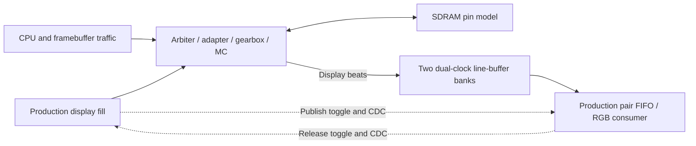

# SDRAM traffic and latency board probe

The `sdram_traffic_probe` Gowin example fits only the memory service, a traffic
generator, counters and UART. No CPU core, Flash, HDMI, DSP or BSRAM is included.
The target owns one PLL: all seven client interfaces and timestamps run at 54 MHz;
every request passes through the production arbiter, SharedSdramPort, pair gearbox
and 108 MHz native controller. The SDRAM clock uses the fitted 292.5-degree phase.
The dedicated wide binding retains the system's I/O-register option and SDRAM
input/output constraints. The production system configuration is unchanged.

## Current qualification

The independent cycle combination and connected pin fixture pass. Nine shortened
workload windows pass pin-model data/guard checks, real UART bit decoding and CRC32.
The full board image passes Gowin 1.9.8.11 Education PnR and setup/hold audit for
GW2AR-LV18QN88C8/I7. The original serial image passes the physical workloads below.
The current four-sector group image also passes repeated SRAM and verified Flash
software-reload measurements; see [group board results](#group-board-results-2026-10-02).
The bounded production-display component check below also passes. Physical cold
power-on and complete production system integration remain open.

| Measurement | Result | Scope |
| --- | --- | --- |
| Native controller synthesis | 234 LUT + 29 ALU = 263 Logic; 181 registers | Exclusive hierarchy under this traffic stimulus |
| Gearbox synthesis | 226 Logic; 322 registers | Excludes its controller child |
| Arbiter synthesis | 90 Logic; 6 registers | Seven live client paths |
| SharedSdramPort synthesis | 400 Logic; 153 registers | Scalar and line traffic |
| MC combination synthesis | 979 Logic; 662 registers | Sum of four exclusive scopes, excludes PLL/test instrumentation |
| Full probe post-route | 7535 Logic; 3923 registers; 5082 CLS; 1 PLL | Includes generator, counters, UART and target |
| Controller / logic fmax | 135.078 / 57.487 MHz | Required 108 / 54 MHz |
| Worst setup / hold slack | 0.493 / 0.425 ns | Full fitted project, including SDRAM I/O constraints |

Logic here is the tool's LUT+ALU accounting. Synthesis hierarchy does not provide
a per-module post-route allocation; the full-project PnR total is listed separately.
Workload-specific constant propagation can affect module area, so these numbers
are not a universal MC budget. Address-dependent xorshift patterns exercise all DQ
lanes rather than presenting fixed high-word constants.
`resources.py` collects these reports and records source/constraint/bitstream SHA256
in `measurement-manifest.json` inside the selected project output.

## Physical measurements, 2026-10-02

The `3b69ba5` image was audited before SRAM programming with Gowin Programmer
1.9.8.11 Education, USB Debugger A (location 401), device ID `0x0000081B`, and
COM4 through the BL616 UART route. Image SHA256 is
`eb8334c2aab01eb802dc22e00954fa3da694651310be941d171631b665938d2b`.
Two captures of 20 and 10 seconds contain 546 complete CRC-valid records, 60--62
per mode, with no reported pattern/protocol/watchdog failure. An independent
accounting check confirms every client drains, total useful bytes equal completed
requests times payload length, and every GPU group has exactly four sectors.
Together the measured windows complete 2,906,012,416 useful bytes. Both captures
produce identical per-mode aggregate bandwidth and group means at stored precision.
These are observed repeat results, not worst-case or PVT guarantees.

| Mode | Traffic | Effective MB/s | Useful bus % | Owner occupancy % | 512 B group mean / observed max, logic clocks |
| --- | --- | ---: | ---: | ---: | ---: |
| 0 | GPU read, row hit | 287.48 | 66.55 | 91.68 | 95.17 / 96 |
| 1 | GPU write, row hit | 285.93 | 66.19 | 91.73 | 95.70 / 100 |
| 2 | GPU read, sequential banks/rows | 286.25 | 66.26 | 91.72 | 95.59 / 99 |
| 3 | GPU read, row conflicts | 275.73 | 63.83 | 92.02 | 99.27 / 102 |
| 4 | GPU + periodic Display | 277.90 | 64.33 | 92.27 | 102.79 / 112 |
| 5 | GPU + normal CPU/command | 278.08 | 64.37 | 92.42 | 106.35 / 157 |
| 6 | GPU + CPU/command + periodic Display | 267.98 | 62.03 | 92.86 | 116.18 / 174 |
| 7 | GPU + CPU/command + batched Display | 269.06 | 62.28 | 92.77 | 115.66 / 243 |
| 8 | Saturated CPU/command + GPU + periodic Display | 238.23 | 55.15 | 94.08 | 298.97 / 320 |

All means below include release-to-accept waiting. Mode 6 represents the normal
mixed workload; a logic clock is 1/54 microsecond. Write first response is its ack.

| Client | Mean wait | First response mean / observed min / max | Completion mean / observed min / max |
| --- | ---: | ---: | ---: |
| Display, 32 B | 12.62 | 20.16 / 9 / 37 | 23.16 / 12 / 40 |
| Instruction, 32 B | 13.75 | 21.65 / 8 / 68 | 24.65 / 11 / 71 |
| Data, 32 B mixed read/write | 17.14 | 26.28 / 8 / 86 | 28.28 / 11 / 89 |
| DMA, scalar | 16.34 | 25.10 / 9 / 74 | 25.10 / 9 / 74 |
| GPU read-only, 128 B | 16.89 | 24.71 / 8 / 84 | 39.71 / 23 / 99 |
| Framebuffer read, 128 B | 5.80 | 13.09 / 8 / 76 | 28.09 / 23 / 91 |
| Framebuffer write, 128 B | 5.87 | 28.50 / 23 / 91 | 28.50 / 23 / 91 |

Solo framebuffer read averages 8.04 clocks to first data and 23.04 to completion;
solo write averages 23.17 to ack. In mode 7, fifty Display requests share their
batch release: mean completion is 837.29 clocks, observed max 1703. This includes
the earlier Display members, rather than implying each native transfer takes that
long. Modes 0--7 have zero missed release opportunities. Saturation deliberately
over-offers three clients and skips an average 3,104,910 release opportunities per
window; accepted jobs still drain. It is not a promise to service all offered load.

Both successful captures used the audited SDRAM image in FPGA SRAM and the
existing MC source. Evidence and full per-client results are under
`target/gpu-v2-sdram/board-2026-10-02/`, with image
identity in `session.json` and independently checked aggregates in `measurements.json`.

## Workloads

The generator initializes and independently reads back an 8 KiB pattern region.
Every subsequent read is checked and writes reproduce the address-dependent pattern.
Each mode offers traffic for 2^20 logic clocks, drains all admitted work and finishes
any partial four-sector GPU group, freezes counters, then serializes a report.
UART reporting and initialization are excluded from measured elapsed time.

| Mode | GPU traffic | Additional traffic |
| --- | --- | --- |
| 0 | Four 128 B reads, fixed four-bank row-hit group | None |
| 1 | Four 128 B writes, fixed four-bank row-hit group | None |
| 2 | Four 128 B reads, sequential 512 B groups across 8 KiB | None |
| 3 | Four 128 B reads, alternating groups 4 KiB apart | None |
| 4 | Fixed read groups | Display 32 B every 150 clocks |
| 5 | Alternating read/write groups | CPU/command traffic below |
| 6 | Alternating read/write groups | CPU/command + periodic Display |
| 7 | Alternating read/write groups | CPU/command + fifty Display reads every 7500 clocks |
| 8 | Alternating read/write groups | Saturated instruction/data/command clients + periodic Display and DMA |

Normal CPU/command traffic is instruction 32 B every 1728 clocks, data 32 B every
288 clocks with every third request writing, DMA scalar every 4096 clocks with
alternating read/write, and GPU read-only 128 B every 512 clocks. Mode 8 offers
instruction/data/read-only work every clock. CPU clients have one pending/active
transaction each. Busy clients count skipped release opportunities as missed load
deadlines instead of silently claiming the offered bandwidth was achieved.
Display batches retain one common release timestamp for all fifty members; its
entire backlog drains before reporting. Loads are explicit estimates, not a replay
of a captured CPU/display trace. Rates and window/divisor are in the source.

The serial and early-grant images traverse four separately arbitrated sectors,
including real gaps and possible CPU/Display interference. The opt-in group image
below admits one indivisible 512 B transaction and physically chains its sectors.
Each image measures actual service; oracle-predicted continuation is not substituted.

## Accounting and UART record

Latency starts at actual generator release, before arbitration. Every client
reports requests/completions, mean/min/max first response and completion latency,
and mean/max arbitration wait. Write first response means its completion ack.
Subtract mean wait from mean first/completion to obtain service after acceptance.
Display members use their batch release; GPU group time includes all four sectors
and intervening arbitration. Window and elapsed are distinct: elapsed includes
drain and is the denominator for bytes actually completed.

Useful bus utilization is `(read_bytes + write_bytes) / (elapsed * 8)`; 100% is
432 MB/s at the 54 MHz, 64-bit boundary. Owner occupancy counts logic clocks from
accepted request through accepted last response. These are separate metrics:
occupancy includes row/refresh/arbitration transport and does not imply useful DQ.
Scalar DMA counts two useful bytes, not a fictional full 64-bit payload. This probe
does not separately count raw SDRAM command/DQ electrical activity.

The UART runs at 115200 baud (divisor 469). A record contains 104 little-endian
u32 words followed by CRC32: magic `SDMC`, version/mode/failure flag, nominal clock,
window/elapsed/occupancy/read bytes/write bytes, group count/sum/max, missed deadlines,
then thirteen words per client in Display/I/Data/DMA/RO/FBR/FBW order. Client words
are counts, three u64 sums (wait/first/complete), three maxima and two minima.
The implemented sums use bounded u32 counters with zero high words: one job per
CPU/Display client and at most two GPU sectors bound cumulative intervals by twice
elapsed, or at most fifty times elapsed for Display batches. Window is bounded to 2^24 plus a 65536-clock drain watchdog.
Pattern/protocol/timeout failure is sticky, marks the record and stops subsequent
modes. Captures with that flag or invalid CRC/accounting fail decoding.

## Build, validation and board handoff

```powershell
& scripts/run-cargo.ps1 -Subcommand run -Label sdram-board-build -CargoArgs @('-p','digital-design-hardware-gowin','--example','sdram_traffic_probe','--','target/sdram_traffic_probe_gowin','--build')
python hardware/vendor/gowin/examples/sdram_traffic_probe/resources.py target/sdram_traffic_probe_gowin
& scripts/run-cargo.ps1 -Subcommand test -Label sdram-pin -CargoArgs @('-p','gpu-v2','--test','sdram_emu_rtl','--','--ignored','--nocapture')
```

Board enablement comes from the user. Audit the selected image against current
source and preserve its manifest SHA before programming. On 2026-10-02 the user
authorized persistent Flash probes because frequent resets lose SRAM images.
The board loop now programs/verifies the selected generated configuration `.bin`
at Flash offset zero, then reloads the FPGA. This replaces its power-on design
with that probe. SRAM-only programming remains available for transient controls;
after a power cycle the Flash probe must be identified again before attributing
UART records to another SRAM image. For the serial probe:

```powershell
& target/release/examples/sdram_traffic_probe.exe target/sdram_traffic_probe_gowin --check-existing --program-flash 0x000000 target/sdram_traffic_probe_gowin/impl/pnr/sdram_traffic_probe.bin --cable-index 4
```

Use the corresponding audited project/example/bin for early or grouped probes.
Tang Nano 20K uses the target's GAO-Bridge Flash program-and-verify operation;
retain its success log and the binary SHA, not only the SRAM `.fs` hash.
On the
Tang Nano 20K, UART goes through the BL616 console: select `choose uart` and keep
that same serial session open. Use the existing bounded capture script with the
verified port, then decode the saved bytes:

```powershell
& hardware/vendor/gowin/scripts/capture_bl616_uart.ps1 -Port COM_PORT -Seconds 30 -Out target/gpu-v2-sdram/board-capture/uart.bin
python hardware/vendor/gowin/examples/sdram_traffic_probe/decode.py --input target/gpu-v2-sdram/board-capture/uart.bin --output target/gpu-v2-sdram/board-capture
```

`COM_PORT` is a placeholder for the verified board port. Capture options are
documented in `../scripts/README.md`. A persisted Flash probe reloads after power returns.
Opening a raw serial port alone does not select the FPGA UART route. The decoder's
`--port` option requires pyserial and a UART interface that is already transparent.
Offline input uses
`--input CAPTURE.bin`, or `--input uart.hex --hex` for pin-fixture records.
The capture has a time/byte limit and saves original bytes, JSON records and a
per-client CSV. Record image hash, board/tool identity, capture interval and repeat
agreement before treating results as physical evidence. The pin fixture runs its
two related clocks at a model-safe scaled frequency; its nominal-rate bandwidth
conversion is not a board measurement.

## Early-grant probe qualification

The separate `sdram_early_grant_probe` image enables one irrevocable successor
slot and closed-other-bank preparation. GPU sources prepost only sectors inside
the current four-sector group, retaining the active address/payload until LAST.
Direction/group boundaries remain explicit. All clients still use the same
54 MHz arbiter/gearbox path; physical READ/WRITE chaining remains disabled.

Serial and candidate pin fixtures pass all nine modes, data/guard checks and UART
CRC. A simulation assertion proves early admission is exercised. Another proves
owner occupancy equals accepted client activity, including a reserved request
from a different client; LAST must not clear occupancy while that request remains.
The following table identifies the earlier fitted early-only snapshot. Current
source has subsequently gained opt-in physical groups; rebuild the early-only
project before auditing it against that source, rather than reusing its old image.
Physical candidate qualification is **pending usable UART measurements**. On
2026-10-02, the audited candidate was programmed into SRAM and the LEDs were
reported to cycle. That observation establishes activity; bandwidth and latency
qualification requires decoded UART records. The session evidence is under
`target/gpu-v2-sdram/early-board-2026-10-02/`.

| Candidate measurement | Result | Scope |
| --- | --- | --- |
| MC combination synthesis | 1053 Logic; 718 registers | Same four exclusive scopes as baseline |
| Full probe post-route | 8376 Logic; 4026 registers; 5472 CLS; 1 PLL | Includes expanded generator/counters/UART |
| Controller / logic fmax | 125.004 / 55.864 MHz | Required 108 / 54 MHz |
| Worst setup / hold slack | 0.449 / 0.425 ns | Full fitted project and SDRAM I/O |

Bitstream SHA256 is
`3341f6aaecbc6a06ab773ac5fc943d450901aead38389ea3b6977c569452c7e9`;
build source fingerprint is `cc0b205948082a3c`. This is a historical early-only
snapshot preceding the group changes, not a current-source qualification.
`resources.py` validates source and image fingerprints before issuing a report;
use the matched current-source projects below for new comparisons.

Short pin windows predict row-hit read/write useful utilization of 70.72%/68.57%,
compared with serial 66.45%/66.13% under the same 3000-clock fixture. These are
scaled-clock simulation predictions; the physical baseline table above is a
separate measurement. Candidate groups and client request latencies must be
compared separately: a preposted sector's release timestamp occurs earlier.

```powershell
& scripts/run-cargo.ps1 -Subcommand run -Label sdram-early-build -CargoArgs @('-p','digital-design-hardware-gowin','--example','sdram_early_grant_probe','--','target/sdram_early_grant_probe_gowin','--build')
& target/release/examples/sdram_early_grant_probe.exe target/sdram_early_grant_probe_gowin --check-existing
python hardware/vendor/gowin/examples/sdram_traffic_probe/resources.py target/sdram_early_grant_probe_gowin
```

Board testing uses this standalone image after the user opens the board and
repeats the same bounded UART capture/decoder procedure. The early-only attempts
above used SRAM before the later Flash authorization.

## Four-sector group probe

The separate `sdram_chained_group_probe` enables early admission and
`CHAIN_GROUP_FOUR`. Framebuffer clients submit one aligned 512 B group, with one
grant and final completion, rather than four 128 B requests. Other clients and
initialization/readback retain their existing sizes. The
[group contract](sdram-memory-controller.md#optional-four-sector-physical-groups)
defines uninterrupted source/sink requirements, refresh fallback and priority.
Production system defaults remain serial.

UART version 2 identifies this admission boundary: framebuffer request counts
and per-request latencies refer to 512 B. Version 1 retains 128 B framebuffer
requests. The decoder validates both byte totals and completions per group;
compare whole-group latency and useful bytes across versions, not individual
framebuffer request latency. The same nine offered loads and reporting boundaries
apply to all three images.

Final source qualification on 2026-10-02 passed 179 GPU Rust tests, all six explicit
Icarus tests, strict scoped clippy, formatting and system dependency compilation.
Independent edge/pin checks exercise read/write chains, row conflicts, refresh
fallback, Display arrival before/after grant, reset, invalid alignment, source
underrun and held final responses. Accepted chained column commands are checked
to be exactly 32 native clocks apart. CRC/accounting decoder regressions reject
five deliberately malformed records and still decode the saved baseline capture.

| Group candidate measurement | Result | Scope |
| --- | --- | --- |
| MC combination synthesis | 1242 Logic; 776 registers | Same four exclusive scopes as baseline |
| Full probe post-route | 8618 Logic; 4066 registers; 5560 CLS; 1 PLL | Includes generator/counters/UART |
| Controller / logic fmax | 110.952 / 54.164 MHz | Required 108 / 54 MHz |
| Worst setup / hold slack | 0.056 / 0.425 ns | Full fitted project and SDRAM I/O |

The narrow setup margin passes this fitted probe; it does not qualify integration
into a larger system. No timing exception hides descriptor crossings: a registered
108 MHz header and registered continuation validity close those paths.
Image SHA256 is
`8ccc45a2738c04f9f72455135f4b30ce7bacb9b4f5bd68ba23e93935e0701e2a`,
with source fingerprint `5f386e99c0400823`. Its audited manifest is under
`target/sdram_chained_group_probe_gowin`.

The following comparison uses the same 3000-clock pin fixture. Bandwidth is
converted using nominal 54 MHz; these are **simulation estimates, not board
measurements**. Group latency includes drain and any arbitration/refresh gaps.

| Mode | Serial MB/s | Early MB/s | Group MB/s | Group useful % | Group mean clocks |
| --- | ---: | ---: | ---: | ---: | ---: |
| 0: row-hit read | 287.07 | 305.50 | 372.15 | 86.15 | 73.29 |
| 1: row-hit write | 285.70 | 296.23 | 375.23 | 86.86 | 72.68 |
| 2: sequential read | 286.42 | 304.61 | 373.99 | 86.57 | 72.93 |
| 3: row-conflict read | 276.30 | 294.91 | 365.59 | 84.63 | 74.62 |
| 4: read + Display | 279.88 | 298.09 | 365.82 | 84.68 | 77.00 |
| 5: mixed + CPU | 277.73 | 291.13 | 360.06 | 83.35 | 80.59 |
| 6: mixed + CPU + Display | 268.99 | 283.45 | 347.21 | 80.37 | 86.74 |
| 7: mixed + CPU + batch50 Display | 256.39 | 269.36 | 325.22 | 75.28 | 98.94 |
| 8: saturated clients | 238.61 | 249.75 | 314.01 | 72.69 | 117.54 |

Group ownership trades Display latency for GPU bandwidth. In mode 6, Display
completion mean/max changes from early-only 29.05/37 to 48.30/87 logic clocks.
In mode 7 its common-release batch completion mean/max changes from 783.84/1561
to 1504.86/3023. These include arbitration wait; production Display buffering and
deadlines must be evaluated before enabling groups there. The detailed per-client
comparison is `target/gpu-v2-sdram/chained-model/pin-comparison.json`. Cycle-derived
average oracle calibration has a different address/arrival trace and is documented
only in the [model contract](sdram-memory-controller.md#cycle-derived-average-rust-oracle).

The current [display configuration](../../../../systems/cpu-v3-tang-nano-20k/src/display.rs)
and [four-row buffer](../../../../systems/cpu-v3-tang-nano-20k/src/hardware/display/display_hdmi.v)
require 50 segments for two source rows. During active scanout, the default 2x
mode repeats that consumption every approximately
`4 * 1056 * 54_000_000 / 33_300_000 = 6850` logic clocks; retained 3x mode uses
`6 * 1650 * 54_000_000 / 74_250_000 = 7200`. The probe's 7500-clock interval
represents the approximate whole-frame average, including blanking, rather than
the shorter active demand cadence. Buffer release/publication crossings, row
sampling and an initial 100-segment fill further affect the actual deadline.
The short simulated batch maximum above is below the active interval, but that
comparison is conditional: it is neither a worst-case bound nor an integrated
underflow test. Qualification needs actual active-phase requests and the real
buffer/CDC path, in addition to long repeated physical probe measurements.

### Bounded active-demand cycle check

`ip/gpu-v2/tests/sdram_display_load.rs` additionally drives the actual Rust cycle
Service with the active 2x interval rounded down to 6849 logic clocks and the
3x interval of 7200. Each run releases 100 initial Display segments, then six
batches of 50, at phases 0 and 73. CPU I-cache reads use period 1728; D-cache
uses period 288 with every third request writing. Framebuffer read and write
each keep at most two 512 B jobs outstanding. All paths use the shared arbiter,
adapter, gearbox and controller; Display/read payloads and response accounting
are checked. Initialization is excluded and every run has a 100000-clock bound.

These are observed maxima across the two phase samples in 2x mode, not global
worst-case bounds. Queue-to-grant includes the host backlog of a common release.

| Cycle Service config | Initial 100 complete | Active batch50 queue-to-grant max | Active batch50 complete max | Deadline misses |
| --- | ---: | ---: | ---: | ---: |
| Serial | 1103 | 568 | 578 | 0 |
| Early only | 3257 | 1633 | 1652 | 0 |
| Early + group | 6796 | 3454 | 3470 | 0 |

All 12 combinations passed their assumed deadlines. The group's initial fill
leaves only 53 clocks against the assumed 6849-clock budget. This is an assumed
Service workload deadline, not the production startup contract: the actual
display waits for publication and a frame boundary before starting. This earlier
test does not execute tiled addressing, publication/release CDC or scanout.
The connected production-display check below covers those components within a
bounded scope; neither check is a complete production-system qualification.

Reproduce only this additional check with `cargo test --release -p gpu-v2
--test sdram_display_load -- --nocapture`; detailed output is in the corresponding
`target/cargo-summaries/mc-active-display-bounded-release.log`.

### Bounded production display and CDC check

`ip/gpu-v2/tests/sdram_display_rtl.rs` directly composes the unchanged production
`display_hdmi.v`, `display_line_buffer.v` and `display_pair_fifo.v` with the
vendor's generated arbiter, adapter, gearbox, native controller and SDRAM pin
model. Production 2x timing, framebuffer dimensions and sRGB table are read from
the authoritative system sources; no replacement display/CDC model or system
crate dependency is added to GPU v2. The pin-safe related clocks retain the exact
nominal 54 MHz / 33.3 MHz logic/pixel ratio; physical PLL/TMDS behavior is outside
this simulation.



Six normal cases compare serial/early/group with independent video-lock delays
of 0/73 logic clocks and a fractional pixel-edge shift. CPU arrival periods stay
1728/288 clocks, every third D-cache request writes, and framebuffer read/write
are saturated in disjoint scratch regions. Initialization uses the production
21600 controller clocks. The real producer fills the initial 100 segments, waits
for actual consumer releases and publishes only complete two-row groups. Each
case checks 48 active output rows / 38400 pixels against independent coordinate
goldens and an output-row counter, including tiled request order, row width,
slot reuse, native refresh and protocol errors. No startup deadline is invented.

Observed timing below is in logic clocks across these finite samples. Fill starts
at the first accepted segment; release-to-publication includes return CDC and
arbitration. Readiness lead is publication visible in the pixel domain to the
actual first-row readiness sample, excluding the initial prefetched groups.

| Config | Accepted-first-segment to publication max | Release to publication max | Minimum visible-publication lead |
| --- | ---: | ---: | ---: |
| Serial | 558 | 581 | 6331 |
| Early only | 1657 | 1667 | 5246 |
| Early + group | 3421 | 3470 | 3442 |

All six cases pass without underflow or wrong/missing/duplicate pixel rows;
230400 pixels are checked. Last accepted beat to observed publication is one
logic edge, and to observed pixel-domain publication is at most four logic
clocks. A seventh starvation control stops new display grants after six groups:
the unpublished row remains black, then the real consumer reports underflow
after 25 completed output rows. This verifies that the test actually observes
the production failure path rather than relying only on service averages.

Every case has a 1150000-logic-clock and 180-second process bound. Source hashes,
per-case timing and exported RTL are under
`target/gpu-v2-sdram/display-integration/summary.json`; the final test log is
`target/cargo-summaries/mc-display-integration-final-release.log`. Reproduce with
`cargo test --release -p gpu-v2 --test sdram_display_rtl -- --ignored --nocapture --test-threads=1`.
This covers a bounded active region, two lock/arrival phases and functional
synchronizers, not full-frame wrap/swap, all phase combinations, metastability,
the physical PLL or complete system integration. Production remains serial;
enabling groups still needs full-system co-simulation/PnR and cold-start evidence.

### Matched current-source artifacts

The later serial/early comparison builds use the same MC source revision as the
group probe. Their source fingerprints are `8c1622c9b8c0da7b` in
`target/sdram_serial_compare_probe_gowin` and `e3b23eb00d60c787` in
`target/sdram_early_compare_probe_gowin`. Each contains its audited
`gowin-build.manifest` and `measurement-manifest.json`; the group identity is
recorded above. Physical group measurements are recorded below; the matched
current serial/early snapshots have not been measured on the board. The original
serial board results remain historical evidence for their own image.

```powershell
& scripts/run-cargo.ps1 -Subcommand run -Label sdram-group-build -CargoArgs @('-p','digital-design-hardware-gowin','--example','sdram_chained_group_probe','--','target/sdram_chained_group_probe_gowin','--build')
& target/release/examples/sdram_chained_group_probe.exe target/sdram_chained_group_probe_gowin --check-existing
python hardware/vendor/gowin/examples/sdram_traffic_probe/resources.py target/sdram_chained_group_probe_gowin
```

### Group board results, 2026-10-02

After the user's fresh board authorization, USB Debugger A at location 6977 and
COM4 were usable. With `choose uart` kept open, the audited group SRAM image
produced 327 CRC-valid version-2 records. The same generated binary was written to Flash offset zero,
Program/Verify succeeded, and FPGA Reprogram succeeded. A separate capture started
after that reload produced another 362 valid records, independently of pre-write
traffic. Each mode has 36--41 records per capture. All 689 records pass CRC,
pattern/protocol/watchdog flags, drained client counts, useful-byte totals and
512 B group accounting, covering 4,779,236,256 useful bytes.

Source is `358a4e9`, with the group fingerprint and FS hash listed above. Binary
SHA256 is `bf9ca98060e8dba9ed4e658c3445c82086c379a0c0915be65aa4afc699fc579b`.
Aggregates below weight bandwidth by elapsed clocks and group means by completions;
maxima are observed values, not worst-case or PVT guarantees. Mode identities are
the same as the historical serial table and simulated comparison above.

| Mode | Effective MB/s | Useful bus % | 512 B group mean / observed max, 54 MHz clocks |
| --- | ---: | ---: | ---: |
| 0 | 373.29 | 86.41 | 73.07 / 87 |
| 1 | 374.30 | 86.64 | 72.87 / 86 |
| 2 | 372.24 | 86.17 | 73.27 / 89 |
| 3 | 367.01 | 84.96 | 74.33 / 89 |
| 4 | 361.01 | 83.57 | 78.11 / 100 |
| 5 | 360.29 | 83.40 | 80.37 / 141 |
| 6 | 345.83 | 80.05 | 87.11 / 155 |
| 7 | 345.85 | 80.06 | 87.11 / 196 |
| 8 | 314.73 | 72.85 | 117.12 / 155 |

Display completion mean/max is 48.93/106 clocks in mode 6 and 1565.70/3195 clocks
from common batch release in mode 7. Modes 0--7 report zero missed configured load
deadlines; intentional overload mode 8 reports 3,124,755 per window. The batch
probe still uses the 7500-clock average interval, not the real active scanout/CDC
path. Software Flash reload is verified; full power-off cold boot remains pending.
Production defaults stay serial. Raw captures, decoded per-client records and
`recovered-summary.json` are under `target/gpu-v2-sdram/group-board-2026-10-02/`.
