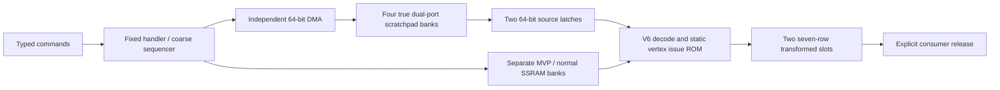

# Command, scratchpad and vertex Rust models

The reusable components own `ports` and `sim/{oracle,counted,timed}` under
`src/command_processor`, `src/scratchpad`, `src/vertex` and `src/frontend`.
Frontend composition consumes finished numerical reports at narrow typed
boundaries. Its arithmetic milestone stops at transformed vertices. A separate
bounded source-capture controller prepares the existing triangle oracle's input;
it is not wired into that sequencer. The frontend implements no
triangle generation, framebuffer cache, emulator, RTL or command-machine ABI.

The oracle can also consume a GPU-owned MemoryPort through `run_with_memory`.
The [SDRAM combination adapter](sdram-memory-controller.md) uses the vendor service
only in GPU tests; the existing timed service fixture remains independent.

Command counted publishes DMA source/destination pointers and both aligned
vertex-word addresses with their half-word selection. Scratchpad counted
assembles each 96-bit packet from the audited bank reads; the consumer receives
that finished observation. Derived addresses and packet payloads therefore do
not re-enter the next component as unverified host arithmetic.



## Contracts

`Command` is an external semantic input: DMA, WAIT token, DRAW vertex range,
consumer RELEASE acknowledgment and frontend FENCE. Unimplemented commands
are rejected explicitly. The captured five-field command records used by
counted are an audit representation, not an encoded GPU ABI. Matrix parameters
and meshlet grid parameters arrive on the draw-context port. Parsing GV2M
headers/descriptors, AABB validation, mixed v/t streams and uniform DMA loading
are future adapters. DRAW accepts a contiguous prefix of v6 vertex records;
a non-vertex tag faults rather than becoming a successful no-op.

DMA addresses/counts must be eight-byte aligned, with nonzero count up to 4096
bytes, token 0..3, no source-address overflow and no crossing a 4KiB region.
There are two ownership regions and one active DMA. The pending descriptor
queue is bounded at four; reservation at submission conservatively limits
outstanding descriptors to the two currently free regions. It cannot queue
overlapping future writes into an occupied region. Source memory is a bounded
test port with configurable first-response latency and beat gap, not a DRAM
controller. Received beats write all four 16-bit bank payloads. Completion is
published one edge after the last write; response errors remain sticky and
drain the already accepted descriptor without a normal token or fence.

The 8KiB logical scratchpad uses four 1024x16 payload banks, fitted into the
supported 1024x18 BSRAM geometry. Both physical ports support read/write;
DMA owns port 0, core reads/writes port 1. Same-address collisions are forbidden.
Regions transition FREE -> FILLING -> READY -> IN_USE -> FREE. Generation-tagged
leases reject stale reads, writes and releases. A consumer can read only the
entirely completed DMA range. Scratchpad core writes are modeled by its owned
ports and all three stages; the current frontend command subset uses core reads.
The host reference's initial zero guard words are test initial conditions;
the counted RAM deliberately rejects uninitialized reads.

Scratchpad timing treats interface slicing, concatenation and static audit-table
indices as wiring. Its checker proves disjoint occupied-bit masks for additions
and requires all other arithmetic to have literal-only provenance; arbitrary
carry additions cannot silently become zero-cycle bus wiring. Command decode
guards are preflight, while address increments and token/ownership effects are
checked against each timed edge; command logic area/fmax is not measured.

DMA tokens and pending bits are distinct: handler acknowledgment clears an
event, while WAIT consumes the sticky token and permits its reuse. The fixed
ROM identities are DMA0..3, COMMAND, TRIANGLE_CREDIT, CACHE_DONE and FAULT;
triangle/cache handlers are masked here. Dispatch occurs only at idle/WAIT
boundaries and uses a rotating selector. Entry does not acknowledge an event;
same-edge new events beat acknowledgment. All core micro-operations, source
returns, arithmetic phase and write tags freeze on core CE=0. DMA reception and
drain continue on wall-clock edges. FENCE covers accepted frontend DMA and
vertex publication only; it is not the eventual render fence.

Each output slot is one 512x36 BSRAM. A meshlet has at most 64 vertices, each
seven rows: four raw clip fields; XYZ normal in row4 (three S(12,10) fields),
UNORM12 U/V in row5 and RGB565 in row6. Upper unused bits are
zero. All seven registered writes must complete before the next publication
edge sets ready. Publication retains the slot; explicit consumer release is
required before allocation increments its epoch and clears ready bits. There
is a separate producer-active bit: even a matching consumer release cannot
recycle a slot while the remaining vertex writes are still in flight. There
are no triangle references in this milestone. Slot starvation and producerless
WAIT are bounded timeouts, not success.

## Bounded triangle source capture

`frontend::source_capture::Controller` owns the two existing transformed slots,
four pending triangle descriptors and one active capture/snapshot position.
These four descriptors represent the planned geometry task credits; a future
CP adapter must reuse them rather than add another four-entry FIFO behind them.
A task names three published vertex indices, slot, full u32 epoch, triangle ID
and one immutable draw-context token. A monotonically bounded ticket distinguishes
consumer acknowledgments, even when triangle IDs repeat. Queue-full admission
returns no credit; stale epochs, unpublished vertices, context mismatch and
submission after stream sealing are rejected. This is a Rust control/transport
model, not an audited triangle arithmetic executor or CP command encoding.

Capture reads three sets of seven rows sequentially, one row per enabled edge.
It deliberately rereads a repeated vertex index. The baseline chooses the
512x36 SDP bypass read stage: request at E0, downstream capture at E1, matching
the [Gowin timing contract](../../../hardware/vendor/gowin/doc/gowin-bsram-timing.md).
One return credit is reserved before each issue; both return and issue freeze
with core CE. Twenty-one issues, the last return and a separate publication
edge take **23 enabled edges**, excluding consumer work and queue waiting.
The model emits issue/return events with concrete addresses/data. It does not
provide free parallel reads, an extra port or a second queued snapshot.

The snapshot decodes the current seven-row layout with canonical spare-bit
checks into an owned `triangle::ports::Input`. It holds the full source through
the consumer's final clipping/fan use. `source_captured` is independent of
`triangle_consumed`: the source slot may be recycled once its producer has
finished, its triangle stream is sealed and every accepted reference is captured.
Snapshot data remains valid after source reuse. Ready snapshot backpressure
prevents the next task's capture, preserving the single geometry position.

Successful producer completion and stream sealing are independent controls.
Cancellation stops new tasks/publication, drains a pending source read on an
enabled edge, discards queued/captured geometry and emits no successful capture.
It still requires producer completion/drain acknowledgment and stream sealing
before slot release. Fault-only `abort_production` covers a producer that failed
before publishing any vertex. This controller does not drain DMA, accepted
external memory, raster records or pixels. `drained()` describes only capture
and snapshot work; it cannot authorize a full render fence or context change.
The existing frontend FENCE and RELEASE semantics are unchanged.

`publish_completed_vertex` is an explicit producer fixture boundary after all
seven writes and publication, not a zero-cost production write schedule. The
integration regression instead imports actual timed-frontend slots and checks
their input against the existing triangle oracle. The shared arithmetic calendar,
two triangle record slots and a live CP/vertex/capture pipeline remain separate
integration work. Precision candidates must update both packing and decoder after
review; the current baseline has no hidden truncation of clip, normal or UV.

| Retained object | Declared logical capacity |
| --- | --- |
| Existing source slots | 2 x 512 x 36 bits; no new source replica |
| Snapshot rows | One 21 x 36-bit store; 648 useful bits, 108 spare bits |
| Registered return | One 36-bit payload plus row tag/valid |
| Pending descriptors | Four, each 32-bit triangle ID + 1-bit slot + 32-bit epoch + 18-bit indices + 64-bit context + 64-bit ticket = 211 payload bits |
| Active/snapshot metadata | One additional descriptor/ticket; capture cursors, per-slot reference counts, sealing and valid state are separate control |

The active and ready Rust states are mutually exclusive and transfer ownership
of one logical snapshot. This is a capacity declaration, not an RTL RAM binding,
FF/Logic measurement or proof that every control register can be minimized.
No context narrowing, refcount CAM or per-vertex recycling is assumed.

```powershell
& scripts/run-cargo.ps1 -Subcommand test -Label gpu-source-capture -CargoArgs @('-p','gpu-v2','--test','source_capture')
```

The bounded regressions cover concrete frontend/triangle input, exact read
count, reordered/repeated source indices, CE stalls, queue credit, source reuse
while the snapshot remains live, separate producer/seal completion, cancellation,
bad row drain, stale tickets/context/epochs and cycle/task watchdogs.

## Numerical stages

The frozen counted formats are named in `src/vertex/format.rs`. V6 is exactly
the three-cell layout: tag2, XYZ10, three signed Q1.7 normals, two UNORM12 UV
codes and RGB565. Positions are `base_raw + delta << grid_shift`, with checked
signed32 Q16.16 output. Normal unpacking preserves -128 and multiplies raw codes
by 128 into signed16 Q14. UV codes remain 0..4095 and RGB565 is copied exactly;
UV normalization uses 4095, not 4096. No normal normalization occurs here.

MVP is a general four-row Q16.16 matrix including the perspective w row.
Because input w=1, the fourth term is an exact translation shift, reducing the
dense transform from sixteen to **twelve 32x32 Wide36 products**. Twelve wide
additions accumulate the clip rows. Normal transformation has nine signed16
Native18 products and six full-precision additions. Each row rounds once with
ties to even; output overflow faults rather than wrapping or saturating. The
remaining decode, addressing, packing and context-copy work is retained in the
ledger. Signed66 Q32 and signed34 Q28 sums are conservative full-precision
formats; future narrowing needs a domain proof, not successful sample values.
The selected vertex output is S(12,10), after one RNE from each full Q28 sum.
`Normal` remains the S(16,14) multiply operand; `NormalOutput` owns the narrowed
producer boundary. `Transformed::validate` rejects normal or UV width violations
before source publication and triangle admission. The seven-row physical output
allocation and read/write counts remain unchanged by this repacking.

The driver preflight checks the actual Q14 normal matrix's Gram matrix against
identity with maximum raw error 32768. Identity, signed rotations and quantized
45-degree rotation pass; nonuniform scale fails. This is a driver/context
contract check, outside the GPU arithmetic ledger. It does not normalize each
input vertex or assume that its normal has unit length.

Oracle exposes high-precision clip/normal values, unpacked stages and exact
integer row sums. Clip/normal quantization can be reduced independently at
runtime. Counted obtains every numeric value through typed stores and audited
operations, including all v6 decoding and row packing. Matrix copies are
explicit RAM writes. Coefficient addresses are sixteen statically named ROM
instructions, so there is no artificial coefficient-loop increment datapath.
The vertex index is unsigned7 and transformed-row counter unsigned9; their
post-increment bounds are 64 and 448.

For a dense vertex the current ledger has 39 additions: 21 ordinary arithmetic
adds (12 clip, 6 normal, 3 position), 7 RNE increments, 8 address increments and
3 disjoint output-field concatenations. The last three have no carry and can
be exact wiring; they remain conservative resource reservations here. Context
preparation separately reads/writes 16 MVP and 9 normal coefficients once per
draw. The read-only draw-context lifetime is maintained throughout that draw.

## Timing experiment and measured tradeoffs

`vertex::sim::timed` reconstructs the counted dependencies, memory hazards and
capacities before scheduling. Independent checks cover the scheduler assignment,
declared DSP modes/topology, canonical memory replicas, all bank accesses,
width-weighted lifetimes, seven-row publication and static issue ROM contents.
The MVP and normal matrices use distinct registered single-read SSRAM banks;
vertex operands are latched so these banks do not secretly supply two reads.
An added MVP read port is a full replicated bank with broadcast context writes.

The finite batch experiment starts with captured vertices and loads the context
once. The periodic body experiment proves repeated resource/dependency legality
after context setup; its II is **not** the implemented sequencer's acceptance
interval. Periodic mutable RAM replay is not claimed. The frontend executor is
conservative and processes one vertex at a time with two source-word latches,
then reuses the body ROM. It does not copy a raw meshlet into another work RAM.
Its independently replayed trace checks concrete DMA data, read returns, exact
ROM write times, ownership, publication, epochs and error drain. Numeric payloads
are supplied by consumed counted reports; this is a timed Rust model, not an emu.

The reproducible dense, varying-input probe uses 8/64 captured vertices and a
two-draw frontend workload of 8+64 vertices. All other capacities stay fixed.
Cycles include context setup and final publication; utilization is over the
finite 8-vertex schedule including setup. These are model results, not PnR.

| Wide36 + Native18 | MVP read ports | First / body publication | Periodic body II / span | Captured batch 8 / 64 | Two-draw sequencer |
| --- | ---: | ---: | ---: | ---: | ---: |
| 1 + 1 | 1 | 39 / 23 | 16 / 23 | 150 / 1046 | 1891 |
| 1 + 2 | 1 | 39 / 23 | 16 / 23 | 150 / 1046 | 1891 |
| 2 + 1 | 1 | 38 / 22 | 16 / 21 | 150 / 1046 | 1819 |
| 1 + 3 | 1 | 39 / 23 | 16 / 23 | 150 / 1046 | 1891 |
| 2 + 2 | 1 | 38 / 22 | 16 / 21 | 150 / 1046 | 1819 |
| 1 + 1 or 1 + 2 or 1 + 3 | 2 | 39 / 23 | 12 / 22 | 123 / 795 | 1891 |
| 2 + 1 or 2 + 2 | 2 | 35 / 19 | 9 / 19 | 97 / 601 | 1603 |

Setup is 16 cycles in every configuration. With one MVP read port, its sixteen
coefficient reads dominate II; another narrow lane has no throughput benefit.
One extra MVP replica costs **32 RAM16 cells**, increasing matrix storage from
48 to 80 cells, and makes baseline II12 possible. Combining that replica with
the second wide lane reaches II9; the nine normal coefficient reads then dominate.
An additional narrow multiplier again does not overcome that single read port.

Baseline packing is 3 macros / 2 tiles / 10 multiplier half-slots. The 1+2
configuration occupies the same macro count (12 half-slots); 1+3 uses 4 macros
(14 half-slots); 2+1 and 2+2 use 5 macros / 3 tiles (18/20 half-slots). Each Wide36
owns a whole tile; no spare ALU sharing is assumed. Frontend physical storage is
4 scratchpad plus 2 output BSRAM, and 48 or 80 matrix RAM16 cells, excluding the
unfrozen command/descriptor ROM encoding and control FFs. Baseline batch-8
retained-value peak is 4650 bits; baseline wide/narrow utilization is 64.43%/48.32%.
With two MVP reads it is 3629 bits and 78.69%/59.02%. These lifetime totals describe
the captured-batch experiment, excluding DSP pipeline and FIFO/control registers.

The actual baseline sequencer averages 1891/72 = 26.26 wall cycles per vertex,
including DMA and setup. Approaching the body II16 needs explicit overlap:
at least another 128-bit next-vertex latch and two in-flight vertex IDs/result
reservations, plus register-lifetime checks for overlapping body values and
an independently checked output/slot calendar. That pipeline is a next step,
not inferred from the modulo certificate. A static issue ROM plus a coarse
transform MicroOp/local sequencer expresses the current work without a new
general microcode ISA; a full VLIW format has no demonstrated benefit here.

## Verification and reproduction

The frontend tests include 256 bounded varying signed stage goldens, dense
non-sparse matrices, zero/extreme normals, UV endpoints, positive/negative RNE
ties, near-overflow and invalid-tag/scale/grid cases. DMA tests use different
payloads and guard words, registered ACKs, concurrent second-region DMA, CE
freeze, source faults with drain, stale leases, explicit three-draw slot reuse,
bounded WAIT/credit starvation and tampered ROM/resources/payload/publication/events.
The scratchpad tests verify core writes as well as DMA/core reads. All runtime
tests declare a cycle/event/sample limit.

```powershell
& scripts/run-cargo.ps1 -Subcommand test -Label gpu-v2-frontend -CargoArgs @('-p','gpu-v2')
& scripts/run-cargo.ps1 -Subcommand clippy -Label gpu-v2-frontend-clippy -CargoArgs @('-p','gpu-v2','--all-targets','--','-D','warnings')
& scripts/run-cargo.ps1 -Subcommand run -Label gpu-v2-frontend-probe -CargoArgs @('-p','gpu-v2','--example','frontend_probe','--','target/gpu-v2-frontend')
```

The probe writes `summary.csv`, `counts.txt`, stage `goldens.txt`, `issue-rom.csv`
and a concrete two-draw `trace.txt` under the requested target directory.
The limits are 64 commands, 64 vertices per draw, 4096 scratchpad transactions,
1MiB supplied source memory and at most 1,000,000 wall cycles. The default
20,000-cycle bound is used by the integration probe. No emu/RTL/CPU tests run.
