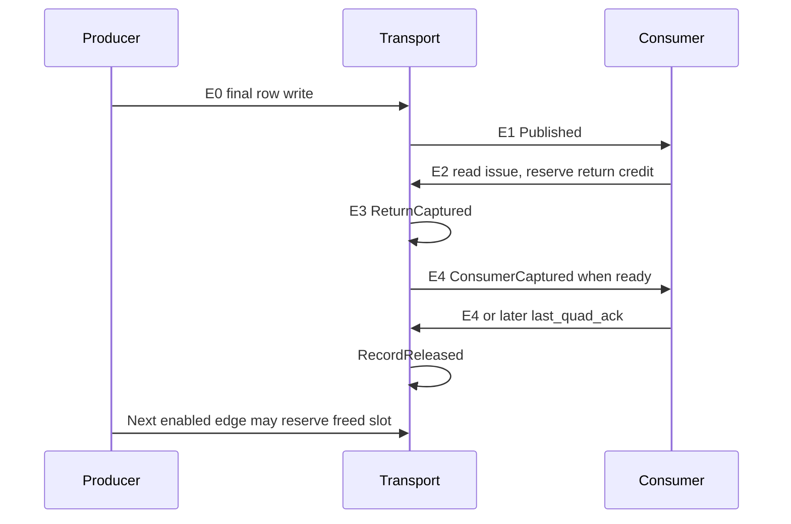

# Bounded triangle-record transport

`src/geometry/record_transport.rs` is an independent Rust control model for opaque
triangle-record rows. It executes ownership, storage admission, publication, the
shared read return, and release. It does not execute setup, coverage, attribute
arithmetic, or define a numerical record layout. The crate exports it through
`geometry::record_transport`; tests use that same implementation.

## Source connection

`geometry::source_record_link::Connection` supplies the normal-path lease
control between `frontend::source_capture` and the record controller. One
`pump` advances each controller once. The caller retains the producer, fan-row
encoder and consumer ports; the connection alone drives source admission and
the consumed-ticket feedback. It obtains context from the actual source
snapshot, with no test constant or payload copy.

The connection retains one offered ticket/context until actual
`SnapshotAccepted`. Actual `SnapshotLastUseAck` latches one feedback ticket,
consumed only on a later enabled edge. It does not merge physical source-slot
release, source-snapshot consumption, and final record release. The added state
is offer129 + feedback65 + unsupported-cancel1 = 195 host-witness bits; u64
ticket/context widths are diagnostic contracts, not fitted hardware tags.
Four counters and returned event vectors are host diagnostics. There is no fan
FIFO, second snapshot, capacity increase or additional RAM port.

Cancellation is rejected explicitly and latches a recreation requirement;
callers must drain the controllers externally. It cannot become a successful
consumed-ticket event. Complete cancellation and render-fence composition,
setup arithmetic and a numerical record encoder remain separate work.

## Storage and ownership

The model has exactly two record slots, each admitting 1 through 64 sequential
36-bit rows. Payload uses fixed arrays; allocation and release change metadata,
without clearing the payload. There is one writer and one shared reader for
coverage and attribute consumers. A write to a Writing slot and a read of a
different Published slot may happen on the same enabled edge. There is no fan
FIFO or additional record queue.

Every slot key binds slot index, monotonically increasing generation, source
ticket, context, and fan index. The context is frozen at construction. One active
upstream snapshot lease admits up to six consecutive fans. A third fan stalls
while both slots are occupied; its rows remain the upstream producer's duty.
`SourceEnd` announces the total fan count, including fans still awaiting credit.

Three completion boundaries have different meanings:

| Boundary | Meaning |
| --- | --- |
| Input `source_captured` | Upstream already owns a complete snapshot; transport accepts its ticket/context. This model does not read or release transformed source storage. |
| `SnapshotLastUseAck` | All announced fans have been completely written and published, or the source legally produced zero fans. Upstream may consume its snapshot. Published records remain owned. |
| `RecordReleased` | The final attribute return has transferred to its consumer and the caller supplied `last_quad_ack`. Only this successful event returns the record slot. |

`SnapshotLastUseAck` adapts to source capture's consumed-ticket input through
the normal-path `source_record_link::Connection` described above. Source
snapshots, raw scratchpad storage, and triangle records have separate lifetimes.

## Enabled-edge behavior

Eligibility is determined from pre-edge state. A final row write does not publish
on its own edge; publication occurs on the next enabled edge. A newly published
record cannot be read on that publication edge. Slot release cannot fund a
same-edge allocation. Callers advance or withdraw requests only after the
corresponding acceptance event.

The shared reader has one logical return credit spanning Pending and Captured
phases. It reserves ownership on issue, captures one enabled edge later, and
transfers no earlier than the following enabled edge. While the captured head is
blocked, further reads stall. A head transfer can accept a new read on the same
edge; a pending return cannot do so.



`last_attribute_capture` is an authoritative marker supplied by the external
attribute adapter, not a determination of actual quad exhaustion by this model.
Issuing that marked read seals further reads to the record. Its captured return
must transfer before release is legal. A final transfer and its ACK may coincide.
The future adapter must prove that every other consumer reference is finished
before supplying this marker; this fixture model cannot prove that property.

CE freezes admission, writes, publication, returns, transfers, ACKs, and cancel
drain. The finite wall-edge watchdog still counts disabled edges and rejected
actions. Source and reservation budgets are also explicit and positive. Normal
invalid actions are validated before state mutation, apart from this watchdog.
Bad context, stale owner/generation, malformed row, premature ACK, and illegal
state transitions return faults.

## Cancellation

`cancel()` latches stop intent. On enabled drain edges, an unpublished writer is
discarded, even if its final row was already written. The active snapshot emits
`SnapshotAborted`, without a successful last-use ACK. A pending read still
captures before being discarded on a later enabled edge. Captured heads are
discarded without successful consumer transfer.

A published record requires a separate fault-only `abort_ack` confirming that
consumers have cancelled every reference. This ACK can latch while its return is
pending, but the slot is freed only after that return is drained. Published
records are never silently freed by upstream cancellation. Abort events are
distinct from successful release events. `drained()` covers only this transport,
not DMA, source capture, renderer completion, or a draw fence.

## Verification and limits

The bounded regression uses independently generated nonzero fixture words and
checks every returned row and owner. It covers two occupied slots and third-fan
backpressure, all 64 rows, six fans and zero-output sources, CE holds, concurrent
read/write, shared-return turnover, stale keys, bad context and rows, early ACKs,
and cancellation in Writing, fully written but unpublished, Pending, Captured,
and Published states. Each controller has finite wall/source/record limits.

A fixed-seed scoreboard regression runs several overlapping sources and fans
through both physical slots, alternates the coverage and attribute consumers on
the single shared return, pauses on disabled edges, and ends with a legal
cancellation that aborts two still-published records. An independent test-side
scoreboard checks every accepted read word against the fixture function, the
publication order by record generation, and normal release only after a live
record's final capture was consumed. Cancellation instead requires each live
record's abort ACK; the two records in this sequence have not been final-captured.
Slot-credit and cancellation drains have explicit two-slot iteration bounds.

```powershell
& scripts/run-cargo.ps1 -Subcommand test -Label geometry-record-transport -LogDirectory target/gpu-v2-record-transport/logs -CargoArgs @('-p','gpu-v2','--test','geometry_record_transport','--offline','--','--nocapture')
& scripts/run-cargo.ps1 -Subcommand clippy -Label geometry-record-transport-clippy -LogDirectory target/gpu-v2-record-transport/logs -CargoArgs @('-p','gpu-v2','--test','geometry_record_transport','--offline','--','-D','warnings')
```

The implementation is an executable Rust storage/control boundary, not RTL or a
native BSRAM binding. Its response latency is explicit model behavior. Fixture
fan rows are supplied externally and do not count as a free hardware queue.
There are no fitted resource, frequency, or real geometry throughput results.
`tests/source_record_transport.rs` additionally checks the production connection
with actual source-slot reuse, a blocked third fan, live records after snapshot
consumption, CE across admission/feedback, non-default context, zero fans and
observable negative ACK/cancellation cases. Every driver has a cycle bound.

Production integration still needs the numerical row encoder,
coverage/attribute consumers, and complete cancellation/fence ownership.

## Test-only numerical connection

`tests/record_raster_pixel.rs` connects this controller to persistent
`PixelBranches` and the actual shared SDRAM cycle fixture. Its private 51-row,
36-bit format owns coverage edges, nine attribute fields, determinant, local
scale and original constant-channel attributes for a restricted 32x32 profile.
It is a test format, not a production triangle ABI or a storage budget.

The bounded consumer loads only `ConsumerCaptured` words, then advances a
tile/quad/lane cursor and holds one complete quad until actual admission.
All four helper UVs are captured; only covered lanes supply basic and lighting
attributes. After exhaustion and the final accepted quad, a later marked
attribute reread confirms the record before a later release ACK. Empty fans
also exhaust their consumer references before this confirmation.

Original snapped vertices and a separate per-sample solve supply the checker,
not consumer inputs. Tests compare final attribute codes and the complete
color/depth/texture/guard memory image. They cover real two-slot backpressure,
slot reuse, paused returns/helpers/final offers, finish, and cancellation.
Accepted framebuffer writes finish with genuine MC terminals during abort;
a poisoned memory owner cannot become successful global drain or render finish.

Setup encoding and attribute reconstruction remain atomic host oracle work.
Only transport, consumer control, downstream handshakes and the shared MC
execute cycle transitions. This fixture is not arithmetic emulation, a
counted/timed rasterizer, DRAW, RTL, fitted resources or board evidence.

```powershell
& scripts/run-cargo.ps1 -Subcommand test -Label record-raster-pixel -CargoArgs @('-p','gpu-v2','--test','record_raster_pixel','--','--skip','shared::tests','--test-threads=1')
```
