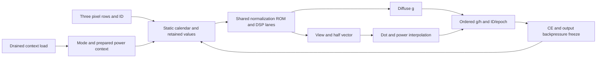
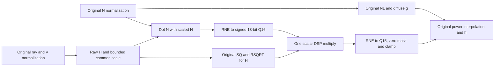
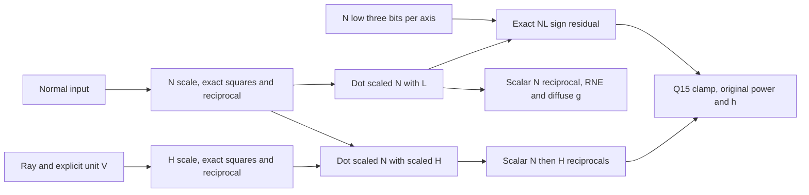
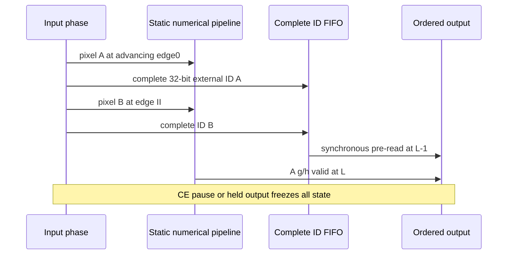
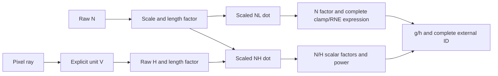

# Lighting models, emulator and RTL

Lighting is a pixel component. Its public ports are in `src/lighting/ports.rs`.
The independent numerical cycle emulator and synthesizable RTL implement the
single-pixel component. Quad allocation, GPU command ABI, final color and the
web adapter remain outside this component.

`sim::workbench` exposes the existing Fast/Compact full/diffuse bound DAG and
calendar to the [interactive scheduling workbench](../web/README.md#lighting-scheduling-workbench).
It independently validates manual issue/lane/II/capacity edits, preserving atomic
DSP/logic fusion and recomputing zero-latency wiring. Exported schedules are host
planning artifacts; they do not replace the emulator/RTL program automatically.

The selected NDC input is S(16,14), generated directly from pixel centers with
one RNE. View-ray products are S(32,28), then RNE to the Q14 working ray.
Normal working precision and Q14 light/projection uniforms remain unchanged.
Existing fitted tables below predate this input-width migration; allocation
changes do not constitute new PnR or board evidence.

## Cycle pipeline contract

`LightingProfile::Fast` implements full/specular II2 and diffuse II1;
`LightingProfile::Compact` implements full/specular II3 and diffuse II2.
`LightingEmu::with_profile(profile, max_wall_ticks)` and
`rtl::generate_with_profile(profile)` select the same independently checked
static calendar. `new` / `generate` default to Fast. The full path also computes
diffuse g; both profiles produce the same g/h bits. Historical Rust scheduling
alternatives below remain modeling evidence, with their own reported latencies.
The separately selected [resource profiles](#resource-profile-contract) keep these
II targets and the port/ownership contract, but change H rounding. The original
profile remains the default and the numerical comparison baseline.
The additional [system candidates](#system-candidates-and-selection) use II2/II4
in both modes and expose their changed N/NL semantics explicitly.



The calendar is compiled once from the architecture graph, independently checked
for cross-iteration collisions and dependency timing. It contains no runtime
resource arbitration. Registered one-hot full/diffuse phase selectors drive
physical lane input muxes. Identical typed cones share arithmetic; their declared two-cycle latency is
implemented as two actual combinational segments separated by a packed register
of live intermediate values. DSP operands
are selected before multiplication, and ROM addresses before synchronous reads. Free slots use one real operand choice
as a harmless default instead of masking every inactive slot to zero. Only the
checked occupied slot has consumers; ROMs are read-only and the DSP macro does
not accumulate. Valid, CE and retained-value ownership remain unchanged.
Each value is retained only until its scheduled consumers, using II-spaced delay
registers. Uniform sources bypass these per-pixel delays. The two modes share DSP
and ROM hardware, but have separately retimed pixel/ID/value storage. They cannot
be in flight together: mode/context changes require complete drain.

Context includes mode, shininess, light/projection fields and a 16-bit epoch;
43 derived power fields are prepared and latched once on context load. Pixel
input is three simultaneous 36-bit rows plus a 32-bit ID. Output is g9/h9, ID32
and epoch16. The interface is defined by `LightingTick` / `LightingSignals` and
the generated `gpu_v2_lighting` ports:

- `tick` returns pre-edge signals and then applies the edge. Transfers require
  CE and ready/valid. The emu validates accepted inputs, with an explicit wall
  clock budget; parked inputs do not fault.
- Reset wins even when CE is zero, invalidates context and drops all tokens.
  Numerical registers need no reset because valid/ownership is cleared.
- CE pauses and a held valid output freeze the entire datapath, token ages,
  calendars and retiming. Output payload remains stable until accepted.
- Context ready requires an empty pipeline and CE. A context request suppresses
  pixel acceptance; context changes are atomic. This drain rule is intentionally
  simpler than the exploratory mixed-context Rust reservation model.
- Unlit/ambient use the diffuse calendar and select the specified constant at
  commit. Their latency is not an early-return bypass.

The emu executes operations when their stage issues and publishes them at their
ready age. It never calls the oracle or counted evaluator on pixel acceptance.
The RTL generator reads template values only for literals; runtime pixels,
uniforms and immutable table contents drive every other value. Signed results
are computed explicitly before selection. The static power path clamps the
interpolation coordinate to32767 and then selects the exact32768 endpoint;
this makes one fixed graph safe for every pixel without a sample-dependent
endpoint branch. RNE remains in normalization and final output, with floor only
in the nonnegative power interpolation as specified by the architecture profile.

Gowin mode instantiates registered MULT9X9 / MULT18X18 (three advancing edges)
and MULTADDALU18X18 (four, including a tail register and aligned C input). The
behavioral backend uses matching latencies. Normalization tables are packed
SQ256 plus RSQRT128 into one512x36 ROM per read lane; power uses two ROMs.
Synthesis can additionally map long retained-value chains into BSRAM/SSRAM;
counted ROM budgets therefore do not describe the total fitted memory usage.

## Compact normal transport

The new functional chain selects **S12F10** (12 total signed bits, ten fractional
bits, also called S2.10) for both transformed-normal output and interpolated
pixel-normal storage. The original v6 mesh input stays S8F7. Light direction,
projection, normalized N/V/H, reciprocal and dot/power working formats stay at
their existing precision. In particular, normalized N is still Q14; narrowing
transport does not imply a narrower reciprocal or DSP result.

`spec/lighting-formats.csv::NormalInput` is the twelve-bit arithmetic type.
`CompactPixelInput` validates codes [-2048,2047], does not normalize them, and
defines this local layout:

| Row | Bits | Meaning |
| --- | --- | --- |
| 0 | [11:0], [23:12], [35:24] | Normal XYZ, three S12F10 codes |
| 1 | [15:0], [31:16] | NDC XY, two S16F14 codes; four spare bits |

Thus the payload is68 bits and exactly two36-bit rows, versus80 meaningful bits
in three36-bit rows on the original port. Normal alone falls48->36 bits. A
four-pixel normal+NDC snapshot falls320->272 payload bits; a sixteen-pixel store
falls1280->1088 payload bits, excluding headers. These are bit counts, **not**
fitted FF/BSRAM savings or changes to the existing pixel-system live stores.

The producer performs RNE directly at F10 (negative ties included). Converting
existing Q14 codes uses right-RNE4 with positive +2 saturation to2047; expanding
the twelve-bit code into the working Q14 value sign-extends and appends four
zero bits. Expansion is wiring. Direct f64 producers quantize once at F10,
avoiding an unintended double-round through Q14. `rows` / `from_rows` reject
noncanonical upper bits. CPU-facing producers may retain aligned signed16 Q14
words and explicitly use `from_q14`; tight internal storage still uses S12F10.
There is no separate sign-magnitude storage ABI or negative-zero encoding.

`counted::evaluate_compact` actually reads `pixel.compact-rows` with two declared
rows and twelve-bit slices, then uses the original square/rsqrt/power arithmetic.
Full mode reads the normal row and NDC row; diffuse reads only the normal row.
The compact kernel extracts each sign as wiring, computes magnitude with a
signed13 negator (including -2048), then compares unsigned12 magnitudes. Only
the selected maximum enters Q14 max/prescale arithmetic; signed components
expand independently as wiring for the existing signed DSP arithmetic. Zero
detection is `max_code < 1`, exactly equivalent to the Q14 threshold4. Expanded
values have four zero low bits and common downscale is at most two bits, so the
32767/RNE-overflow prescale guard is unnecessary. SQ, RSQRT and normalized N
remain unchanged. This local sign/magnitude view does not persist duplicate
components or change negative rounding to magnitude truncation.

`timed::plan_compact` reserves this graph with68 payload bits/pixel and two input
rows. It requires already quantized codes; `plan` with the compact flag rejects
Q14 inputs having nonzero low four bits. Row calendars explicitly gate
`pixel.compact-rows` on their physical read-ready times and audit two-row
coverage. This first row calendar prefetches both rows even in diffuse mode;
the counted diffuse kernel itself consumes only the normal row. Architecture
profiles with prelatched power fields still require
register inputs; the separate row experiment uses the non-prelatched optimized
kernel and performs its context-ROM work in the counted graph. The four uniform
rows remain aligned Q14. This is offline counted/timed support, not a compact
cycle port or fitted mux/BSRAM implementation.

### Exact narrow prescale and storage-aware candidate

`counted::Config::compact()` selects architecture arithmetic with compact
transport and `compact_prescale`. Both flags are explicit; the previous compact
graph remains selectable with `compact_prescale=false`. For a nonzero U12 maximum
code `m`, let `z=leading_zeros_12(m)`. The Q14 common shift is `z-2`, so
`(code<<4) << (z-2)` equals `(code << z) << 2`. The dynamic operation is therefore
a **signed13 left shift**, followed by two zero bits of wiring. Its magnitude is
at most4095; no normal-prescale RNE or signed right shift remains. Zero codes use
the original0.5 fallback, with the same final zero gate. Published SQ, reciprocal,
normalized N and all later stages match the original quantized-input contract.
This option works with the existing scalar/block alternatives; it changes only N
prescale, not their separately declared H/dot semantics.

`Storage::DemandRows` is an additional offline compact-input calendar. It reads
the rows actually consumed by the current uniform mode: none for unlit/ambient,
normal only for diffuse, normal plus NDC for full. `ReadOrder::PixelMajor` and
`NormalFirst` compare per-pixel and normal-row-first ordering on the same ports.
The original `Storage::Rows` remains the conservative prefetch baseline. Both
use the same68-bit transport and four aligned uniform rows, and retain the
architecture/register-input restriction. Demand reads reduce bandwidth; they do
not by themselves change the upstream allocated payload or context preparation.

`PeriodicSchedule::compact_storage_bounded` compares whole and partial ALAP
placements with width-weighted, repeated value lifetimes. It tries at most256
candidates, preserves lane/phase, input capture ages, II and commit age, and accepts
only independently audited placements whose peak live bits do not increase.
Blind ALAP can increase this cost, particularly when an input row or reciprocal
has several consumers. ROM/DSP physical calendars are checked separately by
`audit_physical`. Live-bit cost excludes primitive-internal registers, control,
IDs/FIFOs and routing; it is not total FF count or a synthesis result.

The browser uses this same numerical contract through `oracle::evaluate_output`
after transport expansion; it does not run the audited evaluator per pixel.
Existing `PixelInput` / `PixelRows` and cycle emu/RTL continue to define the
original wide transport. The cycle-program constructor rejects the compact
flag rather than incorrectly treating it as the old three-row input. Migrating
that external port/calendar is a separate hardware task; no new II, latency or
PnR result is claimed by this functional precision change.

S12F10 fits the binary upstream pipeline better than strict SNORM12. SNORM12's
producer encoding uses2047 instead of1024 and clips at±1; when consumed only by
normalization, its integer codes can be expanded by appending three zeros,
letting normalization remove the common scale. The browser retains SNORM12 as
an explicit comparison. S12F10 preserves more headroom for unnormalized normals
and avoids the2047 scaling at the producer. Normal-matrix and mesh preflight
remain necessary; near-cancelling or tiny normals can still have larger errors.

Light retains the aligned Q14 boundary in this unit. A separately quantized
S12F10 light is a possible future contract, with a matching unit-length error
tolerance; reusing the normal's arbitrary common-scale shortcut would change
both dot products and L+V because light is not normalized inside lighting. Its
48-bit uniform cost is paid once per context, unlike per-pixel normal storage. Uniform
rows, the180-bit retained context and ROM precision remain unchanged in this
unit. Power context43->30 and literal power28->27 repacking remain candidates;
they are not silently counted as implemented. Keeping the existing ROMs avoids
changing the numerical approximation while isolating normal transport errors.

Verification covers all4096 codes, all65536 Q14 conversions,17 exponent codes
against the counted output, numerical frame comparison, and functional FIFO
capacity changes. In one deliberately bright200x120 grazing scene (yaw85,
s=4, Cs255), changing only pixel-normal Q14->S12F10 gave max |delta g|=1 and
|delta h|=1 Q8 code, with identical D16. This is a finite example, not a global
bound. Larger full-pipeline differences include compact fetch, geometry coverage,
RGB565 tint and earlier normal quantization, so they cannot be attributed only
to the lighting input width.

## Implemented Fast path walkthrough

The current `system::pixel::LightingLive` constructor explicitly selects
`LightingEmu::with_profile(Fast)`. It does not select Resource, System or Factor.
This section describes that original architecture and its matching RTL export.
Compact changes its calendar and capacities; the alternatives below change more
than scheduling and must be selected explicitly. Ages below are relative to an
accepted pixel at age0 and count advancing edges, not stalled wall clocks.
The result becomes valid at age97; its first transfer is on the following edge.

### Input and immutable context

| Boundary | Useful payload | Actual interface / retained owner |
| --- | --- | --- |
| Pixel normal | Three signed16 Q14 components, 48 bits; not normalized upstream | PixelRows row0 holds X/Y; row1 holds Z |
| Pixel center | Two signed16 Q14 NDC components, 32 bits; each in [-1,1] | Row1 bits16..31 hold X; row2 bits0..15 hold Y |
| Pixel capture | 80 useful bits plus external ID32 | Three simultaneous36-bit RTL inputs, not three serial RAM reads |
| Uniform fields | Light48 + projection48 + Ia/Id18 + mode2 + shininess5 = 121 bits | Latched once per drained context update; no per-pixel uniform delay copies |
| Complete retained context | Uniform121 + epoch16 + prepared power43 = 180 bits | Immutable registers; specular RGB is represented here only by the prepared mode |
| Ordered result | g9 + h9 + ID32 + epoch16 = 66 bits | Held pipeline output; no additional local result FIFO |

The 43-bit power context contains boundary15, coarse shift4, fine shift4 and two
address bases of10 bits each. A 32x43 context ROM has17 useful entries. Context
load selects and latches one entry. The four36-bit `UniformRows` are a candidate
packing helper, not the physical RTL's uniform RAM or a serial loading protocol.

### Numerical paths and exact published ages

Normal and view/half computations overlap. The following rows are numerical
boundaries, not mutually exclusive whole-clock stages: different pixels use
different physical lanes in the same edge.

| Work | Full path age | Diffuse age | Data / operation |
| --- | --- | --- | --- |
| Read normal rows | 2 | 2 | Extract three signed16 Q14 values |
| Common normal scale | 13 | 13 | Widen magnitude to17 bits, max of three, threshold4, leading zeros and shared shift; shifted components stay16 Q14 |
| Normal squared length | 20 | 20 | Three signed-SQ chords and their sum, unsigned30 Q28 |
| Normal reciprocal length | 29 | 29 | RSQRT interpolation and exponent restoration, unsigned17 Q15 |
| Unit normal | X/Z37, Y38 | X/Y/Z37 | Three signed16 x unsigned17 products, signed33 Q29; RNE/clamp to signed16 Q14 |
| Normal-light dot | 46 | 44 | One standalone third product plus one paired MAC for the other two and sum; signed34 Q28 |
| Diffuse coefficient d | 50 | 48 | Clamp NL to [0,1], RNE to unsigned9 Q8 |
| Diffuse g | 58 | 55 | Id9 x d9 -> unsigned18 Q16, RNE; add Ia in10 Q8 and saturate to511 |
| View ray | X/Y8, Z3 | Not used | NDC16 x projection16 -> signed32 Q28, RNE to signed16 Q14; Z is uniform k |
| View squared length / reciprocal | 13 / 22 | Not used | Same SQ/RSQRT method; validated k>=8192 permits no magnitude prescale or zero branch |
| Unit view vector | 29 | Not used | Three signed16 Q14 components |
| Half-vector common scale | 38 | Not used | RNE((L+V)/2), magnitude threshold64, common scale |
| Half squared length / reciprocal | 45 / 55 | Not used | unsigned30 Q28 / unsigned17 Q15 |
| Unit half vector | X/Y64, Z63 | Not used | Three signed16 Q14 components, with degenerate H forced to zero |
| Normal-half dot | 71 | Not used | Paired MAC plus third product; signed34 Q28 |
| Power coordinate x | 75 | Not used | Clamp NH to [0,1], RNE to unsigned16 Q15, including32768 endpoint |
| Shininess power | 89 | Not used | Prepared-context segment selection, one power read and delta-times-tail interpolation |
| Masked p9 | 91 | Not used | RNE power to unsigned9 Q8; force zero when NL<=0 |
| Specular h | 96 | Constant zero | Id9 x p9 -> unsigned18 Q16, RNE to9 Q8 |
| Ordered result valid | 97 | 56 | g/h and complete ID aligned; acceptance requires CE and output ready |

For SQ, a signed scaled component is decomposed as x=128a+b, b in0..127.
The 256-entry signed table supplies a*a; a9-bit slope (2a+1) multiplies the tail
using DSP9. The Q28 chord is `(a*a<<14) + ((2a+1)*b<<7)`. This removes a second
absolute-value step; the maximum-magnitude prescale still computes magnitudes.
Very small N/H use a safe internal vector before lookup and mask the normalized
output to zero afterwards, so a zero input cannot create an invalid RSQRT address.

RSQRT uses two64-segment pages selected by exponent parity. Each24-bit entry
contains base16 and delta8; an8-bit fraction drives a DSP9 correction, RNE and
exponent restoration. It computes inverse square root, not general reciprocal.
The latter's LUT/Newton path is not needed by this lighting component.

Power clamps its lookup input to32767 and separately selects the exact32768
endpoint. The prepared context selects coarse/fine segments; the28-bit entry
contains left16 and delta12. Delta12 times tail12 gives24 bits in DSP18. Only
this nonnegative interpolation correction uses floor; normalization and output
quantization retain RNE. Full-mode pixels with NL<=0 still traverse the specular
calendar and are masked near the end. They do not dynamically become diffuse jobs.

### DSP issue and memory ports

| Owner | Physical capacity | Per-pixel full / diffuse work | Ports and timing |
| --- | --- | --- | --- |
| Small multipliers | 7 MULT9X9 | 14 / 5 issues | One operand pair per lane per edge, three advancing-edge latency |
| Large multipliers | 7 MULT18X18 | 14 / 4 issues | One operand pair per lane per edge, three advancing-edge latency |
| Paired dot MAC | 1 MULTADDALU18X18 | 2 / 1 issues | Two products plus aligned C, four advancing-edge latency; no running accumulation |
| Normalization tables | Six replicas, each512x36 | 12 / 4 reads | One synchronous read per replica per edge, one advancing-edge latency, no runtime writes |
| Power table | 1024x28 logical, split16+12 | 1 / 0 reads | Both slices read the same10-bit address; one logical read, one-edge return |
| Material context table | 32x43 logical | No per-pixel read | Select once at drained context update and latch43 bits |

Each normalization replica packs signed SQ256 and RSQRT128; remaining words are
unused. Different replicas supply independent simultaneous addresses. Physical
power allocation uses the existing two BSRAM slices, not two independent pixel
requests. The 886 useful power entries fit the padded1024-word address domain.

Full N SQ reads issue15/return16, RSQRT23/24; V SQ reads issue3 and8, RSQRT16/17;
H SQ reads40/41, RSQRT49/50. All are scheduled in the shared six-port calendar.
The paired MAC handles NL at42/46 and NH at67/71, occupying opposite II2 phases.
The third products issue38/ready41 and64/67 respectively. Power reads83/84,
its interpolation product84/87, and final h multiplication91/94 before RNE.
These times are from the implemented calendar, not an ASAP dependency sketch.

Full work is14 DSP9 products,14 standalone DSP18 products and four products in
two paired-MAC issues. The seven small and seven large lanes are physical sites,
not multipliers allocated separately to every pixel. The DSP coexistence checker
packs them into seven macros/four tiles. No full/diffuse runtime resource arbiter
exists: both mode graphs use the same sites and switch only after complete drain.

### Retention, identity and backpressure

The default export retains6201 logical bits in per-value delay chains,504 bits
in the two modes' input-row delays,180 context bits and98 valid ages. Examples
below state extra retained taps beyond the producing lane's current output.

| Value | Width | Ready / last consumer | Retained words / payload bits |
| --- | ---: | --- | ---: |
| Full N.x | 16 | 37 / 67 | 15 / 240 |
| Full N.y | 16 | 38 / 67 | 15 / 240 |
| Full N.z | 16 | 37 / 64 | 14 / 224 |
| Full NL | 34 | 46 / 89 | 22 / 748 |
| Full g | 9 | 58 / 97 | 20 / 180 |
| Full H.x/H.y | 16 each | 64 / 67 | 2 / 32 each |
| Full H.z | 16 | 63 / 64 | 1 / 16 |
| Full h | 9 | 96 / 97 | 1 / 9 |
| Diffuse N.x/N.y | 16 each | 37 / 40 | 3 / 48 each |
| Diffuse g | 9 | 55 / 56 | 1 / 9 |

For distance D and initiation interval II, extra retained words are ceil(D/II).
Consumers select compile-time taps, with no indexed scratchpad or dynamic free
list. At each value's scheduled phase, old taps shift to the next tap. Multiple
wire consumers can read taps simultaneously. This is not automatically equivalent
to a single1R1W addressable RAM; replacing it requires a separate port/age mapping.
The default leaves FF/shift-memory inference to synthesis. The explicit Compact
RAM rings described in Resource profiles belong to that separate option.

The default preserves two independent external-ID chains: full50x32=1600 bits
and diffuse57x32=1824 bits. It does not use the newer shared-ID FIFO. The selected
mode shifts its chain at its II phase and reads a fixed output tap. ID32 is kept
even though the current pixel adapter uses only quad4+lane2. Context epoch16 does
not need a per-token chain because context cannot change until complete drain.
Phase2, one-hot calendar5 and configured1 provide8 control bits. Generated
register-declaration metrics also include physical lane/cut storage; they are
not fitted FF counts. Fitted BSRAM totals, including inferred retention, remain
in the isolated validation record below rather than in this logical payload bill.

An enabled edge advances only when context is configured and the old output is
not held by backpressure. Input acceptance additionally requires phase0 and no
context request. CE0 or a blocked valid output freezes every phase, valid age,
DSP stage, ROM return and retained tap. Reset clears ownership even at CE0;
stale payload bits need no clearing. Unlit/ambient select constants at the
diffuse output age; they are not early-return component paths.

The live adapter separately owns one332-bit input snapshot: four80-bit pixels,
mask4, cursor3, quad4 and valid1. It only issues covered, non-default lanes after
actual quad admission; it has no pre-admission quad copy or added result FIFO.
The existing J1 light store is64x18 logical payload, one result write port and
one final-stage read port. A result is popped only when that write succeeds;
LightDone follows all required writes. Default-light slots use constants without
reading or writing this store. J1's synchronous return and global retirement
remain separate from LightingEmu's numerical completion and identity ownership.
The complete-image pixel composition is Rust validation; it is not integrated
GPU RTL or whole-GPU fitted memory/port proof.

Reproduce the operation and retention tables with the existing
`lighting_rtl_export` example (`gowin fast`, no alternative argument):
`operations.csv`, `storage.csv`, `lanes.csv` and the generated RTL describe the
same selected body. `LightingVerilog::stages` supplies published names, widths
and ages. This documentation does not require a new fit or new arithmetic tests.

## Isolated implementation validation

Both profiles compare all published numerical stages on975 representative inputs
against counted and final g/h against the independent oracle. The stream test
uses27 contexts,112 pixels each, all17 shininess codes, thresholds/endpoints,
all normalization power-of-two boundaries and signs,
negative extremes, random normals and projections, CE pauses, prolonged output
backpressure, drained context changes and in-flight reset followed by restart.
Each profile commits3025 distinct tokens after dropping the reset-aborted token.
Icarus checks every handshake, ordered payload and currently produced stage
against the independent numerical emu, for both behavioral arithmetic and the
actual Gowin DSP simulation library. Repeated held outputs/stages are observations,
not additional retired pixels. The watchdog bounds each test.

The fit comparison uses the same serial anti-optimization `lighting_probe`
harness, GW2AR-LV18QN88C8/I7 versionC, Gowin V1.9.8.11 Education and an18.518ns
clock. All pixel/context bits remain variable and all output bits feed a checksum.
These are complete PnR results for the isolated probe, including its309 registers
and surrounding logic, not a whole-GPU/CPU/display fit or physical-board proof.
The original registered-calendar baseline is:

| Quantity | Fast | Compact |
| --- | ---: | ---: |
| Full/specular II / latency (advancing edges) | 2 / 97 | 3 / 95 |
| Diffuse II / latency (advancing edges) | 1 / 56 | 2 / 56 |
| PnR Logic, including RAM16 charge | **4195** | **3818** |
| LUT / ALU / RAM16 | 3091 / 750 / 59 | 2834 / 582 / 67 |
| Fitted registers | 4068 | 3521 |
| BSRAM, total | 18 | 13 |
| BSRAM ROM / retained-chain blocks | 8 / 10 | 6 / 7 |
| MULT9X9 / MULT18X18 / MULTADDALU18X18 | 7 / 7 / 1 | 5 / 5 / 1 |
| Actual Fmax (MHz) | 79.109 | 83.209 |
| Worst setup slack at54.002MHz (ns) | 5.877 | 6.500 |
| Setup / hold violated endpoints | 0 / 0 | 0 / 0 |

Compact saves377 Logic (8.99%),547 fitted registers and five BSRAM blocks
relative to Fast. Both return to the original DSP inventory. Compared with the
same-DSP split-cone baseline, Fast saves20.19% Logic and Compact16.71%, while
preserving II and latency. Fast Fmax decreases from84.765MHz but still passes
the54.002MHz constraint; Compact Fmax improves from64.530MHz. Whole-GPU
selection must also include retained memory, registers and system timing.

`structure.txt` reports13998/9650 behavioral register declaration bits, not fitted
FF. Synthesis absorbs storage into DSP/BSRAM/SSRAM and propagates narrow control
ranges. Raw final reports are under `target/gpu-v2-lighting/shift-study/q-domain-fast`
and `q-domain-compact`: `impl/pnr/lighting.rpt.txt`, `lighting.tr`, and
`impl/gwsynthesis/lighting_syn_rsc.xml`. Selected final reports are also retained
in the local `gpu-v2-lighting-fit-evidence` record under `shift-fast/compact`.
Earlier `fit-*-calendar` and `logic-study` reports are historical evidence.
All compared builds use the same harness, device, constraints and tool version.

## Resource profile contract

`LightingEmu::with_resource_profile(profile, max_wall_ticks)` and
`rtl::generate_resource_profile(profile)` select the completed area alternative.
`counted::Config::resource_profile(profile)` supplies its numerical graph.
Both profiles have identical g/h semantics; the original default remains available.
N normalization, NL and its positive specular gate, V normalization, half-vector
construction and the raw H threshold64 retain the original numerical contract.
Only H component normalization moves after its dot product:



The raw Q28 dot fits signed30 bits. Its signed18 Q16 operand multiplies the
unsigned17 Q15 reciprocal; the product rounds to signed18 Q15 before clamping
to0..32768. The published `nh` is this Q15 result rescaled to Q28, without another
round. Scalar H does not publish `h.0..2`; its observable boundaries are
`h.shift`, `h.q`, `h.r` and the scalar dot/product stages.

The calendar partitions large DSPs by semantic role: one ray lane; two/one V
component lanes for Fast/Compact; four/three remaining arithmetic lanes.
Fast dedicates separate paired MACs to NL and NH; Compact shares one. An independent
modulo checker verifies both role restrictions and the merged physical calendar.
No runtime arbiter or multi-pixel batching is added. Both modes share one complete
32-bit ID delay chain, selecting its capture phase and output tap by drained mode.

## Resource profile storage and scaling

Compact replaces wide variable prescale plus sticky-bit rounding with a16-bit
left shifter and two fixed signed right-RNE cases. A normal needs at most a
two-bit downscale; H needs at most one. The only maximum-magnitude guard adjustment
is32767 to shift-2. Exhaustive scalar bounds and stage comparisons preserve the
original N and H pre-scale values. Fast retains the original prescale because it
fits better under its different sharing/calendar structure.

Compact explicitly stores up to six large distant token taps in synchronous
BSRAM arrays. A candidate has width9..36 and exactly one distinct distant depth
D>=4; nearby taps remain in FFs. Each ring has next-power-of-two(D+1) words.
Its producer phase writes and advances the pointer; the consumer phase reads
one edge early, with offset D-1 if that edge also writes and D otherwise.
There is no same-address read/write dependence. Reset/context load resets ownership
and pointers without clearing data. CE and backpressure freeze reads, writes and
pointers together. A bounded independent FIFO proof covers every phase at II1..3,
depths4..64, pointer wrap, CE pauses and restart with stale memory.

Forcing the same RAM policy in Fast fitted slightly worse, so Fast retains its
inferred delay storage. Whole-mode value-chain merging and further constant-cone
sharing also fitted worse despite smaller declaration counts. Neither is selected.
The unchanged uniform context already avoids per-pixel uniform retention.

## Resource profile fitted comparison

These flat builds use exactly the same isolated probe, device, tools and timing
constraint as the original baseline above. The resource export is byte-identical
to its fitted source; hashes and selected reports are retained in the local
`gpu-v2-lighting-fit-evidence` record under `resource-fast/compact`.

| Quantity | Resource Fast | Resource Compact |
| --- | ---: | ---: |
| Full/specular II / latency (advancing edges) | 2 / 86 | 3 / 88 |
| Diffuse II / latency (advancing edges) | 1 / 56 | 2 / 53 |
| PnR Logic, including RAM16 charge | **3738** | **3601** |
| Change from original profile | -457 (-10.89%) | -217 (-5.68%) |
| LUT / ALU / RAM16 | 2600 / 676 / 77 | 2763 / 568 / 45 |
| Fitted registers | 3959 (-109) | 4050 (+529) |
| BSRAM total; ROM / retained blocks | 16; 8 / 8 | 13; 6 / 7 |
| MULT9X9 / MULT18X18 / MULTADDALU18X18 | 7 / 7 / 2 | 5 / 5 / 1 |
| Actual Fmax (MHz) | 90.418 | 100.371 |
| Worst setup slack at54.002MHz (ns) | 7.458 | 8.555 |
| Setup / hold violated endpoints | 0 / 0 | 0 / 0 |

Fast spends one additional paired MAC and saves two BSRAM blocks. Compact keeps
its DSP/BSRAM inventory but uses more fitted FFs: this is an area trade, not a
reduction of every resource. Compact saves only137 Logic over resource Fast.
Declaration counts11494/8764 include inferred/explicit memory and are not FF counts.
These remain isolated complete lighting PnR results, not whole-GPU or board proof.

Diagnostic hierarchy synthesis gives the following exclusive attribution. Its
PnR totals3723/3587 differ from the selected flat totals by15/14 Logic; its
synthesis sums are a separate boundary and must not be added to the flat table.

| Local synthesis Logic category | Original Fast | Resource Fast | Resource Compact |
| --- | ---: | ---: | ---: |
| Variable scaling, including rounding inside shifts | 1197 | 1163 | 959 |
| Other rounding | 557 | 399 | 343 |
| Magnitude, comparison and selection | 518 | 506 | 605 |
| Ordinary sums and increments | 369 | 385 | 351 |
| DSP inputs and external pair tail | 597 | 365 | 568 |
| LZD | 104 | 95 | 125 |
| ROM address/interface | 80 | 41 | 67 |
| Parent DUT: context, retained storage and control | 622 | 660 | 467 |
| Serial harness | 93 | 76 | 76 |
| Synthesis total | 4137 | 3690 | 3561 |

Fast's main savings are DSP operand selection and independent rounding, rather
than a smaller phase controller. Variable scaling still costs31.52% of its
synthesis total; rounding10.81%, DSP inputs9.89%, and the parent17.89%.
Compact's narrower scaling costs26.93%; its shared DSP inputs still cost15.95%.
The small Logic gap therefore reflects different arithmetic/sharing/storage
tradeoffs, rather than an expectation that increasing II alone halves area.

## Resource profile numerical and cycle validation

The independent oracle implements the revised H expression separately from the
audited graph. Tests compare every published counted stage, then cycle emu and RTL.
The57,548-input corpus includes all17 shininess codes, signs, pre-scale boundaries,
H degeneration thresholds, highlight-biased random inputs and22,450 NL-cancellation
inputs. g is unchanged; h differs from the original in2338 inputs, by at most one
output code (1/256). This is a measured corpus bound, not a universal error proof
or an improvement claim against the continuous ideal. The existing hard H threshold
can create large differences from that ideal in both versions.

Moving N normalization after NL was rejected: the cancellation sweep changed the
NL>0 gate259 times and allowed a256-code h difference. For example, normal
`[1023,0,8]`, NDC`[0,0]`, light`[128,0,-16383]`, shininess16 changed old
NL128/h256 to scalar-N NL0/h0. Changing V squares was also rejected because
half-vector cancellation magnifies its error. Direct H squares were measured
but offered no useful area/DSP trade and allowed a two-code h difference.
These were the previous round's contract-preserving decisions. The next study
compares revised numerical contracts against the continuous ideal: the fixture's
exact input NL is -120, so its original h256 is itself incorrect.

The completed checks are128 GPU tests (one separately run ignored RTL test),
strict GPU clippy and formatting; original and resource RTL stage/cycle comparisons
with behavioral and actual Gowin DSP models; the synchronous-ring phase/wrap proof;
and the mandatory CPU core31/system2 co-simulations. Resource stream observations
are Fast14864 cycles/8713 outputs/161228 stages and Compact19038/9277/136401.
Both commit3025 distinct tokens, with full32-bit IDs, CE, held outputs, drained
context changes and reset/drop/restart. BSRAM arrays are inferred RTL tested with
the synchronous behavioral model and fitted in Gowin; a vendor BSRAM primitive
simulation and GPU/system integration remain separate verification boundaries.

```powershell
& scripts/run-cargo.ps1 -Subcommand test -Label lighting-resource-numerical -CargoArgs @('-p','gpu-v2','--test','lighting_scalar','--','--nocapture')
$env:LIGHTING_RESOURCE_PROFILE='1'
& scripts/run-cargo.ps1 -Subcommand test -Label lighting-resource-rtl -CargoArgs @('-p','gpu-v2','--test','lighting_cycles','verilog_matches','--','--ignored','--nocapture','--test-threads=1')
Remove-Item Env:LIGHTING_RESOURCE_PROFILE
& scripts/run-cargo.ps1 -Subcommand run -Label lighting-resource-fast -CargoArgs @('-p','gpu-v2','--example','lighting_rtl_export','--','target/gpu-v2-lighting/scalar-study/selected-fast','gowin','fast','resource')
& scripts/run-cargo.ps1 -Subcommand run -Label lighting-resource-compact -CargoArgs @('-p','gpu-v2','--example','lighting_rtl_export','--','target/gpu-v2-lighting/scalar-study/selected-compact','gowin','compact','resource')
# Run gw_sh build.tcl in the exported directory; resource-hierarchy exports the diagnostic hierarchy.
```

Raw candidates and rejected generator snapshots remain under
`target/gpu-v2-lighting/scalar-study`. The selected flat fits are `dots-fast` and
`ram-compact`; `selected-*` are reproducible exports of those sources. CSV block
calendar studies remain alternative scheduling models, not the implemented role calendar.

## System candidates and selection

`SystemFast` and `SystemCompact` add full/diffuse II2 and II4 respectively.
`LightingEmu::with_system_profile` and `rtl::generate_with_options(profile,
LightingRtlOptions::system_profile())` explicitly select the gate-corrected
N/H scalar kernel. Original default and earlier resource exports are unchanged,
including their fitted source identities. These are isolated integration
candidates; no whole-GPU composition or board validation is claimed.

The aspiration was2200 Logic /9 BSRAM /12 DSP18 within the proposed whole-GPU
budget. **No tested candidate meets it.** The gate-corrected Fast even costs more
Logic than the original Fast. The smaller scaled-gate variants have demonstrated
new NL sign errors. On2026-10-02 the user accepted the NL errors in all reviewed
examples, including area-introduced cases, as visually tolerable edge offsets of
about one pixel. This is a visual decision, not a mathematical one-pixel bound for
all inputs, and does not accept half-vector degeneration. Area-oriented follow-up
uses the scaled-gate candidate; exact NL recovery remains a diagnostic/regression
comparison rather than a required cost for those accepted NL cases. No production
default or whole-GPU integration is changed by this decision.
The H-only reference keeps the previous N/NL contract
and is a useful resource alternative under these slower throughput targets.

The bounded search compared H-only, direct N/V/H DSP18 squares, N/H DSP9 squares,
terminal-only logic registers, and an exact NL low-bit correction. There is no
new quad/warp state: context uniformity was already shared, while N and H vary
per pixel. Grouping pixels alone does not remove their computations or lifetimes.

## System arithmetic boundaries



N/H are factors rather than three unit-vector outputs. V still produces a vector
for L+V. DSP18 squares remove SQ chord reads, interpolation and associated muxes;
RSQRT approximation and power interpolation remain. NL raw Q28 rounds to signed18
Q16, multiplies unsigned17 Q15 rN, narrows to signed34 Q31, and rounds to signed18
Q15. NH raw Q28 narrows to signed31, rounds to signed18 Q15, multiplies rN and
narrows to signed32 Q30 before RNE to signed18 Q16; multiplication by rH then
uses the NL product/round formats. Checked narrowing is part of the audited graph.
Published `nl`/`nh` rescale the Q15 scalar results to Q28; `nl.gate` is separate.

For N right prescale k=1/2, raw N = RNE(N/2^k)*2^k + residual. Three original low
bits per axis determine residual in -2..2. Odd tails use the same +/-L correction
for both k; only an even tail2 at k2 needs +/-2L. The corrected sign uses a small
21-bit sum, with no multiplier. Outside signed18 scaled-dot range, the largest
three-axis residual98304 cannot flip the sign. Left prescale preserves sign.
Normal zero still disables specular. All131072 signed16/k reconstruction cases
pass the independent integer proof; the oracle computes input NL directly.

## System scheduling and storage boundaries

The static schedule partitions large multipliers into ray, V and remaining
arithmetic roles. Capacities are ceil(complete full-path work / full II), also
for diffuse mode; identical logic-cone capacities cover both graphs. Both the
restricted calendar and its merged physical pool pass independent modulo checks.
This keeps fixed operand calendars and does not add an arbiter, feedback queue,
or run-time per-pixel instruction selection. Two real logic segments remain.



The ID FIFO has64/32 slots,2048/1024 payload bits,12/10 pointer bits and one32-bit
output register. Capacity is nextPow2(max(ceil(fullL/fullII),ceil(diffL/diffII))+2).
Writes occur only on acceptance; ordered synchronous reads occur one advancing
edge before valid. Static age/valid is internal token identity; arbitrary32-bit
external IDs remain intact. There is no extra runtime credit loop. Reset/drained
context load resets ownership and pointers without clearing SRAM; simultaneous
read/write addresses are checked to differ. CE/backpressure freeze both ports.

Each export's `storage.csv` lists ready/last-use/II/width/words for every retained
value, input row and nine-bit normal-LSB capture, plus context/control/ID/ROM
boundaries. `lanes.csv` and emitted RTL include physical lane pipeline registers.
The three36-bit external rows are unchanged; the LSB source is fixed wiring from
them, not a new upstream arithmetic requirement. Uniform context is180 bits;
phase/calendar/configured is11, with86/90 valid ages. Both modes share ID capacity
and context, while numerical retained values are still mode specific.

## System fitted resource record

All rows use the complete isolated probe,309 harness FFs, GW2AR-LV18QN88C8/I7 C,
Gowin Education1.9.8.11, and18.518ns/54.002MHz constraints. Logic=LUT+ALU+6*RAM16.
The selected exact-gate exports are byte-identical to `factored-fast/compact`;
scaled-gate exports to `square18-fast/compact`. Reports and identities are retained
under the existing local `gpu-v2-lighting-fit-evidence` record. FF includes harness.

| Kernel / profile | Full / diffuse II | Logic | FF | BSRAM ROM + retained | MULT9 / MULT18 / pair | Fmax MHz |
| --- | ---: | ---: | ---: | ---: | ---: | ---: |
| H-only reference Fast | 2 / 2 | 3731 | 4268 | 8 + 6 | 7 / 7 / 1 | 93.793 |
| H-only reference Compact | 4 / 4 | 3235 | 4113 | 5 + 2 | 4 / 4 / 1 | 91.169 |
| DSP18 squares, scaled NL gate Fast | 2 / 2 | 3502 | 3852 | 4 + 2 | 3 / 10 / 1 | 86.838 |
| DSP18 squares, scaled NL gate Compact | 4 / 4 | 2842 | 3455 | 3 + 1 | 2 / 6 / 1 | 83.451 |
| N/H DSP9 squares Fast | 2 / 2 | 3385 | 3857 | 4 + 2 | 6 / 7 / 1 | 78.361 |
| N/H DSP9 squares Compact | 4 / 4 | 2949 | 3489 | 3 + 1 | 3 / 5 / 1 | 98.613 |
| **DSP18 squares, exact NL gate Fast** | **2 / 2** | **4215** | **4171** | **4 + 7** | **3 / 10 / 1** | **83.769** |
| **DSP18 squares, exact NL gate Compact** | **4 / 4** | **3553** | **4046** | **3 + 5** | **2 / 6 / 1** | **86.370** |

Exact-gate LUT/ALU/RAM16 are3225/576/69 and2883/484/31, with setup slack6.580/
6.940ns and zero setup/hold violations. Declared payload/register bits12070/8099
include arrays and are not FF counts. The correction costs713/711 Logic and5/4
BSRAM over scaled-gate variants; input LSB capture itself is only9 bits per token.
Its additional cone boundaries and retained lifetimes account for the larger cost.
The first nested correction fitted4306/3568 Logic; factoring residual cases reduced
Logic by91/15 but changed inferred storage/FF mapping substantially.

Terminal-only logic registering fitted3884/3204 Logic,2846/2739 FF, and134/84
RAM16. Fmax53.499/54.480MHz: Fast misses54.002MHz and Compact has only0.163ns
slack. Fewer FFs therefore did not produce lower fitted Logic or robust timing.

## System DSP and ROM accounting

The independent `dsp-packing.csv` certificate allocates four MULT9 or two MULT18
per compatible macro; a paired MAC owns a macro, and two macros form a tile.
DSP9 and DSP18 modes do not mix in a macro. Fast needs7 macros/4 tiles, Compact
5 macros/3 tiles. Nominal DSP18 equivalents13.5/9 differ from conservative whole
macro charges14/10, or16/12 if whole tiles are reserved. The Fast candidate exceeds
the12-DSP18 aspiration under each allocation convention. These certificates use
real coexistence rules; text fitter reports confirm primitive counts, not complete
site placement or future cross-component whole-GPU packing.
The H-only reference needs7/4 macros and4/2 tiles for Fast/Compact respectively;
Fast direct squares increase nominal DSP use without increasing that certificate's
macro/tile allocation, while Compact direct squares add one macro and one tile.

N/H DSP9 variants still require the same7/5 macros and4/3 tiles under this
certificate. Their small nominal occupancy reduction does not free an allocation
unit, and the Compact variant uses more Logic than DSP18. Its much larger ordinary
highlight errors make it an unattractive trade here.

System normalization declares512x36 per read lane, but unused SQ fields disappear
with direct squares: only128x24 RSQRT payload per lane is needed. Fast/Compact
fit two/one RSQRT BSRAMs. The power read lane has two synchronous ROMs1024x16 and
1024x12, totaling28672 bits and two BSRAMs; this is two blocks for one access lane.
The32x43 prepared-context ROM has17 meaningful entries and remains LUT logic.
All retained SRAM, ID FIFO, synchronous output registers and controls are included
in the fitted totals; they have not been moved outside the accounting boundary.

## System Logic attribution

Exclusive diagnostic hierarchy synthesis sums4164/3538 Logic; hierarchy PnR is
4206/3542, distinct from flat4215/3553. Categories include their own operand muxes
and lane registers, and do not attribute individual flat PnR cells exactly.

| Local synthesis category | Exact gate Fast | Exact gate Compact |
| --- | ---: | ---: |
| Variable scaling and rounding inside shifts | 1013 (24.33%) | 825 (23.32%) |
| Magnitude, comparisons and selections | 986 (23.68%) | 903 (25.52%) |
| Parent context, retained storage and control | 645 (15.49%) | 389 (10.99%) |
| Ordinary sums and increments | 519 (12.46%) | 488 (13.79%) |
| DSP inputs and external tail | 423 (10.16%) | 496 (14.02%) |
| Other rounding | 369 (8.86%) | 292 (8.25%) |
| LZD | 144 (3.46%) | 89 (2.52%) |
| Serial harness | 63 (1.51%) | 54 (1.53%) |
| ROM address/interface | 2 (0.05%) | 2 (0.06%) |

The largest remaining categories are numerical scaling and comparisons/selects,
not phase control. Exact gate recovery removed new sign failures, but generic
small-cone scheduling and value retention made it expensive. A future resource
boundary should expose a bounded vector/factor operation and explicit small
correction result lifetime; this round has not proved that redesign saves area.
Context-only negations are also still scheduled as per-pixel arithmetic: current
invariant propagation recognizes wiring, not arithmetic resources. Preparing
these once per context is a concrete next boundary to investigate, including its
update latency and total context storage; no fitted saving is claimed for it.
The existing generic audited API was sufficient for this implementation; no
common-framework modification or unaudited arithmetic shortcut was required.
Another boundary is the normal input range: when every component has absolute
raw magnitude strictly below16384, normalization only left-shifts, so scalar NL
preserves the input dot sign without a low-bit correction. Quantized normals
at exactly16384 do not satisfy this strict bound, and the current signed16 ABI
also permits larger unnormalized vectors. Any narrower contract needs proof at
the producer and a complete resource comparison; it is not enabled here.

## System numerical and motion record

The28618-input corpus compares independent oracle, audited stages and outputs:
975 boundaries,3000 ordinary/highlight inputs,22450 NL cancellations and2193 H
degenerations. For DSP18 scalar candidates, ordinary changes from original are
at most one g code/two h codes; maximum h error against ideal is2.086047 codes.
This is a measured corpus bound. N/H DSP9 reaches73-code changes and73.733978
ideal error in ordinary inputs, with362 changes above4 codes; it is not selected.

| NL gate classification against ideal | Scaled gate | Exact gate |
| --- | ---: | ---: |
| Both original and candidate correct | 20803 | 21170 |
| Old error repaired | 972 | 1280 |
| New error introduced | 367 | 0 |
| Both wrong | 308 | 0 |

Exact gate reconstruction removes those sign errors, but the NL sweep still has
maximum ideal h error256 due to downstream half-vector/threshold sensitivity.
Its mean absolute h error falls from7.344749 to0.762665 codes. The retained fixture
N`[1023,0,8]`, L`[128,0,-16383]`, NDC`[0,0]`, shininess16 has exact dot-120:
ideal/candidate h0, original NL128/h256. A256-code difference is not automatically
an improvement or a regression; gate classification and ideal error are separate.

`lighting_system_visual` renders three400x240 scenes over12 frames with identical
quantized inputs, direct g/h color mapping and no error amplification. The native
PNG/GIF/interactive review and CSV are under `system-study/visual-exact`. Sphere
maximum h errors are2.363208 original,2.792229 DSP18 and58.849653 mixed9 codes;
mixed9 has visible highlight banding and maximum temporal residual101.343247.
Exact gate greatly reduces grazing NL streaks, but H-stress still has217-code
errors and219.078947 temporal residual in original and DSP18. Those extreme
discontinuities remain an explicit review boundary, not a silent acceptance.
Temporal residual measures change of numerical error between adjacent frames.
The [interactive Rust WASM review](../web/README.md) exposes these algorithm
alternatives with shared controllable inputs and deterministic frame links. It
does not replace the counted/emu/RTL verification layers;3672 native/WASM scalar
results are bit-identical. Four selected native400x240 scene frames also match
WASM RGBA/g-h bytes exactly, with f64 statistics within1e-8. The review includes
a continuous sphere, uniform light and constant-length inverse-scale normals:
its selected grazing frame has two large original errors, repaired equally by
area and exact candidates. This is separate from constructed NL cases with
area-introduced errors. The review README gives exact frames, coordinates and
RGB values; it does not claim global extrema or human acceptance.
Scene switching, playback, pause, time slider, optional
heatmap and material controls were checked in the browser with no console errors.

## System batch and verification record

Measured no-stall emu edges below include context capture, ordered output transfer
and drain. First-valid latency is85/43 for SystemFast full/diffuse and89/45 for
SystemCompact; first transfer is one edge later. Steady II does not describe small
triangle throughput or frequent context changes.

| Profile / mode | 16 / 64 / 256 pixel context-to-next-context edges | Peak tokens at256 | ID capacity |
| --- | ---: | ---: | ---: |
| SystemFast full | 118 / 214 / 598 | 43 | 64 |
| SystemFast diffuse | 76 / 172 / 556 | 22 | 64 |
| SystemCompact full | 152 / 344 / 1112 | 23 | 32 |
| SystemCompact diffuse | 108 / 300 / 1068 | 12 | 32 |

The final checks pass129 GPU tests, strict GPU clippy and formatting, both system
profiles' behavioral/native Gowin DSP cycle and every published stage comparisons,
full-ID wraps and synchronous FIFO collision checks, and mandatory CPU31/system2
co-simulations. Exact-gate RTL observations: Fast15123 cycles/8590 output observations/
149759 stage observations; Compact23732/10027/127832. Both commit3025 distinct
tokens over reset, CE pauses, held outputs and drained context changes. Native DSP
simulation is not vendor BSRAM primitive simulation; inferred synchronous arrays
and isolated fitting are separate from GPU integration and board proof.

```powershell
& scripts/run-cargo.ps1 -Subcommand test -Label lighting-system-numerical -CargoArgs @('-p','gpu-v2','--test','lighting_system','--','--nocapture')
$env:LIGHTING_SYSTEM_PROFILE='1'
& scripts/run-cargo.ps1 -Subcommand test -Label lighting-system-rtl -CargoArgs @('-p','gpu-v2','--test','lighting_cycles','verilog_matches','--','--ignored','--nocapture')
Remove-Item Env:LIGHTING_SYSTEM_PROFILE
& scripts/run-cargo.ps1 -Subcommand run -Label lighting-system-fast -CargoArgs @('-p','gpu-v2','--example','lighting_rtl_export','--','target/gpu-v2-lighting/system-fast','gowin','system-fast','system')
# system-compact selects II4. system-scaled-gate, system-reference, system-mixed9,
# system-terminal and system-hierarchy reproduce the bounded diagnostics.
# Run gw_sh build.tcl in the exported directory for a complete isolated fit.
```

## Factor pipeline and operation boundaries

`LightingRtlOptions::factor_profile()` and `LightingEmu::with_factor_profile`
explicitly select the new candidate. Fast retains specular II2 / diffuse II1;
Compact retains II3 / II2. The original default, resource alternatives and System
candidates remain separate. The numerical kernel is the existing
`counted::Config::system_candidate(true)`: scalar N/H factors, DSP18 squares,
block prescale and the previously reviewed scaled NL gate. This scheduling change
adds no new arithmetic approximation relative to that System area kernel. It
inherits its known half-vector limitations and differs from original g/h bits.

The useful boundary is a complete pure-logic expression between DSP/ROM issues,
not every small select, clamp or round. The explicit experiment permits up to
8 serial nonwiring operations per cone, with two real registered segments.
The independent longest-path audit includes reconvergent paths; wiring counts
zero. Multiply, memory access and published stage boundaries remain outside
contraction. This is still a bounded static graph, not a hand-written universal
ALU, runtime instruction dispatcher or globally optimal scheduler.



Pure-logic contraction reduces escaping values, retention and operand boundaries.
DSPs keep fixed ray / V / remaining-arithmetic responsibilities. Inventories are
budgeted from **both** complete mode graphs at their respective IIs; Fast diffuse
II1 cannot borrow a full II2 budget. Each role uses the maximum of the two
ceil(work/II) requirements. The graph and physical pool pass separate modulo
checks. Full and diffuse remain mutually exclusive and switch only after drain.
CE/output backpressure freezes all state; reset drops ownership without clearing
RAM. The complete32-bit ID FIFO remains inside the measured lighting boundary.

Compact's arithmetic pool initially used7 native multipliers. Completing the
already allocated macro's unused native slot simplifies its calendar, without
adding a macro or tile. This is a measured allocation choice, not an assumption
that DSP18 and DSP9 can mix in one macro.

### Factor fitted comparison

Complete flat PnR uses the same serial probe,309 harness FFs, device/tool and
54.002MHz constraint as the earlier comparisons. Logic=LUT+ALU+6*RAM16.
Final exported RTL is byte-identical to its fitted source. These are isolated
component results; whole-GPU fit and board operation remain unverified.

| Quantity | Factor Fast | Factor Compact |
| --- | ---: | ---: |
| Full/specular II / latency | 2 / 81 | 3 / 85 |
| Diffuse II / latency | 1 / 36 | 2 / 36 |
| PnR Logic | **2983** | **3021** |
| LUT / ALU / RAM16 | 2259 / 448 / 46 | 2554 / 317 / 25 |
| Fitted FF, including harness | 3269 | 3152 |
| BSRAM total; pROM / SDPB / SPX9 | **8; 4 / 2 / 2** | 6; 3 / 3 / 0 |
| MULT9 / MULT18 / paired macro | 3 / 10 / 1 | 2 / 8 / 1 |
| Certified whole macros / tiles | 7 / 4 | 6 / 3 |
| Conservative macro DSP18 charge / tile charge | 14 / 16 | 12 / 12 |
| Fmax MHz | 78.573 | 95.200 |
| Setup / hold violated endpoints | 0 / 0 | 0 / 0 |

Compared with the original Fast/Compact implementations, Logic falls28.89%/
20.87%; against the H-only resource alternatives it falls20.20%/16.11%. Those
comparisons include a numerical-kernel change. The same-kernel System II2/II2
comparison below isolates the boundary benefit; do not attribute all savings to
rescheduling alone. Fast exceeds the6-block lighting memory allocation; Compact
fits it. The previous Fast total omitted two SPX9 instances and is withdrawn.
The source-identical baseline refresh reproduces all resource and timing numbers,
including the SPX9 instances; this is an accounting correction, not a new mapping.
No sampling block or spare whole-GPU block is borrowed. Neither
achieves the2200-Logic aspiration. Fast also exceeds a12-DSP18 budget when macros
are charged conservatively; nominal primitive percentages do not fix that gap.

### Bounded experiments and attribution

| Experiment | Full / diffuse II | PnR Logic | Decision |
| --- | ---: | ---: | --- |
| System area kernel, coarse boundaries, Fast | 2 / 2 | 2954 | 15.65% below same-kernel System Fast; same DSP/BSRAM |
| System area kernel, coarse boundaries, Compact | 4 / 4 | 2797 | Only1.58% below same-kernel System Compact |
| Stationary cheap logic, System Fast | 2 / 2 | 3497 | Only5 Logic saved; reject as primary method |
| Stationary cheap logic, System Compact | 4 / 4 | 3061 | More Logic; reject |
| H-only resource kernel, coarse Fast | 2 / 1 | 3791 | More Logic than its resource baseline; reject |
| H-only resource kernel, coarse Compact | 3 / 2 | 3784 | More Logic; reject |
| Factor Compact with unfilled native slot | 3 / 2 | 3174 | Superseded by final Compact; same macro/tile allocation |

Larger boundaries are useful here in combination with the factor expression;
they are not a universal area rule. Stationary cheap logic removes some sharing
but adds arithmetic copies. Merely grouping pixels was already rejected above.

Diagnostic hierarchy synthesis uses exclusive local LUT+ALU+6*RAM16 counts.
It is a separate retained-hierarchy build, not a cell-by-cell attribution of flat
PnR. Both local totals are2987; grouping priorities assign any shift-containing
cone to scaling, then LZD, DSP/ROM, comparison/select and remaining rounding.
Thus mixed comparison/select cones can also contain rounding and sums.

| Local category, including its own mux/segment registers | Fast | Final Compact |
| --- | ---: | ---: |
| Variable scaling | 1038 (34.75%) | 918 (30.73%) |
| Comparison/select mixed expressions | 599 (20.05%) | 596 (19.95%) |
| Context, retained storage and control in parent | 505 (16.91%) | 362 (12.12%) |
| DSP input selection and external tail | 359 (12.02%) | 556 (18.61%) |
| Remaining rounding | 161 | 143 |
| Remaining sums | 125 | 245 |
| LZD | 135 | 110 |
| ROM interface / harness | 2 / 63 | 3 / 54 |

Compact saves ALU/storage but still spends more on DSP operand selection. Filling
its native slot reduced Logic by153 and improved Fmax from72.500MHz. It avoids
an extra macro while bringing total area close to Fast. Scaling and numerical
selection remain larger costs than the phase controller.

### Factor verification and reproduction

Independent oracle/count/emu final checks and published stages pass. The original
six kernel/profile combinations also pass with both default and8-level boundaries.
Each final factor profile retires3025 tokens across27 contexts, all17 exponent
codes, normal scaling boundaries, negative extremes, degenerate cases, random
projections, CE pauses, held outputs, drained context updates and reset/restart.
Behavioral Icarus and actual Gowin DSP simulation both match the independent emu
for every handshake, observed output and published stage. Both mandatory CPU
core/system co-simulations pass; those are regression checks rather than GPU
integration. GPU clippy, touched-file formatting and layering pass. Full source
hygiene is blocked by pre-existing unignored geometry-study build artifacts;
document checks remain blocked by the two shared-index Gowin files absent from
this checkout. No unrelated geometry or system source was changed.

```powershell
# Complete numerical/regression tests:
& scripts/run-cargo.ps1 -Subcommand test -Label lighting-factor -CargoArgs @('-p','gpu-v2')
# Both cycle implementations, with vendor and behavioral DSPs:
$env:LIGHTING_FACTOR_KERNEL='1'
$env:LIGHTING_SCALED_GATE='1'
$env:LIGHTING_LOGIC_DEPTH='8'
& scripts/run-cargo.ps1 -Subcommand test -Label lighting-factor-rtl -CargoArgs @('-p','gpu-v2','--test','lighting_cycles','verilog_matches','--','--ignored','--nocapture','--test-threads=1')
# Fresh exports, followed by gw_sh build.tcl inside each directory:
& scripts/run-cargo.ps1 -Subcommand run -Label factor-fast -CargoArgs @('-p','gpu-v2','--example','lighting_rtl_export','--','target/gpu-v2-lighting/stage-study/final-fast','gowin','fast','factor-coarse')
& scripts/run-cargo.ps1 -Subcommand run -Label factor-compact -CargoArgs @('-p','gpu-v2','--example','lighting_rtl_export','--','target/gpu-v2-lighting/stage-study/final-compact','gowin','compact','factor-coarse')
```

`operations.csv` is the implemented issue/ready/physical-lane calendar, including
full/diffuse phase and contraction membership. `calendar-*.csv` is the separate
alternative block study. `storage.csv` and `dsp-packing.csv` keep the complete
retention and macro accounting. Selected flat reports, diagnostic attribution
and source identity are preserved under local `gpu-v2-lighting-fit-evidence` in
`factor-fast/compact`; raw builds remain in `target/gpu-v2-lighting/stage-study`.

### Bounded internal-cut and q-window experiments

This follow-up keeps the Factor numerical kernel, every rounding point, published
stage observation,32-bit external identity, external issue/ready calendar and
two registered logic segments. Only two implementation candidates were fitted.
Both options default to false; neither replaces the default implementation.

Candidate A enumerates existing legal two-stage cuts. It minimizes structurally
proved effective crossing bits plus external-input alignment cost, subject to
at most four logic levels per segment and a weighted-delay bound relative to
the old cut. Shared full/diffuse instances use range unions. Shift, carry,
comparison and rounding weights are heuristics; PnR decides actual timing.
Eight lanes change cut. Declared crossing bits fall891→824, but total fitted
Logic falls by only8: LUTs fall43 while ALUs rise35. Fewer declared registers
alone do not predict area or timing.

Candidate B uses the unsigned30-bit q path whose shift amount is proved to be
[-15,-12] and whose result is consumed only by14-bit mantissa slices. The low
two bits encode these four amounts bijectively; code0/1/2/3 selects right shifts
12/15/14/13. This removes the signed amount negation and variable-shift expression
and carries a2-bit code across the segment boundary instead of18 bits, saving
32 declared bits across two lanes. The full shifted q value remains exact;
rounding and guard/sticky decisions are unchanged. All corresponding uses in
each shared lane must satisfy the same representation contract. An observed
amount, additional consumer or wider amount range prevents the rewrite.

Complete flat PnR uses the same probe/device/tool/54.002MHz constraint. The
refreshed baseline RTL is byte-identical to the earlier Factor Fast fit and
reproduces its complete resource and timing result. Every row retains8 BSRAM:
4 pROM +2 SDPB +2 SPX9. These exceed the6-block allocation; the earlier reported
Fast6-block total was a missed SPX9 row. No memory is moved outside the boundary.

| Quantity | Refreshed Factor Fast | A: internal cut | B: q window |
| --- | ---: | ---: | ---: |
| Logic | 2983 | 2975 | **2864** |
| LUT / ALU / RAM16 | 2259 / 448 / 46 | 2216 / 483 / 46 | 2140 / 448 / 46 |
| FF including harness | 3269 | 3221 | 3195 |
| BSRAM | 8 | 8 | 8 |
| MULT9 / MULT18 / pair | 3 / 10 / 1 | 3 / 10 / 1 | 3 / 10 / 1 |
| Certified macros / tiles | 7 / 4 | 7 / 4 | 7 / 4 |
| Full II / latency; diffuse II / latency | 2 / 81; 1 / 36 | 2 / 81; 1 / 36 | 2 / 81; 1 / 36 |
| Fmax MHz | 78.573 | 71.623 | 76.673 |
| Setup / hold violated endpoints | 0 / 0 | 0 / 0 | 0 / 0 |

A saves0.27% Logic with worse timing and is rejected as the preferred method.
B saves3.99% Logic and74 FF at unchanged DSP/memory cost; its narrower internal
representation is useful, but it remains an explicit experimental option because
the memory budget is unmet. Compact PnR was not expanded after the Fast budget
failure. Both candidates still pass Fast and Compact behavioral/vendor DSP
cycle co-simulation, including every published stage, CE and backpressure.
Independent bit-basis checks cover the complete unsigned q window transform;
guard regressions reject broader ranges, extra amount consumers, wider slices,
and observed amount or shifted values. CPU core
and system co-simulations pass again for this round. The Gowin synthesized
netlist is encrypted, so exact per-register cell attribution is not claimed.

Exports use `lighting_rtl_export ... gowin fast factor-cut` or `factor-window`;
tests select `LIGHTING_COST_CUT=1` or `LIGHTING_Q_WINDOWS=1` in addition to the
Factor environment above. Raw fitted builds and final source comparisons are in
`target/gpu-v2-lighting/boundary-study`. The existing fit-evidence record preserves
the three flat reports, identities, cuts, storage and physical DSP certificates.
`cuts.csv` separates audited-format widths from actual `packed_bits`, so the
q representation reduction is visible without changing the numerical audit.
Both original default-profile exports remain byte-identical to their prior fits.
The fixed-cost lesson is to carry the smallest proved representation across
boundaries; a globally balanced expression tree does not guarantee low Logic.

### Fast shallow-normal storage boundary

One subsequent storage candidate starts from B (`factor-window`). Only the three
diffuse raw S(16,14) normal chains, age2→7 at II1, use explicit native DFFE:
3 components ×5 taps ×16 bits =240 FF bits. Selection follows the pixel-row
field contract rather than relocated value numbers; unexpected retention or
profile is rejected. Full-mode raw normals, long scaled-N retention, all ROMs,
the complete32-bit ID ring and other storage retain their original lowering.
`shallow_normal_ff` defaults to false. Export selects `factor-window-ff` for Fast;
the numerical emu remains the same Factor profile.

Existing B timing paths identify two single-clock writable RAM sites rooted at
`v581_d1`, with DI paths from diffuse raw N.x/N.y/N.z. The primitive inventory
identifies these as SPX9. Complete merged-bank port ownership remains unavailable
in the encrypted flat netlist, so the experiment is restricted to the240-bit
source chains. One complete matched PnR tests the actual result; no global RAM
ban, ID narrowing, K² movement, ROM rearrangement or second storage candidate
is included.

| Quantity | B q-window Fast | Explicit shallow FF Fast |
| --- | ---: | ---: |
| Logic | 2864 | **2913** |
| LUT / ALU / RAM16 | 2140 / 448 / 46 | 2159 / 448 / 51 |
| FF including309 harness FFs | 3195 | 3437 |
| CLS | 2843 | 3012 |
| BSRAM; SPX9 / SDPB / pROM | 8; 2 / 2 / 4 | **6; 0 / 2 / 4** |
| MULT9 / MULT18 / pair | 3 / 10 / 1 | 3 / 10 / 1 |
| Certified macros / tiles | 7 / 4 | 7 / 4 |
| Full II / latency; diffuse II / latency | 2 / 81; 1 / 36 | 2 / 81; 1 / 36 |
| Fmax MHz | 76.673 | **88.282** |
| Setup / hold violated endpoints | 0 / 0 | 0 / 0 |

The six-block lighting target is met in this isolated fit: both SPX9 disappear,
and the complete BSRAM-kind sum agrees with recursive synthesis XML. Relative
to B, the trade is+49 Logic,+242 fitted FF,+5 RAM16 and+169 CLS. The240-bit bound
describes the changed source chains; automatic remapping elsewhere means the
whole fitted FF delta need not equal240. The additional RAM16 cells are charged,
without assigning encrypted-netlist cells to guessed source fields. Remaining
timing paths still identify the ID ring and scaled N.y delay as BSRAM users.

This is the preferred explicit Fast storage candidate. Together with the
unchanged Factor Compact above, both II2/II1 and II3/II2 candidates fit6 blocks.
Fast still exceeds the conservative12-DSP18 macro budget and both exceed the
2200-Logic aspiration. The clock constraint remains54.002MHz; Fmax is a routed
component result, not a frequency change or whole-GPU/board validation.

Behavioral FFs and actual Gowin DFFE/DSP primitives independently match every
handshake, output and published numerical stage: Fast14536 wall cycles and
155982 stage observations, including CE pauses, output backpressure, sparse
tokens, drained context changes and reset/drop/restart. Compact remains the
unchanged regression profile. All132 ordinary GPU tests and both mandatory
CPU core/system co-simulations pass; strict clippy, scoped hygiene, formatting
and layering pass. Main integration also passes the lighting regressions and full
repository hygiene/docs/layering checks after the shared vendor documentation move.
The DFFE model is simulated rather than stubbed; payload FFs do not reset when
runtime reset drops valid ownership. Vendor CE equals the original advancing
edge and diffuse phase; the behavioral model uses the same edge semantics.

Reproduce with `lighting_rtl_export ... gowin fast factor-window-ff` and
`LIGHTING_SHALLOW_NORMAL_FF=1` added to the Factor/q-window RTL test environment.
Raw source, scope manifest, full PnR and BSRAM cross-check are under
`target/gpu-v2-lighting/shallow-ff-study`; selected evidence is linked by the
existing local fit record. Original B/default exports remain byte-identical.

## Area audit and scheduling experiments

A diagnostic hierarchy emits one child per physical arithmetic/ROM lane while
retaining external stage probes. The final hierarchy differs from flat PnR by one
Logic. Its synthesis XML attributes **local** LUT/ALU/RAM16 usage to each child;
the sum below uses LUT+ALU+6xRAM16 and does not attribute final PnR cells exactly.
Each category includes operand selection and local pipeline storage. Shifts that
include rounding are entirely in the variable-scaling category.

| Fast hierarchy synthesis attribution | Before shift optimization | After |
| --- | ---: | ---: |
| Variable scaling cones, including their rounding | 2203 | 1197 |
| Other rounding cones | 567 | 557 |
| Magnitude, comparison and selection | 516 | 518 |
| Ordinary sums and increments | 376 | 369 |
| DSP operand inputs and external pair tail | 597 | 597 |
| LZD | 126 | 104 |
| ROM address/interface logic | 80 | 80 |
| Context, wiring, retained values and control in parent DUT | 634 | 622 |
| Serial harness | 93 | 93 |
| Synthesis total (different boundary from PnR) | 5192 | 4137 |

The adopted lowering makes equal typed scalar operations share one function after
input selection. Heterogeneous opcodes, formats, argument order or literals retain
separate functions. Constant/type/operator interval propagation bounds every shift;
nonliteral numerical template values are never range evidence. Shared cones union
all corresponding ranges across full/diffuse operations, including split segments.
Only required shift directions are emitted; oversized counts are detected before
narrowing. Signed arithmetic remains in explicit assignments and statements.

Normalization has at least one component with magnitude8192 or greater, with all
components at most16384. Signed square chords bound x*x from above and are at most
2^28. Hence2^26<=q<=3*2^28 and the30-bit q has only0..3 leading zeros. Checked
U2 narrowing records this domain in counted/emu/RTL. An independent exhaustive
scalar proof covers every normal/half magnitude, RNE boundaries, zero fallback,
and every signed-square chord; bounded Vz establishes the view-ray lower bound.
Mantissa alignment is now only a right shift by12..15, and reciprocal restoration
only a left shift by0..1. Normal pre-scaling remains bidirectional with range
[-4,14]; power index/correction use right shifts and alignment uses left shifts.
Numerical outputs, DSP count, storage ownership, II and latency are preserved.

All shift candidates passed Gowin-primitive cycle/stage checks before selection.
The final widened stream passes both behavioral and vendor comparisons: Fast
15174 cycles/8641 output observations/174767 stage observations, Compact
19250/9196/165302. GPU tests and clippy, plus CPU/core and system co-sim, pass.
The isolated PnR progression is:

| Experiment | Fast Logic | Compact Logic | Decision |
| --- | ---: | ---: | --- |
| Original terminal cone registers and zero-masked slots | 6051 | 5625 | Historical baseline |
| Remove unnecessary idle-slot zero masks | 5517 | 4885 | Retain |
| Also share left/right barrel networks | 5512 | 4963 | Reject: worse timing |
| Also split cones into actual segments, stock DSP | 5256 | 4584 | This study's baseline |
| Permanent DSP lane per multiply, no cone split | 5076 | 4658 | Reject default:14 small+14 large |
| Permanent DSP lane per multiply plus cone split | 4909 | — | PnR only, reject DSP cost |
| Cone split plus modest Fast DSP increase | 5069 | 4584 | Superseded; DSP inventory restored |
| Stock DSP plus explicit scalar input sharing | 5073 | 4440 | Retain |
| Stock DSP plus structural shift bounds alone | 4496 | 3971 | Retain |
| Combine scalar sharing and structural bounds | 4412 | 3900 | Retain |
| Also expose normalized q domain | See final table | See final table | Default |

Earlier redundant zero masks and terminal cone delay registers were removed;
real cone partitioning mainly improved RAM16 mapping and timing. The shift study
instead removes data-path logic: almost all additional savings are in variable
scaling. Reports, candidates and attribution CSV remain under
`target/gpu-v2-lighting/shift-study`; no candidate is whole-GPU or board evidence.
Dedicated-DSP and packed-calendar options remain diagnostic experiments only.
Uniform light/projection/power context already bypasses per-pixel retention.

For packed pixels, `calendar_study` reserves one virtual block per operation,
ceil-divides each hardware latency by block size, schedules the blocks, and
independently expands back into real DSP/ROM cycles. The expanded checker audits
all within-group issues and wraparound to the next group. With B consecutive
pixels and a period2B for full mode, the same average II2 and inventory remain.
The modeled retained-value peak below excludes pipeline-internal registers,
ID/control, input rows and physical RAM rounding. It includes live escaping
values and is a scheduling metric rather than an allocation or fitted count.

| Full-mode block size, original Fast inventory | Input period | Latency | Operand choices | Retained-value peak bits |
| --- | ---: | ---: | ---: | ---: |
| 1 | 2 | 97 | 336 | 5597 |
| 2 | 4 | 123 | 336 | 7445 |
| 3 | 6 | 157 | 336 | 8863 |
| 4 | 8 | 201 | 336 | 12155 |

Thus merely moving two/three/four pixels through each operation as a block did
not remove operand sources and increased waiting/storage. No burst interface
was implemented or fitted for this rejected schedule. The existing II2 calendar
already supports odd/even operation roles and synchronous ROM/DSP issue.
Quad context sharing alone adds no savings over the existing batch uniform
context. Distinct N and position-dependent H remain independent; an exact flat
triangle or repeated-coordinate cache is a separate contract, as discussed below.
A group of four is therefore not used to substitute one shared normal/half vector.

Reproduce the emulator/RTL evidence and export either build:

```powershell
& scripts/run-cargo.ps1 -Subcommand test -Label lighting-cycles -CargoArgs @('-p','gpu-v2','--test','lighting_cycles')
& scripts/run-cargo.ps1 -Subcommand test -Label lighting-rtl -CargoArgs @('-p','gpu-v2','--test','lighting_cycles','--','--ignored','--nocapture')
& scripts/run-cargo.ps1 -Subcommand run -Label lighting-fast-export -CargoArgs @('-p','gpu-v2','--example','lighting_rtl_export','--','target/gpu-v2-lighting/shift-study/q-domain-fast','gowin','fast')
& scripts/run-cargo.ps1 -Subcommand run -Label lighting-compact-export -CargoArgs @('-p','gpu-v2','--example','lighting_rtl_export','--','target/gpu-v2-lighting/shift-study/q-domain-compact','gowin','compact')
# In either exported directory:
& "$env:GOWIN_HOME/IDE/bin/gw_sh.exe" build.tcl
```

## Rust architecture alternatives

The historical optimized profile remains available bit for bit. The new
`counted::Config::architecture()` exploits validated bounds, prepares material
power fields once, and narrows integer shift/exponent controls to six bits.
`Hardware::lighting_architecture_ii2()` adds certified, registered pure-logic
cones with at most four serial nonwiring operations and a conservative declared
**two-cycle** result latency. DSP/ROM operations stay separate. The exploratory
`lighting_experimental_ii2()` declares one cycle instead; neither declaration
proves 54 MHz. All rows use the same numerical contract and power-floor option.

| Profile | Full II / latency | Diffuse II / latency | DSP half-slots / macros / tiles | Pixel BSRAM |
| --- | --- | --- | --- | ---: |
| Historical optimized, individual primitive delays | 2 / 135 | — | 25 / 7 / 4 | 8 |
| Exact dataflow, same primitive delays | 2 / 113 | 1 / 71 | 25 / 7 / 4 | 8 |
| Four-level cones, two cycles | **2 / 95** | **1 / 56** | 25 / 7 / 4 | 8 |
| Four-level cones, one cycle, exploratory | 2 / 73 | 1 / 42 | 25 / 7 / 4 | 8 |
| Reduced inventory: 5 small, 5 large, 1 pair, 4 reads | 3 / 95 | 1 / 56 | 19 / 6 / 3 | 6 |
| Reduced inventory: 4 small, 4 large, 1 pair, 3 reads | 4 / 98 | 2 / 58 | 16 / 4 / 2 | 5 |

Latency includes one ordered output-write cycle and excludes already captured
inputs and separately reported context/ray/flat preparation. The full two-cycle
cone profile retains 5,502 bits, versus 9,693 for the historical profile; this
excludes DSP/cone internal stage registers, mux/control registers, FIFO and RAM cells.
Its 64-pixel repeating output calendar is 95,97,...,221. A material-context
preparation ROM still costs **86 RAM16 cells**, although it disappears from the
pixel frame's ROM access report; two immutable context copies also retain their
43-bit prepared fields. Resource counts describe static models, not PnR results.

## Reusable measured Rust pipeline blocks

`sim::pipeline` factors numerical tails and coordinate frontends into typed functions:

| Block | Inputs | Result | Opt-in latency |
| --- | --- | --- | ---: |
| `normalized_output` | S33F29 product, optional zero bit | RNE S18F14, clamp to +/-1, S16F14 direction | 1 cycle |
| `reciprocal_tail` | U16F15 base, U16F23 correction | RNE correction, U16F15 subtraction | 1 cycle |
| `diffuse_finish` | U18F16 product, U9F8 ambient | RNE U9F8, U10F8 sum, saturated U9F8 intensity | 1 cycle |
| `square_sum` | Three U30F28 squared components | Two additions, public U30F28 q | 1 cycle |
| `inverse_head` | Bounded U30F28 q | Address U7, fraction U8F8, restore U1 | 1 cycle |
| `inverse_tail` | Base U16F15, correction U16F23, bounded restore | RNE, subtract and restored U17F15 reciprocal | 1 cycle |
| `power_head` | Safe U16F15 coordinate, latched U43 context | Address U10, tail U12, negative shift S18 | 1 cycle |

Oracle remains the independent numerical reference. Counted calls these functions
and retains every arithmetic event and existing stage golden. Timed's optional
`Hardware::lighting_measured_ii2()` contracts only exact typed DAG patterns; the
opcode/format/literal/alias signature is pinned independently of runtime samples.
Undeclared escaped intermediates prevent contraction. `LogicCone::exported_events`
allows explicitly declared side results on the same ready edge; all original
arithmetic remains in counted and independently replayed. `inverse_head` assumes
`2^26 <= q <= 3*2^28`; its normal producer establishes that bound, including the
zero-normal bypass. The inverse-tail restoration is zero or one. `power_head`
receives the separately clamped endpoint, and keeps floor interpolation unchanged.
DSP products, ROM reads and branch effects remain outside the pure-logic blocks.
The historical profiles keep their previous binding unless explicitly selected.

`Hardware::lighting_functions_ii2()` selects measured functions plus conservative
two-edge generic cones for compact-normal counted/timed planning. Cycle emu/RTL
select `LightingRetiming`, independently executing numerical operations on the
same checked calendar. The resource candidate is available through
`LightingEmu::retimed_resource_profile(profile, max_wall_ticks)` and
`LightingRtlOptions::retimed_resource_profile(profile)`. It retains the existing
resource-profile numerical kernel and rates; it is not the default architecture
or a migration of the closed three-row cycle input to S2.10 transport.

Two bounded local lifetime passes preserve resource lane, modulo phase, II and
completion. Only independently checked moves that reduce width-weighted boundary
payload are accepted. The emitter storage table and fitted result remain the final
storage evidence; the cost proxy does not include every mux/control register.
Fast adds no multiplier/read capacity. Compact fills two unused DSP9 slots in its
existing kind-separated macro; extra-ROM/DSP variants remain opt-in experiments.

The matched baselines, three optimization rounds, selected configurations and
full-module two-placement evidence are in the generated
[retiming review](../../../target/lighting-retime-20261005/review.md).
The [resource sweep](../../../target/lighting-retime-20261005/final-resource/summary.csv)
and [architecture sweep](../../../target/lighting-retime-20261005/final-architecture/summary.csv)
report declared register bits separately from fitted FF. Zero-delay retained rows
include diagnostic taps and are not a count of distinct physical buses.

### Compensated-floor numerical configuration

`counted::Config::compensated_resource_profile(profile)` constructs the explicit
Fast/Compact numerical alternative. Use `oracle::Config::from_counted(kernel)`
for its independent scalar reference, `LightingEmu::compensated_resource_profile`
for cycle execution and `LightingRtlOptions::compensated_resource_profile` for
RTL. Existing constructors retain their original nearest-even behavior.

The lit-queue entry uses matching `Config::lit_queue_resource_profile(profile,
quantization)`, `LightingEmu::lit_queue_resource_profile(profile, quantization,
max_wall_ticks)` and `LightingRtlOptions::lit_queue_resource_profile(profile,
quantization)` constructors. It excludes the outer unlit compare/branch and
RTL output-mode selector. Mode0 is owned by the quad default-light bypass;
counted/emu reject it, and RTL requires the caller to supply modes1/2/3.
Ambient and diffuse control remain. The scheduling page selects this entry.
Legacy standalone constructors and functional oracle retain unlit compatibility.
Current cycle, numerical and two-backend stage evidence has one home in the
[lit-queue review](../../../target/lighting-lit-queue-20261006/review.json);
the earlier fitted area/frequency numbers do not describe this changed calendar.

Fusion coverage depends on the numerical operation signature. The current Fast
full floor calendar binds square-sum x3, inverse-head x3, diffuse-finish and
power-head as measured one-cycle blocks. Its floor inverse-tail and normalized
outputs do not match the RNE certificates and retain generic binding. The RNE
calendar additionally binds inverse-tail x3 and normalized-output x6. Exact
inventory is in [fusion inventory](../../../target/lighting-lit-queue-20261006/fusion-inventory.json).
The workbench now exposes complete physical-block recipes and the final select
predicate/alternatives, including whether the predicate belongs to another
block. Many compare/select pairs are already within generic two-edge cones;
their final `Select` label did not imply a separate physical mux stage. Escaping
predicates and diagnostic values remain explicit boundaries. Measured one-edge
certificates still require exact opcode/format/literal matches; presentation
changes do not contract an unmatched cone.
All current units have initiation interval1, including DSP/MAC, ROM and multi-edge
logic. The RTL advances separate stage registers under the common datapath CE;
there is no iterative, exclusively occupied unit in these configurations.
The optional unsplit-cone backend retains the same issue/ready ages using
output delay registers; numerical co-simulation alone does not certify its
combinational timing. Select descriptions, constant classification and unit
stripe verification are recorded in
[block-detail review](../../../target/schedule-block-details-20261006/review.json).
Normal abs/max/prescale and read-adjacent combinations remain separate unless
their complete bound operation has a matching certificate; isolated probes do
not silently reduce a cycle in the full implementation.

The local arithmetic adapter chooses the policy before constructing the DAG:
intermediate conversions floor, the diffuse Q28-to-Q8 factor uses one guard-bit
increment, and final U18F16-to-U9F8 g/h conversions retain nearest-even. Floor is
static arithmetic wiring, not a runtime replacement of a RoundIncrement event.
The counted ledger, timed binding, numerical VM and RTL consume these same events.
Only the closed resource kernels are accepted; cached/prepared/compact-normal
transport and system scalar-N alternatives require separate validation.

The alternate `POWER_MIDPOINT_Q15` table has the same rows, deltas and widths as
POWER, with 64 added to each Q15 base. Its diagnostic publication is explicitly
`power.midpoint_q15`, an encoded value for floor conversion to Q8, not ordinary
x^s. The x==1 branch retains the exact 32768 endpoint. Zero still becomes Q8 zero.
Only the selected table is physically instantiated; generating both host arrays
does not duplicate the hardware ROM. Compact keeps its existing max=32767 normal
prescale bin even though floor no longer causes the RNE overflow there.

Reproduce the bounded frozen dataset with `lighting_compensation_dataset`, export
the actual rebuilt DAG/HDL with `lighting_compensation_probe`, then run the ignored
`compensated_frozen_dataset_replays_actual_dag` test with the absolute dataset path
in `LIGHTING_COMPENSATION_DATASET`. The bounded `lighting_cycles` RTL test selects
this configuration with `LIGHTING_COMPENSATED_FLOOR=1`, resource/retimed profile,
extra-large=1 and local steering. Ordinary g/h differences are tiny, but the
existing half-vector degeneracy threshold can change classification; no global
one-code error bound is claimed. Independent reference and stage checks cover it.
The final formal-DAG area, two placements, memory calendars and co-simulation
identity are in the [formal configuration review](../../../target/lighting-compensation-formal-20261005/review.md).
These are isolated Lighting results, not whole-GPU fit or board evidence.

### DSP input topology alternatives (nearest-even baseline)

`LightingRtlOptions::steered_resource_profile(profile)` selects a later matched
connection-cost alternative; `LightingEmu::steered_resource_profile(profile,
max_wall_ticks)` supplies its numerical cycle program. It preserves the resource
kernel, rates, stage values and issue/ready edges, fills one existing MULT18 slot,
and selects `DspSteering::Local`. Historical constructors remain unchanged.

The RTL lowering interns symbolic operand sources, independent of runtime sample
values, and includes format/sign extension and retained-token distance in a
bit-source diversity proxy. Two deterministic local passes, each at most 256
trials, commute certified scalar multiplication operands and exchange same-phase,
same-kind lanes within one mode. Pair-MAC inputs are not commuted. Every operand
multiset, issue/ready edge and physical phase exclusion is independently checked
afterward. `dsp_input_csv` records the actual emitted operand alternatives. This
proxy guides experiments; it is not a LUT or routing estimate.

DSP idle fallback is emitted structurally exactly once under `free_slots`; it is
not reapplied by searching the generated HDL. The experimental `one_hot_dsp`
masked-input and `DspSteering::Joint` searches remain explicit alternatives, not
selected defaults. A lower structural score need not improve fitted Logic or
timing. Joint exchanges, sparse DSP9 use and additional DSP18 use were measured
against the same kernel before selection. Full per-round conclusions, rejected
candidate history, source identities, two placements and behavioral/vendor
co-simulation evidence are in the generated
[steering review](../../../target/lighting-steering-20261005/review.md).

This is isolated Lighting-module evidence. Counted arithmetic remains unchanged;
physical input topology is an RTL lowering decision. It does not prove whole-GPU
fit, board timing or S2.10 cycle-input transport migration.

The isolated two-placement probes used a 72 MHz margin target for the 54 MHz
clock. `BlockKind::evidence()` identifies the local experiment groups
`lighting-fabric-fusion-20261005` and `lighting-memory-fusion-20261005`.
Memory edge semantics follow the
[Gowin BSRAM contract](../../../hardware/vendor/gowin/doc/gowin-bsram-timing.md).
The reciprocal-tail block is the interpolation subset of its probe; the
inverse-tail block also includes bounded restoration. The global-CE ROM probe
uses production SQ/RSQRT pages and real SDPX9B. Its post-read long-logic candidate
fails the margin target and is excluded. Power frontend probes sweep every
coordinate for representative codes and all-code boundaries. These probes justify candidate
boundaries, not a whole-Lighting frequency or area claim. Input muxes, CE/hold
timing, pipeline-internal registers and actual routing still require integration.
Adder inventory includes embedded ordinary sums and RNE increments; contracting
their scheduling boundaries does not remove their hardware cost.

`lighting_pipeline_probe` compares primitive, existing two-cycle depth cones and
the typed candidate with the same DSP/ROM capacities, at ROM latencies one/two
and II one/two/three. It audits physical calendars and performs bounded storage
compaction; reports also distinguish provisioned from occupied block/adder copies.
Full shape and register details remain in each run directory. Reproduce with:

```powershell
& scripts/run-cargo.ps1 -Subcommand run -Label lighting-pipeline -CargoArgs @('-p','gpu-v2','--example','lighting_pipeline_probe','--','target/lighting-pipeline-blocks')
```

## Numerical contract


The raster input carries an unnormalized signed 16-bit Q14 normal and two
signed 18-bit Q16 NDC coordinates in [-1,1]. Lighting normalizes the normal and
constructs the view ray `(ndc_x * ray_scale_x, ndc_y * ray_scale_y, k)`.
The CPU supplies quantized unit light direction L, intensities Ia/Id in [0,1],
projection coefficients and a material selecting one of 17 shininess exponents.
The projection has k in [0.5,0.75] and |ray_scale| <= 0.75.

```text
pixel normal -> normalize -> N -> dot(N,L) -> d=max(nl,0) -> g
pixel NDC -> projection ray -> normalize -> V
L,V -> (L+V)/2 -> normalize -> H -> dot(N,H) -> power -> h
```

`g = min(Ia + Id*d, 511/256)`; `h = Id*max(dot(N,H),0)^s`, masked to zero
when nl <= 0. Both outputs use unsigned 9-bit Q8; 256 means one. An unlit
material returns (1,0), zero Id returns (Ia,0), and zero specular color skips
the specular path. Specular color is used only to select that path; final color
application belongs to another component.

Normal maximum magnitude below 4 raw Q14 units is degenerate. Half-vector
maximum magnitude below 64 units, after `(L+V)/2` RNE, is degenerate. Degenerate
normalizations return zero after safe internal table evaluation. General
normalization uses a shared scale, a 128-entry square interpolation table and
a 128-entry reciprocal-square-root table. Right shifts requiring RNE implement
ties to even explicitly. A positive maximum of 32767 needs a second common
shift when the first rounded shift would reach the square table's upper edge.

`spec/lighting-formats.csv` generates principal fixed types; intermediate
algorithm widths and scaling constants remain explicitly chosen in Rust.
`spec/power-segments.csv` generates 886 packed power entries and 17 contexts.
Power endpoint values use integer exponentiation and RNE in the build script.
Changing principal formats requires reviewing intermediate widths and tables.

### Documented lookup methods

The implementation already uses the lighting design's section 14.3 RSQRT
and section 16 shininess methods. These are runtime table/interpolation paths;
there is no repeated squaring, runtime floating power or integer divider in counted.

* Normalization needs `1/sqrt(q)`, not the general reciprocal `1/q`.
  Write `q=2^e*t`, `1<=t<2`. Exponent parity selects two pages of 64 segments.
  Each 24-bit entry packs Q15 base in 16 bits and Q15 delta in 8 bits.
  Eight segment-fraction bits drive `r0=base-RNE(delta*f/256)`; the exponent
  restores `r=r0*2^(-floor(e/2))`. Component products retain full precision
  before RNE to Q14. General RCP uses LUT+Newton elsewhere in the GPU;
  it is not an operation needed by this pixel lighting subsystem.
* Shininess codes 0..16 select exponents
  `{4,5,6,7,8,10,12,14,16,20,24,28,32,40,48,56,64}`; code 8 means 16.
  A 43-bit material context supplies the boundary, two shifts and two modular
  address bases. The power ROM has 886 entries, each containing 16-bit left
  endpoint and 12-bit delta. One product and linear interpolation produce Q15
  power. Exact `x=32768` bypasses the lookup; invalid codes are rejected.
  All 557,056 nonendpoint addresses are checked against independent piecewise
  indexing and their material's segment range; maximum address is 885.

The default retains the documented RNE interpolation. The explicit optimized
profile's power-floor option is the separately measured truncation experiment
described below; it uses the same ROM, segments and addressing. The historical profile
charges a `POWER_CONTEXT` read per nonendpoint pixel. The architecture profile
uses `prepare_context` once before pixels, returning an independently audited
preparation ledger, then captures the 43-bit result as immutable context input.
The bounded mixed-mode reservation model below checks context references; there
is still no integrated `SET_MATERIAL` command or numerical cycle executor.

## Three stages and evidence

The oracle uses host integer arithmetic, independent RNE and independently
computed square/rsqrt interpolation. It also supplies ideal f64 equations and
runtime precision/approximation switches. Its power path shares generated ROM
contents with counted, but addresses them independently; a full code/exponent
sweep compares those contents and interpolation with ideal power.

Counted uses closed audited values, typed stores and audited arithmetic. It
publishes intermediate stage goldens and reports logical work, operand widths,
physical product lowering and reads. Observations do not represent hardware
memory writes. Full mode still computes the specular path for backlighting and
degenerate normals. The exact power-one endpoint may skip its table arithmetic.

Timed reserves a conservative nonendpoint counted DAG for each pixel in a
batch of 1..64 with one uniform context. It schedules operand and control
dependencies on finite resources, verifies lane initiation spacing and result
latencies, waits for source data, and preserves output order. Counted evaluates
the actual numerical outputs separately; timed is an offline reservation
experiment, not a cycle-stepped datapath or runtime queue controller. It does
not yet prove runtime streaming, backpressure, RTL equivalence or fmax. The
periodic variant below proves a repeating arithmetic resource calendar at II=2;
its physical certificate checks declared DSP packing, ROM allocation/ports and
retained-value capacity. These are static model checks, not hardware fitting.

Default abstract hardware provides 7 small and 9 large multiply lanes (3-cycle
latency, II=1), 2 add/compare/shift/round lanes per 18/36/54-bit class, 3 select
lanes per class, 1 leading-zero lane per class, 6 pooled normalization reads,
and one power/context read each. Logic and ROM latency are one cycle. These
are experiment capacities, not fitted device usage. Small and large products
remain separate; the additional two large products construct the NDC ray.
The lane budget is 12.5 equivalent 18x18 multipliers when a 9x9 lane is
weighted as half an 18x18 lane. Physical macro packing is a separate binding.

The historical pre-architecture full template has 107 add/sub events: 88 mapped to the shared
18-bit class and 19 to the 36-bit class. The 88 comprise 34 RNE increment
adds, 18 absolute-value negations, 13 exponent/shift-control subtractions,
9 square-slope `2a+1` adds, 3 rsqrt page/segment adds, 3 rsqrt corrections,
3 half-vector sums and 5 remaining power/intensity operations. N/V/H
normalization contributes 24/21/24 of those 88 events. The 19 wide events
are 15 square/interpolation sums and 4 dot-product sums.

This is an unfused operation ledger, not a minimal hardware-adder count.
The 9 slope adds and 3 rsqrt addresses can be expressed as nonoverlapping
bit concatenations. RNE incrementers and sign/exponent handling can have
dedicated hardware bindings instead of competing with general sums on two
shared lanes. In the current mapping, 88/2 gives a 44-cycle-per-pixel
resource lower bound; this bound does not apply to a revised datapath.
The `lighting_add_audit` example exports each contributing event and its
operand producers to `additions.tsv`, plus a category/stage summary.

The `resource-scheduler` adapter compares the same DAG and hardware with an
earliest-ready baseline, critical-path priority, calendar insertion and seeded
restarts. Critical/random insertion priorities are primary keys so later-ready
work can be placed first and earlier holes subsequently backfilled.
Ordered output writes are graph nodes. At most 64 candidates are allowed; the
probe uses 32. All feasible candidates pass the generic independent timing
checker, and the selected plan passes the lighting-specific audit. Search
keeps the original plan when no candidate improves completion.

The GPU tests cover 975 representative stage vectors, 1,024 seeded vectors,
all 17 power codes at all 32,769 input values, invalid inputs, mode shortcuts,
normal/half-vector thresholds, packed signed boundaries, finite scheduling
limits and corrupted reservations. The 1,024-vector maximum absolute errors
against ideal equations on the same quantized inputs are 0.003227 for g and
0.003770 for h. These are corpus measurements, not universal error bounds.

## Checked DSP and small-logic binding

`Hardware::lighting_dsp()` is an explicit alternative to the unchanged generic
default. `sim/binding.rs` lowers the numerical ledger into a target reservation
graph. The ledger retains its original arithmetic and stage goldens. Binding
and timing audits independently check the lowered dependencies and reservations.

Both `dot(N,L)` and `dot(N,H)` admit the same exact fusion:

```text
third component -> standalone signed multiply -> C
first two components -> A0*B0 + A1*B1 + C -> dot result -> RNE
```

The [Gowin DSP manual, MULTADDALU18X18 section](https://cdn.gowinsemi.com.cn/UG287E.pdf)
provides this two-product-plus-C mode. The two 16-bit signed products and C
share 28 fractional bits, with no rounding inside the fusion. Together the
two dots absorb four general wide-add operations per pixel. An intermediate
product or partial sum must not escape to another operation or observation;
the binding rejects such graphs. Internal ledger events are bookkeeping only
and cannot be scheduled before the fused result completes.

The profile reserves two dedicated pair+ALU macros, five standalone 18x18 lanes
and seven 9x9 lanes. This preserves the generic profile's 12.5-equivalent-18x18
budget. Kind-separated packing estimates seven macros in either case:
`ceil(7/4) + ceil(5/2) + 2`, versus `ceil(7/4) + ceil(9/2)`.
The fused lanes have assumed latency four and II one; ordinary multipliers
retain latency three. These are planning parameters, not a fitted pipeline.
The ALUs belong to the fused macros; standalone ALU sharing is not assumed.

The binding also proves nine square-slope and three rsqrt-address additions
are nonoverlapping concatenations. It assigns the 34 RNE additions to dedicated
conditional incrementers. Full-path work is then 42 narrow general add/sub
operations, 34 narrow increments, 15 wide additions and two fused dot operations
per pixel. The numerical ledger still has 107 add/sub events.

The profile provides eight narrow add/sub lanes, eight increment lanes and
eight rounding-control lanes, while keeping two lanes per wide-adder class.
Other capacities retain their generic defaults. A separate probe reduces the
wide classes to one lane each. No LUT, register, routing or fmax cost has been
measured for these capacities.

RNE uses `increment = guard && (sticky || retained_lsb)`, followed by
`retained + increment`. This has only a one-bit second operand and permits a
specialized conditional incrementer. It still needs carry propagation, sticky
reduction and control. FPGA carry-chain mapping can make a general adder quite
efficient too, so an area-saving percentage requires synthesis. The reservation
gain here comes from separating incrementers from general adders.

The following initial binding measurements were recorded at `712365b` with
the earlier append-only 32-candidate search. They compare the same full-path batch.
Current generic search measurements are in the periodic and validation sections.
Average cycles are finite-batch completion divided
by pixel count, not continuous-stream II:

| Binding | One pixel cycles | 16-pixel first result | 16-pixel completion | Average cycles/pixel | 32-pixel average |
| --- | ---: | ---: | ---: | ---: | ---: |
| Generic | 140 | 698 | 749 | 46.8125 | 46.250 |
| Wiring + increments + eight narrow lanes; no fusion | 133 | 395 | 486 | 30.375 | 28.156 |
| Pair+ALU; two wide lanes per class | 135 | 400 | 485 | 30.3125 | 28.094 |
| Pair+ALU; one wide lane per class | 142 | 473 | 581 | 36.3125 | 34.094 |

Most improvement comes from the small-logic binding. Fusion moves wide work
into the DSPs but makes little further throughput difference at these
capacities; waiting for C and the assumed four-cycle latency slightly increase
single-pixel latency. Even the one-wide-lane profile beats the original batch
completion. These results support trying fewer fabric wide adders, rather than
establishing a physical area optimum. The remaining narrow compare workload
is 54 operations on two lanes, giving a 27-cycle-per-pixel resource lower bound.

The historical binding milestone had107 passing GPU-only tests, including all shininess codes,
signed/degenerate boundaries, short modes, numerical fusion checks, forbidden
intermediate escape, corrupted reservations and cross-iteration phase conflicts.
GPU clippy and formatting pass.
Those binding tests alone include no emulator, RTL or place-and-route proof;
the independent implementation evidence is reported above.

### Capacity sweep after supplying enough adders

This initial capacity sweep records the earlier append-only search at `712365b`.
`lighting_capacity_probe` keeps the pair+ALU binding, DSP/ROM budgets, input
storage and latency assumptions fixed. It searches 32 candidates for each
batch of 1, 16, 32 and 64 pixels. Extra capacities are sensitivity experiments;
they do not change the default hardware or claim affordable physical area.

| Capacity profile | 64-pixel completion | Average cycles/pixel | Resource-only lower bound | Limiting resource in that bound |
| --- | ---: | ---: | ---: | --- |
| Pair+ALU profile above | 1763 | 27.5469 | 27 | 54 narrow compares / 2 lanes |
| Add/sub, increments and round control each 8 lanes | 1783 | 27.8594 | 27 | Narrow compares |
| Same three classes each 16 or 32 lanes | 1783 | 27.8594 | 27 | Narrow compares |
| Eight arithmetic lanes; compares 8, selects still 3 | 1543 | 24.1094 | 23.3333 | 70 narrow selects / 3 lanes |
| Arithmetic, compare and select each 8; shifts still 2 | 746 | 11.6562 | 8.75 | Narrow selects |
| All configurable logic classes each 8 lanes | 617 | 9.6406 | 8.75 | Narrow selects |
| All configurable logic classes each 16 lanes | 362 | 5.6562 | 4.375 | Narrow selects |
| All configurable logic classes each 32 lanes | 291 | 4.5469 | 3 | Three wide leading-zero operations / 1 lane |

Each width class gets the stated lane count independently. Leading-zero
capacities remain one per width class throughout; multiply and memory resources
remain unchanged. In the final profile, standalone large multiplication has
the next resource lower bound, `14/5 = 2.8` cycles/pixel. The three-cycle maximum
resource bound is necessary but does not prove an achievable stream II.

Supplying more adders alone has already saturated. Compare, select and shift
capacities explain the next gains. Finite search is not monotonic under capacity
changes: additional lanes alter greedy choices and may yield a slightly worse
candidate, even though the old calendar is physically still feasible.
For the all-logic profiles, isolated single-pixel completion stays 135 cycles;
the 64-pixel figures include fill, drain and ordered output. Static reservations
in this historical sweep did not model retained-value budgets or backpressure.
The current II=2 certificate below adds retained-value capacity checks.

## II=2 is the throughput target

The target is one input and one ordered result every two advancing cycles in
steady state. Batch completion divided by batch size includes pipeline fill
and drain and is not the acceptance metric for that target.

`Hardware::lighting_ii2()` reserves one pair+ALU macro and seven standalone
large multiplier lanes, instead of two macros and five standalone lanes.
Both dots together need two fused issues per pixel, so one macro at II one
has exactly sufficient capacity across the two phases. The remaining 14 large
products need seven standalone lanes. With the unchanged seven small lanes,
the budget remains 12.5 equivalent 18x18 multipliers and seven estimated macros.
The earlier profile's five standalone lanes could not support II=2 regardless
of logic capacity. Two leading-zero lanes per width class also remove its
three-wide-LZD-per-pixel capacity obstruction.

Other capacities are derived conservatively from the bound logical ledger:

| Resource | Work/pixel in full mode | Capacity at II=2 |
| --- | ---: | ---: |
| Small multiplication | 14 | 7 |
| Standalone large multiplication | 14 | 7 |
| Pair+ALU | 2 | 1 macro |
| Narrow add/sub | 42 | 21 |
| Wide add | 15 | 8 per wide class |
| Narrow conditional increment | 34 | 17 |
| Compare | 54 narrow / 5 wide | 27 per class |
| Select | 70 narrow / 4 wide | 35 per class |
| Shift | 8 narrow / 15 wide | 8 per class |
| Round control | 9 narrow / 25 wide | 13 per class |
| Leading zeros | 2 narrow / 3 wide | 2 per class |
| Normalization reads | 12 | 6 pooled lanes |

Power/context reads remain one lane each. These logic pools are capacity
inputs, not a final placement or area recommendation. Width classes reserve
separate units; some wider classes are overprovisioned by the shared field.
Further abs/clamp/shift-RNE lowering may reduce this conservative logic budget.

`sim/periodic.rs` adapts the checked bound DAG to the generic bounded modulo
search in `modeling/scheduler`. Each resource operation occupies a unique `(kind, lane, issue % II)`
slot. Scheduling delays an operation to the next available phase while keeping
all operand/control dependencies. An independent audit checks slot identity,
latency, dependencies, lane/phase uniqueness and result readiness. Uniqueness
proves resource noncollision across arbitrarily many repeated pixels, rather
than relying only on one finite expansion. Input and output times repeat with
the same period. No loop-carried mutable state is modeled.

With 32 candidates, the baseline full-mode register-input calendar has **II=2 and fixed
142-cycle output latency**. Pixel p is released at `2*p`, and its result is
reserved at `142 + 2*p`. The 64-pixel expansion is checked by the existing
finite-plan auditor and matches oracle outputs:

| Pixels | First result | Last result | Consecutive output interval |
| --- | ---: | ---: | ---: |
| 1 | 142 | 142 | — |
| 4 | 142 | 148 | 2 |
| 16 | 142 | 172 | 2 |
| 32 | 142 | 204 | 2 |
| 64 | 142 | 268 | 2 |

The last row averages 4.1875 cycles/pixel because it includes fill; its recurring
calendar still produces one result every two cycles. The 142-cycle latency is
a result of the explicit current counted-operation graph and configurable
pipeline assumptions; it does not validate the separate target-spec C37
candidate or establish optimal latency.

Periodic tests include all 17 codes, signed/degenerate boundaries, backlight,
uniform short modes, 64-pixel expansion and deliberately distinct local times
that collide across iterations. The current API requires precaptured register
inputs and one uniform context; row input scheduling is explicitly rejected.
The physical certificate below supplies ROM placement and retained-value budgets.
The periodic API itself does not implement input/result muxes or numerical
CE/context execution; these are provided by the independent pipeline above.

## Avoiding repeated abs and choosing where to truncate

The legacy cycle-port normal is S(16,14), not Q16.16; the compact counted/timed
boundary above is S12F10. A sign-magnitude format
with the same total 16 bits has one sign and 15 magnitude bits, symmetric
extrema +/-32767 raw and two zero encodings. It does not gain precision over
the current two's-complement format, and loses the -32768 endpoint. Keeping
all 16 magnitude bits plus an external sign increases the total to 17 bits;
the extra magnitude capacity can be traded for range or precision. For these
pixel rows, two 17-bit normals still fit row 0 and normal Z plus 18-bit NDC X
still fits row 1. This establishes packing feasibility, not a new GPU ABI.

Sign-magnitude would make abs a magnitude extraction, but signed vector sums
and conversion into two's-complement dot/DSP operands still have costs. In
particular H=L+V may cancel and change sign. Flooring magnitude and restoring
sign also means truncation toward zero, whereas signed arithmetic right shift
means floor; they are different contracts. Zero signs should be canonicalized
before comparison, addressing or external observation.

The implemented optimization preserves the external types and instead removes
abs from square interpolation. For a scaled signed component x, write
`x = 128*a + b`, with signed a in [-128,127] and unsigned b in [0,127]. Then:

```text
square_chord(x) = (a*a << 14) + ((2*a+1)*b << 7)
```

This is exactly the same quadratic chord as indexing by abs(x). The generated
signed SQ table stores a*a in 256 15-bit entries. The signed slope `2*a+1`
is 9-bit concatenation `{a,1}`, proven as wiring by the target binding. Its
signed 9-bit by signed 8-bit nonnegative-tail multiply remains a small lane.
The wide correction can be negative; the checked unsigned sum is nonnegative.
The complete 32,768-input domain is exhaustively compared with the original
magnitude chord, and representative counted stage outputs agree bit for bit.

This avoids nine secondary abs operations per full pixel, including their
negation, comparison and selection. The basic path retains nine initial abs
operations for N/V/H. The architecture path uses validated V bounds to skip
V's three initial abs/max/prescale operations, leaving six for N/H; the compact
N view narrows its three magnitude negators and two max comparisons. The SQ
payload grows from 128x14=1,792
bits to 256x15=3,840 bits per table copy; it still makes nine SQ reads per pixel.
The concrete layout below allocates the ROM copies; no fitted logic/BRAM tradeoff
is claimed.

The oracle has stage-isolated `RoundingPolicy` controls. The bounded rounding
probe evaluates 32,768 random inputs at full intensity, another 32,768 at varied
intensity, 8,192 near-highlight inputs and 963 half-threshold cases. It reports
maximum, mean and RMS errors against both the unchanged RNE model and ideal
equations, along with changes in H degeneracy. Generated ROM endpoints and
external-input conversion remain RNE in every experiment.

| Changed stage | Observed effect relative to RNE | Decision in optimized profile |
| --- | --- | --- |
| All stages to floor | Up to 3 h output codes on highlights; a threshold case changes h by 256 codes | Retain stage-specific rounding |
| Normalize magnitude to floor, sign restored | Highlight h decreases by up to 3 codes; mean -0.412 code | Retain RNE |
| Signed normalization to floor | Highlight h changes by up to 3 codes; breaks signed rounding symmetry | Retain RNE |
| rsqrt correction to floor | Up to 2 h codes; changes reciprocal scale | Retain RNE |
| Half-vector division to floor | At L=(127,0,-16384), N=(16384,0,0), NDC=(0,0), h changes 256 to 0 by moving the threshold | Retain RNE |
| Dot quantization to floor | Highlight g has mean -0.500 output code | Retain RNE |
| Output conversions to floor | Highlight h has mean -0.400 code; varied-intensity g mean -0.247 code | Retain RNE |
| Nonnegative power interpolation to floor | At most one Q15 unit internally; sampled h changes by at most one output code | Truncate |

An output code here is 1/256, not 1/255. The signed/magnitude rounding variants
are diagnostic alternatives, not counted implementations. The half-threshold
corpus also has large RNE-versus-ideal differences because the existing contract
applies degeneracy after quantized half rounding, while the ideal model uses
an unquantized half. Its discontinuity must not be interpreted as table error.

For power, all 17 codes and all 32,769 inputs prove that floor remains monotone
and endpoints stay exactly 0/1, with `0 <= power_rne-power_floor <= 1` in Q15
raw units. The subsequent monotone RNE conversions and intensity <=1 constrain
the final change to at most one h output code; g and degeneracy are unchanged.
On the full-intensity random corpus, mean h change is -0.000671 output code and
RMS change is 0.025911 code; none of the 8,192 highlight outputs changes.
Counted implements the floor as static slicing of the padded product, followed
by checked narrowing, rather than hiding native arithmetic or deleting events.

`counted::Config::optimized()` selects signed SQ and power-floor together;
the unchanged default is the comparison baseline. `Hardware::lighting_optimized_ii2()`
uses that numerical configuration. Its full-path general narrow add/sub work
falls 42 to 33, increments 34 to 33, compares 54 to 45 and selects 70 to 61;
wide additions remain 15 after dot fusion. Conservative II=2 capacities fall
from 21 to 17 narrow adders, 27 to 23 compares per class and 35 to 31 selects
per class. Kernel configuration is part of the plan's audited certificate.

| II=2 profile, 32 candidates | 18x18-equivalent budget | Estimated macros | Output latency |
| --- | ---: | ---: | ---: |
| Baseline | 12.5 | 7 | 142 |
| Signed SQ + power floor | 12.5 | 7 | 135 |
| Optimized + one standalone large lane | 13.5 | 7 | 134 |
| Optimized + two standalone large lanes | 14.5 | 8 | 134 |

The first extra large lane occupies the unused slot in kind-separated packing;
this is still an unfitted estimate. Every row passes periodic phase/dependency
audit, finite expansion and its matching numerical oracle. The optimized
64-pixel calendar writes at 135,137,...,261. The historical selected optimized
profile keeps the original DSP budget because extra lanes do little for latency
and do not improve the already-achieved static II=2.

These rows use the generic modulo search. The prior local search at `712365b`
measured 147/139/139/137 cycles respectively; numerical formats and DSP budgets
are unchanged. A long dependency chain does not require a large II: absolute
body times preserve dependencies while only resource occupancy is reduced
modulo II. Independent checks include release gates and solitary cross-iteration
unit-II conflicts.

## Physical placement and retained state

`PeriodicSchedule::audit_physical` checks the counted report, fused provenance,
every recurring DSP issue, ROM placement and port calendar, target memory budget
and retained-value budget. The selected optimized layout uses:

| Declared resource | Layout / accounting |
| --- | --- |
| DSP | 7 kind-separated macros in 4 tiles; 25 multiplier half-slots |
| Normalization ROM | Six 512x36 BSRAM banks; each contains one SQ and one RSQRT copy |
| POWER ROM | Two 1024x18 BSRAM banks, splitting 886x28 into 16+12 bits |
| POWER context ROM | One 32x43 SSRAM bank, composed from 86 RAM16 cells |
| Total declared memory | 8 BSRAM blocks; 86 RAM16 cells |
| ROM payload | 32,451 logical bits; 67,011 bits including replicas |
| Physical bank capacity | 148,832 bits including unused rows/columns |
| Retained values at II=2 | Peak 9,693 bits, with uniform inputs shared as invariants |

Normalization copies follow the actual reserved read lane, and each wide POWER
read checks both slice ports and their result latency. All reads use the declared
one-cycle result latency, including a register on SSRAM's possible async output.
This is deliberately conservative: six complete SQ/RSQRT copies simplify
contention, rather than attempting dual-port reuse or a minimal ROM layout.
Baseline SQ uses less payload but the same primitive geometry and bank count.
The context ROM is still accessed per pixel; material-context latch/hoisting is
a future datapath change.

Retained-value analysis counts captured pixel inputs from body time zero,
operand/control lifetimes, alias sharing, g/h held through commit and cross-pixel
overlap. Diagnostic goldens and absorbed fused intermediates allocate no output
registers. Uniform input context is already captured and counts once. DSP
internal pipeline registers, mux/control registers and runtime FIFOs are separate;
9,693 bits is not the total FF count or a completed register allocation.
The ALAP pass preserves phases/II/latency but increases this measurement to
10,582 bits, so the probe keeps the original calendar. Baseline similarly rises
from 10,221 to 11,373 bits. Later consumption extends captured-input lifetimes;
an ALAP label alone does not establish a storage saving.

The generic framework now checks finite mutable memory semantics and provides
bounded control-token context leases, FIFO credits, CE freeze and ordered commit.
GPU tests cover their rejection paths and transactional state preservation.
Lighting currently uses the read-only periodic certificate, not a connected
runtime controller or numerical cycle executor. See the implemented contracts
in [audited](../../../modeling/audited/README.md) and the scheduling algorithms
in [resource-scheduler](../../../modeling/scheduler/README.md).

For larger DSP/BSRAM/SSRAM users, the next step is a shared typed physical plan:
allow bank/replica/port alternatives to affect scheduling instead of only
validating a fixed layout afterward. Multi-resource operations, internal DSP
register modes, per-port clock/control compatibility, numerical mutable-state
replay, backpressure and actual register/FIFO allocation remain open. Keep the
closed numerical ledger as the reference and require a replayable certificate
for every lowering. Packing assumptions still need matched synthesis/PnR.

## Intermediate precision experiments

Stored pixel/uniform formats and g/h remain unchanged. Oracle's
`reciprocal_work_extra` retains 0..8 additional bits between the existing
Q15 RSQRT endpoints and component multiplication. For k extra bits it computes
`r0_work=(base<<k)-RNE(delta*f/2^(8-k))`; no additional ROM precision is
invented. This is distinct from `reciprocal_fraction`, which changes the ROM
endpoint precision in the oracle. These experiments do not change counted or
its timed certificate.

The precision probe isolates each stage on the same 32,768 random inputs,
32,768 variable-intensity inputs, 8,192 near-highlight inputs and 963
half-vector threshold inputs as the rounding probe. Numbers below are h RMS
error relative to ideal equations, in output codes of 1/256:

| Oracle experiment | Random | Variable intensity | Highlight |
| --- | ---: | ---: | ---: |
| Current contract | 0.141207 | 0.143533 | 0.232239 |
| RSQRT work +1 bit, same ROM | 0.141219 | 0.144350 | 0.213336 |
| RSQRT work +3 bits, same ROM | 0.141024 | 0.144369 | 0.198203 |
| Direction work Q15, stored inputs Q14 | 0.139543 | 0.144177 | 0.187832 |
| Exact square only | 0.147318 | 0.146312 | 0.090160 |

Retaining one interpolation bit helps highlights but does not improve all
datasets. Its restored reciprocal needs U(18,16), versus current U(17,15),
and component products become signed 34-bit Q30. DSP sign handling, guards
and routing would need a reviewed binding before adopting it. Retaining
three bits needs a 20-bit reciprocal and can leave the native 18-bit envelope.

Increasing direction work to Q15 changes six threshold classifications in
the dedicated edge corpus and changes h by up to 256 codes there. This follows
from the current contract rounding H to Q14 before its degeneracy test; wider
arithmetic changes that boundary. It must not silently replace the contract.
Conversely, the RSQRT work-only variants made no threshold changes in this
corpus. These are measurements, not universal numerical bounds.

Removing only square interpolation produces a much larger highlight gain,
but slightly worsens the random corpus. Square, RSQRT and rounding errors can
partially cancel; improving one local operation does not guarantee a better
whole lighting result. Keep the documented counted configuration while using
the oracle switches to evaluate precision bottlenecks. A future symmetric
sign/magnitude representation may spend an extra bit only on selected internal
values; its conversion and exact +/-1 endpoints still require explicit costs.

## Candidate local data layout

This layout is internal to this experiment and does not freeze a GPU ABI.

| Row | 36-bit pixel buffer payload |
| --- | --- |
| 0 | normal X at bit 0, normal Y at bit 16 |
| 1 | normal Z at bit 0, NDC X at bit 16 |
| 2 | NDC Y at bit 0 |

Each pixel now has 80 payload bits in 108 physical bits. `PixelRows` checks unused
bits and NDC range. Four uniform rows contain light XY; light Z/Ia/Id;
projection XY; projection k/mode/shininess, totaling 121 payload bits in 144
physical bits. `UniformRows` serializes these rows. Uniform rows are loaded once
and latched before the batch; counted's logical input reads consume those latches.
The derived 43-bit power context still has a separately charged ROM lookup,
as described above; it is not yet latched by a material preparation model.
Rows mode models 1 or more input read lanes with configurable latency, II=1,
and a complete `4+3*N` read calendar. It conservatively fetches all rows even
for short modes. Registers mode assumes all inputs have already been captured.
Each result is one 18-bit g/h payload in a 36-bit row on a single ordered port.
No bank placement or read/write collision semantics are implied.

## Reproduce the experiment

```powershell
& scripts/run-cargo.ps1 -Subcommand test -Label gpu-v2 -CargoArgs @('-p','gpu-v2','--','--nocapture')
& scripts/run-cargo.ps1 -Subcommand clippy -Label gpu-v2-lint -CargoArgs @('-p','gpu-v2','--all-targets','--','-D','warnings')
& scripts/run-cargo.ps1 -Subcommand run -Label gpu-v2-probe -CargoArgs @('-p','gpu-v2','--example','lighting_probe','--','target/gpu-v2-lighting')
& scripts/run-cargo.ps1 -Subcommand run -Label gpu-v2-binding-probe -CargoArgs @('-p','gpu-v2','--example','lighting_binding_probe','--','target/gpu-v2-lighting/binding')
& scripts/run-cargo.ps1 -Subcommand run -Label gpu-v2-capacity-probe -CargoArgs @('-p','gpu-v2','--example','lighting_capacity_probe','--','target/gpu-v2-lighting/capacity')
& scripts/run-cargo.ps1 -Subcommand run -Label gpu-v2-ii2-probe -CargoArgs @('-p','gpu-v2','--example','lighting_ii2_probe','--','target/gpu-v2-lighting/ii2')
& scripts/run-cargo.ps1 -Subcommand run -Label gpu-v2-rounding-probe -CargoArgs @('-p','gpu-v2','--example','lighting_rounding_probe','--','target/gpu-v2-lighting/rounding')
& scripts/run-cargo.ps1 -Subcommand run -Label gpu-v2-precision-probe -CargoArgs @('-p','gpu-v2','--example','lighting_rounding_probe','--','target/gpu-v2-lighting/precision','precision')
& scripts/run-cargo.ps1 -Subcommand run -Label gpu-v2-optimized-ii2-probe -CargoArgs @('-p','gpu-v2','--example','lighting_ii2_probe','--','target/gpu-v2-lighting/ii2-optimized','optimized')
```

The binding probe exports `summary.csv` plus per-profile work counts, fused
groups and ordered write calendars. `lighting_add_audit` exports the original
addition provenance so physical lowering can be compared with the logical work.
The II=2 probe exports its per-event lane/phase calendar, hardware capacities
and finite expansion summary in `target/gpu-v2-lighting/ii2`. `physical.txt`
contains placement usage and per-width/live-interval measurements. The probe
checks ALAP against the original retained-bit objective before selecting it.
The rounding probe exports `summary.csv` and worst-case input examples. The
II=2 example also accepts `optimized-extra1` and `optimized-extra2` as its
second argument after the report directory to reproduce the DSP sensitivity rows.

The bounded probe exports counts, candidate scores, event reservations, source
reads, ordered writes and outputs. The following register-input results use
the same full-mode graph and default hardware in every column:

| Pixels | Serial cycles | Interleaved cycles | Best of 32 cycles |
| --- | ---: | ---: | ---: |
| 1 | 148 | 148 | 139 |
| 2 | 296 | 167 | 150 |
| 4 | 592 | 225 | 209 |
| 8 | 1184 | 392 | 375 |
| 16 | 2368 | 749 | 712 |

Interleaving gives the main gain. Heuristic search produces smaller additional
gains. The 16-pixel selected finite candidate uses critical-path insertion;
the old append-only search at `712365b` measured 749 cycles. A greedy schedule can get slightly worse when an
input port is added because readiness changes its choices. The restricted
one-small/one-large multiply, one-normalization-read experiment is also in the
probe. The objective is finite batch completion, not steady-state throughput.

`scheduler_upgrade_probe` supplies a bounded 4,000-graph survey plus independent
finite/modulo checks. Earliest-ready insertion alone improves none of these
graphs; using critical path as the primary insertion order improves 276 graphs.
This supports bounded priority restarts and backfilling, without claiming a
globally optimal schedule. For fixed II lighting, compare latency and retained
bits as separate objectives; resource lower bounds guide feasibility, not a
proof that a heuristic will find a candidate.

## Architecture reasoning and exact preparation

The view ray is constrained by the input validator: `Vz>=8192` and each
component magnitude is at most 12288. Its magnitude/max/zero selection and
common shift are therefore redundant, as is the final zero-result selection.
The half-vector is the rounded average of two clamped Q14 unit vectors, so its
maximum magnitude is at most 16384. It cannot hit the normal input's 32767 RNE
pre-shift overflow case. The normal path retains that guard. These eliminations
preserve every published numerical stage; full backlit pixels still compute V,
H, the specular dot and power. Six-bit exact integer controls replace the former
18-bit exponent/shift subtractions without changing any shift or golden value.

Certified cones contract only closed, connected pure logic; no multiply, memory
read, branch, publication or externally observed internal value is absorbed.
Their resource identity is the exact canonical operation/format/operand graph,
including literal values and external-value aliasing. Identical functions use
the same physical resource identity across modes. Each function has three
provisioned II1 lanes; lowering to one or two globally fails the full II2
capacity bound (required body II rises to six or three respectively). Cones keep
all numerical events for independent replay and report their embedded adders.
Their declared result latency is a design assumption that needs later fitting.

Member discovery proceeds in reverse topological order, taking the maximum
root-to-node distance at reconvergence. Generation and production plan audits
then independently check the longest physical path using primitive lane kinds;
proved wiring contributes zero levels. A regression covers both operand orders
of a five-adder reconvergent graph with a zero-level resize, and rejects its
otherwise valid numerical certificate at a four-level limit. Earlier89/47
results used a first-visit DFS that underestimated this depth and are superseded.
The bounded probe now increases II if needed: two-level cones require II3 and
give84 cycles; three-level cones run at II2 and79 cycles.

Adding a seventh normalization read port costs one additional 512x36 BSRAM
replica. It reduces the conservative full profile from95 to94 cycles and
retained bits from5502 to5370, while the one-cycle profile stays73 cycles.
Adding an18x18 lane reduces neither selected full-profile latency: it increases
the budget to27 half-slots while
still fitting seven kind-separated macros, using an otherwise unused slot.
These are fixed-hardware, 32-candidate comparisons, not globally optimal proofs.
The long dependency chain, especially V -> H -> specular dot -> power, dominates.
The one-cycle improvement alone does not select an extra BSRAM.

`prepare_ray` is a separate closed model costing two 18x18 products and two
RNE operations. `Config::prepared()` consumes Q14 rays in three 36-bit rows:
normal XY; normal Z/ray X; ray Y/Z. Payload grows from 80 to 96 bits. This gives
108 cycles with individual logic delays, or70 with exploratory one-cycle cones;
these are lighting-entry latencies, not end-to-end claims after moving work.
`scanline_rays` provides an exact upstream alternative for up to 64 uniformly
stepped quantized NDC X positions. Three one-time products seed X/Y and X-step;
Q28 accumulation adds one 32-bit value per subsequent pixel. Y RNE is shared,
X RNE stays per pixel. This retains more guard bits than the proposed Q22 seed
and avoids drift from repeatedly adding Q14 results. Arbitrary raster positions
must restart from an appropriate seed or use separately prepared coordinates.

Current row scheduling supports the historical four-row context. Architecture
profiles require register inputs; their additional 43-bit material fields and
shared geometry are outside that row interface. The independent pipeline above
loads the43-bit material fields explicitly; shared geometry remains future work.
No extra fields are silently squeezed into the old four rows.

## Ordinary sums, increments, and real cone costs

The architecture full pixel contains 34 general add/sub sites after dot fusion:
19 in the <=18-bit class and 15 in the <=36-bit class. The actual general-site
widths are 6:8, 10:1, 16:5, 17:4, 18:1, 30:15. There are 39 carry-chain sites:
29 RNE conditional increments and 10 two's-complement negations. Negation is
bit inversion plus one, rather than a two-variable sum; dedicated negator lanes
keep it separate from conditional RNE increments. Slope `2a+1` and rsqrt page
addresses stay proved concatenations. Dot XY and final sums remain in pair+ALU
macros. Square accumulation, rsqrt correction, half-vector sums, power correction
and intensity addition still require real adders.

| Four-level, two-cycle profile inventory | Provisioned | Occupied by this full calendar |
| --- | ---: | ---: |
| General <=18-bit class | 47 | 16 |
| General <=36-bit class | 15 | 10 |
| Increment/negation <=18-bit class | 54 | 28 |
| Combinational cone copies | 78 | 42 |

Both columns include cone-contained sites and standalone lanes consistently.
Provisioned counts include all three copies of each exact function; occupied
counts reconstruct the lane set used by the selected calendar. Width classes
are conservative: eight general controls need only six real bits, and the
increment/negation sites span 6,9,10,16,17,18 bits. None of these counts includes
routing, operand selection, control or DSP internal adders. This trade spends
fabric logic to shorten latency; reducing unused scalar-function copies requires
an explicit global per-function inventory shared across full and diffuse modes,
not just removing zero entries from one frame. `adder_inventory` and the probe's
per-profile reports retain both columns.

## Uniform modes, mixed streams, and shared geometry

Diffuse-only emits no V/H/specular work. Its II1 calendar uses spare capacity
within the same full-mode DSP and ROM inventory, giving twice the ordinary full
pixel rate. Under the smaller II4 inventory it instead runs at II2, still twice
the full rate. This is arithmetic sharing; it does not instantiate a separate
fixed specular engine and claim it can execute an arbitrary diffuse program.
Unlit/ambient shortcuts and full-mode per-pixel backlighting retain their
original numerical semantics.

`timed::stream` supports at most two immutable contexts, 64 input pixels, 128
FIFO tokens and 20,000 wall ticks. It chooses the first legal II in a bounded
1..8 search for each context. Admission reserves every future arithmetic slot
and a strictly later ordered result cycle. CE pauses freeze arithmetic time,
phase, ID, reservations and context references; result commit releases the
context lease. IDs are bounded to 32 bits and epochs to 16; each token declares
18 payload bits. A separate audit rebuilds the resource calendar, validates
accept/completion times against the token trace, and compares numerical outputs
with the independent oracle. This is a bounded reservation/control model, not a
numerical cycle executor or an implemented runtime arbitration circuit.

This exercise makes the closed ledger useful as a refactoring boundary:
numerical goldens catch mistakes independently of resource certificates, and
composed DSP/logic certificates reject escaping intermediates and preserve
control dependencies. Its main cost is adapter bookkeeping: a mathematical
expression expands into many events, and assigning a cycle to every event can
overstate the real pipeline depth. Exact graph contraction fixes that problem
without changing arithmetic. For larger modules, prioritize a global inventory
of physical functions/banks and context-loading interfaces, then search
placement/replication and schedules jointly. Local per-frame counts cannot prove
that two modes fit the same fabric. Preserve numerical provenance while adding
actual DSP register modes, cone timing evidence, and register/FIFO allocation.
Critical-path list scheduling with bounded priority restarts is a practical
baseline; modulo calendars enforce steady II, while latency and live storage
remain separate objectives. More restarts cannot remove a serial V/H dependency
or make an invalid storage interface valid.

For eight full, 48 diffuse, then eight full pixels, the conservative profile's
first full->diffuse acceptance gap is 43 CE cycles. The short result at cycle
115 follows the last old full result at111; it was accepted at59 while the old
full pipeline remained active. Further transitional resource bubbles remain,
then diffuse reaches II1. The diffuse->full acceptance gap is34 cycles. This
mixed stream does not maintain II1 across transitions. FIFO peak is3060 bits,
and the stream takes264 advancing cycles in `lighting_stream_probe`; a paused replay retains the same advancing-cycle
schedule and numerical results. Shared-half/flat stream ownership is explicitly
rejected until an external cache/triangle owner supplies it.

Exact sharing has two useful boundaries:

* `prepare_half` builds V/H independently of normal and material shininess.
  `evaluate_reusing_half` checks the exact NDC/projection/L key; different normal,
  intensity and shininess can reuse the same H. Cache hits give81 cycles without
  cones at II2; adding one pair macro and one standalone18x18 lane permitsII1
  at the same81-cycle latency (31 half-slots/eight macros). Preparation, storage,
  fill, cache lookup and hit rate are separate costs. This is useful for repeated
  draws/overdraw at the same coordinate and light/projection context, not for
  four different positions merely because they belong to one quad.
* `prepare_flat` computes N, nl, d and g once for an explicitly flat triangle and
  light/intensity context. `evaluate_reusing_flat` verifies the raw normal and
  light/intensity key. The diagnostic nl34 and d9 fields could later be replaced
  by a one-bit `nl>0` and preparation-only goldens, reducing the functional
  N/sign/g payload from100 to58 bits; that compact context is not implemented.
  Full specular still computes its per-coordinate V/H and
  power: conservative latency95, II2. Flat diffuse has no pixel multiply or ROM
  work: it returns prepared g/h at latency4, II1. The implemented triangle context retains100 bits of
  N/nl/d/g, and preparation is accounted separately. A timed flat batch rejects
  unequal raw normals rather than silently treating smooth shading as flat.

Across a smooth triangle, N direction is generally not constant, and H changes
with screen position. Same-triangle/quad identity alone proves neither can be
shared. An oracle-only stress sweep (`lighting_sharing_probe`) explicitly replaces
H coordinates and/or normals; it is not enabled in counted. Across widths128,
320,640,1920 and shininess4/16/64, near the half-vector threshold even center-H
sharing reaches224/256 h error. Normal sharing can reach100/256 g and224/256 h
error near cancellation. Thus neither approximation is accepted. Away from the
threshold, a less-stressed preliminary sample showed1..4 raw h differences, but
that smaller measurement is not a safety bound. High shininess and hard threshold
behavior rule out an unconditional quad-center substitution.

## Architecture reproduction and review boundary

The conservative Rust reference maps six normalization ROM copies to BSRAM
and keeps two BSRAM for power: eight BSRAM plus86 RAM16 for context preparation.
This is an accepted mapping revision under design specification§20.4. Relative
to the earlier SSRAM normalization sketch, the§20.3 subtotal changes from23 to29
BSRAM; that subtotal already includes four scratchpad and two transformed-cache
blocks. CPU/display, RCP and queues have not been fitted together, so this is
not a whole-chip fit result. The II3/II4 alternatives reduce this pressure.

A future exact SQ folding candidate could restore the smaller SSRAM table.
After common pre-scaling, raw Q14 is in[-16384,16383]. For negative signed bin
`a = v >> 7`, choose `k = -a-1` (complement its low seven bits) and unsigned
`b' = 128-b`. The signed-table interpolation is exactly
`k*k*16384 + (2*k+1)*b'*128`. This needs a128x14 square table and a small
eight-bit subtract/select, instead of the256-entry signed table. It remains a
candidate, requiring exhaustive verification over all32768 pre-scaled codes
and separate signed16 normalization/pre-scaling tests; it is not implemented.

```powershell
& scripts/run-cargo.ps1 -Subcommand test -Label gpu-v2 -CargoArgs @('-p','gpu-v2')
& scripts/run-cargo.ps1 -Subcommand clippy -Label gpu-v2 -CargoArgs @('-p','gpu-v2','--all-targets','--','-D','warnings')
& scripts/run-cargo.ps1 -Subcommand run -Label lighting-architecture -CargoArgs @('-p','gpu-v2','--example','lighting_architecture_probe')
& scripts/run-cargo.ps1 -Subcommand run -Label lighting-stream -CargoArgs @('-p','gpu-v2','--example','lighting_stream_probe')
& scripts/run-cargo.ps1 -Subcommand run -Label lighting-sharing -CargoArgs @('-p','gpu-v2','--example','lighting_sharing_probe')
```

Detailed bounded reports go to `target/gpu-v2-lighting/architecture-upgrade`.
Architecture tests compare all historical goldens on975 representative inputs,
add128 seeded vectors, prepared-ray boundaries, a64-pixel exact scan, cache-key
rejections, flat-sharing equivalence, full/diffuse calendars, corrupted cone
aliases, mixed-mode ordering, CE stalls, output tampering and watchdog expiry.
The existing exhaustive power sweep and historical tests remain. These are
historical Rust milestone tests; the independent cycle implementation and its
PnR boundary are described above. Whole-GPU integration remains future work.
