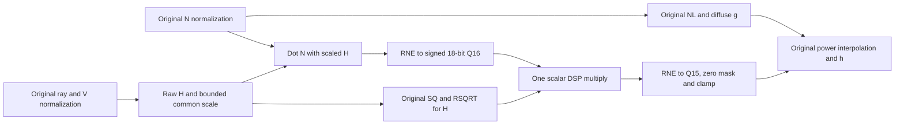

# Lighting models, emulator and RTL

Lighting is a pixel component. Its public ports are in `src/lighting/ports.rs`.
The independent numerical cycle emulator and synthesizable RTL implement the
single-pixel component. Quad allocation, GPU command ABI, final color and the
web adapter remain outside this component.

`sim::workbench` exposes the existing Fast full/diffuse bound DAG and
calendar to the [interactive scheduling workbench](../web/README.md#lighting-scheduling-workbench).
It independently validates manual issue/lane/II/capacity edits, preserving atomic
DSP/logic fusion and recomputing zero-latency wiring. Exported schedules are host
planning artifacts; they do not replace the emulator/RTL program automatically.

## Frozen primary core

As of 2026-10-07, the primary Lighting core is frozen after adopting exact
context-prepared power masks: Fast, CompensatedFloor, the free per-edge unified lit calendar,
II2 / 38 advancing edges, S(12,10) normal transport, Q13 RSQRT endpoint storage,
and the nine-macro DSP binding described below. Preserve the numerical recipe,
rounding boundaries, issue/ready ages, DSP/ROM topology and retained-value order.
Further core optimization or adoption of experimental expression rewrites needs
an explicit decision to reopen this design.

Small peripheral changes may adapt interfaces, context/token transport, queue
integration, diagnostics or presentation while preserving this core contract.
CE/backpressure, arbitrary IDs, epoch ownership and context drain must remain
correct. Such integration still requires its own verification; the existing
standalone proof does not qualify a changed wrapper or a complete GPU.
The legacy constructors and explicit comparison configurations keep their
existing behavior; freezing this core does not migrate GPU backend defaults.

## Unified lit calendar selected for the workbench

`calendars::UnifiedCalendar::selected(quantization)` selects the reviewed
free per-edge calendar for CompensatedFloor and the two-edge group calendar for
NearestEven. The workbench loads this choice by default and keeps both optimized
alternatives available for comparison. Two-edge grouping limits a DSP site to
at most two neighboring groups; both alternatives accept one pixel every two
advancing edges. It does not describe an II1 versus II2 comparison.

Diffuse's separate arithmetic/calendar is removed in these configurations.
All lit modes run the complete mathematical program at the same latency and II;
retirement returns `(g,0)` for diffuse and `(ambient,0)` for ambient mode. Unlit
still bypasses the lighting queue. Normal S(12,10) transport and working rounding
boundaries remain fixed. The selected Floor/free configuration now uses the Q13
RSQRT endpoint storage described below; its small numerical change is explicit.
Context changes continue to drain.

Generated fixtures per numerical policy, calendar and endpoint encoding live in
`spec/lighting-calendars/`. `UnifiedCalendar::plans` and `options` feed the same
explicit checked `LightingEmu::with_schedule_plans`, RTL generator and physical
calendar export; the web server consumes these fixtures directly. The old
constructors below remain separately qualified, and GPU backends do not silently
migrate to a different admission contract.

The [unified-calendar review](../../../target/lighting-unified-20261006/review.md)
is the single evidence home for matched fits, all optimization rounds, DSP packing,
selection rationale, exact HDL identities, behavioral/vendor operation traces and
web checks. Floor now chooses the lower latency, free calendar; the grouped
alternative retains its Logic, FF and DSP-input benefits at three extra edges
and one extra BSRAM. The NearestEven group choice
improves Logic, DSP count and latency at a FF cost.
These are isolated Lighting-module results, not whole-GPU or board results.

Storage is organized by numerical value, rather than one record containing an
entire pixel's intermediate state. Each retained value has a format-specific
delay chain sized by the producer-ready to last-use distance and II. The chain
advances only on its scheduled enabled phase; CE and output stalls freeze it.
Gowin can map those chains to FF, SSRAM or BSRAM without changing their logical
order. The [memory attribution](../../../target/lighting-unified-20261006/review.md#storage-layout-and-attribution)
records fitted counts and controlled synthesis checks of these categories.

The selected free calendar carries IDs in a 20-word, 32-bit shift FIFO. The
grouped comparison instead uses a 32-word, 32-bit addressed ring with read/write
pointers and a registered output. Neither stores normal/color/UV payloads.
`valid_pipe` is a per-age bit vector; one context remains latched until every
in-flight pixel drains. The context contains epoch, mode, shininess code,
light/projection vectors, intensities and the prepared power descriptor.

The selected Floor/free normalization uses three identical 1024x18 true-dual-port
DPX9B images, providing six independent synchronous read channels. SQ occupies
0..255 (15 effective bits) and compressed RSQRT occupies 256..383 (18 bits);
remaining addresses read zero. Full lighting performs nine SQ and three RSQRT
reads per pixel at II2. Both ports share the datapath CE, use the primitive output
bypass, and disable writes, primitive reset and the extra output register.
Legacy and NearestEven configurations retain replicated 512x36 single-read
images with base16/delta8 RSQRT and the optional SQRT extension at 384..511.
The 886-entry power table declares 1024x16 base and 1024x12 delta arrays. The
32-entry shininess context table packs boundary15, wide/fine shift4 each and two
10-bit modular bases; only codes 0..16 are valid. Counted and emu retain this
43-bit numerical descriptor. The selected RTL appends two 16-bit low-bit masks,
making a 75-bit physical descriptor captured only on a context handshake. Each
mask is `(1 << shift) - 1`; unused descriptor codes still read zero. This table
uses logic rather than an additional fitted RAM block.

The generator certifies the closed typed power-tail topology, descriptor owner,
slice positions, shift sign, widths and same-cone operands before replacing
`x - ((x >> shift) << shift)` with the selected prepared mask AND. The numerical
DAG, all observable operation values and issue/ready edges remain unchanged.
Extra physical descriptor bits are excluded from numerical stage probes.
Legacy constructors and the other explicit calendars do not enable this rewrite.

### Q13 RSQRT storage contract

Each of 128 entries stores an unsigned Q13 base in 14 bits and a four-bit delta
residual. Consecutive groups of eight segments share a six-bit bias, generated
as the smallest Q13 endpoint delta in that group. The address's parity bit and
top three segment bits select one of sixteen fixed biases. Decode restores
`base_q15 = base_q13 << 2` and
`delta_q15 = (residual + bias[address >> 3]) << 2`.
Endpoint generation uses nearest-even rounding; the selected Floor interpolation
and all subsequent working formats remain unchanged. No negative zero is added.

Counted records the raw 18-bit read and every decode operation. A checked,
closed decoder topology places that combinational logic at the synchronous
read's output age, without a separate arithmetic pipeline site. The four-bit
group selector follows the same CE/stall schedule as the ROM data. Both encoded
storage ports and decoder latency are covered by emu/behavioral/vendor checks.
`options_legacy` / `plans_legacy` retain the previous exact Q15 endpoint baseline.

The exhaustive 32,768-point lookup comparison changes the old Q15 result by at
most two codes. Sampled general inputs change g by at most one Q8 code and h by
two; the high-shininess/nearly antiparallel diagnostic frames reach three h codes
and two display-channel codes. These downstream maxima are measurements, not
all-input mathematical bounds. The simpler Q12 compression and the exact SSRAM
replication trial are rejected: Q12 amplifies a near-zero half-vector case, while
SSRAM spends substantially more logic and distributed memory for the same BSRAM
saving. Detailed intermediate experiments remain local.

Selected core qualification (serial harness, GW2AR-18C, Gowin 1.9.8.11 Education,
66 MHz constraint; isolated Lighting, not whole GPU or physical-board proof):

| Core | Logic | FF | BSRAM | RAM16 | Fmax MHz | Latency / II |
| --- | ---: | ---: | ---: | ---: | ---: | --- |
| Q13 Floor/free, prepared masks | 2113 | 1957 | 7 | 27 | 72.270 | 38 / 2 |

DSP stays eight MULT9X9, ten MULT18X18 and two paired MACs (nine macros).
Both setup and hold have zero violations. The seven BSRAM are three normalization
TDP banks, two POWER banks, one ID FIFO and one intermediate retention bank.
The standalone 60 MHz board fixture adds nine answer/input ROMs; its offline
and physical qualifications are separate from this core fit. Exact source/report
receipts:
`target/lighting-context-masks-production-20261007/review.json`.
The earlier Q13 core qualification remains historical in
`target/lighting-rsqrt-production-20261007/review.json`. Prepared masks preserve
its exact output bits; all 32 descriptor codes and every 16-bit input coordinate
are exhaustively checked. The new source is separately fitted and replayed in
behavioral/vendor RTL. It has not received a new physical-board test.

Reproduce the stored-domain, counted-stage, mixed-pixel and physical-bank tests:

```powershell
cargo test --release -p gpu-v2 --test lighting_rsqrt
cargo test --release -p gpu-v2 --lib q13_native_tdp -- --ignored --nocapture
$env:LIGHTING_SELECTED_CALENDAR = "1"
cargo test --release -p gpu-v2 --test lighting_cycles verilog_matches_cycle_payloads_and_all_published_stages -- --ignored --nocapture --test-threads=1
Remove-Item Env:LIGHTING_SELECTED_CALENDAR
```

The last command checks CE, backpressure, context drain, reset, arbitrary IDs,
output masks and every published stage against the independently validated
executor, in behavioral HDL and actual Gowin primitives. For a matched exact
endpoint export, also set `LIGHTING_LEGACY_RSQRT=1` on the probe below; this uses
the separate legacy options/fixtures rather than modifying generated HDL.

Reproduce the fixture exports and independent numerical traces with
`lighting_two_cycle_probe <directory> rtl` and
`LIGHTING_REVIEWED_CALENDAR=free|two-edge|selected`. Its generated testbench checks
CE stalls, output backpressure, context drains, arbitrary 32-bit IDs, operation
main results and published intermediate stages in both HDL implementations.

The selected NDC input is S(16,14), generated directly from pixel centers with
one RNE. View-ray products are S(32,28), converted to the Q14 working ray
using the selected intermediate rounding policy.
Normal working precision and Q14 light/projection uniforms remain unchanged.

## Existing qualified lit-queue constructor

`LightingRtlOptions::lit_queue_resource_profile` selects the same configuration
used by `LightingEmu::lit_queue_resource_profile` and `sim::workbench`.
The operating target is 60 MHz; exported lit-queue probes constrain 66 MHz
to retain ten percent clock margin. Both numerical policies retain their
existing oracle/counting arithmetic, formats and output bits.

| Profile / policy | Full latency | Diffuse latency | Full / diffuse II | Logic | FF | BSRAM | Fmax MHz |
| --- | ---: | ---: | --- | ---: | ---: | ---: | ---: |
| Fast / CompensatedFloor | 38 | 19 | 2 / 1 | 2721 | 2279 | 10 | 69.637 |
| Fast / NearestEven | 39 | 21 | 2 / 1 | 3849 | 2253 | 9 | 69.629 |

Latencies count advancing edges; CE and output stalls extend wall-clock time.
These are matched isolated Lighting fits with the existing serial probe wrapper,
GW2AR-LV18QN88C8/I7 and Gowin V1.9.8.11 Education, not whole-GPU or board results.
Both have zero setup/hold violations at the qualification constraint.
Source/report identities and the rejected/intermediate tradeoffs are retained
in `target/multiplier-retiming/selected60` and neighboring experiment directories.

The qualified arithmetic boundaries are:

- Ordinary MULT9X9/MULT18X18: operand/sign and PIPE registers bypassed, OUT enabled,
  one advancing edge. Explicit two/three-edge alternatives remain available.
- Dual 18x18 multiply-add: combinational MULTADDALU18X18 plus a CE-gated fabric
  output register, one edge. C and dynamic signs use the same current operands;
  the four-edge implementation retains its separately aligned C input.
- Generic pure-logic cones: one edge, with maximum audited operator depth six
  for Fast.
- `pipeline::square_sum_head`: two square-sum additions plus bounded LZD,
  exponent/align selection and mantissa alignment in one multi-output boundary.
  It exports q, table address, fraction and restore together. An unexported
  partial sum escaping the block prevents contraction.

Synchronous ROM reads stay separate one-edge operations. A fused sum/address
consumer can exhaust the slack of all three SQ reads; the dependency-only web
view then keeps them parallel instead of inventing additional read slack.
Runtime lane and port conflicts are checked independently on the periodic
calendar. Throughput II is unchanged by these latency reductions.
Other constructors remain separate numerical/timing selections; their generated
RTL requires its own matched timing qualification.
Texture and Vertex need their own matched retiming qualification.

## Cycle pipeline contract

`LightingProfile::Fast` is the supported resource architecture: full/specular II2
and diffuse II1. `new` / `generate` retain the original Fast numerical baseline;
select `lit_queue_resource_profile(Fast, quantization)` for the qualified pipeline
above. `SystemFast` remains an explicit integration comparison with II2 in both
modes and changed scalar-N semantics; it is not the selected lit-queue pipeline.
There is no automatic numerical or timing configuration migration.

The calendar is compiled once from the audited numerical DAG. Independent
checks cover dependencies, physical DSP modes, recurring lane collisions and
synchronous memory ports. DSP/ROM input muxes follow static phase selectors;
there is no runtime arithmetic arbiter. Full and diffuse share hardware and
immutable context, but mode changes require a complete drain.

- `tick` returns pre-edge signals and applies one edge. Transfers require CE
  and ready/valid; accepted inputs are validated under a bounded wall-clock budget.
- Reset wins over CE, invalidates context and drops in-flight tokens.
- CE pauses and held output backpressure freeze numerical stages, ownership,
  token ages and calendars. The output stays stable until accepted.
- Context loads require CE and an empty pipeline, suppress pixel acceptance,
  and latch uniforms plus derived power fields atomically.
- Unlit quads bypass the lighting queue in its owner. Lit-queue counted/emu
  reject mode zero; RTL requires modes one, two or three. Legacy standalone
  constructors and the functional oracle still support unlit inputs.

The numerical emulator executes actual scheduled operations and publishes at
their ready ages. It does not call oracle/counting on pixel acceptance. Behavioral
RTL and Gowin primitive RTL use the same calendar, operand widths and latencies.
All current arithmetic and memory units accept an operation every advancing edge;
there are no iterative or exclusively occupied multi-cycle units.

| Boundary | Useful payload | Physical ownership |
| --- | --- | --- |
| Normal | Three S(16,14) working components, 48 bits | PixelRows row0 holds X/Y, row1 holds Z |
| Pixel center | Two S(16,14) NDC components, 32 bits | Row1 high half holds X, row2 low half holds Y |
| Pixel capture | 80 bits plus ID32 | Three simultaneous 36-bit RTL inputs |
| Uniform fields | Light48 + projection48 + Ia/Id18 + mode2 + shininess5 = 121 bits | Immutable context registers |
| Complete context | Uniform121 + epoch16 + derived power43 = 180 bits | One copy per drained batch |
| Ordered result | g9 + h9 + ID32 + epoch16 = 66 bits | Held output, no extra result FIFO |

The epoch is an opaque context version supplied by the caller and returned with
the result. Power fields contain boundary15, two shifts of four bits and two
address bases of ten bits. They are prepared once per context. `UniformRows`
provides a four-row host packing helper, not a physical uniform RAM protocol.

Each numerical value is retained until its scheduled consumers. Uniform inputs
bypass per-pixel storage. Scheduling's width-weighted lifetime proxy excludes
some mux/control and DSP internal registers: fitted FF and the emitted storage
CSV are authoritative for physical capacity. ROM copies follow actual read lanes;
normalization packs SQ256 and RSQRT128 into 512x36 BSRAM, and the 886x28 POWER
table occupies two 1024x18 slices. Additional inferred retention RAM is included
in the matched module fit above, rather than hidden in a logical ROM count.

## Compact normal transport

Here "compact" means S2.10 data packing, not a hardware resource profile.

The new functional chain selects **S12F10** (12 total signed bits, ten fractional
bits, also called S2.10) for both transformed-normal output and interpolated
pixel-normal storage. The original v6 mesh input stays S8F7. Light direction,
projection, normalized N/V/H, reciprocal and dot/power working formats stay at
their existing precision. In particular, normalized N is still Q14; narrowing
transport does not imply a narrower reciprocal or DSP result.

`spec/lighting-formats.csv::NormalInput` is the twelve-bit arithmetic type.
`CompactPixelInput` validates codes [-2048,2047], does not normalize them, and
defines this local layout:

| Row | Bits | Meaning |
| --- | --- | --- |
| 0 | [11:0], [23:12], [35:24] | Normal XYZ, three S12F10 codes |
| 1 | [15:0], [31:16] | NDC XY, two S16F14 codes; four spare bits |

Thus the payload is68 bits and exactly two36-bit rows, versus80 meaningful bits
in three36-bit rows on the original port. Normal alone falls48->36 bits. A
four-pixel normal+NDC snapshot falls320->272 payload bits; a sixteen-pixel store
falls1280->1088 payload bits, excluding headers. These are bit counts, **not**
fitted FF/BSRAM savings or changes to the existing pixel-system live stores.

The producer performs RNE directly at F10 (negative ties included). Converting
existing Q14 codes uses right-RNE4 with positive +2 saturation to2047; expanding
the twelve-bit code into the working Q14 value sign-extends and appends four
zero bits. Expansion is wiring. Direct f64 producers quantize once at F10,
avoiding an unintended double-round through Q14. `rows` / `from_rows` reject
noncanonical upper bits. CPU-facing producers may retain aligned signed16 Q14
words and explicitly use `from_q14`; tight internal storage still uses S12F10.
There is no separate sign-magnitude storage ABI or negative-zero encoding.

`counted::evaluate_compact` actually reads `pixel.compact-rows` with two declared
rows and twelve-bit slices, then uses the original square/rsqrt/power arithmetic.
Full mode reads the normal row and NDC row; diffuse reads only the normal row.
The compact kernel extracts each sign as wiring, computes magnitude with a
signed13 negator (including -2048), then compares unsigned12 magnitudes. Only
the selected maximum enters Q14 max/prescale arithmetic; signed components
expand independently as wiring for the existing signed DSP arithmetic. Zero
detection is `max_code < 1`, exactly equivalent to the Q14 threshold4. Expanded
values have four zero low bits and common downscale is at most two bits, so the
32767/RNE-overflow prescale guard is unnecessary. SQ, RSQRT and normalized N
remain unchanged. This local sign/magnitude view does not persist duplicate
components or change negative rounding to magnitude truncation.

`timed::plan_compact` reserves this graph with68 payload bits/pixel and two input
rows. It requires already quantized codes; `plan` with the compact flag rejects
Q14 inputs having nonzero low four bits. Row calendars explicitly gate
`pixel.compact-rows` on their physical read-ready times and audit two-row
coverage. This first row calendar prefetches both rows even in diffuse mode;
the counted diffuse kernel itself consumes only the normal row. Architecture
profiles with prelatched power fields still require
register inputs; the separate row experiment uses the non-prelatched optimized
kernel and performs its context-ROM work in the counted graph. The four uniform
rows remain aligned Q14. This is offline counted/timed support, not a compact
cycle port or fitted mux/BSRAM implementation.

### Exact narrow prescale and storage-aware candidate

`counted::Config::compact()` selects architecture arithmetic with compact
transport and `compact_prescale`. Both flags are explicit; the previous compact
graph remains selectable with `compact_prescale=false`. For a nonzero U12 maximum
code `m`, let `z=leading_zeros_12(m)`. The Q14 common shift is `z-2`, so
`(code<<4) << (z-2)` equals `(code << z) << 2`. The dynamic operation is therefore
a **signed13 left shift**, followed by two zero bits of wiring. Its magnitude is
at most4095; no normal-prescale RNE or signed right shift remains. Zero codes use
the original0.5 fallback, with the same final zero gate. Published SQ, reciprocal,
normalized N and all later stages match the original quantized-input contract.
This option works with the existing scalar/block alternatives; it changes only N
prescale, not their separately declared H/dot semantics.

`Storage::DemandRows` is an additional offline compact-input calendar. It reads
the rows actually consumed by the current uniform mode: none for unlit/ambient,
normal only for diffuse, normal plus NDC for full. `ReadOrder::PixelMajor` and
`NormalFirst` compare per-pixel and normal-row-first ordering on the same ports.
The original `Storage::Rows` remains the conservative prefetch baseline. Both
use the same68-bit transport and four aligned uniform rows, and retain the
architecture/register-input restriction. Demand reads reduce bandwidth; they do
not by themselves change the upstream allocated payload or context preparation.

`PeriodicSchedule::compact_storage_bounded` compares whole and partial ALAP
placements with width-weighted, repeated value lifetimes. It tries at most256
candidates, preserves lane/phase, input capture ages, II and commit age, and accepts
only independently audited placements whose peak live bits do not increase.
Blind ALAP can increase this cost, particularly when an input row or reciprocal
has several consumers. ROM/DSP physical calendars are checked separately by
`audit_physical`. Live-bit cost excludes primitive-internal registers, control,
IDs/FIFOs and routing; it is not total FF count or a synthesis result.

The browser uses this same numerical contract through `oracle::evaluate_output`
after transport expansion; it does not run the audited evaluator per pixel.
Existing `PixelInput` / `PixelRows` and cycle emu/RTL continue to define the
original wide transport. The cycle-program constructor rejects the compact
flag rather than incorrectly treating it as the old three-row input. Migrating
that external port/calendar is a separate hardware task; no new II, latency or
PnR result is claimed by this functional precision change.

S12F10 fits the binary upstream pipeline better than strict SNORM12. SNORM12's
producer encoding uses2047 instead of1024 and clips at±1; when consumed only by
normalization, its integer codes can be expanded by appending three zeros,
letting normalization remove the common scale. The browser retains SNORM12 as
an explicit comparison. S12F10 preserves more headroom for unnormalized normals
and avoids the2047 scaling at the producer. Normal-matrix and mesh preflight
remain necessary; near-cancelling or tiny normals can still have larger errors.

Light retains the aligned Q14 boundary in this unit. A separately quantized
S12F10 light is a possible future contract, with a matching unit-length error
tolerance; reusing the normal's arbitrary common-scale shortcut would change
both dot products and L+V because light is not normalized inside lighting. Its
48-bit uniform cost is paid once per context, unlike per-pixel normal storage. Uniform
rows, the180-bit retained context and ROM precision remain unchanged in this
unit. Power context43->30 and literal power28->27 repacking remain candidates;
they are not silently counted as implemented. Keeping the existing ROMs avoids
changing the numerical approximation while isolating normal transport errors.

Verification covers all4096 codes, all65536 Q14 conversions,17 exponent codes
against the counted output, numerical frame comparison, and functional FIFO
capacity changes. In one deliberately bright200x120 grazing scene (yaw85,
s=4, Cs255), changing only pixel-normal Q14->S12F10 gave max |delta g|=1 and
|delta h|=1 Q8 code, with identical D16. This is a finite example, not a global
bound. Larger full-pipeline differences include compact fetch, geometry coverage,
RGB565 tint and earlier normal quantization, so they cannot be attributed only
to the lighting input width.

## Resource profile contract

`LightingEmu::with_resource_profile(profile, max_wall_ticks)` and
`rtl::generate_resource_profile(profile)` select the completed area alternative.
`counted::Config::resource_profile(profile)` supplies its numerical graph.
The original Fast default remains available as a numerical comparison.
N normalization, NL and its positive specular gate, V normalization, half-vector
construction and the raw H threshold64 retain the original numerical contract.
Only H component normalization moves after its dot product:



The raw Q28 dot fits signed30 bits. Its signed18 Q16 operand multiplies the
unsigned17 Q15 reciprocal; the product rounds to signed18 Q15 before clamping
to0..32768. The published `nh` is this Q15 result rescaled to Q28, without another
round. Scalar H does not publish `h.0..2`; its observable boundaries are
`h.shift`, `h.q`, `h.r` and the scalar dot/product stages.

The calendar partitions large DSPs by semantic role: one ray lane, two V
component lanes and the remaining arithmetic lanes. Fast dedicates separate
paired MACs to NL and NH. An independent
modulo checker verifies both role restrictions and the merged physical calendar.
No runtime arbiter or multi-pixel batching is added. Both modes share one complete
32-bit ID delay chain, selecting its capture phase and output tap by drained mode.

## Reusable measured Rust pipeline blocks

`sim::pipeline` factors numerical tails and coordinate frontends into typed functions:

| Block | Inputs | Result | Opt-in latency |
| --- | --- | --- | ---: |
| `normalized_output` | S33F29 product, optional zero bit | RNE S18F14, clamp to +/-1, S16F14 direction | 1 cycle |
| `reciprocal_tail` | U16F15 base, U16F23 correction | RNE correction, U16F15 subtraction | 1 cycle |
| `diffuse_finish` | U18F16 product, U9F8 ambient | RNE U9F8, U10F8 sum, saturated U9F8 intensity | 1 cycle |
| `square_sum` | Three U30F28 squared components | Two additions, public U30F28 q | 1 cycle |
| `inverse_head` | Bounded U30F28 q | Address U7, fraction U8F8, restore U1 | 1 cycle |
| `square_sum_head` | Three U30F28 squares | q and inverse-head outputs together | 1 cycle |
| `inverse_tail` | Base U16F15, correction U16F23, bounded restore | RNE, subtract and restored U17F15 reciprocal | 1 cycle |
| `power_head` | Safe U16F15 coordinate, latched U43 context | Address U10, tail U12, negative shift S18 | 1 cycle |

Oracle remains the independent numerical reference. Counted calls these functions
and retains every arithmetic event and existing stage golden. Timed's optional
`Hardware::lighting_measured_ii2()` contracts only exact typed DAG patterns; the
opcode/format/literal/alias signature is pinned independently of runtime samples.
Undeclared escaped intermediates prevent contraction. `LogicCone::exported_events`
allows explicitly declared side results on the same ready edge; all original
arithmetic remains in counted and independently replayed. `inverse_head` assumes
`2^26 <= q <= 3*2^28`; its normal producer establishes that bound, including the
zero-normal bypass. The inverse-tail restoration is zero or one. `power_head`
receives the separately clamped endpoint, and keeps floor interpolation unchanged.
DSP products, ROM reads and branch effects remain outside the pure-logic blocks.
The historical profiles keep their previous binding unless explicitly selected.

`Hardware::lighting_functions_ii2()` selects measured functions plus conservative
two-edge generic cones for compact-normal counted/timed planning. Cycle emu/RTL
select `LightingRetiming`, independently executing numerical operations on the
same checked calendar. The resource candidate is available through
`LightingEmu::retimed_resource_profile(profile, max_wall_ticks)` and
`LightingRtlOptions::retimed_resource_profile(profile)`. It retains the existing
resource-profile numerical kernel and rates; it is not the default architecture
or a migration of the closed three-row cycle input to S2.10 transport.

Two bounded local lifetime passes preserve resource lane, modulo phase, II and
completion. Only independently checked moves that reduce width-weighted boundary
payload are accepted. The emitter storage table and fitted result remain the final
storage evidence; the cost proxy does not include every mux/control register.
Extra-ROM/DSP variants remain opt-in experiments and require matched validation.

The matched baselines, three optimization rounds, selected configurations and
full-module two-placement evidence are in the generated
[retiming review](../../../target/lighting-retime-20261005/review.md).
The [resource sweep](../../../target/lighting-retime-20261005/final-resource/summary.csv)
and [architecture sweep](../../../target/lighting-retime-20261005/final-architecture/summary.csv)
report declared register bits separately from fitted FF. Zero-delay retained rows
include diagnostic taps and are not a count of distinct physical buses.

### Compensated-floor numerical configuration

`counted::Config::compensated_resource_profile(profile)` constructs the explicit
Fast numerical alternative. Use `oracle::Config::from_counted(kernel)`
for its independent scalar reference, `LightingEmu::compensated_resource_profile`
for cycle execution and `LightingRtlOptions::compensated_resource_profile` for
RTL. Existing constructors retain their original nearest-even behavior.

The lit-queue entry uses matching `Config::lit_queue_resource_profile(profile,
quantization)`, `LightingEmu::lit_queue_resource_profile(profile, quantization,
max_wall_ticks)` and `LightingRtlOptions::lit_queue_resource_profile(profile,
quantization)` constructors. It excludes the outer unlit compare/branch and
RTL output-mode selector. Mode0 is owned by the quad default-light bypass;
counted/emu reject it, and RTL requires the caller to supply modes1/2/3.
Ambient and diffuse control remain. The scheduling page selects this entry.
Legacy standalone constructors and functional oracle retain unlit compatibility.
Current cycle, numerical and two-backend stage evidence has one home in the
[lit-queue review](../../../target/lighting-lit-queue-20261006/review.json);
the earlier fitted area/frequency numbers do not describe this changed calendar.

Fusion coverage depends on the numerical operation signature. The current Fast
full floor calendar combines square-sum and inverse-head into three multi-output
one-cycle blocks, and binds diffuse-finish and power-head. Its floor inverse-tail and normalized
outputs do not match the RNE certificates and retain generic binding. The RNE
calendar additionally binds inverse-tail x3 and normalized-output x6. Exact
inventory is in [fusion inventory](../../../target/lighting-fast-only-20261006/fusion-inventory.json).
The workbench now exposes complete physical-block recipes and the final select
predicate/alternatives, including whether the predicate belongs to another
block. Many compare/select pairs are already within generic one-edge cones;
their final `Select` label did not imply a separate physical mux stage. Escaping
predicates and diagnostic values remain explicit boundaries. Measured one-edge
certificates still require exact opcode/format/literal matches; presentation
changes do not contract an unmatched cone.
All current units have initiation interval1, including DSP/MAC, ROM and multi-edge
logic. The RTL advances separate stage registers under the common datapath CE;
there is no iterative, exclusively occupied unit in these configurations.
The optional unsplit-cone backend retains the same issue/ready ages using
output delay registers; numerical co-simulation alone does not certify its
combinational timing. Select descriptions, constant classification and unit
stripe verification are recorded in
[block-detail review](../../../target/schedule-block-details-20261006/review.json).
Normal abs/max/prescale and read-adjacent combinations remain separate unless
their complete bound operation has a matching certificate; isolated probes do
not silently reduce a cycle in the full implementation.

The local arithmetic adapter chooses the policy before constructing the DAG:
intermediate conversions floor, the diffuse Q28-to-Q8 factor uses one guard-bit
increment, and final U18F16-to-U9F8 g/h conversions retain nearest-even. Floor is
static arithmetic wiring, not a runtime replacement of a RoundIncrement event.
The counted ledger, timed binding, numerical VM and RTL consume these same events.
Only the closed resource kernels are accepted; cached/prepared/compact-normal
transport and system scalar-N alternatives require separate validation.

The alternate `POWER_MIDPOINT_Q15` table has the same rows, deltas and widths as
POWER, with 64 added to each Q15 base. Its diagnostic publication is explicitly
`power.midpoint_q15`, an encoded value for floor conversion to Q8, not ordinary
x^s. The x==1 branch retains the exact 32768 endpoint. Zero still becomes Q8 zero.
Only the selected table is physically instantiated; generating both host arrays
does not duplicate the hardware ROM.

Reproduce the bounded frozen dataset with `lighting_compensation_dataset`, export
the actual rebuilt DAG/HDL with `lighting_compensation_probe`, then run the ignored
`compensated_frozen_dataset_replays_actual_dag` test with the absolute dataset path
in `LIGHTING_COMPENSATION_DATASET`. The bounded `lighting_cycles` RTL test selects
this configuration with `LIGHTING_COMPENSATED_FLOOR=1`, resource/retimed profile,
extra-large=1 and local steering. Ordinary g/h differences are tiny, but the
existing half-vector degeneracy threshold can change classification; no global
one-code error bound is claimed. Independent reference and stage checks cover it.
The final formal-DAG area, two placements, memory calendars and co-simulation
identity are in the [formal configuration review](../../../target/lighting-compensation-formal-20261005/review.md).
These are isolated Lighting results, not whole-GPU fit or board evidence.

### Explicit view-length experiment

The selected floor kernel retains component-wise V normalization. The optional
`weighted_view` flag instead forms `H = normalize((R + length(R)*L)/2)`.
It defaults to false in counted, oracle and RTL options, and is accepted only
with the closed Fast scalar-H contract. Emu executes the selected graph; the
independent oracle checks its changed numerical boundaries.

The length LUT packs Q15 base16 plus delta9 in 128 rows, using rows384..511
of each existing normalization ROM. Its interpolation/restoration retains
U17F15. Three `R*rsqrt` products become three `L*sqrt` products; neither DSP
work nor normalization-read count falls. Floor narrows the weighted products
before addition using an exact floor identity; nearest-even retains the full
products. The half-vector degeneracy gate scales with the computed length.

The matched experiment does not justify replacing the selected floor kernel:
weighted floor costs more Logic for one fewer advancing edge. Near-antiparallel
L/V inputs expose the hard degeneracy gate and can have much larger h differences
than ordinary samples. `LIGHTING_WEIGHTED_VIEW=1` explicitly selects the experiment
in the exporter and cycle co-simulation. Matched fits, error witnesses and final
source identities are in `target/lighting-weighted-half-20261006/review.md`.

## Numerical contract

Normals arrive unnormalized. Narrow transport uses S(12,10); the working cycle
port uses S(16,14). Pixel-center NDC is S(16,14) in [-1,1]. The ray is
`R = (ndc_x * ray_scale_x, ndc_y * ray_scale_y, k)`, converted to Q14 by the selected policy.
Projection requires k in [0.5,0.75] and |ray_scale| <= 0.75. Quantized unit light
squared length may differ from one by at most 32768 / 2^28.

```text
normal -> normalize -> N -> dot(N,L) -> d -> diffuse g
NDC -> projection ray R -> normalize -> V
(L+V)/2 -> common prescale -> H length factors
N dot scaled-H -> scalar reciprocal multiplication -> specular coordinate
specular coordinate -> shininess lookup/interpolation -> specular h
```

`d = clamp(dot(N,L),0,1)`, `g = min(Ia + Id*d,511/256)`;
`h = Id * clamp(dot(N,H),0,1)^s`, zeroed when NL <= 0.
Both outputs are U(9,8), where 256 means one. Ia/Id lie in [0,1]. Specular RGB
only selects full versus diffuse mode here; applying colors belongs to final color.
Ambient mode returns (Ia,0), and the external unlit bypass returns (1,0).

A normal maximum below four raw Q14 units is degenerate. A half-vector maximum
below 64 units after the rounded `(L+V)/2` is degenerate. Safe internal table
evaluation still occurs, followed by a zero result. Power-of-two common scaling
preserves direction and keeps the square lookup in range. The resource kernel
normalizes N and V component-wise and applies H's reciprocal to the scalar NH
dot, avoiding three normalized H component products.

Principal formats come from `spec/lighting-formats.csv`; intermediate widths,
rounding boundaries and scaling constants remain explicit in Rust.

### Documented lookup methods

The implementation already uses the lighting design's section 14.3 RSQRT
and section 16 shininess methods. These are runtime table/interpolation paths;
there is no repeated squaring, runtime floating power or integer divider in counted.

* Normalization needs `1/sqrt(q)`, not the general reciprocal `1/q`.
  Write `q=2^e*t`, `1<=t<2`. Exponent parity selects two pages of 64 segments.
Legacy 24-bit entries pack Q15 base in 16 bits and Q15 delta in 8 bits;
  the selected Q13 encoding above restores the same working fields.
  Eight segment-fraction bits drive `r0=base-RNE(delta*f/256)`; the exponent
  restores `r=r0*2^(-floor(e/2))`. Component products retain full precision
  before RNE to Q14. General RCP uses LUT+Newton elsewhere in the GPU;
  it is not an operation needed by this pixel lighting subsystem.
* Shininess codes 0..16 select exponents
  `{4,5,6,7,8,10,12,14,16,20,24,28,32,40,48,56,64}`; code 8 means 16.
  A 43-bit material context supplies the boundary, two shifts and two modular
  address bases. The power ROM has 886 entries, each containing 16-bit left
  endpoint and 12-bit delta. One product and linear interpolation produce Q15
  power. Exact `x=32768` bypasses the lookup; invalid codes are rejected.
  All 557,056 nonendpoint addresses are checked against independent piecewise
  indexing and their material's segment range; maximum address is 885.

The architecture path prepares POWER_CONTEXT once before pixels, with an audited
preparation ledger, then captures its 43-bit value as immutable context input.
Numerical interpolation policies are explicit and independently validated.

## Verification and reproduction

### Standalone Tang Nano 20K qualification

`examples/lighting_board/` exports the selected free per-edge CompensatedFloor
calendar directly, with no CPU, SDRAM, geometry or whole-GPU integration.
Lighting runs at 60 MHz from the onboard 27 MHz clock; the shared diagnostic
reporter runs at 27 MHz. A bounded scoreboard compares actual DUT g/h, 32-bit
pixel IDs and context epochs against generated independent integer-oracle ROMs.
It traverses 22 contexts and 32 pixels twice: ambient, diffuse, all 17 shininess
codes, signed S(12,10) boundaries, changing uniforms, CE stalls and backpressure.
The second pass uses new epochs. User button S1 resets and restarts the test.

Behavioral and Gowin-DSP simulations exercise independent 60/27 MHz clocks,
mid-stream reset, forced numeric/identity/timeout failures, and decoded UART
success/failure frames. Their PLL is bypassed; physical PLL frequency and timing
are checked separately by the board fit. Offline evidence and the audited image
identity live in `target/lighting_board_gowin/preparation.json`.

```powershell
cargo run --release -p gpu-v2 --example lighting_board -- --build
powershell -ExecutionPolicy Bypass -File hardware/vendor/gowin/scripts/run_board_validation.ps1 -Profile lighting-floor -Mode Audit
# For the requested lighting board test after power-on; substitute the actual VCP.
powershell -ExecutionPolicy Bypass -File hardware/vendor/gowin/scripts/run_board_validation.ps1 -Profile lighting-floor -Mode Full -Port COM8
```

Programming uses volatile SRAM. DDHT test ID `0x0c` reports status 0 after all
1,408 comparisons pass; 1 means g/h mismatch, 2 identity/epoch mismatch,
3 watchdog expiry, 4 unexpected output. Repeated status frames report a latched
verdict rather than newly completed traversals. LEDs 1..6 show heartbeat, done,
success, report toggle, UART busy and PLL lock.

On 2026-10-07, the audited `4f52bb6` image was loaded
into volatile SRAM on the Tang Nano 20K. Live UART reported success after the
1,408-output scoreboard completed, with no failure, wrong-test or checksum-error
frames in the successful capture. Repeated frames carry the same latched verdict.
The bitstream identity matches the preparation receipt; the configured Lighting
clock is 60 MHz, without an independent frequency measurement. Flash was not
programmed. This proves standalone Lighting operation, without CPU/whole-GPU
integration or a Flash cold boot. The physical evidence and image identity are
recorded in `target/lighting_board_gowin/live-test-20261007.json`.
That receipt covers the core before context-prepared masks were adopted; it is
retained as historical physical evidence, not proof of the revised image.

The explicit offline two-edge experiment uses `SchedulePlan`,
`LightingEmu::with_schedule_plans` and `rtl::generate_with_schedule_plans`.
These validate every dependency and recurring resource collision before lowering;
ordinary constructors retain their qualified calendars. Mode-only comparisons
may be declared preconnected input controls; numerical comparisons remain.
`shared_prefix` requires explicit II2 plans for both modes and shares only complete,
identically scheduled, mode-independent recipes. DSP sites in that earlier trial
span at most two neighboring two-edge groups. Diffuse accepts one pixel every
two edges and follows the full path's common prefix; its reduced rate and increased
latency are explicit costs. No production configuration is changed automatically.

Reproduce with the `lighting_two_cycle_probe` CSV export, the bounded
`examples/lighting_two_cycle_schedule.py` search and its `--align-prefix` step,
then the probe's `rtl` action with `LIGHTING_SHARED_PREFIX=1`.
The [two-edge review](../../../target/lighting-two-cycle-20261006/review.md)
contains the matching baseline/candidate fits, source and HDL identities, and
independent numerical plus behavioral/vendor checks of each physical operation's
main result and the published stages.
This is a lighting-module experiment; full-system fitting and board validation
remain outside its evidence.

- Oracle is an independent integer reference plus an ideal floating comparison.
  Counted emits every numerical/read operation through audited Frame.
- Timed binds the same graph, audits atomic DSP/logic fusion and checks recurring
  resource calendars. Manual workbench edits do not automatically change RTL.
- Emu and both RTL backends execute scheduled numeric operations with CE,
  backpressure, drain, reset, arbitrary ID and epoch checks.
- Bounded GPU regression, compensation fixtures and ignored primitive co-sim
  cover output and published intermediate stages. Module PnR is separate from
  whole-GPU/system integration and physical-board proof.

Export the selected Fast probe with the `lighting_rtl_export` example, profile
`fast`, options `resource`, and `LIGHTING_LIT_QUEUE=1`. Select compensated
floor with `LIGHTING_COMPENSATED_FLOOR=1`; otherwise nearest-even is retained.
The qualified retiming is chosen by the common lit-queue constructor. The
`lighting_cycles` ignored differential test uses `LIGHTING_CANONICAL_LIT_QUEUE=1`
and the same optional floor switch, comparing behavioral and vendor primitives.

Current source/report identity and exact verification receipts are kept in
`target/multiplier-retiming/review.md` and `source-identity.json`. The numerical
retiming review is distinct from the newer Fast-only code cleanup receipt in
`target/lighting-fast-only-20261006`. Raw exploratory reports remain local;
they are not additional supported architectures or current resource budgets.
