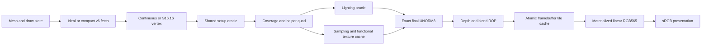

# Functional GPU oracle chain

`system::oracle::render(Scene, Config)` is the reusable IP-owned numerical
composition. The native WebSocket server uses the optional `parallel::render_pair`
adapter; the retained WASM adapter uses sequential `comparison::render`. Both share
the same arithmetic and comparison kernels. It executes no counted, timed,
emulator or RTL engine, and has no board-system/SDRAM dependency. This completes
an image-producing **functional** chain beginning at a triangle mesh; command
submission, persistent DRAW execution and live hardware integration remain separate.

## Owned boundaries and selectable replacements

The source of each arithmetic stage remains its component's `sim::oracle`;
`system::oracle` owns composition and transport. Scene fixtures are Rust meshes,
not per-pixel sphere normals produced by JavaScript. Shared input is immutable;
each A/B render gets independent FIFO, texture-cache and framebuffer state.

| Boundary | Data | Choice / numerical meaning |
| --- | --- | --- |
| Mesh -> fetch | `MeshVertex`: position3, normal3, UV2, tint3; f64 | Ideal input or canonical96-bit `PackedVertex` v6; actual meshlet base/grid, S8F7 normals, UNORM12 UV and RGB565 tint |
| Fetch -> vertex | `FetchedTriangle`: ID and three decoded vertices | Same logical interface for both fetch modes; no ideal color quantization at fetch |
| Vertex -> setup | `TransformedTriangle`: ID, clip3x4, attributes3x8 | Continuous matrix oracle or existing integer S16F16 position/MVP + Q14 normal-matrix oracle. Selected normal output is Q14, S12F10 or SNORM12 |
| Setup -> raster | Existing triangle `Report` | One backend. `run_continuous` retains clip as Q28 integer cofactors, f64 attributes; it shares all clipping, projection snapping, source preparation and coverage code with Q16 input `run` |
| Raster -> shader | `RasterQuad`: triangle ID, aligned XY, coverage mask, four `Sample`s, invalid-helper mask | All valid helpers interpolate from the same original perspective fields, including uncovered lanes; no zero-filled derivative inputs |
| Shader -> final | `ShadedQuad`: XY/mask, D16x4, tint8x12, texture8x12, g/hx4 | One original lighting arithmetic policy, floor only in power interpolation; texture uses the existing UNORM9 numerical contract and real functional cache |
| Final -> ROP | Existing `framebuffer::Quad`, with result g/h metadata | Existing `final_rgb`: divide255 tint/texture rule, Q8 diffuse/specular sum, RNE and clamp. Source alpha255 in these scenes |
| ROP -> cache -> image | Existing `Fragment`, `Context`, `oracle::Pixel` | Existing depth/blend oracle and actual atomic tile replacement/writeback; RGB565 materialization precedes display conversion |

The backend Q28 boundary is explicit: “continuous vertex” does not imply an
unbounded floating rasterizer. Its supported clip range is [-32,32]; this keeps
homogeneous products within i128. The existing Q16 setup entry and numerical
results remain available. Normal Q14 is a high-precision fixed baseline, not
infinite precision. Precision changes do not silently change depth, coverage,
material or sampling settings. Arbitrary nonfinite/range-invalid inputs fail.
Scene preflight retains the vertex component's quantized normal-matrix
orthogonality check; the continuous toggle does not bypass driver requirements.

`vertex::oracle::unpack` and `transform_quantized` are shared with the existing
v6 transform `run`; continuous transform belongs to that oracle too. Lighting's
`evaluate_output` executes the same `evaluate_inner` expressions while omitting
stage-vector/string allocation. Scalar review variants retain stage records when
they need reciprocal recovery. This is an optimization of the oracle, not a
separate browser approximation.

## FIFO semantics

`Config::fifo[6]` configures fetch->vertex, vertex->setup, setup->raster,
raster->shader, shader->final and final->ROP independently, 1..64 entries each.
The setup/raster handoff also owns one active report. A downstream-first pump
preserves submission order and propagates finite-capacity backpressure. Queue
overflow is an error. `max_steps` is required and bounded; exhausted work is an
error, not a partial successful frame. `Stats::fifo_peak` exposes occupancy.

Entries are owned Rust numerical/diagnostic structs; their f64 fields and vectors
are not proposed hardware FIFO layouts or a BSRAM bill. Compact lighting
transport has its separate bit layout in [lighting](lighting.md#compact-normal-transport).
Pump turns, cache transactions and browser milliseconds are not hardware cycles,
bandwidth or latency. The numerical page never instantiates counted/timed models;
the separate scheduling workbench inspects the existing lighting hardware DAG.

## Optional native parallel execution

The `parallel` Cargo feature adds Rayon only to native consumers. Its ordered
parallel passes fetch/transform each referenced vertex once, assemble and set up
triangles, test aligned quad coverage, then interpolate helpers and calculate
lighting/sampling per quad. Indexed collection preserves triangle/grid order.
Unreferenced vertices are not decoded or transformed. Each A/B frame owns its
results; both may share a fixed host worker pool. Identical configurations reuse
one frame. No floating reduction or changed accumulation order is introduced.

The original downstream-first FIFO pump remains the commit engine and sequential
reference. It consumes precomputed values while performing texture cache accesses,
final conversion, ROP and framebuffer replacement in their original order.
Parallel texture arithmetic reads immutable RAW565 payloads, then every captured
texel group is compared to the actual ordered cache return before committing.
Cache counts, FIFO peaks, pump turns, triangle boundaries and materialized output
match the sequential path. In particular, pixels from different triangles cannot
race through depth/blend or publish a different winner.

Host precomputation is bounded to 1,000,000 scanned quad candidates and 65,536
covered quad results per frame, in addition to scene and pump limits. Larger
requests fail explicitly instead of returning a partial image. These vectors and
maps are host acceleration storage, not a hardware context/FIFO proposal. The
default build and bare WASM adapter have no Rayon dependency. The host pool has
1..32 configurable workers, defaulting to at most eight available threads; jobs
share this pool rather than constructing per-request pools. Parallel precomputation
can be slower with one worker; measure scene-dependent host performance with
`bench-parallel`, retaining the sequential reference and exact-frame comparison.

## Helper and cache policies

Extremely thin triangles can have a covered center beside an uncovered helper
whose extrapolated homogeneous denominator crosses the projective pole.
Covered lanes must retain positive finite W; any failure stops the frame. Only
the specific invalid-W helper condition is marked; unrelated errors propagate.
The invalid helper temporarily carries a covered sample, **and a separate marker
forces the coarsest mip** for that textured quad. It is never treated as a genuine
zero derivative. `helper_fallbacks` records these quads. This initial functional
composition policy is explicit, not a frozen hardware helper contract.

Texture uses the existing16-set/4-way cache and actual RAW565 mip payloads through
the GPU `MemoryPort`. The initial framebuffer oracle cache has eight direct-mapped
16x16 tile lines with real eviction/writeback, padded edge tiles, initialized
color/depth and a final flush. It calls the existing ROP for every covered fragment.
Its replacement policy is a functional implementation choice; it does not claim
the bounded hardware-control model's timing or physical storage. Cache activity
does not replace numerical calculation with an average delay or a saved image.

## Browser and verification

[Browser instructions](../web/README.md#full-chain-comparison) describe the A/B
controls and build. Initial scenes are a smooth triangulated sphere, coarse
interpolation, a tilted mipmapped checker plane and near-plane clipping. Light
yaw uses sin/cos over ±180 degrees, including ±90, avoiding a tan singularity.
Material Ia/Id, actual exponent code and independent Cs are visible controls.
Displayed RGB is expanded materialized RGB565 followed by a Rust sRGB lookup.
Diff compares the actual A/B display bytes; g/h and D16 remain separately available.

The default web entry runs native Rust through a local WebSocket server, with
whole-frame binary responses, latest-request coalescing and reconnect recovery.
It needs no WASM build. Networking, request serialization and server state remain
in the standalone host adapter. Rayon is an optional native IP dependency. A/B
arithmetic and comparison remain in the IP; the historical WASM adapter uses the
sequential entry. Full transport and build contracts live in the browser
instructions linked above.

Native regressions cover all4096 compact normal codes, all65536 Q14 producer
codes, all17 exponents against the audited compact arithmetic, independent
perspective solves, direct-surface blend/eviction comparison, FIFO1 versus8,
finite budgets and every scene. Six native/WASM frames compare **every** RGBA,
g/h and D16 byte; double statistics have tolerance1e-8. Historical lighting WASM
vectors/frames are also retained. This is finite numerical evidence, not a proof
of every configuration or full-GPU hardware equivalence. The WebSocket migration
additionally matches those six retained frames byte for byte and validates actual
browser interactions, rapid-edit coalescing, invalid-input recovery and a server
process restart without losing configuration. No speedup over WASM is claimed.
Rayon regressions additionally compare all frame arrays, transformed boundaries
and exact FIFO/cache statistics at one, two and four workers, with FIFO1/8 and
all four scenes. Native host benchmarks compare five samples after warmup at
one/two/four/eight workers; results are runtime measurements, not hardware timing.
