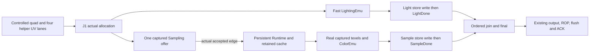

# Controlled pixel composition (J1)

`system::pixel` connects bounded result storage and exact final color to the
existing framebuffer model. `Model` (J1) still takes externally controlled branch
results. The `live` submodule connects `LightingEmu`; `PixelBranches` connects
that path alongside actual persistent Sampling Runtime/cache/ColorEmu results. These bounded
composers use controlled quad inputs, without command, geometry, rasterizer,
RTL or board integration.

## Lighting-live connection

`LightingLive::new(pixel, lighting_context, max_cycles)` owns one `Model` and one
`LightingEmu` (default `Fast` profile) and steps both once per wall edge.
`LiveTick` carries the J1 controls plus a `LiveQuad` (J1 attributes and four
per-lane `PixelInput`s) and the unchanged controlled `SampleWrite`. After a quad
is admitted, only covered, non-default lanes issue `LightingRequest`s; default
light never reads or writes the light store. A returned `LightingResult` is
checked against the context epoch and stored through J1's one light write port on
the same edge it is popped, so a cycle shows issue before the matching
`LightDone`.

The caller holds an offered quad until actual `quad_accepted`; the wrapper does
not copy an unaccepted input, including during CE=0. One admitted input snapshot
retains only four lighting pixels until the last covered lane issues. Its bill
is 4x84 pixel bits (normal48 + NDC36), mask4, cursor3, quad4 and valid1: 348
logical bits. Context-load control adds one bit. There is no second copy of the
quad's basic/header payload and no new result FIFO. The fixed context is a
controlled uniform source for the existing emulator context register.
`ticket_for_quad[16]` and serials are host ownership witnesses, excluded from
this logical bill; no wide hardware tag or fitted resource claim follows.

`LiveTick::light_ready` independently backpressures the real light-store write.
LightingEmu is stallable: its existing output and numerical pipeline hold until
that write succeeds, independently of final readiness. This is distinct from
a non-stoppable BSRAM return. Abort resets local lighting work on the next edge,
including CE=0, while the existing framebuffer transport drains. `drained()`
requires both the faulted J1 path and empty local lighting; it is not successful
rendering. An execution error latches abort; a watchdog still requires external
transport drain after its bound.
`tests/pixel_lighting_live.rs` compares the complete image and guards against the
independent integer golden, requires the executor output to equal the oracle and
the counted architecture config, and covers coverage/default combinations,
consecutive quads, slot reuse, CE pauses, final/result-port backpressure, input
ownership and abort. All six lighting contexts cross all three final contexts;
the tests do not silently truncate these combinations with a zip. The oracle only
supplies post-hoc goldens; it never drives or releases the device.

## Both real branch executors

`PixelBranches::new(pixel, lighting, texture_slots, max_cycles)` owns one
`LightingLive` and one persistent bound `Runtime`. Runtime uses its unchanged
preparation/cache/ColorEmu capacities and a frozen context with 1 through 16 valid
texture slots. It is not recreated for a quad or an idle gap. `BranchTick`
provides controlled attributes, all four helper UV lanes, independent branch
store readiness, Sampling offer readiness, CE, final readiness and finish.
The caller retains an unallocated offer until `live.model.quad_accepted`.

Only actual J1 allocation supplies quad4. A single captured Sampling offer then
bridges that allocation to Runtime's separate real acceptance, reported as
`sample_admitted`. No future ID, release or downstream credit is predicted.
Eligibility for a new sampled allocation uses pre-edge offer emptiness: accepting
an old offer cannot fund a new allocation on that edge. Likewise a new allocation
cannot issue its Sampling offer on its own edge. A busy offer holds later sampled
input outside the wrapper; default-sample and zero-coverage inputs require no
Sampling offer. Zero coverage allocates neither branch.

`sample_issue_ready=false` withholds only the offer. It never freezes older
accepted work. CE freezes compute/admission/result transfers, while the Runtime
still steps its distinct texture transport on every non-faulted wall edge,
including idle gaps and result stalls. Already accepted sampled IDs overlap in
the existing contexts and credits. `sample_ready` gates actual ColorEmu output
consumption independently of final readiness. Only this **actual public result**
supplies `SampleWrite`; the closed-cache cross-check never writes J1 or releases
its ownership. On that same enabled edge J1 writes its single sample port, then
emits `SampleDone`; the wrapper asserts a corresponding successful store write.

The sibling adapter reads LightingLive's existing allocation witness through a
private accessor. It adds no second owner table or wide hardware tag. J1/store
witnesses remain until final consumption and global retirement. Runtime's own
six-bit result ownership and pre-edge ID readiness prevent same-key reuse while
old public lanes or preparation/cache references remain live.



The offer has the following logical bill, all retained from actual allocation
until Sampling acceptance (or discarded on terminal abort):

| Field | Bits | Capture |
| --- | ---: | --- |
| Four helper U/V pairs | 320 | Eight signed 40-bit Q18 codes, RNE and checked magnitude <=2^20 |
| LOD bias | 16 | Signed Q8 code, RNE after +/-32 clamp |
| Texture slot / material size | 4 / 4 | Checked slot0..15 / size0..10 |
| Filter / mask / allocated quad | 2 / 4 / 4 | Exact checked metadata and actual quad4 |
| Offer valid | 1 | Set by allocation, cleared only on acceptance/abort |
| Total offer | **355** | One entry, not a FIFO |

Terminal fault adds one persistent bit: wrapper total **356 logical bits**,
versus seven wrapper bits at the archived singleton checkpoint. This is a
349-bit declaration increase, not fitted Logic or physical FF measurement.
The checked integer containers are host representations. RNE capture exactly
matches the frozen texture format; decoding gives exact binary rationals, so
Runtime's subsequent counted capture is idempotent. Tests cover even/odd UV and
bias ties, bias clamping and held-offer sender changes. This host boundary does
not implement a serial eight-edge UV ingress or certify capture hardware cost.

No return register, full-result FIFO, extra context, or duplicate basic/light
quad payload is added. Runtime's declared link state (266 bits), existing input
capture, P16/Group32, result16 and all cache/preparation/ColorEmu storage remain
its owner's bill; LightingLive's input register is accounted above. Compilation
occurs only at an eligible Runtime ingress edge, with no preloaded quad list or
unbounded history. Preparation and closed-cache arithmetic are still counted
replay, not an independent numerical emulator or RTL. No area, clock or II claim
follows from the Rust containers or these logical declarations.

`step(texture, framebuffer)` exposes two independently owned client ports.
J1's issued store returns and framebuffer maintenance advance on wall edges.
The original branch tests use distinct controlled fixtures. The shared native
fixture below routes both views through one clock owner; independently advancing
adapters must never target the same `Combination`.

Finish stops new J1 allocation but retains and offers an already allocated
Sampling request, even if Runtime had not accepted it. Success requires actual
branch stores, final/ROP, dirty writeback ACKs, an empty offer and Runtime idle.
Sampling or J1/ROP failure latches terminal fault and cannot report success.
Runtime has no abort/drain API: preserve it for diagnosis, stop ticking it, and
have the caller separately drain accepted texture transport. Wrapper fault
steps drain only the distinct framebuffer port. `framebuffer_drained()` is not
a whole-render drain. Recreate after both transports drain; watchdog exhaustion
also requires external transport drain. Partial external writes are not rolled
back or relabelled as successful completion.

`tests/pixel_branches.rs` compares every actual branch result with independent
component goldens and the entire framebuffer/depth/guard image with independent
integer final/address/depth/blend arithmetic. It retains forty-quad defaults,
partial/zero coverage, true wrap reuse, independent stalls, CE, finish and both
transport fault boundaries. Persistent-specific cases prove varying RGB across
warm idle gaps and wrap, overlapping actual Sampling IDs, blocked output stability,
full real result16/global16/P16/Group32 limits and recovery, capture ties, and
immutable allocated offers whose acceptance cannot fund same-edge allocation.
All loops and instance lifetimes are bounded.

Matched S1/S2 execution uses the archived singleton source, identical controlled
fixtures/stimuli and component/full-frame goldens. Exact sources, wall/CE timing,
acceptances, first/last results, cold/warm windows and refill counts are in the
workspace `target/gpu-pixel-branches/persistent/` evidence. Sampler step/enabled
counts include idle housekeeping in persistent S2 but only singleton lifetimes
in S1; they are not arithmetic utilization. Per-quad intervals in an overlapping
stream include queueing, and refill deltas in those intervals may include other
IDs. Warm serial windows isolate those effects. A finite frame mean is not a
steady-state II or whole-GPU performance certificate.

## Shared native memory fixture

`tests/pixel_shared_sdram.rs` connects the persistent branches through the
test-only `support/sdram/shared_pixel.rs` adapter to one actual serial
arbiter/gearbox/controller `Combination` and one external image. The FB view
owns each physical tick; the passive Sampling view delivers one bounded RO
edge record on the following edge. This additional return edge is explicit.
Native initialization is accounted separately, and accepted MC returns continue
during compute CE pauses and closed Sampling result admission.

Each enabled background client has one reserved sink: Display, Instruction
and Data issue 32-byte reads periodically. Sampling retains its native 128-byte
refill; FB reads/writes retain their sixteen-beat transactions and final ACK.
Texture and background regions are disjoint from color/depth and remain guarded.
Independent branch goldens and the entire image check cold/warm cache reuse,
normal completion, paused returns, and external RO discard plus FB fault drain.
The fixture serializes quad admission; it does not prove shared-MC saturation.

Read-only preflight errors occur before Hub mutation. An error after that
boundary, including write-source underrun or native tick failure, poisons the
adapter: retry and idle/drained claims are rejected. Driver RO-poll failure
before the clock owner is a separately tested drainable case. General native
error-response recovery, context rebinding, RTL and board behavior remain open.

## Interfaces and ownership

`Model::new(Context, max_cycles)` fixes a materialized surface, ROP state,
specular RGB and alpha until completion or fault drain. `Tick` supplies one quad,
one lighting result and one sampling result per edge. `Cycle` reports actual
acceptances, store accesses and lifecycle events. No separate output queue is
added: final feeds `OutputRow` into the framebuffer model's existing two slots.

Each nonempty admission reserves one of 16 ordered global slots and all three
payload destinations. `Ticket { quad, serial }` identifies that allocation;
`PixelKey` adds a covered lane. The serial and per-row ownership witnesses detect
stale host injection after wrap. They are simulation diagnostics, not a proposed
wide hardware tag or a change to the six-bit internal pixel key.

| State | Capacity and owner |
| --- | --- |
| Header/join | 16 slots; ingress initializes coverage/defaults; each writer updates its own done mask |
| Basic store | 64 pixels, two logical rows each: RGB24 then D16; ingress alone writes, final alone reads |
| Light store | 64 rows of g9+h9; result injection alone writes, final alone reads |
| Sample store | 64 RGB24 rows; result injection alone writes, final alone reads |
| Basic ingress | One held quad of attributes; at most one row written per enabled edge |
| Final | One lane's work state; one issued-read descriptor/data latch, one reserved return record, one held output row |
| Output/ROP/MC | Existing two output slots, bounded ROP work and one outstanding 128-byte framebuffer transaction |

Payload arrays have fixed host containers (128/64/64 `u32` rows). Effective
fields and reserved bits are enforced by writes. Control, diagnostic witnesses,
ingress and return/output registers are additional state; host layout is not a
fitted RAM or logic budget. Issued and held return records are mutually exclusive.
No dynamically growing queue holds GPU payloads. Test-side lists are finite
stimulus producers and are not counted as GPU storage.

Every store permits one read and one write per edge; same-address collisions
are rejected by assertions. Basic readiness follows its depth-row write. Branch
readiness follows its payload write. Join uses readiness from before the edge,
so a completion write cannot bypass into a read. Only the oldest ready quad joins.
Default-light selects g=256/h=0, default-sample selects RGB=255; neither accesses
its stale store. Mask zero drops before allocation, and uncovered lanes emit
deterministic zero output rows without payload reads.

## Final color and synchronous returns

For each channel, with byte-valued tint, texture and specular color:

```text
base  = nearest_integer(tint * texture / 255)
color = saturate_u8(RNE((base * g + specular * h) / 256))
RGBA  = color plus immutable context alpha
```

The divide-by-255 implementation uses the exact bounded multiply/add shortcut;
the divide-by-256 stage uses round to nearest, ties to even. Inputs outside
g=0..511 or h=0..256 are rejected. RGB565 quantization happens only in ROP.
The final numeric function executes atomically on return consumption: it is not
an audited counted/timed arithmetic calendar or a latency/resource certificate.

A color read captures basic RGB and required branch payloads together; a
separate basic read supplies depth. Reads reserve their destination before issue.
The next wall edge captures the stored row values even under CE=0 or final
backpressure. Only a previously valid return can be consumed, and the resulting
output row cannot be accepted on its creation edge. A held output may leave and
the next read issue on the same edge, using that actual transfer. The return
position is distinct and no future ready credit is predicted.

This deliberately serial final controller has no II2 claim. Workload timings
include admission policy, result injection, CE pauses, misses and flush; they do
not measure lighting/sampling arithmetic throughput.

## Release, completion and errors

```text
payload written -> done -> ordered join -> store return captured
  -> final consumed -> all eight output rows accepted -> global slot released
  -> ROP payload captured (output slot released) -> ROP committed
  -> dirty data written back and ACKed -> render complete
```

Global slot reuse is independent of output slot reuse, ROP line dependencies
and MC transaction lifetime. The output retains everything ROP needs after the
global slot is released. Each branch must send exactly one result per required
lane. Duplicate, uncovered, invalid or stale writes latch a terminal fault;
neither branch write from that edge is accepted.

`finish` under CE stops new admissions and keeps receiving already allocated
results. After final drains, the model requests flush once. `complete()` requires
framebuffer flush completion and idle; the test composition also checks adapter
idle. ROP's existing maintenance continues every wall clock, including CE=0.
Fault stops new work, drains presented/accepted transport, then discards remaining
local state. `drained()` reports this fault path, never successful rendering;
partial external writes are not rolled back. No in-place context switch or reset
is provided. The wall watchdog returns an explicit error; after that bound the
caller must drain external transport separately rather than keep calling `step`.

## Verification and remaining integration

`tests/pixel_system.rs` uses an independent integer final/depth/blend/addressing
golden and compares the complete color/depth byte image, including guards. It
covers masks/default combinations, full credits, more than three slot rotations,
out-of-order branch writes, same-address order, duplicate/stale/default rejection,
real slot reuse, synchronous return reservation, CE/backpressure, cold/dirty
maintenance, fault drain and a permanent-result-stall watchdog. Reversing the
same-address stimulus changes the independent golden, proving order matters.
Two directed cases sharpen the J1 boundary: a wrap-16 slot is first filled with
real non-default payloads and then reused for light-only, sample-only and
both-default bypass, with exact per-store read/write addresses proving the stale
bank cell is never touched and the full byte/guard image matching independent
arithmetic; and finish asserted while an allocated result is late and the
downstream MC is stalled shows no premature complete, that already allocated
results still land, that no work is admitted after finish, that a CE pause
preserves state, and that Complete follows dirty writeback ACK. This fixture
case identifies accepted read/write transactions separately, checks all sixteen
write beats, observes the delayed interval after the last beat without Complete,
and compares the complete color/depth/guard image with an independent golden;
refill completion alone is not counted as a flush ACK.

`tests/pixel_sdram.rs` uses the existing direct `Combination` burst adapter with
the actual serial arbiter/gearbox/controller cycle emulator and pin memory model.
Every wall edge advances this combination exactly once. Complete images and
guards match; all accepted 128-byte requests return/consume sixteen beats and
exactly one terminal response. Reference branch cases include zero and
unnormalized normals, negative components, NDC boundaries, shininess endpoints,
and nearest/bilinear/trilinear sampling with four helper UVs. Branch reference
generation uses external texture fixture memory; only framebuffer traffic uses
the cycle MC in J1.

The next integration requires serial helper-UV ingress, independent preparation
arithmetic and live geometry inputs. The shared native dispatcher above is a
test-only composition; production transport and context ownership still need
their own integration contract. Existing standalone adapters each own their
MC advance and cannot be stepped independently against one shared controller.
J1 needs no new vendor/audited/ROP public API.
Certified final/ROP arithmetic, live command/raster inputs and render/display
ownership remain separate work. No emu-vs-RTL, PnR or board result is claimed here.
