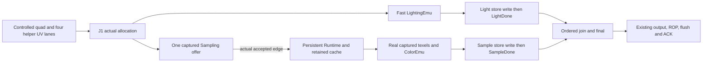

# Pixel composition and published quad foundation

`system::pixel` connects bounded result storage and exact final color to the
existing framebuffer model. `Model` (J1) still takes externally controlled branch
results. The `live` submodule connects `LightingEmu`; `PixelBranches` connects
that path alongside actual persistent Sampling Runtime/cache/ColorEmu results. These bounded
composers use controlled quad inputs, without command, geometry, rasterizer,
RTL or board integration.

## Published row foundation

`foundation::Pipeline` is a separate replacement controller; `foundation_live::Live`
attaches the frozen Fast/free/Floor Q13 Lighting core and actual persistent Sampling
Runtime, and `foundation_backend::Backend` attaches the existing serial
FramebufferEmu/cache. The older dispatcher below remains available as a baseline.
The new controller is Rust edge-level integration, with independently checked
SPSC and Final RTL leaves. It is not full-controller RTL, fitted storage, integrated
system PnR, a rasterizer, or physical-board evidence.

The source supplies eight held attribute beats per quad. Each beat writes one
basic RGB24/D16 row and, when lit, one Lighting36 row; odd beats also write one
Sampling UV36 row. Only the first beat carries XY/mask, draw-bank selection and
`force_coarsest`. A private producer holds metadata for the incomplete tail, never
a duplicate complete quad. The final beat publishes all required input queues
and advances the global published insert pointer. Occupancy includes the private
tail, so it cannot borrow credit released on the same edge. Mask-zero quads
allocate no status or payload; their draw boundary still survives.

The 32 global slots hold compact origin/mask and ownership, not normal or UV.
Lighting has two quad input entries, with two36-bit rows per pixel; Sampling has
eight entries, with one36-bit UV row per lane. Independent consumers assemble
only the necessary head: one held normal row for Lighting, three UV rows plus
the fourth queue head for Sampling. Each queue frees its entry on its own last
row acceptance. Results remain in separate single-writer arrays.

Each branch writes its own whole-quad done RAM once, with the last covered
result. The allocator has a separate one-bit expected epoch for each branch and
slot, toggling only when that branch actually runs. Bypass neither toggles the
expectation nor accesses stale result/done data. A single global lap epoch is
insufficient: active-to-bypass-to-active could match a stale done value. Each
branch initializes its32 done cells through its own writer before admissions.
Join suppresses a done read when the same slot completes on that edge, and
observes the new value on the next edge. Diagnostic serials, generations and
per-lane sent/seen masks detect invalid ownership in Rust; they are not proposed
wide tags or hardware per-lane readiness storage. Branch results must stay ordered
within each quad; the two branches may complete independently.

Join captures color operands on C and depth on D, admitting multiple keyed jobs
to the actual nine-stage Final leaf at two edges per covered pixel. Eight total
result credits cover the real acceptance-to-consumption lifetime. A bounded
eight-entry key/depth owner FIFO follows actual Final acceptance. Output writes
RGBA32 then D16, one row per edge, with zeros for uncovered lanes. Row7 publishes
the output entry; actual ROP row7 acceptance releases its global slot and draw
reference. No scalar wait-for-Final-response loop remains on this path.

Lighting's existing32-bit ID carries global slot5/lane2. Sampling retains its
16 public quad IDs and key6: the fixed ID is `global_slot & 15`. An adapter owns
16 entries of high destination bit, valid and remaining coverage mask. It assigns
only on actual Runtime admission and clears only after the last actual result
write. An old mapping blocks an aliased new offer using pre-edge state, even
when that edge returns its last result. Bypass occupies no mapping. Final also
keeps its existing key6; the strictly ordered owner FIFO retains full global
slot5/lane2 and depth. Return compares the queue head's low6 key, with no random
lookup by the truncated key. Aliased slots are at least16 nonempty quads apart,
while at most8 Final tasks are live. Host full-ticket witnesses remain separate.

Two immutable draw banks publish atomically; a third draw waits for a free bank.
The boundary queue retains empty and bypass draws and releases a bank after its
last queued reader. A reused Lighting bank forces a context reload. Lighting
uniform changes still drain that frozen leaf locally; core-internal overlapping
contexts are not claimed. The framebuffer adapter snapshots ROP state for its
current quad and waits for that existing leaf to idle before changing context.
Draw retirement does not imply MC completion. `Backend::request_finish()`
explicitly ends the frame; only then, after the pixel path drains, does the
adapter request cache flush and wait for real write ACKs. Temporary idleness or
an empty draw never implicitly ends the frame.

The banked mutable fields are lighting/material/projection, Sampling
slot/filter/bias/material size, alpha and ROP modes. `Live::new` still fixes the
texture slot address/size/mip table, and `Backend::new` fixes the render surface.
Two material draws therefore qualify only those banked changes. Rebinding the
same texture slot or changing render target while old work is in flight requires
an explicit drain/fence and a new attachment; neither is qualified as an
overlapped change. No cache version/tag scheme is introduced here.

### Memory organization and read positions

These are logical fields and implemented edge-model organizations, not fitted
device counts. Basic and result arrays currently have asynchronous reads into
explicit capture positions; replacing them with synchronous BSRAM requires a
corresponding calendar change. One source/destination read/write is available
per payload array per edge, with same-address collisions excluded by ownership.

| Store | Useful bits | Model rows | Read/write ownership and physical boundary |
| --- | --- | --- | --- |
| Basic | 32x4x(RGB24+D16)=5120 | 256x32 | Producer writes; join reads C/D. Asynchronous storage candidate, not an implemented synchronous SDP36. |
| Lighting input | 2x4x68=544 | 16x36 | Source writes; Lighting head reads. Selected asynchronous SSRAM organization; behavioral distributed-RAM RTL checked, without fit. |
| Sampling input | 8x4x36=1152 | 32x36 | Source writes; Sampling head reads. One explicit SDPX9B36 primitive with hard synchronous DO; vendor-primitive edge simulation checked, without fit. |
| Lighting result | 32x4x18=2304 | 128x32 | Lighting writes; join reads. Effective g9/h9, upper model bits unused. Mapping remains to be fitted. |
| Sampling result | 32x4x24=3072 | 128x32 | Sampling writes; join reads. Effective RGB24; physical mapping remains to be fitted. |
| Output | 32x4x(RGBA32+D16)=6144 | 256x32 | Final writer and ROP head reader. Current capture/distributed organization; conservative32-quad depth follows global slot lifetime through ROP row7. |
| Done | 2x32x1=64 | Two32x1 arrays | One branch writer and one join probe per array; no allocator clear or read. Expected epochs add64 allocator FF bits. |

Payload is not the complete resource cost. Two completed queue heads are paid
per queue: Lighting and Sampling each retain2x36 data bits, Output2x32, plus row
tags, validity and pointers. Sampling additionally owns the primitive's hard DO
return and its pending row/valid tag; this DO is not a separate soft36-bit FF
array. Lighting holds one36-bit normal; Sampling holds3x36 assembled UV bits.
Join retains96 bits of Final operands/key and the owner FIFO retains8x(7+16)
effective bits, plus phase/pointers and the output depth hold. Final's arithmetic
pipeline and8x30-bit result FIFO are additional leaf state.
The Sampling destination adapter adds a conservative16x(high1+valid1+mask4)=96
logical FF bits; public key6 and its internal8-context configuration do not grow.

Status has32x23 effective bits (aligned origin15, mask4, bank1, two bypass
flags and `force_coarsest`), plus the separately owned expected epochs. Context
banks carry Lighting160, optional Sampling26, alpha8 and ROP5 effective bits
each, with valid/closed/reference and boundary state. Current Rust status/context
lookup views serve allocator, both branch descriptors, join and ROP; these are
register-table/mux views, not an arbitrary-port SSRAM claim. Descriptor queues
and their bounded slot/bank ownership also cost storage; their packed physical
implementation is still open. Host witness integers do not establish RAM or FF
allocation. A smaller output queue could reduce storage but would change
backpressure/lifetime; no reduction is inferred from useful bits alone.
Each enlarged payload still fits the capacity of one future SDP36 block, but
its asynchronous read/capture implementation has not been retimed or fitted to
that primitive. Capacity arithmetic is not a synchronous-storage qualification.

### Qualification

`pixel_foundation` independently checks96 full quads: every publication gap is8,
every actual Final acceptance gap2, and all768 actual ROP-input row transfers
have gap1 at a controlled one-row-per-edge sink. This is a sustained finite
stream interval, not a fill/drain average. Faster externally released quads
exercise backlog/backpressure rather than pretending the eight-row source bus
accepts a quad in four edges. Sparse masks, CE pauses, independent branch stalls,
all bypass combinations, repeated slot reuse, unpublished tails, empty draws,
terminal faults and wall watchdogs have separate bounded checks.
Active/bypass epoch patterns use32-quad blocks and six complete slot laps, so
the same slot actually encounters active-to-bypass-to-active reuse.

`pixel_foundation_live` checks the actual selected Lighting and Sampling engines
for nearest, bilinear and trilinear, changing draw contexts, tile/mip crossings,
misses, CE and result stalls. Its measured gap distributions retain branch/cache
and context-drain bubbles; the controlled-branch II2 result is not transferred
to arbitrary live workloads. A separate actual FramebufferEmu test uses one
shared arbiter/gearbox/Combination clock owner, competing background requests,
real row/context backpressure and flush ACKs. The full color/depth image and
untouched guards match an independent golden. ROP remains the existing serial
implementation; the older bounded II8 control calendar is not its measured rate.

The original16-slot controller's fixed-footprint Nearest trace revealed160-edge
steady source-to-ROP lifetime against a128-edge budget. Its exact life/stall
timeline and failing whole-warm-interval II2 counterexample are retained in the
worktree receipt. At least20 slots are required for that measured lifetime;
32 is the tested power-of-two candidate, not a proven minimum. Releasing at
last join D alone would still leave141 edges and cannot justify global16.

The normal `actual_one_group_warm_nearest_bilinear_stream_has_ii2_to_rop` test
checks actual branch calculations and all512 rows per filter. With full coverage,
one group per pixel, one initial tile refill, eight-edge quad releases and a
one-row-per-edge ROP input sink, **every** Final gap across quads16..63 is2 and
every ROP row gap is1. The192 Final transfers and384 row transfers include all
intervals in this declared window. Public-ID alias waits and32-slot wrapping
are exercised; no interval is silently dropped or averaged into an II.

The original complex Bilinear footprint remains a separate normal numerical
test: its upper taps cross an8x8 tile boundary, creating six groups per quad
(384 packets/256 pixels). Its warm interval retains ten-edge inter-quad gaps
in this implementation. An explicitly ignored strict counterexample preserves
the failed universal II2 assertion. The fractional two-plane Trilinear case
also retains its measured distribution. These traces check all512 rows per
case and report every quads16..63 interval; neither is relabeled as a one-group
case or an immutable algorithmic throughput bound. Their source, admission,
shared-context release, last result, join, output and occupancy events are kept.

The foundation adapter supplies `RawQuadInput` to `Runtime::step_raw` directly:
UV Q16 and draw bias Q8 do not make a fixed-to-float-to-fixed round trip. Live
admissions count actual accepted quads, while per-input Program compilation
remains zero. The compatibility float entry of older composers is capture-only;
Sampling's internal qualification remains specified in [texture.md](texture.md).

`pixel_spsc` checks bounded semantic streams against independent whole-entry
publication goldens, wrap, poisoned stale payload, incomplete tails, reset,
CE, stalls and full one-row-per-edge runs. Ignored Icarus cases compare every
edge for capture, registered and explicit Sampling SDPX9B36 configurations.
`pixel_final_stage` checks finite credits,512 paced pixels at II2 and reset with
live old results; `pixel_final_stage_rtl` includes a nonempty reset edge. Reset
gates ready/valid, invalidates ownership and never clears payload RAM. No
on-reset transfer or same-edge returned credit is counted.

## Explicit quad dispatcher and common contexts

The selected dispatcher ingress carries S(12,10) normal, S(16,14) pixel-center
NDC and unwrapped S(18,16) helper UV. Each compact lighting pixel contains68
meaningful bits in two36-bit rows. Sampling carries eight18-bit UV components
and one `force_coarsest` flag. Width accounting follows these effective fields;
it does not imply a narrower fitted RAM geometry. Unlit/untextured still bypass
their branch queues and never require unused input data to be valid.

`dispatch::Dispatcher` is a separate bounded controller; the older J1 composers
below retain their original contracts. `engines::BranchEngines` connects the
dispatcher to the current Fast CompensatedFloor lit-only LightingEmu and the
persistent Sampling Runtime. `composition::FinalBranches` adds the actual
registered FinalEmu with an explicit external row-stream port. `backend::Backend`
connects that port to the actual registered ROP/framebuffer cache emulator.
Sampling's numerical/control qualification
boundaries remain those in [texture.md](texture.md).

The raster/attribute producer holds an `Input` until accepted into a configurable
quad ingress FIFO. Each input carries an aligned 2x2 XY/mask, common-context ID,
four RGB8/D16 basic values, four S12F10 normals plus S(16,14) NDC centers, and all
four S(18,16) helper UV pairs and the coarsest-mip flag. Dispatch reserves a free one of 16 status slots, one
basic-store writer and credit in each required branch queue, using pre-edge
capacity. A blocked branch cannot cause partial dispatch. Moving attributes to
the branch queues removes them from ingress; status retains no normal or UV.

`CommonContext` owns lighting material/light/projection, optional texture
slot/size/filter/bias, final alpha and ROP state. The configurable table has four
entries by default, at most 16. It is currently a stable register-table model
with mux read views, not an unlimited-port BRAM abstraction. A reference covers
ingress and status through output publication. Context replacement is rejected
while referenced. Lighting uniform changes wait for its real kernel to drain.
Host generation/serial witnesses detect stale access and are not proposed wide
hardware tags.

Unlit never enters the lighting queue: its status starts with light-done coverage
and final supplies g=256/h=0 without accessing light RAM. Untextured similarly
bypasses the Sampling queue and sample RAM with RGB255. This allocation-marker
representation avoids reading or writing stale payload rows. Other done bits
are set only after actual single-port result writes; unsolicited, duplicate,
uncovered and stale results latch terminal fault. Zero coverage allocates nothing.

The basic writer uses one 32-bit write per enabled edge, alternating RGB24 and
D16 rows for each covered lane. Final probes only the oldest status. It reserves
one of two output slots before reading basic RGB, light and sample on their
separate read ports; basic depth uses the next read. Returns capture on wall
time even when CE is low. One held keyed final job receives the immutable
specular color from common context. Final response writes RGBA32 then D16 in
two separate edges. Uncovered output lanes contain zeros and remain masked.

Row7 publication releases status and its context reference. Output independently
holds XY/mask and the detached ROP-state snapshot, so no subsequent context
lookup can change its meaning. ROP reads one output row through a reserved
synchronous return and held skid; eight accepted rows release that output slot.
No same-edge returned credit funds another admission. This conservative first
controller uses one final arithmetic job at a time; its throughput is not the
previous Lighting or framebuffer hot-path II. It is not dispatcher RTL evidence.

`Dispatcher::inventory()` is the payload/array organization source of truth.
Additional costs include the basic writer, final working state, context registers,
FIFO metadata, output descriptors and two independently reserved return paths.
The four payload stores have one read and one write per edge; no spare capacity
is counted as an extra port. Physical primitive allocation and fitted mux/Logic
are not inferred from logical widths.

`pixel_dispatch_overnight` checks 72 controlled quads, all bypass combinations,
partial masks, context pins, slot reuse, ordered output, CE/backpressure, single
read/write ports and watchdogs. `pixel_engines_overnight` runs 36 quads through
actual Lighting, Sampling and the nine-stage FinalEmu. It compares returned
operands and every output color/depth row to independent goldens; memory is a
stalled byte fixture. Neither
test claims shared-MC performance, full final/ROP RTL or board validation.

`FinalBranches` reserves one keyed final operation, advances the independent
leaf once per wall edge, and returns only an actually consumed result to the
dispatcher. Depth remains in the dispatcher. The leaf's fixed-stage arithmetic
and its eight result credits have separate timing certificates; the present
single-job composition does not claim the arithmetic-only II=1 lower bound.
`pixel_final_stage` exhaustively checks the division/rounding identities;
`pixel_final_stage_rtl` compares a bounded registered RTL stream with the emu.
The composition itself remains a Rust controller rather than integrated RTL.

`BranchEngines::step_with_rop` polls Sampling's read view first, then invokes a
single external framebuffer/physical-clock owner with the pre-edge held row.
That owner must run once on every wall edge, including CE=0 and an empty row
offer, and returns actual row acceptance. A branch fault switches the external
owner to an explicit accepted-memory drain; retrying a partially advanced edge
is not supported. `pixel_dispatch_shared_clock` checks this order with the real
arbiter/gearbox/Combination, concurrent display/CPU reads, partial coverage and
CE pauses, including unchanged memory guards. It uses actual FinalEmu; ROP row
consumption is controlled there, with no framebuffer writes in that fixture.

`raster_input::convert` consumes existing triangle-oracle `RasterQuad` attributes
into this compact ingress contract. Covered RGB becomes UNORM8, depth retains
D16, pixel centers produce S(16,14) NDC, and lit normals become S2.10 with an
explicit clipping counter. All four UV helper lanes retain unwrapped S(18,16) codes;
unlit/untextured attributes need no conversion. Textured nonprojectable helpers
set the conservative coarsest-LOD flag; out-of-domain uncovered helpers do the
same. Covered invalid UV still errors. Runtime and register-only Sampler share
the flag semantics. `pixel_raster_ingress` checks actual triangle
coverage/interpolation and independent branch offers, not live rasterizer RTL.

## Actual backend and shared memory owner

`backend::Backend` composes the independent branches, actual FinalEmu and
`framebuffer::emu::FramebufferEmu`. Sampling's read view is polled before the
cache invokes its `MemoryPort` exactly once per wall edge, including CE=0 and
an empty output offer. Production GPU code depends only on GPU-owned ports;
the real vendor arbiter/gearbox/controller is supplied by the test adapter.

Each detached ROP row carries the immutable context snapshot. A differing ROP
context waits for the old cache work to retire before row0 admission; the next
seven rows must keep ticket/header/context and sequence. Same-context quads may
use both cache output slots. Context switching retains resident tiles and dirty
data. This conservative barrier avoids reading a newer material for old work;
it is a baseline for later overlap optimization, not a new context RAM port.

Closing waits for branches/Final and all eight output-row transfers, requests
flush once, and reports completion only after actual framebuffer terminal ACKs.
A failed edge is terminal: external transport cancels unpresented Sampling and
drains accepted requests; already advanced edges must not be retried.

`pixel_backend_shared_mc` checks thirty-six inputs across twenty tiles, all four
lit/textured combinations, partial/empty masks, context changes, status reuse,
CE and downstream backpressure. Real128B Sampling refills and framebuffer
reads/writes share one `Combination` with CPU/display background reads. Every
color/depth/guard/texture byte matches the independent full-image golden;
accepted burst beat/terminal counts are checked. This closes the Rust backend
numerical/transport path, not live DRAW ingress, integrated GPU RTL or board proof.

`registered::RegisteredBranches` and `registered_backend::Backend` provide the
new register-only Sampling alternative. They keep the same Dispatcher/Final/ROP
ownership contracts but replace Runtime admission with direct S(18,16) helper UVs
to `SamplerEmu`; no counted Program or preparation oracle executes on this live
path. Lighting remains the independent lit-only Fast CompensatedFloor kernel.
Sampling's held RGB96 quad-result bank feeds the existing single result-write
port using one two-bit covered-lane cursor, without a second color buffer. The
last covered-lane write transfers that held result; all other lanes wait in its
bank under CE/backpressure. Status still retains neither normal nor UV.

`pixel_registered_backend` repeats the independent full-image/guard proof with
the actual register-only sampler, both serial optimizations enabled and one
physical Combination shared with framebuffer and CPU/display traffic. A second
case starts from actual triangle-oracle RasterQuads. The raw register sampler,
Lighting and ROP/cache can still be instantiated independently. This is a Rust
composition proof: Dispatcher, common-context management and the complete GPU
connection are not yet RTL; triangle/raster inputs are numerical oracle output,
not live DRAW/vertex/rasterizer hardware.

## Lighting-live connection

`LightingLive::new(pixel, lighting_context, max_cycles)` owns one `Model` and one
`LightingEmu` (default `Fast` profile) and steps both once per wall edge.
`LiveTick` carries the J1 controls plus a `LiveQuad` (J1 attributes and four
per-lane `PixelInput`s) and the unchanged controlled `SampleWrite`. After a quad
is admitted, only covered, non-default lanes issue `LightingRequest`s; default
light never reads or writes the light store. A returned `LightingResult` is
checked against the context epoch and stored through J1's one light write port on
the same edge it is popped, so a cycle shows issue before the matching
`LightDone`.

The caller holds an offered quad until actual `quad_accepted`; the wrapper does
not copy an unaccepted input, including during CE=0. One admitted input snapshot
retains only four lighting pixels until the last covered lane issues. Its bill
is 4x84 pixel bits (normal48 + NDC36), mask4, cursor3, quad4 and valid1: 348
logical bits. Context-load control adds one bit. There is no second copy of the
quad's basic/header payload and no new result FIFO. The fixed context is a
controlled uniform source for the existing emulator context register.
`ticket_for_quad[16]` and serials are host ownership witnesses, excluded from
this logical bill; no wide hardware tag or fitted resource claim follows.

`LiveTick::light_ready` independently backpressures the real light-store write.
LightingEmu is stallable: its existing output and numerical pipeline hold until
that write succeeds, independently of final readiness. This is distinct from
a non-stoppable BSRAM return. Abort resets local lighting work on the next edge,
including CE=0, while the existing framebuffer transport drains. `drained()`
requires both the faulted J1 path and empty local lighting; it is not successful
rendering. An execution error latches abort; a watchdog still requires external
transport drain after its bound.
`tests/pixel_lighting_live.rs` compares the complete image and guards against the
independent integer golden, requires the executor output to equal the oracle and
the counted architecture config, and covers coverage/default combinations,
consecutive quads, slot reuse, CE pauses, final/result-port backpressure, input
ownership and abort. All six lighting contexts cross all three final contexts;
the tests do not silently truncate these combinations with a zip. The oracle only
supplies post-hoc goldens; it never drives or releases the device.

## Both real branch executors

`PixelBranches::new(pixel, lighting, texture_slots, max_cycles)` owns one
`LightingLive` and one persistent bound `Runtime`. Runtime uses its unchanged
preparation/cache/ColorEmu capacities and a frozen context with 1 through 16 valid
texture slots. It is not recreated for a quad or an idle gap. `BranchTick`
provides controlled attributes, all four helper UV lanes, independent branch
store readiness, Sampling offer readiness, CE, final readiness and finish.
The caller retains an unallocated offer until `live.model.quad_accepted`.

Only actual J1 allocation supplies quad4. A single captured Sampling offer then
bridges that allocation to Runtime's separate real acceptance, reported as
`sample_admitted`. No future ID, release or downstream credit is predicted.
Eligibility for a new sampled allocation uses pre-edge offer emptiness: accepting
an old offer cannot fund a new allocation on that edge. Likewise a new allocation
cannot issue its Sampling offer on its own edge. A busy offer holds later sampled
input outside the wrapper; default-sample and zero-coverage inputs require no
Sampling offer. Zero coverage allocates neither branch.

`sample_issue_ready=false` withholds only the offer. It never freezes older
accepted work. CE freezes compute/admission/result transfers, while the Runtime
still steps its distinct texture transport on every non-faulted wall edge,
including idle gaps and result stalls. Already accepted sampled IDs overlap in
the existing contexts and credits. `sample_ready` gates actual ColorEmu output
consumption independently of final readiness. Only this **actual public result**
supplies `SampleWrite`; the closed-cache cross-check never writes J1 or releases
its ownership. On that same enabled edge J1 writes its single sample port, then
emits `SampleDone`; the wrapper asserts a corresponding successful store write.

The sibling adapter reads LightingLive's existing allocation witness through a
private accessor. It adds no second owner table or wide hardware tag. J1/store
witnesses remain until final consumption and global retirement. Runtime's own
six-bit result ownership and pre-edge ID readiness prevent same-key reuse while
old public lanes or preparation/cache references remain live.



The offer has the following logical bill, all retained from actual allocation
until Sampling acceptance (or discarded on terminal abort):

| Field | Bits | Capture |
| --- | ---: | --- |
| Four helper U/V pairs | 320 | Eight signed 40-bit Q18 codes, RNE and checked magnitude <=2^20 |
| LOD bias | 16 | Signed Q8 code, RNE after +/-32 clamp |
| Texture slot / material size | 4 / 4 | Checked slot0..15 / size0..10 |
| Filter / mask / allocated quad | 2 / 4 / 4 | Exact checked metadata and actual quad4 |
| Offer valid | 1 | Set by allocation, cleared only on acceptance/abort |
| Total offer | **355** | One entry, not a FIFO |

Terminal fault adds one persistent bit: wrapper total **356 logical bits**,
versus seven wrapper bits at the archived singleton checkpoint. This is a
349-bit declaration increase, not fitted Logic or physical FF measurement.
The checked integer containers are host representations. RNE capture exactly
matches the frozen texture format; decoding gives exact binary rationals, so
Runtime's subsequent counted capture is idempotent. Tests cover even/odd UV and
bias ties, bias clamping and held-offer sender changes. This host boundary does
not implement a serial eight-edge UV ingress or certify capture hardware cost.

No return register, full-result FIFO, extra context, or duplicate basic/light
quad payload is added. Runtime's declared link state (266 bits), existing input
capture, P16/Group32, result16 and all cache/preparation/ColorEmu storage remain
its owner's bill; LightingLive's input register is accounted above. Compilation
occurs only at an eligible Runtime ingress edge, with no preloaded quad list or
unbounded history. Preparation and closed-cache arithmetic are still counted
replay, not an independent numerical emulator or RTL. No area, clock or II claim
follows from the Rust containers or these logical declarations.

`step(texture, framebuffer)` exposes two independently owned client ports.
J1's issued store returns and framebuffer maintenance advance on wall edges.
The original branch tests use distinct controlled fixtures. The shared native
fixture below routes both views through one clock owner; independently advancing
adapters must never target the same `Combination`.

Finish stops new J1 allocation but retains and offers an already allocated
Sampling request, even if Runtime had not accepted it. Success requires actual
branch stores, final/ROP, dirty writeback ACKs, an empty offer and Runtime idle.
Sampling or J1/ROP failure latches terminal fault and cannot report success.
Runtime has no abort/drain API: preserve it for diagnosis, stop ticking it, and
have the caller separately drain accepted texture transport. Wrapper fault
steps drain only the distinct framebuffer port. `framebuffer_drained()` is not
a whole-render drain. Recreate after both transports drain; watchdog exhaustion
also requires external transport drain. Partial external writes are not rolled
back or relabelled as successful completion.

`tests/pixel_branches.rs` compares every actual branch result with independent
component goldens and the entire framebuffer/depth/guard image with independent
integer final/address/depth/blend arithmetic. It retains forty-quad defaults,
partial/zero coverage, true wrap reuse, independent stalls, CE, finish and both
transport fault boundaries. Persistent-specific cases prove varying RGB across
warm idle gaps and wrap, overlapping actual Sampling IDs, blocked output stability,
full real result16/global16/P16/Group32 limits and recovery, capture ties, and
immutable allocated offers whose acceptance cannot fund same-edge allocation.
All loops and instance lifetimes are bounded.

Matched S1/S2 execution uses the archived singleton source, identical controlled
fixtures/stimuli and component/full-frame goldens. Exact sources, wall/CE timing,
acceptances, first/last results, cold/warm windows and refill counts are in the
workspace `target/gpu-pixel-branches/persistent/` evidence. Sampler step/enabled
counts include idle housekeeping in persistent S2 but only singleton lifetimes
in S1; they are not arithmetic utilization. Per-quad intervals in an overlapping
stream include queueing, and refill deltas in those intervals may include other
IDs. Warm serial windows isolate those effects. A finite frame mean is not a
steady-state II or whole-GPU performance certificate.

## Shared native memory fixture

`tests/pixel_shared_sdram.rs` connects the persistent branches through the
test-only `support/sdram/shared_pixel.rs` adapter to one actual serial
arbiter/gearbox/controller `Combination` and one external image. The FB view
owns each physical tick; the passive Sampling view delivers one bounded RO
edge record on the following edge. This additional return edge is explicit.
Native initialization is accounted separately, and accepted MC returns continue
during compute CE pauses and closed Sampling result admission.

Each enabled background client has one reserved sink: Display, Instruction
and Data issue 32-byte reads periodically. Sampling retains its native 128-byte
refill; FB reads/writes retain their sixteen-beat transactions and final ACK.
Texture and background regions are disjoint from color/depth and remain guarded.
Independent branch goldens and the entire image check cold/warm cache reuse,
normal completion, paused returns, and external RO discard plus FB fault drain.
The fixture serializes quad admission; it does not prove shared-MC saturation.

Read-only preflight errors occur before Hub mutation. An error after that
boundary, including write-source underrun or native tick failure, poisons the
adapter: retry and idle/drained claims are rejected. Driver RO-poll failure
before the clock owner is a separately tested drainable case. General native
error-response recovery, context rebinding, RTL and board behavior remain open.

## Interfaces and ownership

`Model::new(Context, max_cycles)` fixes a materialized surface, ROP state,
specular RGB and alpha until completion or fault drain. `Tick` supplies one quad,
one lighting result and one sampling result per edge. `Cycle` reports actual
acceptances, store accesses and lifecycle events. No separate output queue is
added: final feeds `OutputRow` into the framebuffer model's existing two slots.

Each nonempty admission reserves one of 16 ordered global slots and all three
payload destinations. `Ticket { quad, serial }` identifies that allocation;
`PixelKey` adds a covered lane. The serial and per-row ownership witnesses detect
stale host injection after wrap. They are simulation diagnostics, not a proposed
wide hardware tag or a change to the six-bit internal pixel key.

| State | Capacity and owner |
| --- | --- |
| Header/join | 16 slots; ingress initializes coverage/defaults; each writer updates its own done mask |
| Basic store | 64 pixels, two logical rows each: RGB24 then D16; ingress alone writes, final alone reads |
| Light store | 64 rows of g9+h9; result injection alone writes, final alone reads |
| Sample store | 64 RGB24 rows; result injection alone writes, final alone reads |
| Basic ingress | One held quad of attributes; at most one row written per enabled edge |
| Final | One lane's work state; one issued-read descriptor/data latch, one reserved return record, one held output row |
| Output/ROP/MC | Existing two output slots, bounded ROP work and one outstanding 128-byte framebuffer transaction |

Payload arrays have fixed host containers (128/64/64 `u32` rows). Effective
fields and reserved bits are enforced by writes. Control, diagnostic witnesses,
ingress and return/output registers are additional state; host layout is not a
fitted RAM or logic budget. Issued and held return records are mutually exclusive.
No dynamically growing queue holds GPU payloads. Test-side lists are finite
stimulus producers and are not counted as GPU storage.

Every store permits one read and one write per edge; same-address collisions
are rejected by assertions. Basic readiness follows its depth-row write. Branch
readiness follows its payload write. Join uses readiness from before the edge,
so a completion write cannot bypass into a read. Only the oldest ready quad joins.
Default-light selects g=256/h=0, default-sample selects RGB=255; neither accesses
its stale store. Mask zero drops before allocation, and uncovered lanes emit
deterministic zero output rows without payload reads.

## Final color and synchronous returns

For each channel, with byte-valued tint, texture and specular color:

```text
base  = nearest_integer(tint * texture / 255)
color = saturate_u8(RNE((base * g + specular * h) / 256))
RGBA  = color plus immutable context alpha
```

The divide-by-255 implementation uses the exact bounded multiply/add shortcut;
the divide-by-256 stage uses round to nearest, ties to even. Inputs outside
g=0..511 or h=0..256 are rejected. RGB565 quantization happens only in ROP.
The final numeric function executes atomically on return consumption: it is not
an audited counted/timed arithmetic calendar or a latency/resource certificate.

A color read captures basic RGB and required branch payloads together; a
separate basic read supplies depth. Reads reserve their destination before issue.
The next wall edge captures the stored row values even under CE=0 or final
backpressure. Only a previously valid return can be consumed, and the resulting
output row cannot be accepted on its creation edge. A held output may leave and
the next read issue on the same edge, using that actual transfer. The return
position is distinct and no future ready credit is predicted.

This deliberately serial final controller has no II2 claim. Workload timings
include admission policy, result injection, CE pauses, misses and flush; they do
not measure lighting/sampling arithmetic throughput.

## Release, completion and errors

```text
payload written -> done -> ordered join -> store return captured
  -> final consumed -> all eight output rows accepted -> global slot released
  -> ROP payload captured (output slot released) -> ROP committed
  -> dirty data written back and ACKed -> render complete
```

Global slot reuse is independent of output slot reuse, ROP line dependencies
and MC transaction lifetime. The output retains everything ROP needs after the
global slot is released. Each branch must send exactly one result per required
lane. Duplicate, uncovered, invalid or stale writes latch a terminal fault;
neither branch write from that edge is accepted.

`finish` under CE stops new admissions and keeps receiving already allocated
results. After final drains, the model requests flush once. `complete()` requires
framebuffer flush completion and idle; the test composition also checks adapter
idle. ROP's existing maintenance continues every wall clock, including CE=0.
Fault stops new work, drains presented/accepted transport, then discards remaining
local state. `drained()` reports this fault path, never successful rendering;
partial external writes are not rolled back. No in-place context switch or reset
is provided. The wall watchdog returns an explicit error; after that bound the
caller must drain external transport separately rather than keep calling `step`.

## Verification and remaining integration

`tests/pixel_system.rs` uses an independent integer final/depth/blend/addressing
golden and compares the complete color/depth byte image, including guards. It
covers masks/default combinations, full credits, more than three slot rotations,
out-of-order branch writes, same-address order, duplicate/stale/default rejection,
real slot reuse, synchronous return reservation, CE/backpressure, cold/dirty
maintenance, fault drain and a permanent-result-stall watchdog. Reversing the
same-address stimulus changes the independent golden, proving order matters.
Two directed cases sharpen the J1 boundary: a wrap-16 slot is first filled with
real non-default payloads and then reused for light-only, sample-only and
both-default bypass, with exact per-store read/write addresses proving the stale
bank cell is never touched and the full byte/guard image matching independent
arithmetic; and finish asserted while an allocated result is late and the
downstream MC is stalled shows no premature complete, that already allocated
results still land, that no work is admitted after finish, that a CE pause
preserves state, and that Complete follows dirty writeback ACK. This fixture
case identifies accepted read/write transactions separately, checks all sixteen
write beats, observes the delayed interval after the last beat without Complete,
and compares the complete color/depth/guard image with an independent golden;
refill completion alone is not counted as a flush ACK.

`tests/pixel_sdram.rs` uses the existing direct `Combination` burst adapter with
the actual serial arbiter/gearbox/controller cycle emulator and pin memory model.
Every wall edge advances this combination exactly once. Complete images and
guards match; all accepted 128-byte requests return/consume sixteen beats and
exactly one terminal response. Reference branch cases include zero and
unnormalized normals, negative components, NDC boundaries, shininess endpoints,
and nearest/bilinear/trilinear sampling with four helper UVs. Branch reference
generation uses external texture fixture memory; only framebuffer traffic uses
the cycle MC in J1.

The next integration requires serial helper-UV ingress, independent preparation
arithmetic and live geometry inputs. The shared native dispatcher above is a
test-only composition; production transport and context ownership still need
their own integration contract. Existing standalone adapters each own their
MC advance and cannot be stepped independently against one shared controller.
J1 needs no new vendor/audited/ROP public API.
Certified final/ROP arithmetic, live command/raster inputs and render/display
ownership remain separate work. No emu-vs-RTL, PnR or board result is claimed here.
