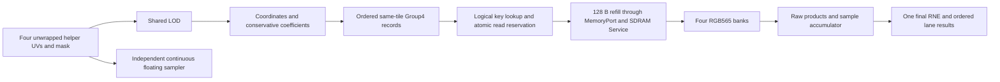

# Texture sampling oracle and counted model

## Current boundary

This component implements **oracle and counted** (steps 0 and 1).
`texture::ports` owns slot, quad, Group4 and precision configuration records;
`texture::sim::oracle` owns preparation, filtering, a functional cache and an
independent continuous reference. `texture::sim::counted` implements the frozen
UNORM9 datapath with independently replayable numerical ledgers. Timed, cycle
emulation, RTL, GPU dispatch integration and physical performance results remain
future work.

Refills reuse the existing GPU-owned `frontend::ports::MemoryPort` facade,
re-exported by texture. The existing generic test adapter connects it to the
vendor SDRAM `Service` from base commit
`fb472c98c5b4e9f32faac26929cea16534a21b74`, through a dev dependency only.
Each tile requests 128 aligned bytes and consumes sixteen actual little-endian
64-bit beats. The vendor service owns latency/load behavior; sampling introduces
no second memory interface or texture-specific latency fixture.

`Config::default()` preserves the historical precision-study candidate.
`Config::counted()` selects the frozen step-1 contract below. Ongoing timed
choices remain in the local GPU v2 texture specification and development process.

## Frozen counted contract

The single signal-format source is [`texture-formats.csv`](../spec/texture-formats.csv).
It contains width, binary point, rounding/range and arithmetic route. The build
script generates typed values, typed stores and ROM literals; no runtime `Fixed`
constructor or division is used. `format.rs` includes that generated source.
UV is captured as signed Q18 with magnitude <=2^20. After the capture, most
signals carry integer codes (CSV fraction zero): coordinates are Q8 codes,
LOD/bias are Q8 codes and coefficients/colors are separately interpreted UNORM
codes. Explicit slicing and scaling preserve those units.

| Boundary | Frozen behavior |
| --- | --- |
| Helper UV | RNE Q18; all four unwrapped edges and both components |
| LOD | 64x8 ROM; `k=RNE(64*(mantissa-1))`; k=64 carries into exponent |
| LOD bias | RNE Q8 at capture; clamp to +/-32 before capture is output-equivalent for this UV/size contract |
| LOD guards | slope >2 forces coarsest available mip; zero slope selects zero; bias then clamp otherwise |
| Mips | Single-layer floor LOD; trilinear linear mip + bilinear; mag is one bilinear layer |
| Coordinates | Floor Q8; n=0/1 both address a physical 2x2 footprint |
| Weights | Nine-bit UNORM 0..511; each pixel sums exactly to 511 |
| Group4 | Actual ordered groups; 72 bits; 32-row numerical scratch FIFO |
| Color | RAW565 replication; 9x8 raw products; 17-bit sums <=130305; one final exact nearest /511 |

`prepare` reads inputs/context through typed stores and derives derivatives,
LOD/index/exponent, mip parents, coordinates, taps, coefficients, first/last,
complete packed Group4 records and 32-bit tile addresses in a single closed
frame. Slot/material validity and allocation bounds are checked at the external
boundary. Mask, filter and all data-dependent arithmetic paths are audited.
The preparation writes each real packet to a 32x72 scratch store; the complete
two-mip repeat-seam test fills all 32 rows. This establishes a numerical capacity
bound for one quad, not FIFO admission/credit behavior across quads.

`sample` transfers the **verbatim finished packet words**, not oracle goldens or
host-reconstructed weights, into per-lane color frames. Atomic cache reads supply
external RAW565 words and the short reserved line identity. Each color frame
audits virtual +1 bank/local addresses, expansion, all twelve products per group,
partial sums, running accumulators and final RGB. The functional adapter still
owns tag/PLRU/replacement/refill state; those controller operations are not in
the arithmetic ledger. Its real 128-byte MemoryPort transactions, beat counts
and warm/prefetch hits are separately tested against the existing SDRAM service.

Implemented reductions:

- LOD, mip parents/lambda, layer size, coordinate shift, tile stride and prefix
  are prepared once per quad. Layer prefix ROM reads are not repeated per group.
- Full-parent row split is `2*fv-(fv!=0)`, leaving two column products per pixel.
  General fractional trilinear requires two row and four column products.
- `lambda=2*f-(f>128)` exactly replaces the 511-by-fraction multiply/RNE.
- Coarse Q8 coordinates use signed `(fine_Q-128)>>1` when fine n>=2; n=1 to 0
  reuses Q. Integer/fraction extraction and constant right shifts use bit slices.
- Final normalization uses `h=N>>9`, an eight-bit carry from `h+N[7:0]`, and
  `increment=N[8] OR carry`; output is `h+increment`. No reciprocal/divider is
  needed. Exhaustive closed-frame audit covers all 130306 valid accumulator codes.

### Counted evidence and limits

`texture_counted` compares every published stage against independently executed
oracle goldens: 2112 mixed preparation cases, 1728 LOD-grid/tie stimuli, bias
boundaries, a full 32-group seam, 336 sampling cases and exhaustive normalization.
Sizes 0..10, full/missing mip chains, all filters/masks, helper-only gradients,
negative UV, UV endpoints, overflow and maximum slot/quad IDs are covered.
Tamper tests remove a DSP count or change an output and require audit rejection.
The 1024 nearest endpoint exposed an insufficient wrap temporary: both mux
inputs exist and 1024+1024 needs 13 signed bits. `WrapWork` now records that guard;
the narrower 12-bit integer coordinate remains valid.

The bounded probe audits 128 quads per profile. With optional existing photo
assets, all ten profiles total 1280 quads. The following are measured work counts,
not resource instances or cycles:

| Profile | Pixels | Groups/pixel | Coefficient products/pixel | Color products/pixel |
| --- | ---: | ---: | ---: | ---: |
| Bilinear / integer LOD | 512 | 1.265625 | 2 | 15.1875 |
| Fractional LOD | 512 | 2.529297 | 6 | 30.351563 |
| Affine mixed LOD | 512 | 2.203125 | 5 | 26.4375 |
| Perspective with mixed masks | 269 | 1.583643 | 3.011152 | 19.003717 |
| Two-mip repeat seam | 512 | 8 | 6 | 96 |

Every group writes/reads 72 payload bits, reads 64 RAW565 bits and issues twelve
9x8 color products, including zero-weight slots. The seam batch performs only
eight cold refills yet 4096 group reads: color work can dominate even with hot
cache data. The four 512-square natural-photo subsets use the same affine
coordinates and produce 1128 groups/512 pixels each. Max/mean RGB-code errors
against the continuous reference are Peppers 1.058388/0.225828, Mandrill
1.077418/0.252385, Sailboat 1.462432/0.241775 and Airplane 0.938736/0.210665.
These are bounded subset results with the new LOD algorithm, not replacements
for the larger historical photo study below.

The generic framework lowers each logical 9x8 product to one Native18/DSP18
operation; the ledger does **not** certify a small Logic multiplier or its area.
Equality tests expand into audited comparisons/adds, and nonoverlapping packet
packing/bank concatenation currently uses counted add operations. Physical
logic/wiring certificates must handle those graphs before sizing ALUs; primitive
operation counts must not be interpreted as dedicated physical adder counts.
There is no schedule, throughput claim, FPGA synthesis or PnR result here.

```powershell
& scripts/run-cargo.ps1 -Subcommand test -Label texture-counted -CargoArgs @('-p','gpu-v2','--lib','--test','texture_counted','--test','texture','--test','texture_sdram')
& scripts/run-cargo.ps1 -Subcommand run -Label texture-counted-probe -CargoArgs @('-p','gpu-v2','--example','texture_counted_probe','--','target/gpu-v2-texture-counted','target/gpu-v2-texture-photos/assets')
```

Omit the second probe path for six synthetic profiles without downloaded assets.
It exports `summary.csv`, `operations.csv` and first-case stage goldens. Relevant
tests and strict component clippy pass; only the pre-existing Windows linker
stdout diagnostic remains. No whole-repository checks were run for this step.
Work stops here for discussion. Timed must execute the 32-entry queue, optional
prefetch, FILLING merge, demand recheck/reservation, READY hits during refill,
CE/backpressure and fault/drain behavior before concurrency can be claimed.



## Executable behavior

- Up to sixteen slots: aligned base, full-mip flag, size exponent 0..10 and
  validity. Invalid slots, overflowing 32-bit allocations, material/slot size
  disagreement and invalid tile keys are errors. Memory additionally checks
  fitted physical capacity. Mips are small to large, tiles and texels row major.
  Layer prefixes use a fixed lookup.
- For n<3, the asset must supply periodic 8x8 RAW565 payloads. Logical n=0 uses
  a virtual 2x2 footprint of equal values; missing padding is never invented.
- Quad UV is signed, unwrapped and row-major. All four horizontal/vertical edge
  differences participate in max-norm LOD, matching the triangle oracle. The
  mask selects output lanes only. Helper derivatives precede periodic wrapping.
- Filtered coordinates use `u*a-0.5`; nearest uses `floor(u*a)`. Negative UV,
  repeat seams and smallest-mip saturation are supported. Nearest texel and
  single-mip selection are separate policies. Missing mip chains use base only.
- Bilinear splits row then column with floor and conserved total; trilinear
  splits mip parents first and folds their weights into eight taps. Total weight
  is exactly the configured scale (`2^F` or `2^B-1`). There is no final two-mip lerp.
- Group4 retains four tap positions and zeroes other tiles' coefficients.
  Zero-only groups are omitted before rebuilding first/last. Groups are
  contiguous per sample, in first-tap order within a mip, finer mip first.
  The checked baseline 72-bit packing is for inspection, not an external ABI.
- Bank is `{y[0] XOR x[1],x[0]}`; local index is `{y[2:0],x[2]}`. Virtual +1
  coordinates precede bank selection, including small mips and tile crossings.
- RGB565 expands by bit replication to UNORM8. Raw products accumulate across
  every group; only the final sum is divided with ties-to-even. Baseline weight
  sum 256 bounds each accumulator to 65280. Higher-precision experiments use
  unrestricted host integers. Each covered lane produces one result.

## Precision controls and stage goldens

| Control | Default candidate | Experiment range |
| --- | --- | --- |
| Input UV quantization | RNE, 17 fractional bits | None, or 0..30 bits |
| Coordinate fraction | Floor, 8 bits | 1..16 bits |
| Coefficient unit | 256, 8 fractional bits | Binary 2^F or UNORM 2^B-1, 1..16 bits |
| LOD output | RNE, 8 fractional bits | 1..16 bits |
| Log2 method | 64x8 table, floor mantissa index | Exact CPU log2 or table |
| Single-mip selection | Nearest, half selects coarser | Floor or nearest |
| Derivative range | Difference magnitude <=2 | Positive finite limit |

Host inputs must be finite with absolute UV <=2^20. Finite derivatives beyond
the configured limit force coarsest available LOD regardless of bias; zero
derivatives select LOD zero. Otherwise bias precedes clamp. Table entries are
oracle-generated `RNE(log2(1+i/64)*256)`. The counted implementation owns
the selected immutable 64x8 table. Its nearest-grid indexing and frozen derivative
limit/single-mip policies are specified below; physical placement remains timed work.

`PreparedQuad` records UV, helper differences, rho, overflow, exponent/table
index, ideal/selected/raw LOD, mip parents, coordinate floors/fractions, taps,
coefficients and Group4 records. `Output` adds raw texels, expanded channels,
partial sums, post-add accumulator, RGB and cache events. These are stage goldens
for future comparison, never imported into audited arithmetic.

The independent `reference` uses continuous UV, exact log2 and standard floating
bilinear/trilinear weights. It reads linear payloads and independently derives
mip offsets, addresses and color expansion. It does not reuse bank addressing,
Group4, conservative splits or quantized LOD. The shared assumptions are the
RAW565 asset contract and max-norm LOD convention.

## Functional cache and memory boundary

Sixteen sets/four ways, four 1024x16 banks and tree-PLRU are modeled functionally.
Lookups use `{slot,n,tile_x,tile_y}`; prepared groups own no physical way.
Invalid ways precede PLRU replacement. Accepted demand hits, consumed prefetch
hits and complete refills touch PLRU. Rebind invalidates state at a synchronous
call boundary; stale tags and replacement bits need no reset.

Cache operations are serial host transactions: allocate FILLING, receive sixteen
beats, write banks, then publish READY. Group taps are captured before another
allocation, providing functional short read protection. The returned host Vec
is an unconstrained oracle sink, not a hardware buffer proposal. Service faults
are terminal: retain FILLING, publish no result and prohibit allocation/rebind.
Drain or recreate the service before starting a new cache; a watchdog must not
silently cancel an accepted refill or recycle its destination.

`prefetch` consumes an explicit optional hint atomically. Later demand rechecks
its logical key after eviction/invalidation. Hint FIFO/drop, dual tag reads,
same-cycle commit/touch ordering, FILLING merge, descriptor capacity/promotion,
CE/backpressure and hardware sink credits are future timed/emu work. Atomic
oracle calls do not certify those concurrent behaviors or predict cycle counts.

## Validation and reproduction

Bounded tests cover all 65536 bilinear fraction pairs; trilinear endpoints;
one/two/four/eight groups; seams; periodic small mips; all 64 bank/refill words;
constant colors; final-round ties and per-group-rounding failure; mip saturation;
missing mip chains; masked helper LOD; table error; input faults; PLRU/prefetch/
rebind; truncated payloads and service watchdogs. Independent float comparison
uses 256 deterministic quads. Both debug and release profiles are checked.

SDRAM integration compares one independent asset under calibrated average
service, Solo/Display/CPU/Both load and both unchained/chained policies. It checks
every returned word, sixteen beats before READY, completion counts, no new
traffic after warming, and unchanged backing data. This is Rust service evidence.

```powershell
& scripts/run-cargo.ps1 -Subcommand test -Label texture-oracle -CargoArgs @('-p','gpu-v2','--test','texture','--test','texture_sdram')
& scripts/run-cargo.ps1 -Subcommand run -Label texture-probe -CargoArgs @('-p','gpu-v2','--example','texture_oracle_probe','--','target/gpu-v2-texture')
```

The probe scans twenty configurations across 216 bounded pressure/random quads
(2592 output channels). An optional second argument selects size_log2 9 or 10
(512x512 or the default 1024x1024). Coordinates and helper gradients specified in
texels scale with that size; the deterministic random seed is unchanged. The
stress asset generates each mip independently, so size comparisons change the
source colors and are not comparisons of one downsampled photograph.

`precision.csv` reports max/mean RGB code error and LOD error against continuous
input; `stages.csv` exports named baseline goldens. `worst.csv` identifies each
configuration's maximum by case, lane and channel; `worst_taps.csv` exports its
ideal/actual tap colors and weights; `worst-detail.txt` contains the full stage
trace. `fixed_case.csv` compares configurations at the baseline's fixed maximum
input, avoiding attribution from aggregate maxima whose locations can change.
Reports stay in the requested worktree `target/` directory, not version control.
The mip-varying asset stresses filtering: these are sampled errors, not exhaustive
image-quality bounds. Increasing one precision can move conservative split
boundaries and need not monotonically reduce worst-case error.

Nine-bit coefficient experiments retain the default UV, coordinate and LOD
settings unless the configuration name says otherwise. UNORM9 has 512 values
including zero and unity, uses denominator 511, and conserves a total of 511.
`coefficient_fraction` selects its storage width B when the encoding is UNORM.
It fits the four existing nine-bit coefficient fields in `pack72`. The binary
alternative has 512 nonzero values plus zero and denominator 512. Its
`pack76_zero_mask` stores 1..511 directly, unity as code zero, and four extra zero
mask bits distinguish zero from unity. `zero_mask9` and `coefficient9` have the
same numerical result; the former names the tested storage alternative. The
functional cache consumes decoded weights. Neither encoding changes the default
configuration or freezes a counted/RTL ABI. UNORM final normalization uses RNE
division by 511; the binary alternative uses RNE division by 512.

Tests exhaust all 65536 bilinear coordinate fraction pairs for both new scales,
check trilinear conservation across the LOD fraction range, preserve black,
white and primary-color assets exactly, and distinguish all 513 binary weights
through the 76-bit packing. Exported ideal/actual tap contributions reconstruct
the independent reference and oracle accumulator, respectively.

```powershell
& scripts/run-cargo.ps1 -Subcommand run -Label texture-error-1024 -CargoArgs @('-p','gpu-v2','--example','texture_oracle_probe','--','target/gpu-v2-texture-error-study/1024','10')
& scripts/run-cargo.ps1 -Subcommand run -Label texture-error-512 -CargoArgs @('-p','gpu-v2','--example','texture_oracle_probe','--','target/gpu-v2-texture-error-study/512','9')
```

See [SDRAM integration](sdram-memory-controller.md) for service ownership and
assumptions. Discuss precision/LOD policy and implementation details before
starting counted work.

### Natural-photo study

The offline photo tools use four original 512x512 RGB photographs from the
[USC-SIPI miscellaneous collection](https://sipi.usc.edu/database/database.php?volume=misc):
Peppers (4.2.07), Mandrill (4.2.03), Sailboat (4.2.06), and Airplane (4.2.05).
Downloaded TIFFs, source URLs/hashes, generated assets and reports remain under
`target/gpu-v2-texture-photos`. No external images are checked in.

`texture_photo_assets.py` builds coherent mips by recursive RGB8 code-space BOX
downsampling, then quantizes each layer to nearest RAW565 values. Small layers
are padded periodically. Pillow/NumPy versions and asset hashes are recorded in
`assets/manifest.json`. Both the Rust float reference and quantized sampler read
the same asset; reported differences measure sampler precision rather than
RGB565 encoding loss relative to the source photograph.

The bounded Rust probe uses UV18, eight coordinate fractional bits and the
unchanged floor-indexed LOD table, comparing baseline /256, UNORM9 /511, and
binary9 with zero mask /512. Each photo has 183272 quads / 733081 active pixels:
seven full-image scales (640, 400, 256, 160, 80, 20 and 3 pixels per side) plus
16384 deterministic random affine quads spanning magnification and fractional
LOD minification. Repeat-border footprints are reported separately from image
interiors in `precision.csv`; `summary.csv` combines both scopes. Full-size PPM
renders, maximum sample traces and unamplified comparison figures are retained.

The Python report independently decodes all 1398784 RAW565 asset words, compares
2670180 rendered reference pixels with a planar-mip float sampler and replays
all 24 scope/configuration maxima from the original helper UVs. Maximum float
reference disagreement is zero at those samples. Twelve rendered channel codes
differ by one only at floating-point half-code rounding boundaries (distance
from the halfway value <1e-8). `independent-check.json` records these checks.

Observed maximum / mean RGB8 code errors, including repeat-border samples:

| Photo | Baseline /256 | UNORM9 /511 | Zero mask /512 |
| --- | --- | --- | --- |
| Peppers | 3.374 / 0.241 | 2.468 / 0.235 | 2.468 / 0.234 |
| Mandrill | 2.848 / 0.272 | 1.977 / 0.261 | 1.977 / 0.258 |
| Sailboat | 3.438 / 0.249 | 2.402 / 0.239 | 2.348 / 0.238 |
| Airplane | 3.375 / 0.200 | 2.518 / 0.195 | 2.518 / 0.194 |

For both nine-bit alternatives the largest measured error is Airplane case
179835/lane2, at UV (0.6726631784860123, 0.4248005344153869), with reference RGB
(89.51257753621461, 76.51823864168183, 118.26701445680673) and output (87,74,117).
Ideal LOD is 4.0432075410609905 and table LOD is 4.0234375. These are sampled
errors for this corpus, not an exhaustive image-quality bound. The study does
not measure concurrent cache behavior or advance counted/timed implementation.

```powershell
python ip/gpu-v2/examples/texture_photo_assets.py target/gpu-v2-texture-photos/assets
& scripts/run-cargo.ps1 -Subcommand run -Label texture-photos -CargoArgs @('-p','gpu-v2','--example','texture_photo_probe','--','target/gpu-v2-texture-photos')
python ip/gpu-v2/examples/texture_photo_report.py target/gpu-v2-texture-photos
```

### Arithmetic choice and sharing opportunities

The accepted target coefficient encoding is UNORM9. This is a Logic estimate,
not a synthesis result: it keeps the Group4 width at 72 bits (36 RAM16SDP4 cells
for 32 entries, versus 38 for a 76-bit zero-mask representation), represents
unity directly in nine bits, and needs no zero/unity mask decode. Accumulators
need 17 bits for a conserved bound of 255*511=130305. Division by 511 is not a
general divider: exact nearest rounding over that bound is

```text
h = N >> 9; l = N & 511
RGB8 = h + (h + l >= 256)
increment = l[8] OR carry8(h + l[7:0])
```

Since `N=511*h+(h+l)` and `h+l<=764`, `(h+l+255)/511` is either zero or one,
with threshold 256. The implementation needs a small carry calculation and an
eight-bit increment per channel. The final target format remains distinct from
the historical /256 default used by regression tests; UNORM9 studies explicitly
select the accepted encoding. Hardware formats/scheduling remain unimplemented.

`prepare` now computes level, two mip identities, lambda and parent weights once
per quad, outside the lane loop. UV quantization, all eight helper differences
and LOD were already shared. Pixel coordinates and coefficients remain separate.
For eight-bit LOD fraction f, `RNE(511*f/256)=2*f-(f>128)`; a full-parent split
uses `floor(511*f/256)=2*f-(f!=0)`. Both eliminate generic multiplication.
Coordinate size scaling and wrapping are bit operations in a fixed-point target.
If Q is a fine-mip filtered coordinate floored to eight fractional bits, the next
mip coordinate is exactly `floor((Q-128)/2)` for n>=2. For n=1 to n=0 both physical
addressing dimensions are two, so Q is reused unchanged. Negative values require
an arithmetic shift with adequate signed width before wrapping.

The diagnostic work module observes oracle goldens and reports structural
opportunities. **It is not the staged counted model, a schedule, or a performance
measurement.** It counts actual groups/nonzero coefficients and unique integer
multiply operands, tile keys and texels within each quad. Unique products are an
optimistic bound requiring additional comparison/storage; they are not free.
Color datapath slots count twelve per Group4 regardless of zero coefficients.

The photo probe writes `<photo>-work.csv`. Geometry determines these counts, so
all four photos give identical work profiles for the same sample inputs.
`texture_work_probe` additionally observes 32768 bounded synthetic perspective
helper quads, with w gradients of 2% or 30% and mixed masks. All four helper UVs
are evaluated from affine homogeneous numerator/w fields; the study does not
assume perspective UV is itself affine.

| Scenario | Generic coefficient multiplies/pixel after simple reductions | With perfect quad operand reuse | Reusable fraction | Groups/pixel |
| --- | ---: | ---: | ---: | ---: |
| Axis-aligned 256-pixel image, integer LOD | 2.0000 | 0.5000 | 75.00% | 1.2656 |
| Axis-aligned 400-pixel image, fractional LOD | 6.0000 | 4.9968 | 16.72% | 2.5072 |
| Random affine quad | 5.4235 | 5.4015 | 0.406% | 2.1893 |
| Mild perspective quad | 5.7971 | 5.7731 | 0.414% | 2.3141 |
| Strong perspective quad | 5.8677 | 5.8383 | 0.502% | 2.2254 |

General bilinear preparation needs two column multiplies; general trilinear
needs six split multiplies. Color work is up to 12/24 nonzero tap-channel
products per pixel; splitting into Group4 consumes more physical product slots.
The 400-pixel scene uses 30.0864 slots/pixel, of which 23.6532 are nonzero
(78.62%). Zero slots do not by themselves justify reducing the physical twelve
color multipliers or reducing the three coefficient multipliers needed for the
two-phase trilinear preparation target.

Prioritize unconditional quad scalar sharing, exact strength reductions,
zero-parent omission and existing bounded prefetch deduplication. In the
400-pixel scene, Group4 keys fall from 401152 references to 123072 distinct
quad keys, a potential 69.32% hint reduction. Perspective scenes show potential
59.75%/61.14% reductions. These unique-key bounds do not prove a three-entry
recent-key filter captures every duplicate. Demand must still recheck the
logical key at consumption; an old physical way cannot be held across eviction.

Do not add general coefficient memoization: perspective cases save only about
half a percent before paying for that state. Texel gathering can also reuse
38.5%/42.9% of nonzero references in the perspective cases, but needs buffering,
bank arbitration and read protection while per-lane color products remain. A
lower read count therefore does not establish a throughput improvement.

The n=0 layer is a separate optional opportunity guaranteed by the asset
contract: constant-only sampling can forward its color, and its weighted partial
in a two-layer sample can be computed once per quad. It occurs in 2843/3419
pixels of the two perspective sets (about 6.1%/7.4%), so any future bypass must
account for context lifetime, Group4 ordering and first/last across the FIFO.
Other small mips are not constant. No gather/memo/bypass architecture is added.

The work examples exhaust all 130306 valid accumulator values, all 256 LOD and
full-parent fractions, and 262145 signed coordinate stimuli to check the exact
strength reductions independently. Texture/SDRAM regression remains unchanged.

```powershell
& scripts/run-cargo.ps1 -Subcommand run -Label texture-work -CargoArgs @('-p','gpu-v2','--example','texture_work_probe','--','target/gpu-v2-texture-work')
```

Validation on this branch: GPU v2 release regression, texture debug tests,
strict workspace clippy, layering/source hygiene and required CPU/core/system
co-simulations passed. Full workspace testing stops at the unchanged legacy
GPU-display boot test, which expects an accepted command from the retired GPU.
The two Gowin reference documents missing from the initial worktree have been
restored from the main checkout and indexed in the vendor document README.
Subsequent validation is limited to the requested component and changed files;
the earlier quick validation aggregate cannot be reported as passing.
