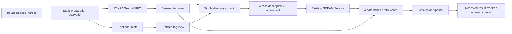
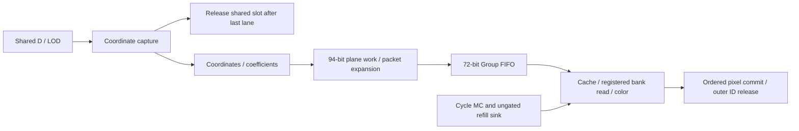
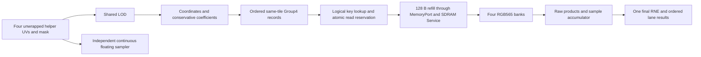

# Texture sampling models

## Source and qualification boundaries

The long-calendar preparation contracts below describe the `e583cfa` source
baseline. The later published-quad foundation is committed on the development
line at `a0fe042`. Sampling optimization checkpoints through `dad5328` are on
`dev/gpu-soft-ff-20261008`; they have not been integrated into this
development checkout. File presence does not establish integration.

The selected `dad5328` RTL uses a three-edge shared-axis D, four-edge grouped
LOD, two-edge legal-domain Coordinate, explicit two-row coefficient weight FFs,
borrowed Member/Packet outputs and fused Color tap sums. Its independent generic
emulators remain numerical references where the physical architecture differs.
The qualified configuration has16 material slots. Source hashes, complete serial
sampler resource/timing reports and committed identity are recorded in that
worktree's `target/sampling-list-20261009/{review,commit}.json`.

That fitted serial composition includes texture cache/refill and Color; it
excludes outer Quad and the complete overlapping Runtime controller. The
non-seam warm two-mip II2 receipt belongs to Runtime emulation, not the serial
controller or whole-GPU fit. Complete Runtime hardware, shared-MC performance,
integrated GPU area/timing and board operation still require their own proof.

## Selected render precision

The physical oracle/count/timed/emu/RTL preparation boundary uses unwrapped
S(18,16) UV (eight components per quad), with one RNE at raster/admission.
`capture_uv` preserves UV=1 as raw65536 until derivative calculation; only
afterwards does repeat wrap keep the low16 bits. Exact signed differences are
nineteen-bit integer codes at the same F16 scale, with eighteen-bit magnitudes.
The coordinate shift is `physical_size_log2 - 8`, preserving Q8 texel coordinates
and the existing UNORM9/511 filtering coefficients.

`force_coarsest` is captured per quad and survives the dispatcher, held offers
and actual serial RTL input. An uncovered helper outside the representable
domain uses a benign placeholder and forces the coarsest available mip, even
with negative bias or zero ordinary derivative. The D-to-LOD seam encodes that
flag as slope131073, strictly above the raw131072 derivative-limit threshold.
This is an explicit fallback, not a clamped or wrapped normal derivative.
Covered out-of-range UV is rejected. With no mip chain, the only available base
layer remains selected. Ideal and legacy oracle precision configurations remain
available; `Config::counted()` selects this physical contract.

The packed register calendar is regenerated for the new formats. D/LOD/coordinate
numeric banks are858/264/716 bits, spans17/28/9, and II8/8/2 respectively.
The serial controller data bank is600 bits. These are checked allocation counts,
not fitted Logic, FF or BSRAM results. Historical timing/PnR evidence below
predates this migration and does not validate the current RTL's frequency.

## Current boundary

This component implements oracle, counted and a bounded timed baseline.
`texture::ports` owns slot, quad, Group4 and precision configuration records;
`texture::sim::oracle` owns preparation, filtering, a functional cache and an
independent continuous reference. `texture::sim::counted` implements the frozen
UNORM9 datapath with independently replayable numerical ledgers.
`texture::sim::timed` executes the bounded cache/color controller. It supports
the historical static preparation baseline and checked input from
`staged::bound`: universal periodic stage calendars with finite credits,
registered boundaries and optional early shared-context release. Most independent
preparation has now also been implemented as independent registered kernels.
The conservative `PreparationEmu`/`SamplerEmu` path below complements the richer
Runtime; it does not replace its earlier performance evidence. Actual leaf RTL
and the composed preparation/cache/color whole-sampler RTL are qualified with
bounded differential tests. Fitted performance and live DRAW/board integration
remain open.
`texture::emu::color` executes the captured-texel color pipeline.
An optional concrete periodic FF-slice layout checks bit ownership at every
actual read edge; the dedicated allocation remains the default reference.

Refills reuse the existing GPU-owned `frontend::ports::MemoryPort` facade,
re-exported by texture. The existing generic test adapter connects it to the
vendor SDRAM `Service` from base commit
`fb472c98c5b4e9f32faac26929cea16534a21b74`, through a dev dependency only.
Each tile requests 128 aligned bytes and consumes sixteen actual little-endian
64-bit beats. Timed uses the GPU-owned `RefillPort` cycle projection of that
same service's submit/step/events. The composition adapter forwards directly;
the vendor service owns all latency/load behavior. There is no texture-specific
memory timing model or production vendor dependency. The bound-stage acceptance
fixture uses the actual `emu::service::Memory`, `Config::default()` serial MC
at source `358a4e9` (local dependency cherry-pick `f6b61ec`). Early grant and
512-byte groups stay disabled; each texture request is still one 128-byte tile.

`Config::default()` preserves the historical precision-study candidate.
`Config::counted()` selects the frozen step-1 contract below. Ongoing timed
targets remain in the local GPU v2 texture specification and development process.

## Independent register-only sampler

`sim::staged::bound::serial::PreparationEmu` accepts raw S(18,16) helper UVs,
Q8 bias and a bounded header. Its stepping path runs actual derivative, LOD,
coordinate, coefficient, membership and packet register kernels. It does not
admit a counted `Program`, execute an oracle, retain a numerical template or
schedule already computed answers. Closed counted goldens remain independent
test references. One quad is serialized deliberately; leaf II is not quad II.

| Step | Actual computation and retained boundary | Timing boundary |
| --- | --- | --- |
| Derivative | Eight signed edge differences; magnitudes/maximum, overflow guard and header | 17 enabled edges, kernel II8 |
| LOD | Guarded CLZ/normalization, Table64 lookup/RNE, bias/clamp, fine/coarse level and parent weights | 28-edge calendar |
| Coordinate | Per covered lane, signed floor/wrap Q8 coordinates and coarse half transform | 9 enabled edges, kernel II2 |
| Coefficient | Exact UNORM9 row/column weights; up to two retained 171-bit rows | 12 enabled edges, kernel II2 |
| Membership | Local 2x2 tap grouping at repeat/tile seams; first/last group identity | 7-edge default, 5-edge short configuration |
| Packet | Canonical key/local/weights/first/last/quad/lane into one held 72-bit word | 9-edge default, 3-edge short configuration |
| Demand cache | Literal slot/level address, tag/PLRU lookup, address/config FF stage, synchronous four-bank tap capture | Hit read captures on the enabled edge after address issue; miss waits for actual beats and terminal ACK |
| Color | RAW565 expansion, twelve 9x8 products in three registered ages, pair/partial/feedback sums, exact nearest /511 | Eight enabled edges from group acceptance; only last group emits a pixel |

The serial controller adds 600 data and 11 control bits, including a 171-bit
operand/result overlay. `SamplerEmu` connects the held packet to
`emu::cache::CacheEmu` and then `ColorEmu`, using pre-edge ready/valid throughout.
It retains one quad result bank: RGB96, quad4, mask4, done4 and two control bits.
One completed quad holds under CE/backpressure; its transfer does not fund
same-edge admission. Zero coverage runs no numerical/cache work.

The demand cache has 64 lines in 16 four-way sets, 3-bit tree-PLRU per set,
four synchronous 1024x16 banks, one 72-bit demand head, one captured result,
one read-address/config stage and one miss descriptor. No prefetch or hints are
implemented in this independent baseline. `cache::Allocation` is its exact
logical inventory; slot validity is a billed ROM bit, and read ownership pins
the line. A hit is visible only from old READY tags. ACK cannot fund same-edge
read issue; read capture cannot fund same-edge address issue. An old output
transfer can free the later result capture slot.

Each miss presents one aligned 128B request and consumes sixteen indexed 64-bit
beats plus an independent terminal ACK. Same-edge accept/first beat and
last-beat/ACK are supported. Delayed ACK without a beat is supported; last beat
alone never publishes. Memory maintenance runs on wall time under CE0 and
fault. Fault invalidates compute and FILLING publication, retains an already
presented request and drains to terminal. A malformed beat sharing a terminal
still consumes that terminal. Recovery requires recreation, not edge replay.

`emu::refill_bridge::RefillBridge` adapts the existing single-parent `RefillPort`
to this cache. Facade credit reservation is acceptance at this boundary;
physical Started/beat/terminal events remain distinct. It polls without clocking
the physical MC. The framebuffer owner advances the shared Combination once
after Sampling has polled. See [pixel-system.md](pixel-system.md).

`serial::Config` keeps both optimizations off by default. `nearest_bypass` skips
coefficient execution only for effective nearest filtering and supplies exact
511/zero parent rows through the same 171-bit boundary. `short_alignment` removes
unused Membership/Packet alignment tails without merging arithmetic stages.
It saves 616 data plus eight valid bits. On the checked four-covered-pixel
fixture, preparation drains at 220/171/188/139 enabled edges for baseline,
nearest-only, short-only and both respectively; trilinear short alignment changes
299 to 235. These are fixture preparation spans, not memory-inclusive latency,
sustained throughput or FPGA area. No multiplier/resource instance is removed
by the runtime nearest bypass.

The independent `texture_sampler_emu` optimization matrix also measures the
whole registered composition. Twenty repeated full-mask quads include negative/
repeat seams, a nonzero derivative, and (for trilinear) a half-level bias. The
fixture accepts one request/beat per wall edge, delays ACK by three, and uses
CE/output-ready continuously. All four configurations return identical oracle
pixels and leave asset/guards unchanged. The final hot window is actually steady:

| Filter | Default hot edges/quad | Nearest bypass | Short tails | Both |
| --- | ---: | ---: | ---: | ---: |
| Nearest | 240 | 184 | 208 | 152 |
| Bilinear | 296 | 296 | 232 | 232 |
| Trilinear | 504 | 504 | 336 | 336 |

These are one-quad serial-controller fixture intervals, not the periodic Runtime
or a shared-MC bandwidth result. Reproduce with `texture_sampler_emu`; exact
cold-return edges, requests and group counts are generated in
`target/gpu-overnight-20261006/sampler-optimization-matrix.csv` at repository root.
Removing unused alignment ages helps every seam group; skipping coefficients
helps only effective nearest. Neither optimization widens a shared input mux or
changes arithmetic rounding. The next throughput frontier is overlapping real
quad/lane ownership across the existing kernels; arithmetic latency and scalar
controller waits must be separated before choosing more DSPs. The richer
periodic Runtime remains the comparison point rather than being deleted.

`rtl::sampler::{build_with_config,verilog_with_config}` composes the same
preparation, cache and Color leaves without duplicating numerical code. The
default factory remains configuration-identical. Its result bank is108 data
plus two control bits. Raw header slot/max_n/has_mip must correspond to the
immutable slot table: use `derivative::Input::capture` or the checked common
context adapter. The wrapper does not add another slot ROM or a second raw-header
lookup port. Every whole-RTL configuration is checked edge by edge against
`SamplerEmu`, including actual refill bytes, branch accepts and held outputs.

`texture_sampler_emu` checks 48 sequential quads across all filters, masks,
negative UV/repeat/mips, CE and request/result backpressure against independent
counted-contract oracle pixels. `texture_cache_actual{,_rtl}` checks separate
and same-edge ACKs, seams/PLRU/levels, port stalls, abort and numbered beats;
Icarus compares actual RTL and registers on every edge. Actual numerical leaf
RTL is separately covered by `texture_{calendar,coefficient,color,
serial_preparation}_rtl` integration tests and the private `runtime_rtl::tests`
Membership/Packet co-simulations. Arithmetic RTL currently lowers explicit
expressions/registers; no shared-DSP mux binding, Gowin fit, fmax or board proof
is inferred from these declarations. Earlier Runtime experiments below retain
their original, narrower qualification boundaries.
`texture_sampler_rtl` also exercises all filters/material levels0/1/3/6/10,
missing mips, masks, negative UV, CE/result/request stalls, both ACK seam timings,
more than64 cache lines and identity reuse. The whole wrapper has no external
abort port yet; cache fault/drain is independently qualified and Rust composition
exposes explicit abort/drain. Do not treat wrapper fault wiring as a tested
external cancellation command.

The Sampling schedule page `/web/sampling-schedule.html` reads the IP's certified
leaf calendars through `/schedule-ws` (`profile: "sampling"`). It also runs the
project's actual preparation emulator to export all four optimization state
traces, plus a two-quad cache/refill/color composition trace from `SamplerEmu`.
Its memory fixture is explicitly identified; it is not an averaged MC model.
State traces disable periodic-repeat display: their measured quad span does not
certify a universal initiation interval. Browser code contains no copied model
arithmetic; leaf packing inventories and actual implementation declarations are
identified separately.

## Frozen counted contract

The single signal-format source is [`texture-formats.csv`](../spec/texture-formats.csv).
It contains width, binary point, rounding/range and arithmetic route. The build
script generates typed values, typed stores and ROM literals; no runtime `Fixed`
constructor or division is used. `format.rs` includes that generated source.
UV is captured as unwrapped S(18,16), with explicit helper fallback. After the capture, most
signals carry integer codes (CSV fraction zero): coordinates are Q8 codes,
LOD/bias are Q8 codes and coefficients/colors are separately interpreted UNORM
codes. Explicit slicing and scaling preserve those units.

| Boundary | Frozen behavior |
| --- | --- |
| Helper UV | RNE S(18,16); all four unwrapped edges and both components |
| LOD | 64x8 ROM; `k=RNE(64*(mantissa-1))`; k=64 carries into exponent |
| LOD bias | RNE Q8 at capture; clamp to +/-32 before capture is output-equivalent for this UV/size contract |
| LOD guards | slope >2 forces coarsest available mip; zero slope selects zero; bias then clamp otherwise |
| Mips | Single-layer floor LOD; trilinear linear mip + bilinear; mag is one bilinear layer |
| Coordinates | Floor Q8; n=0/1 both address a physical 2x2 footprint |
| Weights | Nine-bit UNORM 0..511; each pixel sums exactly to 511 |
| Group4 | Actual ordered groups; 72 bits; 32-row numerical scratch FIFO |
| Color | RAW565 replication; 9x8 raw products; 17-bit sums <=130305; one final exact nearest /511 |

`prepare` reads inputs/context through typed stores and derives derivatives,
LOD/index/exponent, mip parents, coordinates, taps, coefficients, first/last,
complete packed Group4 records and 32-bit tile addresses in a single closed
frame. Slot/material validity and allocation bounds are checked at the external
boundary. Mask, filter and all data-dependent arithmetic paths are audited.
The preparation writes each real packet to a 32x72 scratch store; the complete
two-mip repeat-seam test fills all 32 rows. This establishes a numerical capacity
bound for one quad, not FIFO admission/credit behavior across quads.

`sample` transfers the **verbatim finished packet words**, not oracle goldens or
host-reconstructed weights, into per-lane color frames. Atomic cache reads supply
external RAW565 words and the short reserved line identity. Each color frame
audits virtual +1 bank/local addresses, expansion, all twelve products per group,
partial sums, running accumulators and final RGB. The functional adapter still
owns tag/PLRU/replacement/refill state; those controller operations are not in
the arithmetic ledger. Its real 128-byte MemoryPort transactions, beat counts
and warm/prefetch hits are separately tested against the existing SDRAM service.

Implemented reductions:

- LOD, mip parents/lambda, layer size, coordinate shift, tile stride and prefix
  are prepared once per quad. Layer prefix ROM reads are not repeated per group.
- Full-parent row split is `2*fv-(fv!=0)`, leaving two column products per pixel.
  General fractional trilinear requires two row and four column products.
- `lambda=2*f-(f>128)` exactly replaces the 511-by-fraction multiply/RNE.
- Coarse Q8 coordinates use signed `(fine_Q-128)>>1` when fine n>=2; n=1 to 0
  reuses Q. Integer/fraction extraction and constant right shifts use bit slices.
- Final normalization uses `h=N>>9`, an eight-bit carry from `h+N[7:0]`, and
  `increment=N[8] OR carry`; output is `h+increment`. No reciprocal/divider is
  needed. Exhaustive closed-frame audit covers all 130306 valid accumulator codes.

### Counted evidence and limits

`texture_counted` compares every published stage against independently executed
oracle goldens: 2112 mixed preparation cases, 1728 LOD-grid/tie stimuli, bias
boundaries, a full 32-group seam, 336 sampling cases and exhaustive normalization.
Sizes 0..10, full/missing mip chains, all filters/masks, helper-only gradients,
negative UV, UV endpoints, overflow and maximum slot/quad IDs are covered.
Tamper tests remove a DSP count or change an output and require audit rejection.
The 1024 nearest endpoint exposed an insufficient wrap temporary: both mux
inputs exist and 1024+1024 needs 13 signed bits. `WrapWork` now records that guard;
the narrower 12-bit integer coordinate remains valid.

The bounded probe audits 128 quads per profile. With optional existing photo
assets, all ten profiles total 1280 quads. The following are measured work counts,
not resource instances or cycles:

| Profile | Pixels | Groups/pixel | Coefficient products/pixel | Color products/pixel |
| --- | ---: | ---: | ---: | ---: |
| Bilinear / integer LOD | 512 | 1.265625 | 2 | 15.1875 |
| Fractional LOD | 512 | 2.529297 | 6 | 30.351563 |
| Affine mixed LOD | 512 | 2.203125 | 5 | 26.4375 |
| Perspective with mixed masks | 269 | 1.583643 | 3.011152 | 19.003717 |
| Two-mip repeat seam | 512 | 8 | 6 | 96 |

Every group writes/reads 72 payload bits, reads 64 RAW565 bits and issues twelve
9x8 color products, including zero-weight slots. The seam batch performs only
eight cold refills yet 4096 group reads: color work can dominate even with hot
cache data. The four 512-square natural-photo subsets use the same affine
coordinates and produce 1128 groups/512 pixels each. Max/mean RGB-code errors
against the continuous reference are Peppers 1.058388/0.225828, Mandrill
1.077418/0.252385, Sailboat 1.462432/0.241775 and Airplane 0.938736/0.210665.
These are bounded subset results with the new LOD algorithm, not replacements
for the larger historical photo study below.

The generic framework lowers each logical 9x8 product to one Native18/DSP18
operation; the ledger does **not** certify a small Logic multiplier or its area.
Equality tests expand into audited comparisons/adds, and nonoverlapping packet
packing/bank concatenation currently uses counted add operations. Physical
logic/wiring certificates must handle those graphs before sizing ALUs; primitive
operation counts must not be interpreted as dedicated physical adder counts.
The staged companion now consumes structural wiring/equality certificates;
the original static reservation deliberately retains its conservative mapping.
This numerical work ledger does not establish a schedule or FPGA resource result.
The separately checked timed baseline is described below.

```powershell
& scripts/run-cargo.ps1 -Subcommand test -Label texture-counted -CargoArgs @('-p','gpu-v2','--lib','--test','texture_counted','--test','texture','--test','texture_sdram')
& scripts/run-cargo.ps1 -Subcommand run -Label texture-counted-probe -CargoArgs @('-p','gpu-v2','--example','texture_counted_probe','--','target/gpu-v2-texture-counted','target/gpu-v2-texture-photos/assets')
```

Omit the second probe path for six synthetic profiles without downloaded assets.
It exports `summary.csv`, `operations.csv` and first-case stage goldens. Relevant
tests and strict component clippy pass; only the pre-existing Windows linker
stdout diagnostic remains. No whole-repository checks were run for this step.

## Timed execution and reservations

`Program::compile` captures counted preparation and assigns its primitive graph
to fixed sites using two bounded scheduler candidates. Dependencies, port/lane
budgets, multiplier latencies, ordered packet writes and width-weighted retained
value occupancy are checked independently. Programs are immutable and tied to
their slot bindings; admission rejects stale bindings or incompatible hardware.
`Machine::step` executes the cache/color state, advancing the existing SDRAM
Service by one cycle. A report contains bounded offers, control, responses,
events, snapshots and ordered committed pixels.

There are two explicit input profiles:

- `Reserved` (default): one quad's complete counted primitive reservation at a
  time. Group4 packets release at their actual scheduled writes. A full FIFO
  freezes this preparation's local calendar; cache/refill/color keep advancing.
  These are numerical payloads evaluated by counted plus verified reservations,
  rather than an independent cycle executor of every preparation primitive.
- `PreparedGroups`: externally prepared, counted-verified packets are offered
  at up to one per enabled cycle. This measures cache/color capacity only. It
  does not charge the preparation graph to throughput or establish whole-sampler
  II=2. Immutable program/golden/trace arrays are harness data, not extra queues.

| Site / storage | Default timed declaration |
| --- | --- |
| Group4 FIFO | 32x72; 16 entries available for comparison; one write/read per enabled edge |
| Quad ingress | Four waiting descriptors, one active preparation; 16 live quad IDs |
| Hint FIFO | Eight keys; last three pending keys deduplicated; optional hints can drop |
| Miss directory | Four descriptors including active; one active 128-byte refill |
| Cache | 16 sets x four ways; coherent demand/prefetch tag views; one allocation/edge |
| Data banks | Four 1024x16 banks; one registered read and one refill write each |
| Result credits | 16, covering in-flight last groups and queued results; configurable 1..16 |
| Preparation arithmetic | Three 9x8 lanes; fixed one-cycle logic sites per operation/width; eight helper register reads; one ROM read/site |
| Preparation value budget | 16384 conservative bits; constants/wiring also counted; observed occupancy is reported by the probe |
| Color arithmetic | Twelve 9x8 lanes, II=1, latency 3; nine tree adders; three one-cycle feedback adders; per-channel carry/increment normalization |
| Run bounds | <=256 quads, <=2 million wall cycles, <=12000 preparation events/quad |

DSP packing is checked as one four-lane preparation macro (one lane spare) and
three four-lane color macros, within two DSP tiles. This is a placement
certificate for Multiply9, not a synthesis/frequency result. Color expansion is
bit replication. The color pipeline is statically read(1), multiply(3),
tree(2), feedback(1), normalize(2): nine enabled cycles from bank issue to result,
and a further handshake edge to commit. Continuous one-group samples therefore
need ten credits; four credits alone impose output stalls even with warm cache.
The declared logic stages still require implementation/timing validation in RTL.



Demand rechecks the logical key when consuming a group. READY ways cannot be
evicted until their short read reservation reaches word capture. Afterwards,
tokens carry the captured words; no way is retained across a whole sample/quad.
FILLING keys merge, demand promotes a pending descriptor, and active bursts
never preempt. A demand miss wins the single allocation; the prefetch view sees
the committed/forwarded allocation. Prefetch replacement protects the waiting
demand head, even under result backpressure. Fill, prefetch and demand touches
apply in that order to the shared PLRU state. A last-beat write cannot be read
from that same line on the same edge; other READY lines continue to serve hits.

Consumer CE gates admission, preparation, tag requests, color and output
commit. The non-backpressurable refill sink and already committed miss work
continue under CE=0, including READY publication and starting pending bursts.
This is an explicit interface boundary, not a freeze of the memory controller.
Last groups reserve output capacity at read issue. On `last`, normalization
uses that token's **post-add** accumulator. A quad ID cannot be reused until
preparation ends and every covered result commits. Slot rebind requires drain.
The FIFO and tokens transfer verbatim 72-bit counted packets; closed color
kernels slice weights and `first` from those packets. Host decoding is used for
controller keys/identity and independent inspection, never to rebuild arithmetic
operands between numerical stages.

Malformed IDs/beat order/last flags, incomplete completion, memory errors and
watchdog expiration cause a terminal sampler fault. FILLING is not published as
READY. An accepted Service transaction remains owned by the Service: drain it
externally before recreating the sampler; a sampler fault never cancels a burst.

### Closed preparation boundaries and historical control proposals

`sim::staged` finishes separate derivative, LOD, coordinate, row, column and
plane numerical frames. Each successor captures verbatim typed outputs of its
predecessors. Balanced derivative reduction, exact 20-bit normalization,
single-boundary tap wrapping and shared X/Y tile comparisons preserve the
existing counted/oracle packets. UNORM9 precision and rounding are unchanged.

`staged::binding` uses the public structural WiringAdd/Equality proofs without
changing the numerical ledger. It checks resource counts and dependency timing;
unlimited primitive lanes are a diagnostic assumption, not a physical schedule.
Its actual LOD counterexample shows why a single-output cone cannot absorb the
shared `h=19-clz(slope)` used by both normalization and exponent calculation.

`staged::stream` executes bounded contexts, coordinate credits, coefficient
reservations and ordered plane/packet control. Fixed three-lane coefficient
issues have period two and are audited against all actual 9x8 products.
Optional shared-context release occurs after the last covered lane captures
its operands. Verbatim lane/plane records retain later operands, while a
separate 16-entry completion table protects live quad IDs until packet drain.
Sparse/empty masks still execute helper derivatives and LOD. CE freezes this
controller; the separate timed cache retains its independent refill contract.

These stage latencies remain **proposals**: the numerical primitives are not
independently executed each cycle, multi-output logic and register cuts are not
yet certified, and record-bit telemetry covers boundary payloads only. This
companion is not connected to cache/color and cannot establish whole-sampler
II, fitted area, production SDRAM-chain benefit or RTL correctness. The existing
`Reserved`/`PreparedGroups` evidence below retains its original meaning.

```powershell
& scripts/run-cargo.ps1 -Subcommand test -Label texture-staged -CargoArgs @('-p','gpu-v2','--test','texture_staged')
& scripts/run-cargo.ps1 -Subcommand run -Label texture-staged-probe -CargoArgs @('-p','gpu-v2','--example','texture_staged_probe')
```

The probe exports bounded context/release/credit/mask/backpressure comparisons
and checked structural work. Every control CSV row has `latency_certified=false`.
Context release, slot reuse, captured operands, ordering and tampered snapshots
are audited; independent oracle/count comparisons include LOD ties and UV seams.

### Universal preparation binding and cycle-MC composition

`staged::bound` replaces the proposed latencies with one calendar per kernel.
Memory shapes, literals, operands, control dependencies and value formats must
match across every numerical input; indexed ROM rows may vary. Input-specific
omission of covered lanes/zero-parent planes changes admission work, never the
arithmetic body or its phase. Equality cones and WiringAdd are structurally
proved. The LOD `h`/shift use charged public singleton cones, preserving both
outputs and the original escape counterexample without a fusion discount.

| Kernel | Fixed II | Primitive span | Rotating FF allocation |
| --- | ---: | ---: | ---: |
| Quad derivatives | 8 | 16 | 2440 bits |
| Quad LOD/context | 8 | 27 | 793 bits |
| Pixel coordinates | 2 | 9 | 890 bits |
| Pixel coefficients | 2 | 10 | 419 bits |
| Plane membership | 1 | 6 | 691 bits |
| Group4 packet | 1 | 7 | 674 bits |

These are declared registered primitive latencies, not a verified clock period.
There is a separate holding-register edge after primitive completion; consumers
read stable ready records on a later edge. D/LOD shared-context updates have
the same cuts. No same-edge producer-result bypass is assumed. CE freezes the
enabled phase clock and all preparation/color state; the MC and refill sink
continue on wall clocks. The coefficient body always pays for six 9x8 products
per covered pixel, including bilinear/nearest zeros, on three fixed sites.

FF input fields have continuous fanout. Each retained origin owns rotating
slots derived from its last read, with a checked overwrite distance; wiring
packet aggregates extend their physical field lifetimes instead of allocating
an extra 72-bit register at every concatenation. Shared ALUs and their operand
selection are explicit sites. ROM reads have one port/site and registered
outputs; replication needed for another simultaneous read is rejected.

Default preparation has eight contexts, six coordinate credits, sixteen plane
credits and sixteen packet credits. A last coordinate capture may release the
shared context, but a separate sixteen-entry completion table retains prep ID
ownership until every packet emits. The cache keeps the ID until every covered
pixel commits. The external 72-bit packet port is ready only when the bounded
Group FIFO has space; composition audit checks that readiness, CE, admission,
packet provenance, completion and physical DSP occupancy. It also retains the
independent cache/bank/color audit and compares pixels with the oracle.



The cycle-MC probe uses RAW565 size 512, no prefetch, 32 Group entries and 16
result credits. The first 64 quads warm an initially invalid cache; the next 64
repeat that input. The hot window spans commit edges of quads 80..111, excluding
initial fill and final drain. All hot windows below submit zero GPU refills.
Whole-batch values include cold-cache misses and pipeline fill/drain, with the
MC's separately measured 10813 initialization clocks excluded. Units are wall
clocks per covered pixel:

| Profile | 5 early contexts: hot / batch | 8 late contexts: hot / batch | 8 early contexts: hot / batch |
| --- | ---: | ---: | ---: |
| Bilinear | 3.312500 / 3.394531 | 3.250000 / 3.394531 | 2.000000 / 2.503906 |
| Fractional trilinear | 3.109375 / 3.613281 | 3.500000 / 3.863281 | 2.703125 / 3.394531 |
| Two-mip repeat seams | 8.000000 / 8.609375 | 8.000000 / 8.609375 | 8.000000 / 8.609375 |

Eight early contexts are needed for this registered pipeline's full-quad rate;
the five-slot historical proposal does not carry over. Trilinear still pays
variable Group expansion and finite-record pressure. At a seam, eight groups
per pixel force eight clocks even when every tile hits. One/two covered lanes
per quad cost 8/4 clocks per pixel in the hot window because D/LOD still execute
once per quad. A 64-quad cold tile scan costs 7.476562 clocks/pixel, with 64
refills. One bilinear quad takes 142 clocks after MC initialization, or 10850
clocks including a fresh MC start. Four trilinear quads take 221 clocks.

The loaded comparison generates actual 32-byte reads from Display/Instruction/
Data every 128/256/512 clocks, with one outstanding request per client. Eight
early-context bilinear costs 2.519531 clocks/pixel for the batch and 2.000000 in
the hot window. This is bounded synthetic traffic; it does not establish a
production display/CDC margin or board behavior. Optional 512-byte groups are
not enabled or used to infer a gain for isolated 128-byte refills.

The original dedicated `inventory` bills allocations, not boundary-data peaks:
all kernel FF banks, contexts, pass-through/ready records, completion, phase/
queue control, slot/tag/PLRU/line state, miss directory, Group/result FIFOs and
color tokens/tree/feedback. The conservative mapping needs **16469 FF bits for
five contexts or 17690 for eight**, plus four data BSRAMs, eight DSP18 slots,
765 hard-DSP pipeline bits and **92 RAM16SDP4 cells**. The latter consists of
12 ROM, 24 plane-work, 20 four-way tag and 36 Group-FIFO cells. The public
framework's conservative 16x1 composition count is separately reported as 355;
it must not be confused with 355 four-bit primitives. The target-spec's six
Logic/cell accounting gives a 552-Logic RAM base fee before selection/control.

Rotating-bank read selection and stage operand selection also have declared
2:1 tree demand (2619 and 4526 bit nodes), not fitted Logic counts. Arithmetic,
write decode, distinct read phases and queue/control mux costs remain unpriced
in Logic. This deliberately simple FF mapping needs compaction before a viable
target implementation: even the five-slot allocation exceeds the board's total
15552 FF capacity. These allocations are not a minimum bound on another layout.
The 1500-Logic target and frequency are **unverified**; no texture RTL/PnR result
is claimed. Arithmetic goldens remain immutable closed frames evaluated ahead
of the finite cycle controller, rather than an independent arithmetic emulator.

Four new integration tests, the scoped 50-test regression and strict component
clippy pass. Coverage includes all size/filter shapes, missing mips, sparse/empty
masks, context/ID reuse, minimal/maximal credits, CE, result stalls, actual MC
beats during CE=0 and rejection of timing/storage/site/provenance mutations.
The probe exports `performance.csv`, `stages.csv` and `storage.csv` under the
chosen output directory; no full-repository or board validation is part of this
unit.

### Concrete periodic FF reuse

The optional `control::Storage::Packed` policy reuses bit-addressed FF slices
inside the six preparation kernels. It changes no arithmetic format, stage
II, context release, FIFO credit, cache port or MC behavior. Other allocations
retain the dedicated conservative bill. This bounded comparison uses exactly
two layouts; it does not search for a global minimum or select a fitted winner.

Structural wiring views resolve slices, signed extension, floor shifts, static
input aliases and certified disjoint field concatenation to their original
source bits. Product low bytes and sliced-away UV high bits stop occupying
storage after their last actual read. Constants remain literal wiring at each
consumer, independent of their sampled value. The unused D/LOD base publication
and LOD shift1 diagnostic publication are omitted from physical retention;
cache addresses still read the separately billed, drain-protected slot table.

Each field lists its producer edge and **every read offset**. A deterministic
first-fit allocation assigns contiguous physical FF ranges and a finite periodic
phase bitmap. Overlapping live masks, duplicate births, missing fields, forged
bit origins/read offsets, out-of-range addresses and altered bills are rejected.
Lifetimes include the final read edge: a new producer cannot overwrite an old
value on that edge. Every physical bit has at most one write per enabled edge;
reads use continuous FF fanout and explicitly billed phase-specific selectors.
No RAM port or cache maintenance port is borrowed.

| Kernel | Dedicated data FF | Packed data FF | Periodic live peak | Phase/valid FF | Read mux bit nodes | Write mux bit nodes |
| --- | ---: | ---: | ---: | ---: | ---: | ---: |
| D | 2440 | 1336 | 1159 | 49 | 1191 | 833 |
| LOD | 793 | 277 | 277 | 60 | 248 | 356 |
| coordinate | 890 | 718 | 691 | 18 | 806 | 211 |
| coefficient | 419 | 315 | 315 | 19 | 489 | 200 |
| membership | 691 | 722 | 649 | 15 | 1258 | 142 |
| packet | 674 | 673 | 673 | 16 | 1154 | 579 |

Data FF falls from 5907 to 4041, with **177 additional control FF** for six
CE-gated one-hot phase rings and fixed-delay issue-valid pipelines. Allocation
fragmentation makes membership larger despite its smaller live peak; the bill
uses actual allocated ranges rather than ideal simultaneous-live bits. The
new storage topology costs **5146 read and 2321 write 2:1 bit-mux nodes**, plus
**10871 conservative Boolean gates** for phase/valid enables and per-bit enable
OR trees. Shared enable factoring is not credited. Existing arithmetic operand
selection remains 4526 bit nodes. These are topology demands, not Logic/LUT counts;
arithmetic and non-stage queue/controller logic still require RTL synthesis.

The whole conservative storage bill is **14780 FF with five contexts, 16001
with eight**, versus the dedicated totals above. RAM stays 92 RAM16SDP4 cells
(355 separately reported framework 16x1 cells), four cache-data BSRAMs and eight
DSP18 slots with 765 hard pipeline bits. Macro register compatibility and the
declared soft captures remain unverified by RTL. Large retained allocations
include shared contexts, coordinate/coefficient boundary copies, packet holds
and whole color tokens. They are paid even when a hypothetical borrowed view or
field ring might remove a copy. Five contexts cost measured bilinear hot II
3.3125 instead of eight-context II2; their fractional hot II is 3.109375 instead
of 2.703125. Neither total establishes the 1500-Logic target or spare capacity
for the rest of the GPU. Eight contexts still exceed the device's entire FF count.

Actual issue traces replay every packed bit write/read with producer value ID,
source bit, unique issue clock, expiry and numerical value. CE freezes both
phase and valid calendars. Owner comparisons catch stale data even when colors
match. This checks storage transport from immutable closed-frame goldens;
the goldens are not an independent cycle arithmetic emulator.
Placement tables must remain in the canonical order used by binary search.
Replay visits every enabled edge from zero, including idle bubbles, and rejects
duplicate/skipped edges or issue clocks different from the current edge. Its
clock checker is host diagnostic state, not another datapath register bill.

The probe compares both layouts on the same 30 actual serial-MC cases. All
cycles, packets, refills, queue peaks and pixels match between layouts, including
one-quad/four-quad batches, warm steady windows, sparse masks, seams, cold scans,
loaded traffic and initialization inside the batch. The additional mixed-mode
test exercises ID/context reuse, long result backpressure and MC beats during
CE=0; certificate/address/lifetime/cost mutation tests fail as intended.
The scoped seven-suite regression passes 50 tests, including the integration
review's lookup-order and idle-edge negative cases; component clippy and fmt
checks pass. Observed stage live peaks reach every periodic peak in the table.
`layout.csv` exports concrete addresses/lifetimes, `storage_traffic.csv` records
observed per-stage live peaks and read/write bit traffic, and the three original
CSV files retain the full costs and performance comparison. Reproduce with the
existing `texture_bound_probe` command and an output directory such as
`target/gpu-v2-texture-packed`.

The native input remains a complete quad. The shared interconnect proposal's
four sequential U/V40 lane transfers therefore need a separately verified
reservation/assembly adapter. A simple standalone candidate needs 320 UV FF,
6 key FF and 16 assembly-control FF (342 total), before immutable draw/header
metadata, and accepts one lane every two clocks: at least eight clocks/quad
before the existing native admission and D phase alignment. Alternatively,
reservation could assemble directly in the already billed raw context region;
this needs a receiver reservation API and cannot be claimed as free today.
Likewise the proposed 64x24 public sample-result BSRAM and delayed done-after-store
adapter are not this native result FIFO. The public store is an additional
BSRAM outside the four sampler data banks; one pending key/valid needs seven FF.
Global quad ownership must continue through final output publication.

Further input borrowing needs an explicit parent-region reference, protected
last-read/release acknowledgement and a finite read-port certificate. For example,
a blocked lane record cannot read an early-released context after that context
is reused. Marking such input as a globally invariant constant would hide the
hazard. This unit keeps those copies, does not modify the public audited API,
and stops before arithmetic emulation, RTL or PnR.

Remaining storage decisions use the existing eight-context allocation and trace
credits. Occupied records are not field liveness: the current performance CSV
does not split ready occupancy from in-flight credits or export color/result
field lifetimes. Those missing measurements must not be replaced with ideal
live-bit estimates. No additional layout is implemented in this unit.

| Allocation | Paid FF | Existing trace evidence | Required ports and next decision |
| --- | ---: | --- | --- |
| shared contexts | 3096 | Peak 8 occupied slots; raw/D/LOD fields have distinct lifetimes | Admission, D capture and LOD capture can write different contexts in one edge; D, LOD and lane consumers can coincide. A single 1R1W bank is insufficient without field banks/prefetch/capture scheduling; keep short borrowed fields protected through last read. |
| ready and pass-through | 2021 | Coordinate aggregate credit peaks at 6; 185/594 pass bits cover fixed-latency overlap, 900/342 ready bits cover backpressure | Each ready FIFO has 1W+1R; synchronous RAM needs a reserved return/skid. Separate rounded 150/171-bit RAM16 rows cost 38/43 SDP4 cells at depth16 before control. Pass-through is fixed-delay data, better handled by field lifetimes or explicit taps than an unpriced multiport RF. |
| packet holding | 1152 | Packet credit peak 16 includes pipeline and stable output; it is not 16 occupied output rows | Output storage can use 1W+1R, 18 SDP4 cells for 16x72. Reserve the synchronous return and a stable 72-bit skid; retain output validity during stalls. Stage registers and packet-credit counting still remain. |
| color tokens | 2268 | Nine-token fixed pipeline capacity; per-field occupied peak not exported | Capture/partial/accumulate/normalize act on different ages in the same edge. One whole-token 1R1W RAM is insufficient. Reclaim fields at their actual consumers and keep feedback/markers in FF or separately ported banks; macro-product registers must remain counted. |
| slot table | 1024 | These 30 cases bind one slot; interface capacity remains 16 | 26 reserved ABI bits/entry can be constant wiring. Actual fields total 38 bits/entry. Admission validation and head/miss lookup must be separated or given two read views; a miss-only synchronous lookup is a candidate, not a proved hot-path replacement. Drain-protected writes must remain. |
| result FIFO | 480 | Capacity 16; occupied/field peak not exported here | Native FIFO is 1W+1R and could use eight SDP4 cells plus registered return/hold. The public 64x24 result BSRAM is an alternative protocol adapter, not a free replacement; done and global retirement must follow actual store/output publication. |

Two subsequent structural routes remain for budget discussion: (1) reserve and
bank contexts, borrow protected inputs, and put the independently stalled ready/
packet queues in 1R1W RAM with explicit return credits; or (2) first split color
tokens/pass-through by consumer lifetime and adopt the public result-store
adapter. Route 1 must resolve simultaneous context reads/writes and RAM-return
stalls; route 2 must resolve concurrent color ages, feedback, done timing and
global ID reuse. Both retain eight contexts, current precision and stage II.
The five-context comparison measures the throughput penalty only; it is not
an area-closure solution. Whole-GPU RAM/Logic budgeting precedes either route.

```powershell
& scripts/run-cargo.ps1 -Subcommand test -Label texture-bound -CargoArgs @('-p','gpu-v2','--test','texture_bound')
& scripts/run-cargo.ps1 -Subcommand run -Label texture-bound-probe -CargoArgs @('-p','gpu-v2','--example','texture_bound_probe','--','target/gpu-v2-texture-bound')
```

### Timed evidence and remaining bottleneck

The independent audit replays controller decisions and also reconstructs
row-major tiles, PLRU victim order, reservations, word coverage, group/sample
ordering, RAW565 expansion, partial sums, feedback and exact /511 output. It
checks queue capacities and the static color/DSP issue calendar. Tampered
payloads, CE, totals, reservation calendars and value budgets are rejected.
Tests compare committed values with the independently implemented oracle,
rather than treating successful replay as a numerical golden.

Nine integration tests and one cache-control test cover sizes 0/1/3/5/9/10,
full/missing mips, filters/masks and quad-ID reuse; calibrated-average and both
chained/unchained services under solo/display/CPU/combined load; FIFO saturation,
hint drops, descriptor saturation, same-set pollution/refetch, pending-demand
promotion, non-preemption, short reservations, output backpressure, CE,
malformed beats, binding changes, configurable latencies/capacities and bounded
permanent stalls. The dedicated
prefetch test requires READY reads on the **same edges as actual refill beats**.
The bilinear probe additionally records 119 such simultaneous edges.

The bounded probe uses 64 quads/256 pixels per profile, starts cold and includes
pipeline fill/drain. These rows use the calibrated-average Service, prepared
Group4 input and 16 result credits; numbers are cycles per pixel:

| Profile | 16 entries, no hints | 16 + prefetch | 32 entries, no hints | 32 + prefetch |
| --- | ---: | ---: | ---: | ---: |
| Bilinear | 2.234375 | 1.710938 | 2.234375 | 1.488281 |
| Fractional trilinear | 3.640625 | 3.082031 | 3.640625 | 2.710938 |
| Sequential cold tiles | 7.046875 | 5.816406 | 7.046875 | 5.816406 |
| Two-mip repeat seams | 8.796875 | 8.742188 | 8.796875 | 8.742188 |

For 32 + prefetch, bilinear issues 320 groups/381 cycles (83.99% group-site
utilization) with ten refills; fractional issues 608/694 (87.61%) with thirteen.
Four result credits worsen bilinear to 2.625000 cycles/pixel, with 316 credit
stall cycles. Under the configured display+CPU unchained Service the four
prepared-input profiles take 3.851562, 5.062500, 8.515625 and 11.105469
cycles/pixel respectively. Queue depth cannot create refill bandwidth or reduce
the seam's eight groups/pixel. Optional existing Peppers/Mandrill/Sailboat/Airplane
assets each produce 256 committed pixels bit-identical to the oracle.

The default **Reserved end-to-end baseline** takes 76.285156, 128.539062,
76.253906 and 147.546875 cycles/pixel for those same profiles. Preparation
coefficient-lane utilization is only 0.87..1.56%; observed retained values peak
at 1977..2798 conservative bits. Serial quad preparation and literal primitive
graphs dominate, including equality expansion and field/address concatenation.
The ready/write calendar is input-path-specific and not a universal issue ROM.
No optimized II=2 preparation, small-logic lowering, cross-quad preparation
pipeline or complete-system throughput has been established. The next
optimization must certify legal comparison/wiring lowering and context lifetime
before replacing this conservative baseline; its cycle counts cannot be hidden
by presenting the prepared-input results as end-to-end sampler performance.

```powershell
& scripts/run-cargo.ps1 -Subcommand test -Label texture-timed-control -CargoArgs @('-p','gpu-v2','--lib','texture::sim::timed::tests')
& scripts/run-cargo.ps1 -Subcommand test -Label texture-timed -CargoArgs @('-p','gpu-v2','--test','texture_timed','--test','texture_counted','--test','texture','--test','texture_sdram')
& scripts/run-cargo.ps1 -Subcommand run -Label texture-timed-probe -CargoArgs @('-p','gpu-v2','--example','texture_timed_probe','--','target/gpu-v2-texture-timed','target/gpu-v2-texture-photos/assets')
```

Omit the final path to run without existing photos. `summary.csv` records
profile, memory mode, preparation mode, capacities, workload, occupancy,
utilization and distinct stall counters; `overlap.csv` records simultaneous beat
and read edges. These counters can overlap and must not be summed as disjoint
causes. Validation remains confined to texture and the related SDRAM/modeling
paths; no whole-repository audit or board/RTL/PnR result is claimed.
Work stops here for discussion. Timed must execute the 32-entry queue, optional
prefetch, FILLING merge, demand recheck/reservation, READY hits during refill,
CE/backpressure and fault/drain behavior before concurrency can be claimed.



## Executable behavior

- Up to sixteen slots: aligned base, full-mip flag, size exponent 0..10 and
  validity. Invalid slots, overflowing 32-bit allocations, material/slot size
  disagreement and invalid tile keys are errors. Memory additionally checks
  fitted physical capacity. Mips are small to large, tiles and texels row major.
  Layer prefixes use a fixed lookup.
- For n<3, the asset must supply periodic 8x8 RAW565 payloads. Logical n=0 uses
  a virtual 2x2 footprint of equal values; missing padding is never invented.
- Quad UV is signed, unwrapped and row-major. All four horizontal/vertical edge
  differences participate in max-norm LOD, matching the triangle oracle. The
  mask selects output lanes only. Helper derivatives precede periodic wrapping.
- Filtered coordinates use `u*a-0.5`; nearest uses `floor(u*a)`. Negative UV,
  repeat seams and smallest-mip saturation are supported. Nearest texel and
  single-mip selection are separate policies. Missing mip chains use base only.
- Bilinear splits row then column with floor and conserved total; trilinear
  splits mip parents first and folds their weights into eight taps. Total weight
  is exactly the configured scale (`2^F` or `2^B-1`). There is no final two-mip lerp.
- Group4 retains four tap positions and zeroes other tiles' coefficients.
  Zero-only groups are omitted before rebuilding first/last. Groups are
  contiguous per sample, in first-tap order within a mip, finer mip first.
  The checked baseline 72-bit packing is for inspection, not an external ABI.
- Bank is `{y[0] XOR x[1],x[0]}`; local index is `{y[2:0],x[2]}`. Virtual +1
  coordinates precede bank selection, including small mips and tile crossings.
- RGB565 expands by bit replication to UNORM8. Raw products accumulate across
  every group; only the final sum is divided with ties-to-even. Baseline weight
  sum 256 bounds each accumulator to 65280. Higher-precision experiments use
  unrestricted host integers. Each covered lane produces one result.

## Precision controls and stage goldens

| Control | Default candidate | Experiment range |
| --- | --- | --- |
| Input UV quantization | RNE, 17 fractional bits | None, or 0..30 bits |
| Coordinate fraction | Floor, 8 bits | 1..16 bits |
| Coefficient unit | 256, 8 fractional bits | Binary 2^F or UNORM 2^B-1, 1..16 bits |
| LOD output | RNE, 8 fractional bits | 1..16 bits |
| Log2 method | 64x8 table, floor mantissa index | Exact CPU log2 or table |
| Single-mip selection | Nearest, half selects coarser | Floor or nearest |
| Derivative range | Difference magnitude <=2 | Positive finite limit |

Host inputs must be finite with absolute UV <=2^20. Finite derivatives beyond
the configured limit force coarsest available LOD regardless of bias; zero
derivatives select LOD zero. Otherwise bias precedes clamp. Table entries are
oracle-generated `RNE(log2(1+i/64)*256)`. The counted implementation owns
the selected immutable 64x8 table. Its nearest-grid indexing and frozen derivative
limit/single-mip policies are specified below; physical placement remains timed work.

`PreparedQuad` records UV, helper differences, rho, overflow, exponent/table
index, ideal/selected/raw LOD, mip parents, coordinate floors/fractions, taps,
coefficients and Group4 records. `Output` adds raw texels, expanded channels,
partial sums, post-add accumulator, RGB and cache events. These are stage goldens
for future comparison, never imported into audited arithmetic.

The independent `reference` uses continuous UV, exact log2 and standard floating
bilinear/trilinear weights. It reads linear payloads and independently derives
mip offsets, addresses and color expansion. It does not reuse bank addressing,
Group4, conservative splits or quantized LOD. The shared assumptions are the
RAW565 asset contract and max-norm LOD convention.

## Functional cache and memory boundary

Sixteen sets/four ways, four 1024x16 banks and tree-PLRU are modeled functionally.
Lookups use `{slot,n,tile_x,tile_y}`; prepared groups own no physical way.
Invalid ways precede PLRU replacement. Accepted demand hits, consumed prefetch
hits and complete refills touch PLRU. Rebind invalidates state at a synchronous
call boundary; stale tags and replacement bits need no reset.

Cache operations are serial host transactions: allocate FILLING, receive sixteen
beats, write banks, then publish READY. Group taps are captured before another
allocation, providing functional short read protection. The returned host Vec
is an unconstrained oracle sink, not a hardware buffer proposal. Service faults
are terminal: retain FILLING, publish no result and prohibit allocation/rebind.
Drain or recreate the service before starting a new cache; a watchdog must not
silently cancel an accepted refill or recycle its destination.

`prefetch` consumes an explicit optional hint atomically. Later demand rechecks
its logical key after eviction/invalidation. Hint FIFO/drop, dual tag reads,
same-cycle commit/touch ordering, FILLING merge, descriptor capacity/promotion,
CE/backpressure and hardware sink credits are future timed/emu work. Atomic
oracle calls do not certify those concurrent behaviors or predict cycle counts.

## Validation and reproduction

Bounded tests cover all 65536 bilinear fraction pairs; trilinear endpoints;
one/two/four/eight groups; seams; periodic small mips; all 64 bank/refill words;
constant colors; final-round ties and per-group-rounding failure; mip saturation;
missing mip chains; masked helper LOD; table error; input faults; PLRU/prefetch/
rebind; truncated payloads and service watchdogs. Independent float comparison
uses 256 deterministic quads. Both debug and release profiles are checked.

SDRAM integration compares one independent asset under calibrated average
service, Solo/Display/CPU/Both load and both unchained/chained policies. It checks
every returned word, sixteen beats before READY, completion counts, no new
traffic after warming, and unchanged backing data. This is Rust service evidence.

```powershell
& scripts/run-cargo.ps1 -Subcommand test -Label texture-oracle -CargoArgs @('-p','gpu-v2','--test','texture','--test','texture_sdram')
& scripts/run-cargo.ps1 -Subcommand run -Label texture-probe -CargoArgs @('-p','gpu-v2','--example','texture_oracle_probe','--','target/gpu-v2-texture')
```

The probe scans twenty configurations across 216 bounded pressure/random quads
(2592 output channels). An optional second argument selects size_log2 9 or 10
(512x512 or the default 1024x1024). Coordinates and helper gradients specified in
texels scale with that size; the deterministic random seed is unchanged. The
stress asset generates each mip independently, so size comparisons change the
source colors and are not comparisons of one downsampled photograph.

`precision.csv` reports max/mean RGB code error and LOD error against continuous
input; `stages.csv` exports named baseline goldens. `worst.csv` identifies each
configuration's maximum by case, lane and channel; `worst_taps.csv` exports its
ideal/actual tap colors and weights; `worst-detail.txt` contains the full stage
trace. `fixed_case.csv` compares configurations at the baseline's fixed maximum
input, avoiding attribution from aggregate maxima whose locations can change.
Reports stay in the requested worktree `target/` directory, not version control.
The mip-varying asset stresses filtering: these are sampled errors, not exhaustive
image-quality bounds. Increasing one precision can move conservative split
boundaries and need not monotonically reduce worst-case error.

Nine-bit coefficient experiments retain the default UV, coordinate and LOD
settings unless the configuration name says otherwise. UNORM9 has 512 values
including zero and unity, uses denominator 511, and conserves a total of 511.
`coefficient_fraction` selects its storage width B when the encoding is UNORM.
It fits the four existing nine-bit coefficient fields in `pack72`. The binary
alternative has 512 nonzero values plus zero and denominator 512. Its
`pack76_zero_mask` stores 1..511 directly, unity as code zero, and four extra zero
mask bits distinguish zero from unity. `zero_mask9` and `coefficient9` have the
same numerical result; the former names the tested storage alternative. The
functional cache consumes decoded weights. Neither encoding changes the default
configuration or freezes a counted/RTL ABI. UNORM final normalization uses RNE
division by 511; the binary alternative uses RNE division by 512.

Tests exhaust all 65536 bilinear coordinate fraction pairs for both new scales,
check trilinear conservation across the LOD fraction range, preserve black,
white and primary-color assets exactly, and distinguish all 513 binary weights
through the 76-bit packing. Exported ideal/actual tap contributions reconstruct
the independent reference and oracle accumulator, respectively.

```powershell
& scripts/run-cargo.ps1 -Subcommand run -Label texture-error-1024 -CargoArgs @('-p','gpu-v2','--example','texture_oracle_probe','--','target/gpu-v2-texture-error-study/1024','10')
& scripts/run-cargo.ps1 -Subcommand run -Label texture-error-512 -CargoArgs @('-p','gpu-v2','--example','texture_oracle_probe','--','target/gpu-v2-texture-error-study/512','9')
```

See [SDRAM integration](sdram-memory-controller.md) for service ownership and
assumptions. Discuss precision/LOD policy and implementation details before
starting counted work.

### Natural-photo study

The offline photo tools use four original 512x512 RGB photographs from the
[USC-SIPI miscellaneous collection](https://sipi.usc.edu/database/database.php?volume=misc):
Peppers (4.2.07), Mandrill (4.2.03), Sailboat (4.2.06), and Airplane (4.2.05).
Downloaded TIFFs, source URLs/hashes, generated assets and reports remain under
`target/gpu-v2-texture-photos`. No external images are checked in.

`texture_photo_assets.py` builds coherent mips by recursive RGB8 code-space BOX
downsampling, then quantizes each layer to nearest RAW565 values. Small layers
are padded periodically. Pillow/NumPy versions and asset hashes are recorded in
`assets/manifest.json`. Both the Rust float reference and quantized sampler read
the same asset; reported differences measure sampler precision rather than
RGB565 encoding loss relative to the source photograph.

The bounded Rust probe uses UV18, eight coordinate fractional bits and the
unchanged floor-indexed LOD table, comparing baseline /256, UNORM9 /511, and
binary9 with zero mask /512. Each photo has 183272 quads / 733081 active pixels:
seven full-image scales (640, 400, 256, 160, 80, 20 and 3 pixels per side) plus
16384 deterministic random affine quads spanning magnification and fractional
LOD minification. Repeat-border footprints are reported separately from image
interiors in `precision.csv`; `summary.csv` combines both scopes. Full-size PPM
renders, maximum sample traces and unamplified comparison figures are retained.

The Python report independently decodes all 1398784 RAW565 asset words, compares
2670180 rendered reference pixels with a planar-mip float sampler and replays
all 24 scope/configuration maxima from the original helper UVs. Maximum float
reference disagreement is zero at those samples. Twelve rendered channel codes
differ by one only at floating-point half-code rounding boundaries (distance
from the halfway value <1e-8). `independent-check.json` records these checks.

Observed maximum / mean RGB8 code errors, including repeat-border samples:

| Photo | Baseline /256 | UNORM9 /511 | Zero mask /512 |
| --- | --- | --- | --- |
| Peppers | 3.374 / 0.241 | 2.468 / 0.235 | 2.468 / 0.234 |
| Mandrill | 2.848 / 0.272 | 1.977 / 0.261 | 1.977 / 0.258 |
| Sailboat | 3.438 / 0.249 | 2.402 / 0.239 | 2.348 / 0.238 |
| Airplane | 3.375 / 0.200 | 2.518 / 0.195 | 2.518 / 0.194 |

For both nine-bit alternatives the largest measured error is Airplane case
179835/lane2, at UV (0.6726631784860123, 0.4248005344153869), with reference RGB
(89.51257753621461, 76.51823864168183, 118.26701445680673) and output (87,74,117).
Ideal LOD is 4.0432075410609905 and table LOD is 4.0234375. These are sampled
errors for this corpus, not an exhaustive image-quality bound. The study does
not measure concurrent cache behavior or advance counted/timed implementation.

```powershell
python ip/gpu-v2/examples/texture_photo_assets.py target/gpu-v2-texture-photos/assets
& scripts/run-cargo.ps1 -Subcommand run -Label texture-photos -CargoArgs @('-p','gpu-v2','--example','texture_photo_probe','--','target/gpu-v2-texture-photos')
python ip/gpu-v2/examples/texture_photo_report.py target/gpu-v2-texture-photos
```

### Arithmetic choice and sharing opportunities

The accepted target coefficient encoding is UNORM9. This is a Logic estimate,
not a synthesis result: it keeps the Group4 width at 72 bits (36 RAM16SDP4 cells
for 32 entries, versus 38 for a 76-bit zero-mask representation), represents
unity directly in nine bits, and needs no zero/unity mask decode. Accumulators
need 17 bits for a conserved bound of 255*511=130305. Division by 511 is not a
general divider: exact nearest rounding over that bound is

```text
h = N >> 9; l = N & 511
RGB8 = h + (h + l >= 256)
increment = l[8] OR carry8(h + l[7:0])
```

Since `N=511*h+(h+l)` and `h+l<=764`, `(h+l+255)/511` is either zero or one,
with threshold 256. The implementation needs a small carry calculation and an
eight-bit increment per channel. The final target format remains distinct from
the historical /256 default used by regression tests; UNORM9 studies explicitly
select the accepted encoding. Hardware formats/scheduling remain unimplemented.

`prepare` now computes level, two mip identities, lambda and parent weights once
per quad, outside the lane loop. UV quantization, all eight helper differences
and LOD were already shared. Pixel coordinates and coefficients remain separate.
For eight-bit LOD fraction f, `RNE(511*f/256)=2*f-(f>128)`; a full-parent split
uses `floor(511*f/256)=2*f-(f!=0)`. Both eliminate generic multiplication.
Coordinate size scaling and wrapping are bit operations in a fixed-point target.
If Q is a fine-mip filtered coordinate floored to eight fractional bits, the next
mip coordinate is exactly `floor((Q-128)/2)` for n>=2. For n=1 to n=0 both physical
addressing dimensions are two, so Q is reused unchanged. Negative values require
an arithmetic shift with adequate signed width before wrapping.

The diagnostic work module observes oracle goldens and reports structural
opportunities. **It is not the staged counted model, a schedule, or a performance
measurement.** It counts actual groups/nonzero coefficients and unique integer
multiply operands, tile keys and texels within each quad. Unique products are an
optimistic bound requiring additional comparison/storage; they are not free.
Color datapath slots count twelve per Group4 regardless of zero coefficients.

The photo probe writes `<photo>-work.csv`. Geometry determines these counts, so
all four photos give identical work profiles for the same sample inputs.
`texture_work_probe` additionally observes 32768 bounded synthetic perspective
helper quads, with w gradients of 2% or 30% and mixed masks. All four helper UVs
are evaluated from affine homogeneous numerator/w fields; the study does not
assume perspective UV is itself affine.

| Scenario | Generic coefficient multiplies/pixel after simple reductions | With perfect quad operand reuse | Reusable fraction | Groups/pixel |
| --- | ---: | ---: | ---: | ---: |
| Axis-aligned 256-pixel image, integer LOD | 2.0000 | 0.5000 | 75.00% | 1.2656 |
| Axis-aligned 400-pixel image, fractional LOD | 6.0000 | 4.9968 | 16.72% | 2.5072 |
| Random affine quad | 5.4235 | 5.4015 | 0.406% | 2.1893 |
| Mild perspective quad | 5.7971 | 5.7731 | 0.414% | 2.3141 |
| Strong perspective quad | 5.8677 | 5.8383 | 0.502% | 2.2254 |

General bilinear preparation needs two column multiplies; general trilinear
needs six split multiplies. Color work is up to 12/24 nonzero tap-channel
products per pixel; splitting into Group4 consumes more physical product slots.
The 400-pixel scene uses 30.0864 slots/pixel, of which 23.6532 are nonzero
(78.62%). Zero slots do not by themselves justify reducing the physical twelve
color multipliers or reducing the three coefficient multipliers needed for the
two-phase trilinear preparation target.

Prioritize unconditional quad scalar sharing, exact strength reductions,
zero-parent omission and existing bounded prefetch deduplication. In the
400-pixel scene, Group4 keys fall from 401152 references to 123072 distinct
quad keys, a potential 69.32% hint reduction. Perspective scenes show potential
59.75%/61.14% reductions. These unique-key bounds do not prove a three-entry
recent-key filter captures every duplicate. Demand must still recheck the
logical key at consumption; an old physical way cannot be held across eviction.

Do not add general coefficient memoization: perspective cases save only about
half a percent before paying for that state. Texel gathering can also reuse
38.5%/42.9% of nonzero references in the perspective cases, but needs buffering,
bank arbitration and read protection while per-lane color products remain. A
lower read count therefore does not establish a throughput improvement.

The n=0 layer is a separate optional opportunity guaranteed by the asset
contract: constant-only sampling can forward its color, and its weighted partial
in a two-layer sample can be computed once per quad. It occurs in 2843/3419
pixels of the two perspective sets (about 6.1%/7.4%), so any future bypass must
account for context lifetime, Group4 ordering and first/last across the FIFO.
Other small mips are not constant. No gather/memo/bypass architecture is added.

The work examples exhaust all 130306 valid accumulator values, all 256 LOD and
full-parent fractions, and 262145 signed coordinate stimuli to check the exact
strength reductions independently. Texture/SDRAM regression remains unchanged.

```powershell
& scripts/run-cargo.ps1 -Subcommand run -Label texture-work -CargoArgs @('-p','gpu-v2','--example','texture_work_probe','--','target/gpu-v2-texture-work')
```

### Bounded storage transport probe

`texture_storage_probe` is an independent study. It leaves the native bound
controller, numerical contract and previously recorded MC performance unchanged.
It exports real native field lifetimes and post-edge occupancy separately from
inclusive last-read occupancy, then checks three bounded transport components:

- Raw/wrapped input has one arithmetic UV window, a rescheduled derivative
  calendar, physical periodic FF owner/value replay and separately owned
  metadata/LOD ports. Its downstream lane-credit returns are a fixed-latency
  fixture, so its input interval is not a composed GPU throughput measurement.
- A 64-row packet pool uses one producer write and one synchronous head read,
  preserves the 16/32 logical credits, and counts pending/head within Group
  occupancy. Tests include row wrap, CE, long consumer stalls, terminal fault
  concurrent with capture and a partial actual serial-MC burst drained under
  fault. The single head deliberately has no return-to-consumer bypass.
- Color uses finite field registers and independent integer arithmetic checked
  against native partial/accumulator/RGB goldens. Its public result write precedes
  done, and global slot reuse waits for final's synchronous capture. A dense
  consumer-stall stimulus reaches all 16 global slots.

`allocation.csv` is one provisional replacement ledger, not a fitted resource
result: planned lane/plane/slot adapters are marked explicitly. RAM16SDP4,
FF, hard DSP registers and the separately budgeted public result BSRAM are
distinct. The raw and packet calendars expose throughput obstructions; their
individual successful replays do not establish a composed II or area closure.
No full staged arithmetic emulator, replacement cache implementation or RTL is
added.

```powershell
& scripts/run-cargo.ps1 -Subcommand run -Label texture-storage -CargoArgs @('-p','gpu-v2','--example','texture_storage_probe','--','target/gpu-v2-texture-storage')
```

### Per-lane storage reservation increment

`texture_storage_increment` first replaces the raw probe's four-ticket cohort
fixture with a finite 16-row lane controller. Each actual wrapped R reserves one
row and its return destination. Only the last required lane capture releases its
raw context; an unissued lane can pause while older stages and acknowledgements
continue. Coordinate/coefficient credits stay six, coefficient-ready credit two,
work credit sixteen and raw contexts eight.

Relative to coordinate capture C, geometry/operand W is C+10, coefficient R is
C+11 and its capture C+12. Weights W is C+23; member R is C+24 and full 171-bit
head capture C+25 returns the row. Coefficient R uses odd phases and member R
even phases of the same operand port. Head consumption starts C+26, with the
second plane on C+27. Source reservation uses accepted events, never predicted
future releases. CE freezes all local pending returns and fixed calendars.

Bilinear sustains quad II8 in this isolated fixture. Two-plane sampling reaches
work credit sixteen: edge85 cannot reserve two more work tokens, and the current
cohort pauses its next wrapped R until two actual acknowledgements arrive.
Arithmetic is still closed-frame golden data. Work acknowledgement is a bounded
external endpoint, not the native plane/packet/cache composition. Sparse/zero
coverage, signed UV, CE, ring reuse and equal-value stale-owner rejection are
checked. `lane_cost.csv` retains the previous control allowance and charges
additional references. Work admission reads sixteen paid per-row flags captured
from the actual LOD last-fine bit, rather than looking ahead at golden plane
counts or borrowing the geometry bank's member read port. Head consumption uses
its captured last-fine bit to end the lane. `lane_selectors.csv` separately
charges port and flag selection.
`lane_controls.csv` records finite counter/compare transitions awaiting lowering;
these declarations are not fitted Logic or an area closure result.

```powershell
& scripts/run-cargo.ps1 -Subcommand run -Label texture-storage-increment -CargoArgs @('-p','gpu-v2','--example','texture_storage_increment','--','target/gpu-v2-texture-storage-increment')
```

### Two-head packet storage increment

The same increment example separately checks two owned 72-bit head locations.
The original probe retains its single-head baseline. Payload banks still have
one R and one W; producer credit stays sixteen and Group credit thirty-two,
including queued indices, pending returns and captured heads. A read reserves
an empty target, full synchronous capture returns its row once, and actual
consumer issue returns Group credit. The consumer sees only a previous edge's
valid head. Full-Group producer readiness uses pre-edge occupancy.

The hot trace consumes packets on edges 12/13/14, sustaining one per enabled
clock. Edge 12 consumes head0, captures head1 and reserves the next head0 read.
All 1024 seam packets match their source goldens through sixteen ring wraps.
CE, long miss-style stalls and a sudden stop preserve both owned locations;
normal stalled cases reach P16/G32 and forty-six live rows. No third head, extra
credit, extra bank port or return-to-consumer bypass is used.

Fault at edge 12 suppresses consumption but still captures the reserved return;
reset waits through the last local W at edge 19. A separate accepted serial-MC
burst faults after beat 3 with both heads occupied, then drains all remaining
twelve beats, including beats under CE=0, before reset. Six injected violations
must fail at their intended checks: early index publication, early row release,
stale equal-value reply, pending reset, occupied-head reservation and return-edge
consumption. These tests retain the terminal drain/recreate boundary.

`packet_two_head_cost.csv` pays the extra payload, valid, target and pointers,
as well as payload/valid selection; `packet_two_head_controls.csv` lists capture
enable decode and finite credit logic. The former bank output reservation is
retained, without a third soft payload buffer. Mux nodes are not fitted LUTs.
`packet_two_head_summary.csv` distinguishes enabled clocks from wall clocks;
its sampled interval spans consumption indices 32 through 96 and can include a
stall. Ready is explicit stimulus here, so this is not a native cache/MC CPP
measurement. Native storage replacement and full GPU integration remain separate.

The two increments add 178 declared FF bits and 169 bit-mux nodes. Their combined
provisional inventory is 6873 FF bits, 156 RAM16 cells and eight sampling BSRAMs;
it still includes planned adapters and is not a fitted resource result. Lane and
packet throughput are measured independently and do not establish sampler II2.
Increment validation is limited to GPU v2 regressions, the finite probes, strict
clippy and formatting; no new CPU/system co-simulation, RTL or PnR run is claimed.
The lane stale-owner injection must execute and hit its designated owner check.

### Connected packet pool, cache and color

`bound::system::run_pooled` connects the existing bound preparation to a 64-row
72-bit pool and two synchronous heads, then to the actual cache/tag/data and
color pipeline. `run` retains the native storage path for comparison. Producer
credit sixteen includes all packet calculations and written rows waiting for
index transfer; the preparation controller cannot allocate a second credit
domain. Group credit thirty-two includes indices, pending returns and heads.
Pool rows are reserved on actual packet issue, written from its finished output,
released on full synchronous capture, and Group credit is released by cache Read.
There is one payload W and one R, with no return-edge consumer bypass.

Runtime key, coordinates, UNORM9 weights, first/last and quad/lane are decoded
from the captured payload. An admitted quad's four-bit slot survives preparation
release until cache/color retirement, and the live lane/immutable slot bindings
validate consumption. Golden Programs check payload/order but supply no Group
semantic fields to the external consumer. A test corrupts their semantic Group
fields while retaining the payload and proves the actual decode still governs.

The connected probe uses actual serial refills to warm lines. Its middle window
commits 64 pixels, has no refill submissions in the three hot cases, and reports
packet service separately from pixel/quad throughput:

| Hot profile | Native clocks/pixel | Pool clocks/pixel | Pool clocks/quad | Pool clocks/packet in window |
| --- | ---: | ---: | ---: | ---: |
| Bilinear | 2.125 | 2.25 | 9 | 2.0870 |
| Two-plane | 2.65625 | 2.65625 | 10.625 | 1.3934 |
| Seam expansion | 8 | 8 | 32 | 1 |

In the pool's bilinear/two-plane windows, respectively 75/48 clocks have no old
head to offer; none has a ready head waiting for cache, and producer credit is
never full. The existing preparation/input and transport availability therefore
limit those measured windows. Seam expansion sustains all 512 Reads in its
512-clock window. Bilinear's added handoff/rephasing cost remains visible;
this correct connection does not claim an unconditional quad II8.

A recovery profile holds result readiness low, freezes consumer CE periodically,
then changes to a previously cold tile. It stalls safely, accepts refill beats
under CE=0 and eventually commits every result. All eight native/pool runs match
independent oracle RGB. Additional tests cover slot changes, masks/zero coverage,
quad reuse, corrupt return ownership/data and forbidden capture-edge consumption.
The slot regression alternates distinct texture assets when reusing the same quad
ID and checks Reads after preparation release. Return negatives inject a wrong
pending owner and altered backing-row data at capture; a separate trace mutation
checks replay rejection.

The actual inventory removes `packet holding records` and `Group4 FIFO` in pool
mode. It retains all other bound preparation/cache/color storage, adds the two
payload BSRAMs, and conservatively pays short descriptors in FF, heads, pending,
pointers and slot lifetime state. Index FF selectors and head selection are
listed separately in `packet_selectors.csv`; write enables/compare/decode still
need lowering. These rows describe this connection, not the earlier complete
storage replacement plan or fitted Logic. No queue-depth scan or broader storage
replacement is required to merge this unit.

```powershell
& scripts/run-cargo.ps1 -Subcommand run -Label texture-packet-connected -CargoArgs @('-p','gpu-v2','--example','texture_packet_connected','--','target/gpu-v2-texture-connected')
```

The output directory contains actual packet/cache/commit edges, hot blockers,
native/pool allocation rows and the selector declaration. Miss absorption, more
storage conversion and arithmetic cones are subsequent independent work.

### Persistent sampling connection

`sim::staged::bound::session::Session` owns the existing preparation, packet
pool and cache machines plus the independent ColorEmu across consecutive
`step` calls. Its constructor accepts a finite controlled input sequence;
it is not a live CP/quad-dispatch port. Actual acceptance advances that input
sequence. Preparation still replays closed-frame audited arithmetic; it is not
an independent numerical preparation emulator. The cache program checks
packet provenance only; actual captured texels and decoded packet bits drive
ColorEmu. The closed cache/color commits remain an explicit diagnostic/control
shadow, not public results or permission to reuse a public quad ID.

The unit fixes P16/G32, the existing 64-row 1W/1R packet pool and two total
head/pending positions. Cache read latency is fixed at one enabled edge. The
existing CE-gated cache return stage retains its own reservation; this unit
does not claim a new wall-clock BSRAM-return implementation. One captured input
register (packet72 + texels64 + valid1 = 137 bits) holds until a real ColorEmu
acceptance. If occupied, it gates preparation/cache advancement while the single
RefillPort owner continues draining accepted MC/refill traffic on wall edges.
There is no added packet/texel FIFO and no queue-depth search.

Actual public result consumption clears one bit in a 16x4 lane-ownership mask
(64 bits); neither closed-color shadow commits nor preparation completion free
these identities. Result credit stays with ColorEmu's existing Result16 until
actual consumption. Added link state is 137 + 64 + terminal-fault1 = 202 logical
bits, excluding diagnostics and finite input/program fixtures. Existing models
and ColorEmu retain their own declared state; these are Rust bounds, not fitted
FPGA resource results. Session errors are terminal and require recreation.

`tests/texture_sampling_step.rs` covers cold misses, nearest/bilinear/mip/seam,
CE, prolonged result backpressure with refill drain, stable held results,
full ColorEmu credit, and reuse with different RGB data only after actual
consumption. `examples/texture_sampling_step.rs` writes bounded workload/trace
evidence with an explicit warm measurement window, separating packet, pixel
and quad intervals. Texture and framebuffer still require one shared MC owner
before system integration; their standalone adapters cannot advance a common
controller independently. No preparation RTL, full sampler RTL or board proof
is implied.

### Runtime quad ingress

`sim::staged::bound::runtime::Runtime` adds caller-owned live input to the
existing bounded path. `step_raw(memory, Option<&RawQuadInput>, Control)`
accepts signed18 Q16 helper UVs, coverage and result ID plus stable draw fields
(slot, material size, filter, signed16 Q8 bias and force-coarsest). Raw bias is
saturated in integer arithmetic at +/-8192, matching the legacy boundary.
`step(QuadInput)` remains a quantization-only adapter. Both report pre-edge
`input_ready` for that ID and actual `accepted`; acceptance requires valid,
ready and CE. Rejected input is not captured or validated beyond identity, so
the caller may replace it before acceptance. Ready conservatively excludes same-edge
context/result release and color-input acceptance. No complete-quad FIFO or
constructor input sequence is added. The finite `Session` API stays compatible.

Actual `CoefficientEmu` consumes captured scalar coordinates and weights;
its local numeric clock can hold while actual membership and packet pipelines
drain on base CE. Work uses
mutable 94-bit SSRAM rows and two 92-bit registered heads. Asynchronous RAM
data and head-valid capture together on R; consumption is on a later edge,
as detailed below. Packet W and public color consumption remain
later, separate transfers.

Derivative, LOD and coordinate now advance actual scalar registers on the shared
Binding; the coordinate bank consumes the captured UV/LOD scalars and publishes
its own taps/weights. Live admission captures boundary fields only: it neither
compiles a Program nor computes future lane values, packets or packet totals.
Constructors extract input-independent structural calendars once. Legacy
Session/Program studies retain their independent provenance; Runtime never
constructs or retains those per-quad objects. `Stats.admissions` counts actual
acceptance; compatibility `compilations` and `peak_preparation_programs` stay
zero, and `peak_live_quads` reports bounded preparation IDs.

Coordinate issue visits accepted covered lanes in order. Actual LOD/coefficients
choose active planes; membership derives the emitted tile mask from registered
weights and coordinates. Packet E1 derives first from the fine plane/tap and
last from the final-plane flag and absence of a higher emitted tap. Only the
actual packet W with last clears that lane in preparation's remaining mask.
All bits clear releases preparation; mask0 releases after its real D/LOD path.
The cache independently checks admitted slot/lane, lowest remaining covered
lane, first/open continuity, last closure and an old producer reservation.
Premature/duplicate completion faults; no expected packet count is consulted.
Public result ownership still lasts until actual ColorEmu output consumption.

The retained preparation packets-left6/ID ceiling now holds remaining-mask4.
The cache's old validation-cursor6/ID allocation is replaced by remaining4,
open1 and live1; the Rust legacy fields are unused on this path. This alternative
allocation fits the existing receipt without extra FF/RAM/DSP claims. It is
not evidence of fitted hardware. Runtime adds no serial raster ingress or
complete-quad FIFO; the upstream foundation owns that transport.

Accepted coverage mapping adds 16x4 = 64 logical bits, cleared at preparation
release; public lane ownership separately lasts until actual ColorEmu consumption.
`LINK_STATE_BITS` is 266: capture137 + public lanes64 + coverage64 + fault1. The
existing preparation/cache/color stores and P16/G32, Pool64 1W/1R, two total
head/pending positions, read1 and Result16 remain owned by their existing models.
Texture precision and cache capacities are unchanged. RefillPort drains accepted
beats even when CE or the color link stalls. Errors are terminal; accepted MC
work needs external drain before recreation. These are Rust bounds, not fitted area.

One immutable texture context lasts for the instance; drain and recreate before
changing slots. All four helper UV lanes affect derivatives for partial coverage;
only covered lanes yield key6/RGB24. Mask0 drains without results/refills.
Default-sample is upstream constant bypass (`None` offers no sampler work).
`tests/texture_runtime.rs` checks live replacement, same-instance different-RGB
reuse, partial/helper/default/mask0, actual P16/G32/Result16/16-ID limits, CE and
committed refill drain under sustained backpressure. `texture_runtime_probe`
writes drained warm-window wall/enabled calendars and actual event traces.
Its raw-port run preserves all sixteen first-stage event/edge traces byte for
byte across eight hot/paused cases, with zero live compilations. Additional
raw-input tests generate 64 quads after successive acceptances, overlap two
stable slots, exercise every coverage mask and extreme UV/bias/force fields,
then invoke the unchanged numerical oracle after drain. Direct cache tests
reject early/duplicate completion, wrong or uncovered lanes/slots, missing or
repeated first, repeated last, and duplicate admission using only live ownership.

**Historical warm-cache measurements.** The pre-fusion probe warms and
drains the same instance, then measures48 quads/192 covered pixels with no
refills. Runtime figures below are total measurement-window wall clocks divided
by pixels, including fill/drain. Serial figures are its separate default hot-quad
interval divided by four covered lanes. They are different controllers and
fixtures; neither column is a whole-GPU fitted throughput result.

| Filter | Runtime window wall edges/pixel | Serial default hot edges/pixel |
| --- | ---: | ---: |
| Nearest | 3.594 | 60.00 |
| Bilinear | 3.594 | 74.00 |
| Trilinear | 6.573 | 126.00 |

The original receipts remain at `target/sampler-hot-runtime` and
`target/cargo-summaries/runtime-hot-probe-release.log`. Do not label these
averages as steady-state II. Paused Runtime wall figures from that receipt
are9.896/13.484; they are not serial measurements.

The historical seam trace has768 packets for192 pixels. Its packet-issue
intervals are576 one-edge gaps and191 three-edge gaps, rather than a uniform
three-edge cadence. Derivative/LOD and lane issue gaps also include startup
values. Counts and window means alone do not prove that context capacity is
the limiting cause. The former context-expansion recommendation is superseded
by measured lifetime/credit work; keep Work16/context8 and use matched traces
to distinguish arithmetic, seam service, cache stalls and actual ownership.

### Runtime Work transport and allocation qualification

Logical Work capacity W remains 2..32, with physical depth
`max(16, next_power_of_two(W))` and modulo-W pointers. One R and one W can target
different rows. The producer fills the complete row before publishing it;
neither that write nor a same-edge ACK supplies new read/row credit. The two
heads form a fixed SPSC ring, not an allocator. R samples asynchronous SSRAM
into an old empty head and publishes its valid bit at that edge. Only an old
valid head may be consumed; there is no R-to-consume bypass or extra C edge.
Another published row may be prefetched while the current head expands.
The source row stays reserved through its last packet capture/ACK.
Coefficient admission reserves one or two Work
destinations from old free capacity. Its existing two ready rows are consumed
one active plane per base edge, releasing the whole row after its last plane.

A private configuration-matched allocation receipt retains generic control and
the cache's closed-color shadow. Actual coefficient numeric315 replaces the
legacy coefficient allocation; phase19 replaces its Packed phase suballocation
or is explicitly added for Dedicated. Work declares payload184, head control10
(two cursor2/valid1, two head pointers1, occupancy2), three modulo-W row pointers
and materialized countQ: `194 + 3A + Q` bits, where `A=ceil(log2(W))` and
`Q=ceil(log2(W+1))`. It replaces the old single-head inventory, adding `98+A`
bits (102 at W16) and a 94-bit two-way head payload/cursor selector. Queue13,
fault1, plane cursor1 and central in-flight work accounting remain separate.
The default Packed receipt declares 16,555 soft bits and 1,377 hard product
bits; RAM, BSRAM and DSP declarations are unchanged. The legacy SDP4/RAM16x1
counters are accounting bases, not interchangeable physical RAM16 primitive
counts. These are model allocations, not fitted cells; other configurations
have their own receipt. Legacy Session inventory and
global replay audit remain unchanged and do not certify this locally held path.

`rtl::work` is an independent asynchronous-RAM/two-head RTL leaf, checked against
Work on every edge at logical depths 2/3/16/17/32. Random CE/consumer stalls,
logical/physical wrap, all fifteen nonempty emit masks, distinct
payloads, simultaneous read/write/consume and a separate FIFO semantic golden
are covered. Reset suppresses all transfers, clears ownership and pointers,
and preserves payload RAM; occupied reset followed by different replacement
rows is checked. The isolated saturated single-group test sustains one row per
enabled edge. This leaf is not yet a complete overlapped sampler RTL top, and
no Gowin fit or frequency result is claimed.

The unchanged `texture_runtime_probe` supplies the same 48 full-mask quads
after a same-instance cache warm-up. In the middle window (result indices
63 through 127), the old/new actual return intervals are:

| Case | Old result gaps | Two-head result gaps | New window edges/pixel |
| --- | --- | --- | ---: |
| Nearest | 64 x 3 | 64 x 2 | 2.000 |
| Bilinear | 64 x 3 | 64 x 2 | 2.000 |
| Mip | 64 x 6 | 56 x 2, 8 x 10 | 3.000 |
| Seam | 64 x 6 | 63 x 4, 1 x 108 | 5.625 |

All windows have zero new refills and preserve independently calculated pixels.
Nearest/bilinear shared-context lifetimes for accepted quads 16..31 fall from
95 to 63 edges with the same eight contexts. Mip/seam still have long gaps;
neither their window average nor the filled/drained batch mean is a steady II.
In particular the old seam packet stream already had mixed 1/3-edge gaps.
Do not diagnose every seam packet as three edges or solve an unmeasured
bottleneck by adding contexts. Raw before/after calendars and lifecycle data
are frozen under `target/sampling-foundation-20261007`, including the source
snapshot used for that first stage. The subsequent raw-ingress change and its
separate receipts are under `target/sampling-live-20261007`.

### Runtime derivative and LOD arithmetic

`emu::derivative::DerivativeEmu` executes the eight signed19 differences before
wrapping, their absolute magnitudes and the balanced18-bit maximum tree once per
quad. `emu::lod::LodEmu` executes the guarded20-bit leading-zero/normalization,
RNE mantissa index and64 carry, registered log ROM return, bias/clamp, mip levels,
parents and registered prefix ROM returns. Zero and overflow keep their existing
priority over bias; filter, single-mip and coefficient precision are unchanged.

| Actual stage | II | Primitive ready age | Numeric FF | Phase/valid FF |
|---|---:|---:|---:|---:|
| Derivative | 8 | 17 | 858 | 32 + 18 |
| LOD | 8 | 28 | 264 | 32 + 29 |
| Coordinate | 2 | 9 | 716 | 8 + 10 |

`emu::coordinate::CoordinateEmu` executes the same frozen coordinate body on its
own old-state registers. It captures the wrapped Q16 helper UV pair, the signed
LOD shift and the nearest/halve/side context and emits the fine/coarse Q8
fractions and the eight wrapped taps. Its Q8 floor, centered `-128`, signed
`(fine-128)>>1` halving, nearest/bilinear/trilinear flag use and single-boundary
repeat wrap (including negatives and `1024` endpoints) are unchanged. The bank is
the certified Packed layout for the II2 kernel: four rotating destinations in an
8-edge periodic bank, no DSP, ROM or BSRAM. Base CE freezes the bank, phase
and valid; the result publishes at age9 into the existing coefficient-ready
queue. The live step path reads actual old scalar operands, never the counted
`coordinate_values` body or a finished coordinate frame.

Each bank uses the existing certified Packed physical slices. Instructions read
old bits at their issue age and register results for the next ready age; all
reuse reads precede writes. Input-only birth0/last0 slices are acceptance wires,
not another retained input copy. Log reads occur at age10 and prefix reads at
ages21/24, with returns at11/22/25. The existing64x8 and11x13 single-port ROMs
remain45 RAM16x1 /12 SDP4. Arithmetic, ROM captures and phase/valid freeze together
under base CE. There is no additional output queue, cohort tag or memory port.

Only operation/format descriptors, literal constants and immutable wiring/cut
maps survive constructor template extraction; sampled arithmetic answers do not.
UV and bias quantization occur on real admission through the generated protected
input types. Registered execution uses actual old scalar operands, never a finished
Frame or a newly evaluated D/LOD body. Diagnostics such as differences, LOD/lambda
and prefixes are observable at their production cuts without a second output bank.

The existing387-bit shared context row replaces its payload: Raw355, Derived219,
or wrapped UV144 + header12 + coordinate-context71 =227, with its two-bit variant
tag inside the same ceiling. Base addresses remain in the immutable slot table.
D captures at age16 into that row; LOD issue needs old captured data and age>16.
LOD captures at27, retains the existing holding cut28, and coordinate issue
requires old validity at age>28. The actual coordinate pipeline retains only the
captured scalar operands; the lane's parents/levels/slot/key/final metadata is
held as structure until its result returns. The actual pending owner is38 bits,
including nearest for the later coefficient input; Runtime explicitly adds one
bit per live coordinate to the old37-bit allowance. Coordinate admission requires
wrapped UV18, power-of-two fine side2..1024, shift=log2(side)-10,
coarse side=max(2,fine/2), and halve iff fine side>2. Phase wraps at its certified
period8, so the eighteen declared control bits are8 phase plus10 valid bits.
The counted `coordinate_values` body
is now reached only by legacy `prepare`/`Program::compile`, which is trapped by
the live counted-call guard. Completion uses actual last packets and accepted
lane masks as described under Runtime quad ingress.

Packed phase/valid is already paid. Dedicated uses the same actual Packed bank:
D data/control1,385 fits its retained2,440 ceiling, and LOD337 fits793. The pending
nearest bits above are the only added FF allowance; no RAM, DSP or primitive/ROM
port is added. Dedicated steering is explicitly rebilled:
read-tree demand rises489 bits, write-tree demand1,189 bits and storage-control
Boolean demand7,407 gates; Packed already includes these declarations. They are
topology demands, not fitted Logic, timing or a PnR result. Legacy Session/Binding
and downstream contracts are unchanged.

`tests/texture_derivative_lod.rs` compares462 overlapping samples with independent
integer goldens,43,428 arithmetic cuts,56,826 physical writes and three sets of462
ROM returns, including every mantissa RNE tie/carry, zero/overflow, negative UV,
all filters, mip/no-mip and bias boundaries. It also poisons all nonliteral
constructor answers and checks full physical width and rejected-input storage.
Connected qualification traps legacy helper and Program calls on every live
edge (including accepted ingress), checks actual cuts and CE freezes, and preserves the accepted
128B refill, Work/head and full-image evidence. `tests/texture_coordinate.rs`
drives the coordinate bank with extreme Q16 UV, every physical mip size1..10,
nearest/halve combinations and both wrap boundaries, comparing every published
fraction/tap against an independent integer golden, under CE freeze and from a
poisoned structural calendar. A connected test checks every live coordinate cut
against its independent checker frame and confirms CE freeze. The checker
never supplies values, completion or packet counts to Runtime.

### Runtime membership and packet arithmetic

Private Runtime pipelines execute membership and packet operations from captured
scalar operands. They neither fetch completed stage values nor call counted or
oracle helpers while stepping. Membership E0 captures weights, coordinates and
metadata; E1 slices tile/local coordinates and tests nonzero weights, E2 compares
tiles, E3 retains pair equivalences, and E4 selects the first nonzero representative
of each tile. E5/E6 align the result; old E6 writes Work on E7. Original corner
weights retain their positions rather than merging duplicate-tile coefficients.

Packet E0 validates and captures the old Work head and sparse tap before cursor
advance or ACK. The emit0 bit ends at that predicate, leaving 93 captured bits.
E1 selects tile/header, corner masks and first/last markers; E2 gates four 9-bit
weights and concatenates disjoint fields into packet72. E3..E8 are real alignment
registers; old E8 writes the reserved Pool64 destination on E9. Both pipelines
have standalone II1, old-state transfers and CE-frozen registers, including
alignment stages. Existing Work/head and packet-credit limits still govern
whole-path throughput; this change preserves the event calendar.

The actual membership data banks total 648 bits with valid7/fault1; packet banks
total 673 bits with valid9/fault1. Runtime retains the existing conservative data
ceilings and generic control. Packed replaces the old two phase allowances with
these 18 control bits plus separately retained allowances of 7 and 6 bits, so its
declared total above is unchanged. Dedicated adds 18 control bits to its previous
configuration receipt. No RAM, queue, multiplier or port is added; removed replay
selector metrics are not a claim about synthesized logic. Legacy Session and the
private coefficient hybrid below retain their original numerical boundaries.

Private numerical tests independently assemble tuple-based membership and packet
goldens, exercise every registered cut, sparse taps, bubbles and terminal faults,
and inspect actual banks and Pool writes under CE/input/result stalls. A test-only
guard rejects dynamic counted helper/Program calls across the complete live
step. Constructor-poison tests remain on the independent arithmetic leaves;
there are no per-input legacy stage values to poison in Runtime. Configuration receipts are allocation
checks; only the explicitly exercised configurations have cycle evidence.

Private library qualification tests under
`texture::sim::staged::bound::runtime::qualification` and
`texture::sim::staged::bound::transport::tests` cover W2/3/16/17/32, logical wraps,
early/late release, Dedicated/Packed, sparse tap versus public packet ordinal,
R/C/ACK pauses, partial-state terminal failure, literal packet/RGB goldens and
absence of live counted calls. Actual 128B MC returns drain during caller
CE0; a local full coefficient queue holds its numerical state while older work
progresses. Run these library tests and `texture_runtime`, `texture_sampling_step`
and downstream pixel/shared-MC regressions in both profiles. Two-head Work
transport and its measured intervals are documented above. This is not a full
overlapping sampler RTL top or GPU fitting result.

### Independent coefficient cycle emulator and private composition

`texture::emu::coefficient::CoefficientEmu` accepts scalar parent weights,
fractions and owned metadata. It executes real fixed-width operations through
three registered multiply sites, with three-cycle products, initiation interval
two and eleven enabled edges to publish a result. Six cohorts and two ready
rows are bounded; an old full ready queue holds the local numeric clock while
the consumer can transfer the existing head. `output()` reads that head without
adding retained state. Admission reserves one downstream work credit per
nonzero parent from the pre-edge available count; consuming a coefficient row
does not return those credits.

The private `cfg(test)` coefficient hybrid uses actual output weights and
metadata to compile membership and one packet at a time into the existing
pooled cache and `ColorEmu`. It reserves Work16 before coefficient admission,
returns each plane credit at final packet operand capture, and retains public
lane ownership until actual color consumption. A fine/coarse cursor consumes
the existing ready row without a second payload queue. Its coefficient clock
can hold while older membership, packet and cache work drains on base CE;
actual MC returns continue on wall edges during caller CE holds.

This composition is a default-only private experiment, not a replacement for
public `Runtime`. Derivative, LOD, coordinate, membership and packet arithmetic
and their calendars remain counted replay; original completion totals and
independent cache provenance remain explicit dependencies. Its FF-backed Work
and additional control/fault/cursor state are conservatively charged, not fitted
area or a hardware lowering certificate. Formal Runtime configurations and
capacities remain unchanged.

`texture_coefficient` checks exhaustive splits, joint fraction boundaries,
physical register ownership, pauses and terminal faults. The private library
qualification adds hand packet/RGB literals, poisoned legacy preparation
results, full ready/work pressure, pre-edge credit checks, CE-held MC returns
and same-ID reuse with different colors. Run the focused integration test and
library tests matching `texture::emu::coefficient` in both profiles. These prove
the coefficient arithmetic frontier and bounded composition, not complete
preparation arithmetic, RTL, PnR or whole-GPU performance.

### Independent captured-texel color cycle emulator

`texture::emu::color::ColorEmu` takes an already captured `Input` containing the
actual 72-bit packet and four RGB565 texels in tap order. `tick(Tick)` decodes
UNORM9 weights/first/last/key and calculates runtime values; it never evaluates
Program/FrameReport results or calls counted, oracle or `Model::numerical`.
The existing bound/timed preparation, packet, cache and color path is unchanged.

| Enabled edges after input acceptance | Actual arithmetic/state |
| --- | --- |
| 0 | Decode weights/key/flags and expand the captured RGB565 words |
| 1..3 | Twelve 9x8 products, three registered product stages |
| 4 / 5 | Pair sums / complete RGB partial, each 17 bits |
| 6 | Single accumulator/owner feedback; only last proceeds to normalization |
| 7 / 8 | Exact /511 carry fields / RGB24 queued with key6 |
| 9 or later | Pre-edge visible output consumed when CE and output_ready hold |

The pipe has eight finite positions, can accept one group per enabled edge,
and freezes completely under CE=0. One input-stream owner checks contiguous
first/last groups; one accumulator holds feedback, including across input gaps.
Sixteen result credits include last-group pipe reservations and queued results.
Only actual output consumption returns credit; a full-credit last group cannot
borrow the same edge's return. A caller holds its offer while input_ready is low.
Malformed owner/width/domain input or watchdog exhaustion is terminal: recreate
the local emulator before reuse; this is not an in-place MC recovery mechanism.

`ALLOCATION` declares the existing twelve Multiply9 lanes in three macros (six
DSP18 equivalents), 612 hard product bits, 496 other datapath bits and 499 result/
control FF bits; it adds no BSRAM. These finite field/role declarations exclude
host traces/watchdog counters and are not fitted Logic. Selection, CE, validation
and fault logic require later lowering. The baseline inventory is unchanged.

Tests independently sum expanded texels and divide by 511, exhaust all 130306
legal normalization values, check stage timing, mixed multi-group owners, full
credits, CE stalls, invalid requests and bounded recovery. A directed regression
fills all 16 result credits with distinct RGB values across two keys, pauses CE
with queued and in-flight results, then blocks the seventeenth last packet until
an old credit is available. After the pipeline drains into the fully occupied
queue, it verifies ordered consumption and reuses both keys with different
multi-group colors on the same drained instance. The complete outputs match
independent integer goldens. Actual serial MC
Captured events, including coarse mip/seams/masks/ID reuse, are replayed into this
block and compared to sampler oracle RGB. This replay does not connect the live
cache reservation/backpressure boundary or public sample-result store. Those
adapters need actual return-edge/DSP timing verification; no RTL/PnR is claimed.

### Bilinear restart bubble: bounded negative experiment

After the connected baseline and review `82fbc3d`, one candidate forwarded an
old published producer descriptor into R on an empty Group index transfer edge.
Only `Pool::advance`'s transfer-time `written = Some(t)` overwrite was removed;
W remained older than R, capture returned the row, and only a later cache Read
returned Group credit. Pre-edge G32 and P16/64 rows/two heads/one W/R were kept.
It was rejected for unchanged hot throughput; production retains the baseline.

The same normally warmed bilinear input and commit indices 63..127 show:

| Event, wall clock | Native | Connected baseline | Forwarding candidate |
| --- | ---: | ---: | ---: |
| Reused quad 0 / program 16 admitted | 143 | 146 | 145 |
| Derivative / LOD issue | 145 / 169 | 153 / 177 | 153 / 177 |
| First packet issue / W | 231 / 240 | 239 / 248 | 239 / 248 |
| Index transfer / R / capture | n/a | 249 / 250 / 251 | 249 / 249 / 250 |
| First cache Read / pixel commit | 241 / 251 | 252 / 262 | 251 / 261 |
| Hot window start / end | 241 / 377 | 244 / 388 | 243 / 387 |
| Hot clocks / Reads / pixels | 136 / 68 / 64 | 144 / 69 / 64 | 144 / 69 / 64 |
| Clocks per Read / pixel / quad | 2 / 2.125 / 8.5 | 2.0870 / 2.25 / 9 | 2.0870 / 2.25 / 9 |

Admission follows stage issue on an edge. Even admission at 145 misses that
derivative phase; both pool paths wait for 153. Continuous bilinear Reads stay
two clocks apart. Advancing transport one clock advances both measured endpoints
one clock, leaving the extra eight clocks from preparation rephasing unchanged.
Two-plane/seam hot CPP remain 2.65625/8; all hot windows have zero new refills.
Recovery CPP changes 2.46875 to 2.453125, a separate miss/CE/backpressure window.

Candidate storage delta is zero FF/RAM/BSRAM/DSP. Its complete added source
selection is a six-bit 2:1 R-address mux plus `empty && transfer` and source-valid
OR; existing credit, head, R/W guard, ring updates and enables remain shared.
These are structural nodes, not fitted Logic. The rejected change is not shipped.
Actual MC/oracle runs cover all eight native/pool curves and safe CE/result/miss
recovery. `texture_packet_connected` now exports both paths' preparation and
cache edges, CSV-escaped stage names, and explicit hot endpoints. Reproduce with
the command above; repeat after the single experimental removal described here.

Historical native validation on this branch, predating these increments: GPU v2
release regression, texture debug tests,
strict workspace clippy, layering/source hygiene and required CPU/core/system
co-simulations passed. Full workspace testing stops at the unchanged legacy
GPU-display boot test, which expects an accepted command from the retired GPU.
The two Gowin reference documents missing from the initial worktree have been
restored from the main checkout and indexed in the vendor document README.
Subsequent validation is limited to the requested component and changed files;
the earlier quick validation aggregate cannot be reported as passing.
