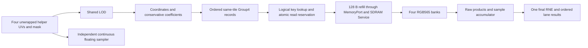

# Texture sampling oracle

## Current boundary

This component implements **oracle only** (step 0 of oracle/counted/timed).
`texture::ports` owns slot, quad, Group4 and precision configuration records;
`texture::sim::oracle` owns preparation, filtering, a functional cache and an
independent continuous reference. Counted/timed, cycle emulation, RTL, GPU
dispatch integration and physical performance results remain future work.

Refills reuse the existing GPU-owned `frontend::ports::MemoryPort` facade,
re-exported by texture. The existing generic test adapter connects it to the
vendor SDRAM `Service` from base commit
`fb472c98c5b4e9f32faac26929cea16534a21b74`, through a dev dependency only.
Each tile requests 128 aligned bytes and consumes sixteen actual little-endian
64-bit beats. The vendor service owns latency/load behavior; sampling introduces
no second memory interface or texture-specific latency fixture.

Default formats and policies below are executable study candidates, not frozen
hardware contracts. Ongoing design choices remain in the local GPU v2 texture
specification and development process.



## Executable behavior

- Up to sixteen slots: aligned base, full-mip flag, size exponent 0..10 and
  validity. Invalid slots, overflowing 32-bit allocations, material/slot size
  disagreement and invalid tile keys are errors. Memory additionally checks
  fitted physical capacity. Mips are small to large, tiles and texels row major.
  Layer prefixes use a fixed lookup.
- For n<3, the asset must supply periodic 8x8 RAW565 payloads. Logical n=0 uses
  a virtual 2x2 footprint of equal values; missing padding is never invented.
- Quad UV is signed, unwrapped and row-major. All four horizontal/vertical edge
  differences participate in max-norm LOD, matching the triangle oracle. The
  mask selects output lanes only. Helper derivatives precede periodic wrapping.
- Filtered coordinates use `u*a-0.5`; nearest uses `floor(u*a)`. Negative UV,
  repeat seams and smallest-mip saturation are supported. Nearest texel and
  single-mip selection are separate policies. Missing mip chains use base only.
- Bilinear splits row then column with floor and conserved total; trilinear
  splits mip parents first and folds their weights into eight taps. Total weight
  is exactly `2^coefficient_fraction`. There is no final two-mip lerp.
- Group4 retains four tap positions and zeroes other tiles' coefficients.
  Zero-only groups are omitted before rebuilding first/last. Groups are
  contiguous per sample, in first-tap order within a mip, finer mip first.
  The checked baseline 72-bit packing is for inspection, not an external ABI.
- Bank is `{y[0] XOR x[1],x[0]}`; local index is `{y[2:0],x[2]}`. Virtual +1
  coordinates precede bank selection, including small mips and tile crossings.
- RGB565 expands by bit replication to UNORM8. Raw products accumulate across
  every group; only the final sum is divided with ties-to-even. Baseline weight
  sum 256 bounds each accumulator to 65280. Higher-precision experiments use
  unrestricted host integers. Each covered lane produces one result.

## Precision controls and stage goldens

| Control | Default candidate | Experiment range |
| --- | --- | --- |
| Input UV quantization | RNE, 17 fractional bits | None, or 0..30 bits |
| Coordinate fraction | Floor, 8 bits | 1..16 bits |
| Coefficient unit | 256, 8 fractional bits | 1..16 bits |
| LOD output | RNE, 8 fractional bits | 1..16 bits |
| Log2 method | 64x8 table, floor mantissa index | Exact CPU log2 or table |
| Single-mip selection | Nearest, half selects coarser | Floor or nearest |
| Derivative range | Difference magnitude <=2 | Positive finite limit |

Host inputs must be finite with absolute UV <=2^20. Finite derivatives beyond
the configured limit force coarsest available LOD regardless of bias; zero
derivatives select LOD zero. Otherwise bias precedes clamp. Table entries are
oracle-generated `RNE(log2(1+i/64)*256)`. A future counted implementation must
own the selected immutable table and account for its physical storage. Derivative
limits and single-mip rounding remain explicit discussion choices.

`PreparedQuad` records UV, helper differences, rho, overflow, exponent/table
index, ideal/selected/raw LOD, mip parents, coordinate floors/fractions, taps,
coefficients and Group4 records. `Output` adds raw texels, expanded channels,
partial sums, post-add accumulator, RGB and cache events. These are stage goldens
for future comparison, never imported into audited arithmetic.

The independent `reference` uses continuous UV, exact log2 and standard floating
bilinear/trilinear weights. It reads linear payloads and independently derives
mip offsets, addresses and color expansion. It does not reuse bank addressing,
Group4, conservative splits or quantized LOD. The shared assumptions are the
RAW565 asset contract and max-norm LOD convention.

## Functional cache and memory boundary

Sixteen sets/four ways, four 1024x16 banks and tree-PLRU are modeled functionally.
Lookups use `{slot,n,tile_x,tile_y}`; prepared groups own no physical way.
Invalid ways precede PLRU replacement. Accepted demand hits, consumed prefetch
hits and complete refills touch PLRU. Rebind invalidates state at a synchronous
call boundary; stale tags and replacement bits need no reset.

Cache operations are serial host transactions: allocate FILLING, receive sixteen
beats, write banks, then publish READY. Group taps are captured before another
allocation, providing functional short read protection. The returned host Vec
is an unconstrained oracle sink, not a hardware buffer proposal. Service faults
are terminal: retain FILLING, publish no result and prohibit allocation/rebind.
Drain or recreate the service before starting a new cache; a watchdog must not
silently cancel an accepted refill or recycle its destination.

`prefetch` consumes an explicit optional hint atomically. Later demand rechecks
its logical key after eviction/invalidation. Hint FIFO/drop, dual tag reads,
same-cycle commit/touch ordering, FILLING merge, descriptor capacity/promotion,
CE/backpressure and hardware sink credits are future timed/emu work. Atomic
oracle calls do not certify those concurrent behaviors or predict cycle counts.

## Validation and reproduction

Bounded tests cover all 65536 bilinear fraction pairs; trilinear endpoints;
one/two/four/eight groups; seams; periodic small mips; all 64 bank/refill words;
constant colors; final-round ties and per-group-rounding failure; mip saturation;
missing mip chains; masked helper LOD; table error; input faults; PLRU/prefetch/
rebind; truncated payloads and service watchdogs. Independent float comparison
uses 256 deterministic quads. Both debug and release profiles are checked.

SDRAM integration compares one independent asset under calibrated average
service, Solo/Display/CPU/Both load and both unchained/chained policies. It checks
every returned word, sixteen beats before READY, completion counts, no new
traffic after warming, and unchanged backing data. This is Rust service evidence.

```powershell
& scripts/run-cargo.ps1 -Subcommand test -Label texture-oracle -CargoArgs @('-p','gpu-v2','--test','texture','--test','texture_sdram')
& scripts/run-cargo.ps1 -Subcommand run -Label texture-probe -CargoArgs @('-p','gpu-v2','--example','texture_oracle_probe','--','target/gpu-v2-texture')
```

The probe scans eight configurations across 216 bounded pressure/random quads
at 1024x1024 (2592 output channels). `precision.csv` reports max/mean RGB code
error and LOD error against continuous input; `stages.csv` exports named baseline
goldens. Reports stay in the worktree's `target/gpu-v2-texture`, not version control.
The mip-varying asset stresses filtering: these are sampled errors, not exhaustive
image-quality bounds. Increasing one precision can move conservative split
boundaries and need not monotonically reduce worst-case error.

See [SDRAM integration](sdram-memory-controller.md) for service ownership and
assumptions. Discuss precision/LOD policy and implementation details before
starting counted work.

Validation on this branch: GPU v2 release regression, texture debug tests,
strict workspace clippy, layering/source hygiene and required CPU/core/system
co-simulations passed. Full workspace testing stops at the unchanged legacy
GPU-display boot test, which expects an accepted command from the retired GPU.
The two Gowin reference documents missing from the initial worktree have been
restored from the main checkout and indexed in the vendor document README.
Subsequent validation is limited to the requested component and changed files;
the earlier quick validation aggregate cannot be reported as passing.
