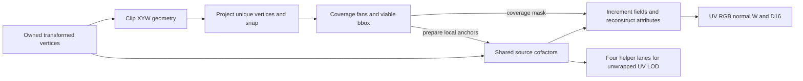

# Triangle setup oracle and workload study

## Current boundary

This component implements **oracle only** (step 0 of oracle/counted/timed).
It consumes three owned `vertex::ports::Transformed` records. It does not fetch
triangle records, schedule DSPs, allocate RAM, define an encoded GPU ABI or
implement emulation/RTL. The command/scratchpad/vertex implementation is described
in [frontend](frontend.md); pixel lighting is in [lighting](lighting.md).

The oracle provides bounded geometry clipping, projection, exact integer
coverage, perspective UV/color/unnormalized normal, uniform-W D16 and unwrapped
quad LOD. It exports intermediate goldens and compares against an independent
per-sample linear solve. Clip/interpolation arithmetic uses CPU `f64`; coverage,
source cofactors and pixel field goldens use `i128`. This is a precision study,
not a frozen fixed-point or physical performance contract.



## Geometry and coverage

- Inputs: clip XYZW signed Q16, normal signed Q14, UV **UNORM12 /4095**, RGB565.
  Geometry uses **XYW**. Z is deliberately ignored: depth is uniform W, not clip Z.
- Clip order: W >= near, +X, -X, +Y, -Y, with guard `abs(X/Y) <= 2^g*W`.
  Defaults are near `8199/65536`, far 200, g=3, viewport 400x240, Q4 snap.
- Clip geometry only. Attributes remain attached to the original three vertices;
  all fans own the same self-contained source package. Original negative/zero W
  is valid because no division by original W is needed to prepare attributes.
- Canonically order the endpoints before computing an intersection. Shared
  reversed edges produce identical represented intersection points. A current
  plane fixes one coordinate exactly; only two free coordinates need lerps.
  On-plane endpoints are reused. Quantized intersections explicitly restore
  already processed halfspaces, with no epsilon classification.
- A convex polygon is bounded to eight vertices and six fans. Project each
  unique polygon vertex once. Snap uses exact rational ties-to-even division of
  the **represented dyadic clip point**, so an f64 reciprocal cannot move a tie.
  It does not claim that floating clip intersections are exact rational geometry.
- Y points down. Positive twice-area is front-facing; culling is optional.
  Back faces otherwise reverse coverage edges and carry a `flip` flag. Normal
  samples retain their original sign; a future shader owns application of flip.
- For an edge p->q: A=py-qy, B=qx-px, C=px*qy-qx*py. Top-left is
  `A>0 || (A==0 && B>0)`. Only coverage subtracts one from non-top-left C.
  The area is the sum of **unbiased** C. Source interpolation never uses biased
  or snapped coverage edges.
- The default coverage origin is the first snapped vertex. Its two adjacent
  edge constants are zero; the opposite edge needs two products. The global
  origin alternative needs six products. Tests prove identical coverage at
  subpixel precisions 1, 4 and 8. Relative coordinates can need an extra bit;
  the future counted format must account for it.
- A pixel sample is `(x*2^F+2^(F-1), y*2^F+2^(F-1))`. Coverage increments are
  **2^F*A** per pixel, **2^(F+1)*A** per quad and **16*2^F*A** per tile.
  At Q4 these are 16A, 32A and 256A. The often quoted 2/4/32 steps apply to a
  different coefficient/coordinate scale.

Exact snapped zero-area and empty-bbox fans are skipped. Snapping a very thin
clipped polygon can destroy convexity: `snap_nonconvex` exposes this condition,
and rasterization rejects duplicate fan coverage rather than shading it twice.
An exactly singular unsnapped source that survives snap produces an explicit
diagnostic. These cases need a deliberate policy before counted; this oracle
does not silently discard ordinary thin triangles or clamp their weights.

## Shared source fields

Let the exact source column be

```
Q_i = (X_i + W_i, W_i - Y_i, 2*W_i)
S   = (Q_1-Q_0) cross (Q_2-Q_0)
C_1 = Q_2 cross Q_0
C_2 = Q_0 cross Q_1
delta = Q_0 dot S
```

Viewport factors are applied **after** the cross products:
`F=(height*C.x, width*C.y, width*height*C.z)`, and
`det=width*height*delta`. This keeps cross-product operands at most 33 bits,
34 after differences, instead of putting viewport-expanded 41-bit coordinates
into a multiplication whose operand limit is 36. It does not make the raw
cofactor/determinant products narrow: their outputs and subsequent operands
still require a proved normalization or partial-product implementation.

At pixel center V=(2x+1,2y+1,2), evaluate D=F_S dot V and N1/N2 analogously:

```
beta1 = N1/D; beta2 = N2/D; beta0 = 1-beta1-beta2
attribute = a0 + (a1-a0)*beta1 + (a2-a0)*beta2
w = det/(D*65536)
```

The common area normalization cancels in attributes. There is no attribute
area reciprocal and no per-channel reciprocal. Absolute determinant/scale is
retained for W/D16. Coverage snap can put a sample outside the unsnapped source;
negative beta is retained, even for a narrow surviving triangle.

The alternative `Planes` profile builds a denominator plus eight attribute
numerator fields from the same cofactors. Thus its comparison uses the same
unsnapped source, clipping and depth, rather than comparing two different
numerical contracts. Uniform channels bypass independently quantized numerator
coefficients exactly. Approximate normal/UV/color sharing is not inferred.

Field coefficients are recentered **exactly before conversion to f64** around
the bbox midpoint, with a power-of-two radius. `field_bits` quantizes all fields
with a common power-of-two scale. Global-origin coefficients are available as
a control experiment. Row and pixel traversal increment both coverage and
interpolation fields; only initialization uses coordinate products. The exact
integer source-field stepper is independently checked against point evaluation.
The f64 interpolation stepper is compared against point queries and linear solves;
it is not the eventual fixed-point accumulator contract.

## Samples, knobs and independent checks

UV remains unwrapped and signed at the oracle output; default quantization is
Q17. RGB clamps at RGB565 conversion. Normal remains unnormalized signed Q14 in
an **i32** diagnostic result: extrapolated normals are not silently narrowed to
lighting's i16 input. A future bridge must prove a range or uniformly rescale
the direction before narrowing. Depth is
`RNE(clamp((w-near)/(far-near),0,1)*65535)`.

Knobs include viewport, near/far, power-of-two guard, subpixel precision,
culling, intersection fractions 16..30, coefficient mantissas 8..52, local/global
origin, three/nine fields, output attribute fraction and affine RGB experiment.
Affine RGB changes only color; UV and normal retain perspective correction.
Quad LOD evaluates all four helper lanes before coverage masking, takes the
maximum unwrapped UV difference, scales by the POT texture extent <=1024, and
clamps log2 to zero. Invalid helper W is reported, not replaced by W-clamp.

The independent reference constructs the original homogeneous 3x3 system and
solves it at each sample with pivoted Gauss-Jordan elimination. It decodes input
attributes independently and reads no prepared fields or snapped edges.
Coverage checks separately use integer orientation products and explicit edge
inclusion rules. Tests cover near/guard clipping, reversed shared intersections,
waterproof triangle soup, negative W, exact projection ties, thin extrapolation,
Z invariance, stage bridge from vertex, large signed inputs, uniform channels,
field stepping, overflow/configuration/sample bounds and 128 varied sources.
Output code comparisons allow one code at floating rounding boundaries; this
is not a bit-exact counted acceptance claim.

## Measured precision study

`triangle_oracle_probe` evaluates 80 profiles over five 400x240 scenes, with a
total sample limit of eight million. The current run evaluates **4,924,992**
shaded samples. Each raster scan additionally has a one-million attempt limit.
Full clip/source/projection/edge goldens and 16 selected sample/reference pairs
per scene are exported. LOD examines every seventeenth covered quad; its CSV
records query and invalid-helper counts. This is a sampled study, not a worst
case bound over all triangles.
An additional 512-case clipped thin-triangle sweep reports no nonconvex snaps or
diagnostic failures in its selected corpus; its inputs/results are exported in
`thin-diagnostics.csv`. It is not a proof that snapping preserves all polygons.

| Three fields | Local18: UV texels / D16 codes | Global18: UV texels / D16 codes | Local36: UV texels / D16 codes |
| --- | --- | --- | --- |
| Far 200m wall | 0.004914 / 0 | 2.635595 / 0 | <0.000001 / 0 |
| Wall sliding through guard | 0.012194 / 1 | 7.887029 / 1 | <0.000001 / 0 |
| Grazing long floor | 0.530405 / 2 | 51.450025 / 357 | 0.000000920 / 0 |
| Shared-edge triangle soup | 0.016791 / 0 | 1.748741 / 0 | 0.000000032 / 0 |
| Near-plane crossing | 0.157589 / 0 | 15.639899 / 10 | 0.000000103 / 0 |

Local36 has no D16 code changes or invalid tested LOD helpers in this corpus.
Local24 is promising but still changes a wall-slide depth by one code; thin
conditioning and earlier cofactor/determinant rounding have not been frozen.
The raw fields in these scenes need 52..71 signed bits and determinants 65..96;
declaring a final 36-bit coefficient does not prove that preparation fits one DSP.

The flat 200m counterexample separately gives `RNE(8192/200)=41`, so storing
invW in Q13 reconstructs W=199.804878 and loses **64 D16 codes**. Affine RGB
produces >0.5 channel error in the grazing fixture and is not selected as the
default. Both are executable rejection examples, not format recommendations.

## First-principles workload

These are **logical scalar products**, not DSP18 issues, latency, fabric area
or a counted ledger. Constant viewport networks, conversions, normalization,
reciprocal implementation, control, I/O and diagnostic reference calculations
are excluded and must be charged by counted. Products have very different widths.

| Work | Products | Other essential work |
| --- | ---: | --- |
| Source coordinate differences | 0 | Six differences; viewport constants factored out |
| Three cofactor cross products | 18 | Nine product differences |
| Source determinant | 3 | Two sums; wide raw cofactor operand |
| Three local anchors | 6 | Six sums; radius is power-of-two scaling |
| Nine-field attribute construction | +72 | 48 sums, base cofactor reconstruction |
| Each genuine clip crossing | 3 | One shared reciprocal: t product + two free-coordinate lerps |
| On-plane endpoint reuse | 0 | Comparisons and duplicate suppression |
| Each unique projected vertex | 2 | One shared W reciprocal, viewport networks and exact snap |
| Each fan's vertex-local coverage edges | 2 | Relative-coordinate differences, top-left and bbox |
| Each fan's first interpolation sample | 6 / 18 | Three / nine field seeds at the raster origin |
| Each full covered pixel after field stepping | 19 / 9 | One shared reciprocal in either profile |

For an unclipped three-vertex triangle, setup before raster seed is **35 / 107**
products and three reciprocal requests. The five fixtures have three-field setup
counts **35,55,35,35,45**, and reciprocal counts **3,9,3,3,6** respectively;
nine fields add 72 source products. Source preparation is once per original
triangle, including a clipped triangle with several fans.
The oracle prepares fields only after a viable fan bbox exists. Hardware could
speculate on source cofactors to hide latency, but must then charge discarded
work and retained intermediate state; local anchors still depend on the bbox.

Including one fan's field seed and N full shaded pixels gives:

```
three fields: 41 + 19*N products, 3 + N reciprocal requests
nine fields: 125 + 9*N products, 3 + N reciprocal requests
```

Three fields save 72 **source** products but spend ten more products per full
pixel. Source-only crossover is 7.2 pixels; including seeds it is **8.4 pixels**
for one fan, or `(72+12*fan_count)/10` more generally. Large filled triangles favor
nine fields; micro-triangles can favor basis. Actual covered pixels are not known
at setup, so a hybrid must use a declared estimate/dispatch policy, not oracle
knowledge. Stepping additionally costs three coverage increments and three/nine
interpolation increments per scanned candidate, including uncovered bbox pixels,
and the same field counts for each row transition.

Nine fields could send an unnormalized normal numerator directly to lighting and
remove three pixel divide products. This requires proving positive common scale
or carrying the denominator sign, and fitting the direction format. Basis already
needs beta for UV/color and has no separate three normal division products to
remove. The corresponding seed-inclusive crossover would be 84/13=6.46 pixels.
This is a future interface alternative, not an implemented lighting connection.

Constant channels can remove products and stored coefficients, and exact flat
normal/material/light work can be prepared once as demonstrated by lighting.
Source base/delta attributes can remain in code units: normal150 + UV76 + RGB54
= **280 bits**, instead of raising all 24 values to one broad format. Constant
code conversion is still work. Inclusive Q17 UV=1 has raw131072; its positive
delta does **not** fit signed18. Signed beta also needs an explicit extrapolation
range; a storage type that covers [0,1] does not cover every snapped sample.

The largest remaining concern is preparation width and conditioning. The oracle
keeps exact raw cofactors/determinants; coefficient quantization happens after
exact recentering. A cheap hardware implementation must separately test earlier
coordinate/cofactor/determinant rounding, positive denominator range, LZD/window
selection, product routing and accumulation. Do not price all35 products as18x18.
General reciprocals must follow LUT/normalization/Newton, and coverage projection
should retain the documented residual correction needed for exact Q4 ties.
Those seed/interpolation/refinement/correction products, ports and carry chains
are **additional** to this table. Oracle CPU division does not authorize a
bit-serial divider in counted.

Across neighboring pixels, affine fields replace repeated coordinate products
with increments. A quad can share its field seed and exact x/y offsets, while
each perspective denominator still needs its own inverse unless approximation is
explicitly validated. UV-only uncovered LOD helpers need a smaller work path than
full normal/color/depth shading; the N-pixel formulas exclude those helpers.
Across neighboring triangles, a shared source edge could reuse one cross product
(six logical products), but the cache width/ownership/normalization and hit rate
must be included. Moving invW/attribute work to reused vertices is another option;
its extra output rows and vertex bandwidth must be compared with the whole path.

## Reproduction

```powershell
& scripts/run-cargo.ps1 -Subcommand test -Label gpu-v2 -CargoArgs @('-p','gpu-v2')
& scripts/run-cargo.ps1 -Subcommand run -Label triangle-oracle -CargoArgs @('-p','gpu-v2','--example','triangle_oracle_probe','--','target/gpu-v2-triangle')
```

CSV: `target/gpu-v2-triangle/precision.csv`. Stage goldens:
`target/gpu-v2-triangle/stage-goldens.txt`. No triangle counted/timed, emu, RTL,
PnR or system/board evidence is claimed.
