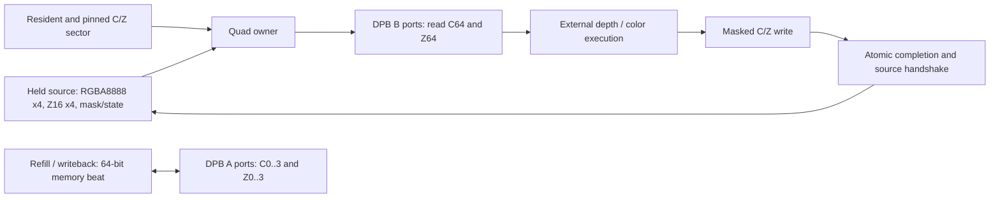

# Eight-DPB framebuffer storage and quad owner

Accepted on 2026-09-27. The independently verified component consists of
`framebuffer_lane_array.v` and `fused_framebuffer_pipe.v` under `src/hardware/gpu`.
It is not yet instantiated by the production GPU export. Existing system and
board validation still describes the blocking, color-only cache in
[`architecture.md`](architecture.md).

## Storage contract

- Eight non-mirrored true-dual-port DPBs: four RGB565 banks and four Z16 banks.
- Port A belongs permanently to memory refill/writeback; port B belongs to rendering.
- Both ports run at 54 MHz. The SDRAM gearbox is the existing system boundary.
- Default: eight 16x16 tile entries, 8 KiB including C/Z, using 512 words per DPB.
  Available primitive capacity is 1024x16; unused capacity does not imply more tags.
- `SLOT_BITS=2, HALF_CAPACITY=1` is the default. The compatibility `group` bit and
  two `way` bits identify an entry; they do not select physical port groups.
  Existing logical tag sets can be retained without data-port checkerboard muxes.
- `SLOT_BITS=3, HALF_CAPACITY=0` offers 16 KiB and sixteen tile entries as an optional
  storage configuration. Its extra controller/tag cost is outside this component.
  `SLOT_BITS=4, HALF_CAPACITY=1` also verifies 32 physical 16x4 sector slots;
  independent sector allocation is not the selected cache-management policy.
- Memory color and depth remain separate planes. Display reads color only.

The accepted management direction retains one 16x16 tile identity with four
16x4 sectors. Each sector has 128 B of color and a separate 128 B of Z16.
Aligned quads never cross a sector boundary. Sector validity, dirtiness and
residency are controller requirements, not implemented by the data array.

## Geometry and memory addressing

For each plane, `bank = (x + 2*y) mod 4`, with bank word address
`{entry, y, x[3:2]}`. For the default capacity the entry has three bits and the
word address has nine bits. The four-pixel memory beat is horizontal; the render
quad is even aligned and ordered top-left, top-right, bottom-left, bottom-right.

```text
Physical bank numbers repeat across the 16-pixel row:
             x=0 1 2 3 4 5 6 7 ... 15
even y          0 1 2 3 0 1 2 3 ...  3
odd  y          2 3 0 1 2 3 0 1 ...  1

quad at x=0:    0 1       quad at x=2:    2 3
                2 3                       0 1

Each quad and each aligned horizontal four-pixel beat uses all four banks.
```

Odd memory rows swap two 32-bit halves. Quads with `x[1]=1` swap their top and
bottom 32-bit pairs. This permits both interfaces without a two-step row packer.
Fixed `(x[0],y[0])` quad banks would collide twice in every horizontal memory beat.

The default memory address is `{1'b0, way[1:0], plane, y[3:0], x[3:2]}`;
the separate group bit supplies the high entry bit. Plane zero is color and
plane one depth. Data bits `[16*j +: 16]` hold horizontal lane j; the eight-bit
memory mask enables individual bytes. Render masks enable entire 16-bit lanes.
Sector-slot mode uses two row bits and four way bits instead. Unused upper
address/row bits must be zero; the array does not validate surface bounds or tags.

## Port ownership and hazards

Memory writes take priority over memory reads to the same plane. Different planes
have independent A ports and may perform a read and write in the same clock.
A zero-byte write is a no-op and does not consume a read address. Memory responses
use a normal valid/ready handshake and remain stable while stalled.

Render obtains all C64 and Z64 values in one synchronous read, then writes both
planes with independent lane masks. Its B ports cannot read and write different
quads simultaneously. Array outputs are held by the DPB output registers;
there is no separate numerical quad FIFO or shader-result snapshot.

Conflicting memory/render accesses involving a write are blocked conservatively
for the addressed horizontal group in either row of the quad. The controller
must additionally protect live entries, initialized sectors and cleaner snapshots.
The primitive's undefined same-word collision behavior is never a correctness rule.
Memory traffic to another entry remains possible while execution holds render DO.
Normal-mode writes hold DO rather than replacing a stalled read result.

## Transaction and execution contract



1. The source presents an even-aligned quad. `resident` means its required C/Z
   sector is initialized and pinned. A miss stalls without accessing render ports.
2. The owner reads all four old colors and depths. `execute_valid` presents this
   result to external execution; `execute_ready` permits its result to be consumed.
3. External execution supplies four RGB565 result colors and a passing mask.
   The color write mask is `input_mask & result_mask`. Z writes the source depths
   on those lanes only when both depth testing and depth writing are enabled.
4. `commit_ready` authorizes the actual final write. Only that edge emits
   `commit_valid` and `input_ready`, with the passing mask. This is an atomic event,
   not an independently backpressured valid stream. Even an empty passing mask
   completes the transaction while modifying no pixels.

The source must keep input valid, entry/coordinates, RGBA8888/Z16, mask, depth
enable/write/function and blend state unchanged until `input_ready`. Once a
read starts, its resident lease must also remain asserted through completion.
Simulation assertions enforce ownership. Reset drops in-flight validity and
does not initialize RAM; the controller must reacquire/initialize before reuse.

Source colors retain alpha. There is no destination alpha or RGB write mask.
Blend modes are replace, premultiplied and straight alpha. Depth/blend arithmetic
is external and remains separate work: the native callback checks depth functions
and RGB565 conversion, but its synthetic XOR color dependency is not blending.

## Measured component boundary

The fit includes array, transaction owner, held source stimulus, live memory
stimulus/signature and synthetic execution. It excludes shader RTL, cache tags,
acquire/pins, miss/refill/clean scheduling, dirty/metadata and marker retirement.
Logic is LUT + ALU + six times RAM16 cells. Constraints are 54 MHz; fitted fmax
reports margin, not an operating-clock change. These are component results,
not measured net whole-GPU savings.

| Same-capacity atomic owner | Capacity | BSRAM | LUT | ALU | RAM16 | Logic / FF | Dense quad interval | Fitted fmax |
| --- | ---: | ---: | ---: | ---: | ---: | ---: | ---: | ---: |
| Earlier four-SDPB coupled-pair baseline | 8 KiB | 4 | 905 | 54 | 9 | 1013 / 363 | 4 clocks | 101.614 MHz |
| Accepted eight-DPB component | 8 KiB | 8 | 660 | 23 | 9 | 737 / 261 | 2 clocks | 93.336 MHz |

The accepted fit saves 245 LUT, 276 Logic and 102 FF against the matched
four-SDPB baseline. Setup/hold TNS and violated endpoints are zero.
The earlier matched eight-DPB experiment established the selection; the accepted
source removes obsolete narrow/non-atomic branches and fixes zero-mask port
address selection. The table reports its fresh fit rather than transferring
numbers from the experimental source. Sources, hashes, primitive models, reports
and rejected alternatives are retained in local record `gpu-merger-study-2026-09-27`.

| Native workload, 256 full quads / 1024 pixels | Clocks | Pixels / clock |
| --- | ---: | ---: |
| Timely execution | 512 | 2.000 |
| Background traffic and periodic execution/completion stalls | 512 | 2.000 |
| Four extra execution wait clocks per quad | 1536 | 0.667 |
| Six extra execution wait clocks per quad | 2048 | 0.500 |
| Six extra wait clocks plus periodic stalls | 2304 | 0.444 |

A dedicated stream commits 256 quads in 512 clocks while accepting 512 memory
C-plane reads and 256 memory Z-plane writes to another entry. Two reads and one
write to the same plane cannot fit in two clocks with port B reserved for render.
This test does not model SDRAM arbitration or establish a throughput floor under
arbitrary execution delay/misses.

## Validation and reproduction

All five native tests passed (five configuration/delay runs and four reproduced
faults), together with 725 workspace tests, workspace Clippy and the mandatory
CPU/system co-simulations (26/2). Documentation, layering, source hygiene, changed
Rust formatting and whitespace checks passed. The pipeline diagram was rendered
and visually checked.

Native vendor tests independently check physical pixels, all masks and depth
functions, disabled depth/write states, all active physical quad addresses,
same-quad ordering, delayed residency, source retention, delayed execution,
completion/memory backpressure, byte masks, concurrent memory traffic and reset.
Every physical word is finally read back. A forced same-word RAW stall includes
a counter proving the blocking path executed; dense and concurrent intervals
are assertions. Suppressed Z writes, a wrong read bank, premature source release and zero-mask
write address theft each reproduce the expected independent failure. All waits are bounded.

```powershell
# Set IVERILOG_EXE, VVP_EXE and GOWIN_HOME for the installed tools.
scripts/run-cargo.ps1 -Subcommand test -Label framebuffer-native -CargoArgs @(
  '-p','cpu-v3-tang-nano-20k','--lib','hardware::gpu::fused_framebuffer_tests',
  '--','--ignored','--nocapture','--test-threads=1')
python scripts/measure-gpu-framebuffer.py
```

Cache-controller integration, explicit shader hold, real execution, concurrent
sector lifecycle/cleaner correctness and ordered END retirement remain pending.
Early raster prefetch must carry tile/sector intent, acquire ownership before
use and preserve target/generation/error semantics; it is a retained requirement,
not implemented by this component. Whole-system fit and physical validation are
required after integration. No board image changes in this component commit.
