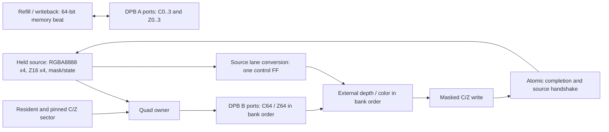

# Eight-DPB framebuffer storage and quad owner

Accepted on 2026-09-27. The independently verified component consists of
`framebuffer_lane_array.v` and `fused_framebuffer_pipe.v` under `src/hardware/gpu`.
It is instantiated by the production GPU export on the display work-1 baseline.
The current controller retains blocking tile acquisition and color-only SDRAM
traffic. Whole-system measurements belong to [`architecture.md`](architecture.md).

## Production attachment

Raster output now holds a covered quad in its source FIFO until the owner commits
the masked write. Marker ACK follows completed writes; END still drains dirty
color entries before submission retirement. The current test shader is constant
within each even 2x2 quad and supplies RGB565 replacement colors. There is no
additional numerical quad queue or mirrored DPB array.

The existing eight direct-mapped tags, K=1 tile acquisition, LOAD/CLEAR, fake draw,
color refill/clean and memory ABI are retained. Each new LOAD/CLEAR initializes
its local Z16 plane to `0xffff` in 64 additional 54-MHz clocks before rendering.
No depth surface is bound by this bring-up ABI, so Z has no SDRAM refill/clean
traffic yet. The four Z DPBs are intentionally retained in synthesis for future
depth processing; their primitive count is included in the whole-system fit.

Depth/blend arithmetic, a numeric RGBA/Z shader source, depth surface binding,
sector lifecycle/concurrent controller scheduling and early prefetch remain
pending. Independent A/B ports provide concurrency in the component; this
blocking controller does not yet exploit that capability. Current system resource
numbers include the eight-DPB storage and production quad owner, without the
future arithmetic or shader. Historical physical-board evidence does not validate
this integration.

## Storage contract

- Eight non-mirrored true-dual-port DPBs: four RGB565 banks and four Z16 banks.
- Port A belongs permanently to memory refill/writeback; port B belongs to rendering.
- Both ports run at 54 MHz. The SDRAM gearbox is the existing system boundary.
- Default: eight 16x16 tile entries, 8 KiB including C/Z, using 512 words per DPB.
  Available primitive capacity is 1024x16; unused capacity does not imply more tags.
- `SLOT_BITS=2, HALF_CAPACITY=1` is the default. The compatibility `group` bit and
  two `way` bits identify an entry; they do not select physical port groups.
  Existing logical tag sets can be retained without data-port checkerboard muxes.
- `SLOT_BITS=3, HALF_CAPACITY=0` offers 16 KiB and sixteen tile entries as an optional
  storage configuration. Its extra controller/tag cost is outside this component.
  `SLOT_BITS=4, HALF_CAPACITY=1` also verifies 32 physical 16x4 sector slots;
  independent sector allocation is not the selected cache-management policy.
- Memory color and depth remain separate planes. Display reads color only.

The accepted management direction retains one 16x16 tile identity with four
16x4 sectors. Each sector has 128 B of color and a separate 128 B of Z16.
Aligned quads never cross a sector boundary. Sector validity, dirtiness and
residency are controller requirements, not implemented by the data array.

## Geometry and memory addressing

For each plane, `bank = (x + 2*y) mod 4`, with bank word address
`{entry, y, x[3:2]}`. For the default capacity the entry has three bits and the
word address has nine bits. The four-pixel memory beat is horizontal; the render
quad is even aligned and ordered top-left, top-right, bottom-left, bottom-right.

```text
Physical bank numbers repeat across the 16-pixel row:
             x=0 1 2 3 4 5 6 7 ... 15
even y          0 1 2 3 0 1 2 3 ...  3
odd  y          2 3 0 1 2 3 0 1 ...  1

quad at x=0:    0 1       quad at x=2:    2 3
                2 3                       0 1

Each quad and each aligned horizontal four-pixel beat uses all four banks.
```

Odd memory rows swap two 32-bit halves. The owner now executes in physical bank
order, with source-lane conversion described below instead of C/Z read/write swaps. This permits both interfaces without a two-step row packer.
Fixed `(x[0],y[0])` quad banks would collide twice in every horizontal memory beat.

The default memory address is `{1'b0, way[1:0], plane, y[3:0], x[3:2]}`;
the separate group bit supplies the high entry bit. Plane zero is color and
plane one depth. Data bits `[16*j +: 16]` hold horizontal lane j; the eight-bit
memory mask enables individual bytes. Render masks enable entire 16-bit lanes.
Sector-slot mode uses two row bits and four way bits instead. Unused upper
address/row bits must be zero; the array does not validate surface bounds or tags.

## Port ownership and hazards

Memory writes take priority over memory reads to the same plane. Different planes
have independent A ports and may perform a read and write in the same clock.
A zero-byte write is a no-op and does not consume a read address. Memory responses
use a normal valid/ready handshake and remain stable while stalled.

Render obtains all C64 and Z64 values in one synchronous read, then writes both
planes with independent lane masks. Its B ports cannot read and write different
quads simultaneously. Bank-order render outputs are held by the DPB output registers;
there is no separate numerical quad FIFO or shader-result snapshot.

Conflicting memory/render accesses involving a write are blocked conservatively
for the addressed horizontal group in either row of the quad. The controller
must additionally protect live entries, initialized sectors and cleaner snapshots.
The primitive's undefined same-word collision behavior is never a correctness rule.
Memory traffic to another entry remains possible while execution holds render DO.
Normal-mode writes hold DO rather than replacing a stalled read result.

## Transaction and execution contract



1. The source presents an even-aligned quad. `resident` means its required C/Z
   sector is initialized and pinned. A miss stalls without accessing render ports.
2. The owner reads all four old colors and depths. `execute_valid` presents this
   result to external execution; `execute_ready` permits its result to be consumed.
3. External execution supplies four RGB565 result colors and a passing mask in
   the same execution lane order. The color write mask is `execute_mask & result_mask`.
   Z writes the correspondingly ordered source depths
   on those lanes only when both depth testing and depth writing are enabled.
4. `commit_ready` authorizes the actual final write. Only that edge emits
   `commit_valid` and `input_ready`, with the passing mask. This is an atomic event,
   not an independently backpressured valid stream. Even an empty passing mask
   completes the transaction while modifying no pixels.

The default owner uses `BANK_ORDER=1`. Execution receives `execute_colors`
(RGBA8888 x4), `execute_depths` (Z16 x4), `execute_mask`, old C/Z and returns results
in bank order. These payloads are meaningful when `execute_valid` is asserted.
`execute_ready` means the external result is available; it is not a separate
execution-request acceptance. Stateful execution advances only on `commit_valid`.
The lane-order control is captured in one FF on the accepted read; the source
continues to hold the numerical payload. Source input and completion-mask order
remain top-left, top-right, bottom-left, bottom-right.

| Quad x[1] | Execution lane 0 | Lane 1 | Lane 2 | Lane 3 |
| --- | --- | --- | --- | --- |
| 0 | Top-left | Top-right | Bottom-left | Bottom-right |
| 1 | Bottom-left | Bottom-right | Top-left | Top-right |

This removes the wide C/Z output and render-write swaps. Only source conversion
and the four-bit completion mask need lane permutation. Pointwise depth/blend
execution must use the provided execution operands, not the logical source bus.
`BANK_ORDER=0` is a compile-time reference configuration for the matched tests.
There is no runtime mode switch. The array's memory beat ordering is unchanged.

The source must keep input valid, entry/coordinates, RGBA8888/Z16, mask, depth
enable/write/function and blend state unchanged until `input_ready`. Once a
read starts, its resident lease must also remain asserted through completion.
Simulation assertions enforce ownership. Reset drops in-flight validity and
does not initialize RAM; the controller must reacquire/initialize before reuse.

Source colors retain alpha. There is no destination alpha or RGB write mask.
Blend modes are replace, premultiplied and straight alpha. Depth/blend arithmetic
is external and remains separate work: the native callback checks depth functions
and RGB565 conversion, but its synthetic XOR color dependency is not blending.

## Measured component boundary

The fit includes array, transaction owner, held source stimulus, live memory
stimulus/signature and synthetic execution. It excludes shader RTL, cache tags,
acquire/pins, miss/refill/clean scheduling, dirty/metadata and marker retirement.
Logic is LUT + ALU + six times RAM16 cells. Constraints are 54 MHz; fitted fmax
reports margin, not an operating-clock change. These are component results,
not measured net whole-GPU savings.

The matched component fit at `b409ae2` uses the full RGBA8888 source: a per-lane XOR fold consumes
all 32 color bits, including alpha, and an old-color dependency; Z uses four
comparisons. These are synthetic execution expressions, not real blend hardware.
The former fit at commit `8933c9c` had a different execution/signature harness;
its numbers are retained in local evidence and must not be subtracted from these.

| Full-source-width matched owner | Capacity | BSRAM | LUT | ALU | RAM16 | Logic / FF | Dense quad interval | Fitted fmax |
| --- | ---: | ---: | ---: | ---: | ---: | ---: | ---: | ---: |
| Logical execution lanes, reference | 8 KiB | 8 | 705 | 16 | 1 | 727 / 320 | 2 clocks | 98.460 MHz |
| **Bank-order execution, latched lane control** | **8 KiB** | **8** | **593** | **16** | **1** | **615 / 320** | **2 clocks** | **98.220 MHz** |

The selected design saves 112 LUT/Logic against this reference. In the same
harness, latching lane control adds one FF and saves a further 18 LUT relative
to unlatched bank-order execution. It preserves the exact word-conflict rule:
reads of another word in the active sector do not stall rendering, and memory
traffic to another sector of the active tile remains concurrent. Broader sector
conflict checks were not selected. Setup/hold TNS and violated endpoints are zero.
Sources, hashes, vendor models, routed reports and rejected resource trades live
in local record `gpu-framebuffer-resource-2026-09-27`; earlier architectural
alternatives remain in `gpu-merger-study-2026-09-27`.

| Native workload, 256 full quads / 1024 pixels | Clocks | Pixels / clock |
| --- | ---: | ---: |
| Timely execution | 512 | 2.000 |
| Background traffic and periodic execution/completion stalls | 512 | 2.000 |
| Four extra execution wait clocks per quad | 1536 | 0.667 |
| Six extra execution wait clocks per quad | 2048 | 0.500 |
| Six extra wait clocks plus periodic stalls | 2304 | 0.444 |

Two dedicated streams each commit 256 quads in 512 clocks while accepting 512
memory C-plane reads and 256 memory Z-plane writes: one targets another entry,
and the other targets another sector of the active tile. Two reads and one
write to the same plane cannot fit in two clocks with port B reserved for render.
This test does not model SDRAM arbitration or establish a throughput floor under
arbitrary execution delay/misses.

## Validation and reproduction

At the standalone `b409ae2` checkpoint, all six native tests passed (seven configuration/callback/delay runs and five
independently reproduced faults), together with 725 workspace tests, workspace
Clippy and CPU/system co-simulations (26/2). Documentation, layering, source
hygiene, changed Rust formatting and whitespace checks passed. The updated
pipeline diagram was rendered and visually checked.

Production integration also passes ten GPU tests, including the vendor-DPB full
frame and a missing-Z-initialization negative regression. The 26-scene suite
checks complete independent images, pixel/ACK conservation, memory transactions
and failure recovery. The production array has a portable Icarus model for the
existing system fixtures; `GPU_FRAMEBUFFER_VENDOR` selects actual Gowin DPBs.
Standalone native tests continue to use vendor primitives by default.

Native vendor tests independently check every execution RGBA/Z/mask bit, physical
pixels, all masks and depth functions, disabled depth/write states, all active physical quad addresses,
same-quad ordering, delayed residency, source retention, delayed execution,
completion/memory backpressure, byte masks, concurrent memory traffic and reset.
Every physical word is finally read back. A forced same-word RAW stall includes
a counter proving the blocking path executed; dense and concurrent intervals
are assertions. Suppressed Z writes, a wrong read bank, premature source release and zero-mask
write address theft each reproduce the expected independent failure. A stuck
execution lane-order bit also fails the full-source-bit oracle. All waits are bounded.

```powershell
# Set IVERILOG_EXE, VVP_EXE and GOWIN_HOME for the installed tools.
scripts/run-cargo.ps1 -Subcommand test -Label framebuffer-native -CargoArgs @(
  '-p','cpu-v3-tang-nano-20k','--lib','hardware::gpu::fused_framebuffer_tests',
  '--','--ignored','--nocapture','--test-threads=1')
python scripts/measure-gpu-framebuffer.py
scripts/run-cargo.ps1 -Subcommand test -Label framebuffer-production -CargoArgs @(
  '-p','cpu-v3-tang-nano-20k','--test','gpu_trace_cosim',
  '--','--ignored','--nocapture','--test-threads=1')
```

Production source retention and ordered END retirement are integrated. Real
execution and concurrent sector lifecycle/cleaner correctness remain pending.
Early raster prefetch must carry tile/sector intent, acquire ownership before
use and preserve target/generation/error semantics; it is a retained requirement,
not implemented by this component. See the production attachment above for the
current integration boundary. Physical validation of the new integration remains
pending.
